# Openeuler开箱指南


<!--more-->

<!-- Place resource files in the current article directory and reference them using relative paths, like this: ``. -->

## 查看系统信息

```shell
#查看操作系统版本信息
 cat /etc/openEuler-latest
 cat /etc/os-release
 cat /etc/openEuler-release
#查看操作系统版本信息
 uname -a
#备份yum源
 cp /etc/yum.repos.d/openEuler.repo /etc/yum.repos.d/openEuler.repo.bak
```

### 系统升，降级

```shell
#系统升级
dnf update | tee update_log
reboot

#系统降级
dnf downgrade | tee downgrade_log
reboot
```

## 查看硬件信息

1. 查看cpu的统计信息

   ```
   # lscpu
   ```

2. 查看CPU相关参数

   ```
   # cat /proc/cpuinfo
   ```

3. 查看系统内存信息

   ```
   # cat /proc/meminfo
   ```

4. 查看内存信息

   ```
   # dmidecode -t memory
   ```

5. 查看硬盘和分区分布

   ```
   # lsblk
   ```

6. 看硬盘和分区的详细信息

   ```
   # fdisk -l
   ```

7. 查看网卡硬件信息

   ```
   # lspci | grep -i 'eth'
   ```

8. 查看所有网络接口

   ```
   # ip a
   # yum install -y net-tools
   # ifconfig
   ```

9. 查看某个网络接口的详细信息

   ```
   # ethtool enp7s0 （以enp7s0为例）
   ```

10. 查看pci信息

    ```
    # lspci
    ```

11. 查看设备树

    ```
    # lspci -t
    ```

12. 查看bios信息

    ```
    # dmidecode -t bios
    ```

## 查看软件信息 

1. 查看软件包的详细信息

   ```
   # rpm -qi systemd（以systemd为例）
   ```

2. 查看软件包提供的模块

   ```
   # rpm -q --provides systemd  （以systemd为例）
   ```

3. 查看所有已安装软件包

   ```
   # rpm -qa | grep systemd （以systemd为例）
   ```

4. 查看软件包文件列表

   ```
   # rpm -ql python3-rpm  （以python3-rpm为例）
   ```

## 查看OS日志

1. 查看系统启动后的信息和错误日志

   ```
   # cat  /var/log/messages
   ```

2. 查看安全相关的日志信息

   ```
   # cat /var/log/secure
   ```

3. 查看邮件相关的日志信息

   ```
   # cat /var/log/maillog
   ```

4. 查看定时任务相关的日志信息

   ```
   # cat /var/log/cron
   ```

5. 查看UUCP和news设备相关的日志信息

   ```
   # cat /var/log/spooler
   ```

6. 查看守护进程启动和停止相关的日志消息

   ```
   # cat /var/log/boot.log
   ```

# 常用技能 

## 配置网络 

1. 配置IP地址

使用IP命令为接口配置地址，**interface-name**为网卡名称。

```
ip addr [ add | del ] address dev interface-name
```

1. 配置静态地址

```
# 配置静态IP地址
ip address add 192.168.0.10/24 dev enp3s0

# 查看配置结果，在root权限使用如下命令
ip addr show dev enp3s0

# 结果如下
2: enp3s0: <BROADCAST,MULTICAST,UP,LOWER_UP> mtu 1500 qdisc fq_codel state UP group default qlen 1000
link/ether 52:54:00:aa:ad:4a brd ff:ff:ff:ff:ff:ff
inet 192.168.202.248/16 brd 192.168.255.255 scope global dynamic noprefixroute enp3s0
valid_lft 9547sec preferred_lft 9547sec
inet 192.168.0.10/24 scope global enp3s0
valid_lft forever preferred_lft forever
inet6 fe80::32e8:cc22:9db2:f4d4/64 scope link noprefixroute
valid_lft forever preferred_lft forever
```

1. 配置静态路由

静态路由，可使用 `ip route add` 命令**在路由表中添加**，使用 `ip route del` 命令删除。常用的 `ip route` 命令格式如下：


```
ip route [ add | del | change | append | replace ] destination-address
```

- **在主机地址中添加一个静态路由**，在 root 权限下，使用以下命令格式：


```
ip route add 192.168.2.1 via 10.0.0.1 [dev interface-name]
```

- **在网络中添加一个静态路由**，在root权限下运行以下命令格式：


```
ip route add 192.168.2.0/24 via 10.0.0.1 [dev interface-name]
```

1. 通过ifcfg文件配置网络

通过在root权限下**修改ifcfg文件**实现，在/etc/sysconfig/network-scripts/目录中生成名为ifcfg-enp4s0的文件中，修改参数配置，示例如下：


```
TYPE=Ethernet
PROXY_METHOD=none
BROWSER_ONLY=no
BOOTPROTO=none
IPADDR=192.168.0.10
PREFIX=24
DEFROUTE=yes
IPV4_FAILURE_FATAL=no
IPV6INIT=yes
IPV6_AUTOCONF=yes
IPV6_DEFROUTE=yes
IPV6_FAILURE_FATAL=no
IPV6_ADDR_GEN_MODE=stable-privacy
NAME=enp4s0static
UUID=xx
DEVICE=enp4s0
ONBOOT=yes
```

## 管理RPM包 

**RPM**的全名是**Red Hat Package Manager**，本意是Red Hat 软件包管理。在**openEuler、Fedora 、Redhat、Mandriva、SuSE、YellowDog**等主流发行版本，以及在这些版本基础上二次开发出来的发行版采用。

**RPM**以数据库记录的方式将需要的软件安装到Linux主机的一套管理程序，特点是将要安装的软件**先编译并打包**，通过包装好的软件中默认的数据库记录，记录这个软件在安装的时候需要的依赖属性模块，在用户的Linux主机安装时，**RPM**会先根据软件里的记录数据，查询Linux主机的依赖属性软件是否满足：

- 若满足则予以安装。
- 若不满足则不安装。

安装时将该软件的信息全部写入RPM的数据库中以便后续查询、验证与卸载。


1. rpm包默认安装路径

通常情况下，**RPM**采用系统默认的安装路径（默认安装路径可以通过命令查询，后续章节中将会详细介绍），所有安装文件都会按照类别分散到如下表格所示的目录中。

**表 1** RPM安装路径及其含义

| 安装路径        | 含义                         |
| :-------------- | :--------------------------- |
| /etc/           | 配置文件安装目录。           |
| /usr/bin/       | 可执行命令安装目录。         |
| /usr/lib/       | 程序所使用的函数库保存位置。 |
| /usr/share/doc  | 基本软件使用手册保存位置。   |
| /usr/share/man/ | 帮助文件保存位置。           |

**注意:** RPM包支持手动指定安装路径，但此方式不推荐使用。通过手动指定安装路径后，所有的安装文件会集中安装到指定位置，且系统中用来查询安装路径的命令也无法使用（需手动配置才能被系统识别）。

1. rpm命令选项

**操作1. 软件包RPM签名检查**

Linux机器安装RPM包之前，需要检查PGP签名，确保签名的完整性和来源无问题后，使用RPM命令中的以下选项来验证有效性。


```
rpm --checksig nano-2.3.1-10.el7.x86_64.rpm
```

**操作2. 安装RPM包**

Linux系统中安装RPM包时，请在rpm命令中使用 **-i** 选项。


```
rpm -ivh nano-2.3.1-10.el7.x86_64.rpm
```

- **-i** : 安装软件包
- **-v**: 详细信息
- **-h**: 套件安装时列出标记

**操作3. 查询已安装的RPM包**

查询Linux系统中已经安装的RPM包（dnf），可以在rpm命令中使用 **-q** 选项。


```
rpm -q dnf
```

- **-q:** 查询操作

如果系统未安装给定的包，会出现以下错误信息。


```
# rpm -q dnf
package dnf is not installed
```

**操作4. 查询所有已安装的RPM包**

查询Linux系统中安装的所有RPM包，请在rpm命令中使用 **-qa** 选项。


```
# rpm -qa 
dracut-config-rescue-055-7.oe2203sp2.x86_64
parted-3.5-1.oe2203sp2.x86_64
irqbalance-1.8.0-9.oe2203sp2.x86_64
......
```

**注意**：一般在使用 **-qa** 选项时，会配合管道符 “|” 一起使用，提升查找的准确率。

**操作5. 查看已安装的RPM包详细信息**

在rpm命令中使用 **-qi** 选项来验证系统中安装的RPM包的详细信息。


```
# rpm -qi python3
Name        : python3
Version     : 3.9.9
Release     : 24.oe2203sp2
Architecture: x86_64
Install Date: Wed 30 Mar 2022 08:30:23 AM UTC
Group       : Unspecified
Size        : 35916839
License     : Python
Signature   : RSA/SHA1, Wed 30 Mar 2022 03:29:30 AM UTC, Key ID d557065eb25e7f66
Source RPM  : python3-3.9.9-24.oe2203sp2.x86_64.rpm
Build Date  : Tue 15 Mar 2022 12:00:00 AM UTC
Build Host  : obs-worker1639015616-x86-0001
Packager    : http://openeuler.org
Vendor      : http://openeuler.org
URL         : https://www.python.org/
Summary     : Interpreter of the Python3 programming language
Description :
Python combines remarkable power with very clear syntax. It has modules,
classes, exceptions, very high level dynamic data types, and dynamic
typing. There are interfaces to many system calls and libraries, as well
as to various windowing systems. New built-in modules are easily written
in C or C++ (or other languages, depending on the chosen implementation).
Python is also usable as an extension language for applications written
in other languages that need easy-to-use scripting or automation interfaces.

This package Provides python version 3.
```

**操作6. 查看未安装的RPM包所有文件**

查看未安装的RPM包的文件列表，可以在rpm命令中使用 **-qlp** 选项。


```
# rpm -qlp pkgship-2.2.0-10.oe2203sp2.noarch.rpm
/etc/ima/digest_lists.tlv/0-metadata_list-compact_tlv-pkgship-2.2.0-10.oe2203sp2.noarch
/etc/ima/digest_lists/0-metadata_list-compact-pkgship-2.2.0-10.oe2203sp2.noarch
/etc/pkgship/auto_install_pkgship_requires.sh
/etc/pkgship/conf.yaml
/etc/pkgship/package.ini
......
```

**操作7. 查看未安装的RPM包依赖项**

查看未安装的RPM包编译的依赖包列表，可以在rpm命令中使用 **-qRp** 选项。


```
# rpm -qRp pkgship-2.2.0-10.oe2203sp2.noarch.rpm
/bin/bash
/bin/sh
/usr/bin/python3
config(pkgship) = 2.2.0-10.oe2203sp2
python3
python3-Flask-Limiter
......
```

**操作8. 验证所有已安装的RPM包**

验证已安装的RPM包时，将包中安装的文件信息与**rpm数据库**中存储的包元数据中获取的文件的信息进行比较，可以通过在rpm命令中使用 **-Va** 选项。


```
# rpm -Va
S.5....T.  c /root/.bashrc
.......T.  c /etc/yum.repos.d/openEuler.repo
S.5....T.  c /etc/issue
S.5....T.  c /etc/issue.net
S.5....T.  c /etc/csh.login
S.5....T.  c /etc/profile
.M....G..  g /var/log/lastlog
.M.......  c /boot/grub2/grubenv
......
```

rpm -Va命令相关输出字段及其含义:

| 字段 | 含义                                   |
| :--- | :------------------------------------- |
| S    | 文件长度发生变化。                     |
| M    | 文件的访问权限或文件类型发生变化。     |
| 5    | MD5校验和发生变化。                    |
| D    | 设备节点的属性发生变化。               |
| L    | 文件的符号链接发生变化。               |
| U    | 文件/子目录/ 设备节点的owner发生变化。 |
| G    | 文件/子目录/ 设备节点的group发生变化。 |
| T    | 文件最后一次的修改时间发生变化。       |

**操作9. 查看特定文件的RPM包**

在Linux上找到一个提供特定二进制文件的RPM包，可以在rpm命令中使用 **-qf** 选项。


```
# rpm -qf /usr/share/doc/pkgship
pkgship-2.2.0-10.oe2203sp2.noarch.rpm
```

**操作10. 查看已安装RPM包中的文件**

查看特定RPM包的安装文件列表，可以在rpm命令中使用 **-ql** 选项。


```
# rpm -ql dnf
/etc/bash_completion.d/dnf
/etc/ima/digest_lists.tlv/0-metadata_list-compact_tlv-dnf-4.14.0-14.oe2203sp2.noarch
/etc/ima/digest_lists/0-metadata_list-compact-dnf-dnf-4.14.0-14.oe2203sp2.noarch
/usr/bin/dnf
/usr/lib/systemd/system/dnf-makecache.service
/usr/lib/systemd/system/dnf-makecache.timer
/usr/share/doc/dnf
/usr/share/doc/dnf/AUTHORS
/usr/share/doc/dnf/README.rst
/usr/share/licenses/dnf
/usr/share/licenses/dnf/COPYING
/usr/share/licenses/dnf/PACKAGE-LICENSING
/var/cache/dnf
```

**操作11. 查看最近安装的RPM包**

Linux是一个多用户操作系统，在使用过程中，其他用户可能已经安装了部分软件包。如需在系统中找到最近安装的包，可以在rpm命令中使用 **-qa** **--last** 选项。


```
# rpm -qa --last
ntp-4.2.8p15-11.oe2203sp2.x86_64
ntpstat-0.6-4.oe2203sp2.noarch
ntp-help-4.2.8p15-11.oe2203sp2.noarch
```

**操作12. 只查看已安装RPM包的文档**

可以从Linux Man页面获得任何命令的帮助（**/usr/share/doc/Package_Name-Version_Number/docs*** 文档存放路径），查看安装的RPM包相关联的文档列表，请在rpm命令中使用 **-qdf** 选项，并输入**二进制文件路径**。


```
# rpm -qdf /usr/bin/grep
/usr/share/doc/grep/NEWS
/usr/share/doc/grep/README
/usr/share/doc/grep/THANKS
/usr/share/doc/grep/TODO
/usr/share/info/grep.info.gz
/usr/share/man/man1/egrep.1.gz
/usr/share/man/man1/fgrep.1.gz
/usr/share/man/man1/grep.1.gz
```

**操作13. 升级已安装的RPM包**

通过使用 **-Uvh** 选项和rpm命令，可以轻松地将已经安装的rpm包升级到最新版本。


```
# rpm -Uvh pkgship-2.2.0-10.oe2203sp2.noarch.rpm
Preparing...        ################################# [100%]
```

**注意**：升级安装的RPM包时，会删除旧RPM包，安装新RPM包。

**操作14. 移除已安装的RPM包**

删除安装在系统上的rpm包，请在rpm命令中使用 **-ev** 或 **-e** 选项。


```
rpm -ev pkgship
```

**操作15. 重建损坏的RPM数据库**

在尝试使用**yum update**命令更新系统时，可能会收到一条错误消息（**RPM数据库已损坏**），如果收到该信息，请在RPM命令中使用 **--rebuilddb** 选项。


```
rm /var/lib/rpm/__db*
rpm --rebuilddb
```

**操作16. 检查特定包的漏洞是否已修复**

可以通过在rpm命令中使用 **--changelog** 选项并输入相应的**CVE**来实现。


```
rpm -q --changelog python-2.6.6 | grep -i "CVE-2019-9636"
```

**操作17. 导入RPM GPG密钥**

默认情况下，当向Linux系统添加新的存储库时，GPG密钥将自动导入。同时，也可在RPM命令中添加**--import** 手动导入RPM GPG密钥，用于从存储库下载时检查包的完整性。


```
rpm --import /etc/pki/rpm-gpg/RPM-GPG-KEY-OpenEuler-24.03-LTS-SP1
```

1. dnf命令

dnf命令及其相关概述

| 命令               | 概述                                           |
| :----------------- | :--------------------------------------------- |
| repolist           | 显示已配置的软件repo源。                       |
| install            | Linux上安装单个或多个软件包。                  |
| upgrade            | 升级Linux上的一个或多个软件包。                |
| list               | 列出一个或一组软件包。                         |
| info               | 显示关于软件包或软件包组的详细信息。           |
| updateinfo         | 显示关于包的公告信息。                         |
| search             | 在软件包详细信息中搜索指定字符串。             |
| check-update       | 检查是否有软件包升级。                         |
| remove             | 从系统中移除一个或多个软件包。                 |
| reinstall          | 重装一个包。                                   |
| downgrade          | 降级软件包。                                   |
| autoremove         | 删除所有原先因为依赖关系安装的不需要的软件包。 |
| distro-sync        | 同步已经安装的软件包到最新可用版本。           |
| makecache          | 创建元数据缓存。                               |
| repository-package | 对指定仓库中的所有软件包运行命令。             |
| provides           | 查找提供指定内容的软件包。                     |
| group              | 显示或使用组信息。                             |
| history            | 显示或使用事务历史。                           |
| clean              | 删除已缓存的数据。                             |

**操作1. 已配置的软件repo**

显示已配置的软件仓库，默认添加 **--enabled** 选项（显示启用的仓库）。


```
# dnf repolist --enabled
repo id                                                                   repo name
EPOL                                                                      EPOL
OS                                                                        OS
debuginfo                                                                 debuginfo
everything                                                                everything
pkgship_elasticsearch                                                     Elasticsearch repositor
source                                                                    source
update                                                                    update
```

- **--all**: 显示所有的软件仓库
- **--disabled**: 显示被禁用的软件仓库
- **--enabled**: 显示已经启用的仓库（默认）

**操作2. 安装单个或多个软件包**

通过**install** 命令可以安装RPM包。


```
# dnf install 软件包
```

安装软件包的过程中可能会存在**冲突**的包或**无法安装**的包，可以在命令中增加 **--allowerasing** 来替换冲突的软件包或 **--skip-broken** 来跳过无法安装的软件包。


```
# dnf install 软件包 [软件包 ...] --allowerasing --skip-broken
```

当使用dnf安装软件包时，通过添加 **--installroot** 设置软件包安装的根目录。


```
# dnf install 软件包 --installroot 软件包安装的根目录
```

需要临时指定特定的repo源安装时，可以添加 **--setopt=reposdir=** 选项来指定repo源的加载目录。


```
# dnf install 软件包 --setopt=reposdir=repo源的加载目录
```

在安装选项时，不需要交互式确认时，可以通过添加 **-y** 或**--assumeyes** 使需要安装的软件包全部自动应答为**是**。


```
# dnf install 软件包 -y
```

指定特定的repo源安装rpm包时，可以通过指定 **--repo** 或 **--enablerepo** 选项。为了达到相同的效果，也可以通过使用 **--disablerepo** 选项来禁用匹配的repo源，此处推荐您使用--repo选项来安装RPM包。


```
# dnf install 软件包 --repo=repo源
```

**操作3. 重新安装软件包**

系统上的软件包需要执行重新安装操作时，可以执行 **reinstall** 命令。


```
# dnf reinstall 软件包
```

**操作4. 升级一个或多个软件包**

- 通过**upgrade**或 **update**升级Linux上的一个或多个软件包。


```
# dnf upgrade 软件包 [软件包 ...]
# dnf update 软件包 [软件包 ...]
```

**操作5. 软件包降级**

当软件包版本过高发生兼容性问题时，可以采用降级的方式解决。


```
# dnf downgrade 软件包
```

**操作6. 列出一个或一组软件包**

罗列系统中已安装的软件包和配置的repo仓中存在的软件包列表，可以使用 `list` 命令。


```
# dnf list
```

可以通过添加选项过滤显示的包列表

- **--all**: 显示所有的软件包（默认）
- **--available**: 只显示可用的软件包
- **--installed**: 只显示已安装的软件包
- **--extras**: 只显示额外的软件包
- **--updates**: 只显示需要被升级的软件包
- **--upgrades**: 只显示需要被升级的软件包
- **--autoremove**: 只显示需要被删除的软件包
- **--recent**: 限制最近被改变的软件包

**操作7. 查看软件包详细信息**

查看软件包的详细信息时，可以使用`info` 命令。


```
# dnf info 软件包
```

**操作8. 搜索软件包**

如需在系统中安装软件包，但不确定软件包全称时，可使用`search`命令查找匹配的包。


```
# dnf search 软件包
```

### **操作9. 卸载一个或多个软件包**

删除已过期或重复的软件包时，可使用`remove`命令移除一个软件包。

```
# dnf remove 软件包
```

- **--duplicates**: **删除已安装（重复）的软件包**
- **--oldinstallonly**: **移除过期的“仅安装”软件包**

**操作10. 自动删除因为依赖关系安装的软件包**

删除因为依赖关系安装的不需要的软件包时，可使用`autoremove`命令。


```
# dnf autoremove 软件包
```

## 配置SSH

1. SSH服务介绍

**SSH（Secure Shell）\**是目前较可靠，专为远程登录会话和其他网络服务\**提供安全性保障**的协议。利用SSH协议可以有效防止远程管理过程中的信息泄露问题。透过SSH可以对所有传输的数据进行加密，并防止DNS欺骗和IP欺骗。OpenSSH是SSH协议的免费开源实现。

1. 配置SSH服务


```
# 打开并修改/etc/ssh/sshd_config文件
vi /etc/ssh/sshd_config

# 重新启动SSH服务
systemctl restart sshd

# 检查SSH服务状态
systemctl status sshd
```

1. SSH服务配置文件主要选项


```
# 指定SSH协议版本(Specify SSH Protocol Version)
Protocol 2

# 允许的用户(Allowed Users)
AllowUsers xxx

# 被拒绝的用户(Denied Users)
DenyUser root

# 配置会话超时(Configure Session Timeout)
ClientAliveInterval 120

# 禁用SSH根登录(Disable SSH Root Login)
PermitRootLogin no

# 配置或更改SSH端口号(Configure or Change SSH Port Number)
Port 1234

# 禁用SSH密码身份验证 (Disable SSH Password Authentication)
PasswordAuthentication no
```


# 配置网络

## 配置 IP 


`nmcli` 是 **NetworkManager 的命令行管理工具**，它让你能完全通过命令来查询、配置和控制Linux系统的网络连接，**非常适合服务器、远程终端或无图形界面的环境**。

它的设计哲学是“一个工具，完成所有”，**替代了传统的 `ifconfig`、`route` 和手动编辑 `/etc/network/interfaces` 或 `/etc/sysconfig/network-scripts/` 下配置文件的方式**，提供了更统一、强大的管理方式。

### 🔧 使用 nmcli 配置静态 IP（有线连接）
这是最常用的场景。假设你要为网卡 `enp3s0`（请用 `ip addr` 或 `nmcli device status` 确认你的实际网卡名）配置静态IP。

**核心思路是：修改（或新建）一个与该网卡绑定的“连接”**。在 NetworkManager 里，“设备”是物理网卡，“连接”是配置方案，一个设备可以有多个连接配置，但一次只能激活一个。

以下是两种最清晰、可靠的方法：

#### 方法一：直接修改现有连接（推荐，最直接）
此方法直接修改当前活跃的连接配置。
```bash
# 1. 先找到当前设备关联的连接名
nmcli connection show

# 假设找到的连接名是 “有线连接 1”，设备是 enp3s0
# 2. 一次性修改所有关键参数（执行后会立即生效并自动重新连接）
sudo nmcli connection modify "有线连接 1" \
    ipv4.addresses "192.168.1.100/24" \
    ipv4.gateway "192.168.1.1" \
    ipv4.dns "8.8.8.8 8.8.4.4" \
    ipv4.method manual \
    connection.autoconnect yes

# 3. 重新激活连接使配置生效
sudo nmcli connection up "有线连接 1"
```

#### 方法二：新建一个连接配置
如果不想改动原配置，或想保留多套配置方案，可以新建连接。
```bash
# 1. 为设备 enp3s0 新建一个名为 “my-static-ip” 的连接，并配置静态IP
sudo nmcli connection add type ethernet con-name "my-static-ip" ifname enp3s0 \
    ipv4.addresses "192.168.1.100/24" \
    ipv4.gateway "192.168.1.1" \
    ipv4.dns "8.8.8.8" \
    ipv4.method manual \
    autoconnect yes

# 2. 激活这个新连接（会自动断开旧连接）
sudo nmcli connection up "my-static-ip"
```

**关键参数解释**：
*   `ipv4.addresses "192.168.1.100/24"`：设置IP地址和子网掩码（`/24` 即 `255.255.255.0`）。
*   `ipv4.gateway "192.168.1.1"`：设置默认网关。
*   `ipv4.dns "8.8.8.8 ..."`：设置DNS服务器，多个用空格隔开。
*   `ipv4.method manual`：表示使用静态IP（手动配置）。`dhcp` 表示自动获取。
*   `connection.autoconnect yes`：设置开机自动连接。

### 📚 其他常用 nmcli 操作
你可以通过以下命令组合，完成绝大多数网络管理任务：

| 任务              | 命令                                                         | 说明                                                         |
| :---------------- | :----------------------------------------------------------- | :----------------------------------------------------------- |
| **查看设备状态**  | `nmcli device status`                                        | 查看所有网络设备（网卡）的**连接状态**。                     |
| **查看连接配置**  | `nmcli connection show` <br> `nmcli connection show "连接名"` | 列出所有连接配置，或查看某个配置的**详细信息**。             |
| **启用/禁用连接** | `sudo nmcli connection up "连接名"` <br> `sudo nmcli connection down "连接名"` | **激活**或**停用**一个连接配置。                             |
| **连接 WiFi**     | `nmcli device wifi list` <br> `nmcli device wifi connect "SSID" password "密码"` | 扫描WiFi列表并连接。                                         |
| **创建热点**      | `nmcli device wifi hotspot ifname wlan0 ssid "MyHotspot" password "12345678"` | 用指定网卡创建WiFi热点。                                     |
| **重载配置**      | `sudo nmcli connection reload`                               | 在手动修改了网络配置文件后，**重载配置**（不会断开当前连接）。 |
| **监控动态**      | `nmcli monitor`                                              | **实时监控**设备、连接的动态事件（如连接、断开），按 `Ctrl+C` 退出。 |

**重要提示**：

1.  **连接名（con-name）**：操作时，通常使用你在图形界面或命令中设置的**“连接名”**，而不是设备名。用 `nmcli connection show` 查看。
2.  **生效与持久化**：`nmcli` 的配置修改是**即时生效且自动持久化**的，配置会保存到 `/etc/NetworkManager/system-connections/` 目录下。
3.  **排错**：如果配置后网络不通，按顺序检查：
    *   `ip addr show` 确认IP是否配置上。
    *   `ping 网关IP` 检查局域网。
    *   `ping 8.8.8.8` 检查外网。
    *   `nslookup baidu.com` 检查DNS。

### 使用nmcli命令 

说明：

使用nmcli命令配置的网络配置可以立即生效且系统重启后配置也不会丢失。

#### nmcli介绍 

nmcli是NetworkManager的一个命令行工具，它提供了使用命令行配置由NetworkManager管理网络连接的方法。nmcli命令的基本格式为：

```
# nmcli [OPTIONS] OBJECT { COMMAND | help }
```

其中，OBJECT选项可以是general、networking、radio、connection或device等。在日常使用中，最常使用的是-t, --terse（用于脚本）、-p, --pretty选项（用于用户）及-h, --help选项，用户可以使用“nmcli help”获取更多参数及使用信息。

```
# nmcli help
```

常用命令使用举例如下：

- 显示NetworkManager状态：

  ```
  # nmcli general status
  ```
  
- 显示所有连接：

  ```
  # nmcli connection show
  ```
  
- 只显示当前活动连接，如下所示添加-a, --active：

  ```
  # nmcli connection show --active
  ```
  
- 显示由NetworkManager识别到的设备及其状态：

  ```
  # nmcli device status
  ```
  
- 使用nmcli工具启动和停止网络接口，在root权限下执行如下命令：

  ```
  # nmcli connection up id enp3s0
  # nmcli device disconnect enp3s0
  ```

#### 设备管理 

##### 连接到设备

使用如下命令，NetworkManager将连接到对应网络设备，尝试找到合适的连接配置，并激活配置。

```
# nmcli device connect "$IFNAME"
```

> 如果不存在相应的配置连接，NetworkManager将创建并激活具有默认设置的新配置文件。

##### 断开设备连接

使用如下命令，NetworkManager将断开设备连接，并防止设备自动激活。

```
# nmcli device disconnect "$IFNAME"
```

#### 设置网络连接

列出目前可用的网络连接：

```
# nmcli con show


NAME    UUID                                  TYPE      DEVICE
enp4s0  5afce939-400e-42fd-91ee-55ff5b65deab  ethernet  enp4s0
enp3s0  c88d7b69-f529-35ca-81ab-aa729ac542fd  ethernet  enp3s0
virbr0  ba552da6-f014-49e3-91fa-ec9c388864fa  bridge    virbr0
```

说明：

输出结果中的NAME字段代表连接ID（名称）。

添加一个网络连接会生成相应的配置文件，并与相应的设备关联。检查可用的设备，方法如下：


```
# nmcli dev status

DEVICE      TYPE      STATE      CONNECTION
enp3s0      ethernet  connected  enp3s0
enp4s0      ethernet  connected  enp4s0
virbr0      bridge    connected  virbr0
lo          loopback  unmanaged  --
virbr0-nic  tun       unmanaged  --
```

##### 配置动态IP连接

###### 配置IP

要使用 DHCP 分配网络时，可以使用动态IP配置添加网络配置文件，命令格式如下：

```shell
nmcli connection add type ethernet con-name connection-name ifname interface-name
```

例如创建名为net-test的动态连接配置文件，在root权限下使用以下命令：

```
# nmcli connection add type ethernet con-name net-test ifname enp3s0
Connection 'net-test' (a771baa0-5064-4296-ac40-5dc8973967ab) successfully added.
```

NetworkManager 会将参数 connection.autoconnect 设定为 yes，并将设置保存到 “/etc/sysconfig/network-scripts/ifcfg-net-test”文件中，在该文件中会将 ONBOOT 设置为 yes。

###### 激活连接并检查状态 

在root权限下使用以下命令激活网络连接：

```
# nmcli con up net-test 
Connection successfully activated (D-Bus active path:/org/freedesktop/NetworkManager/ActiveConnection/5)
```

检查这些设备及连接的状态，使用以下命令：

```
# nmcli device status

DEVICE      TYPE      STATE      CONNECTION
enp4s0      ethernet  connected  enp4s0
enp3s0      ethernet  connected  net-test
virbr0      bridge    connected  virbr0
lo          loopback  unmanaged  --
virbr0-nic  tun       unmanaged  --
```

##### 配置静态IP连接 

###### 配置IP

添加静态 IPv4 配置的网络连接，可使用以下命令：

```
nmcli connection add type ethernet con-name connection-name ifname interface-name ip4 address gw4 address
```

说明：

如果要添加 IPv6 地址和网关信息，使用 ip6 和 gw6 选项。

例如创建名为 net-static的静态连接配置文件，在root权限下使用以下命令：

```
# nmcli con add type ethernet con-name net-static ifname enp3s0 ip4 192.168.0.10/24 gw4 192.168.0.254
```

还可为该设备同时指定 IPv6 地址和网关，示例如下：

```
# nmcli con add type ethernet con-name test-lab ifname enp3s0 ip4 192.168.0.10/24 gw4 192.168.0.254 ip6 abbe::**** gw6 2001:***::*
Connection 'net-static' (63aa2036-8665-f54d-9a92-c3035bad03f7) successfully added.
```

NetworkManager 会将其内部参数 ipv4.method 设定为 manual，将 connection.autoconnect 设定为yes，并将设置写入 /etc/sysconfig/network-scripts/ifcfg-net-static 文件，其中会将对应 BOOTPROTO 设定为 none，将 ONBOOT 设定为 yes。

设定两个 IPv4 DNS 服务器地址，在root权限下使用以下命令：


```
# nmcli con mod net-static ipv4.dns "*.*.*.* *.*.*.*"
```

设置两个 IPv6 DNS 服务器地址，在root权限下使用以下命令：


```
# nmcli con mod net-static ipv6.dns "2001:4860:4860::**** 2001:4860:4860::****"
```

###### 激活连接并检查状态 

激活新的网络连接，在root权限下使用以下命令：


```
# nmcli con up net-static ifname enp3s0
Connection successfully activated (D-Bus active path: /org/freedesktop/NetworkManager/ActiveConnection/6)
```

检查这些设备及连接的状态，使用以下命令：


```
# nmcli device status

DEVICE      TYPE      STATE      CONNECTION
enp4s0      ethernet  connected  enp4s0
enp3s0      ethernet  connected  net-static
virbr0      bridge    connected  virbr0
lo          loopback  unmanaged  --
virbr0-nic  tun       unmanaged  --
```

查看配置的连接详情，使用以下命令（使用 -p，--pretty 选项在输出结果中添加标题和分段）：


```
# nmcli -p con show net-static 
===============================================================================
Connection profile details (net-static )
===============================================================================
connection.id:                          net-static
connection.uuid:                        b9f18801-6084-4aee-af28-c8f0598ff5e1
connection.stable-id:                   --
connection.type:                        802-3-ethernet
connection.interface-name:              enp3s0
connection.autoconnect:                 yes
connection.autoconnect-priority:        0
connection.autoconnect-retries:         -1 (default)
connection.multi-connect:               0 (default)
connection.auth-retries:                -1
connection.timestamp:                   1578988781
connection.read-only:                   no
connection.permissions:                 --
connection.zone:                        --
connection.master:                      --
connection.slave-type:                  --
connection.autoconnect-slaves:          -1 (default)
connection.secondaries:                 --
connection.gateway-ping-timeout:        0
connection.metered:                     unknown
connection.lldp:                        default
connection.mdns:                        -1 (default)
connection.llmnr:                       -1 (default)
```

##### 添加 Wi-Fi 连接

有两种方式添加Wi-Fi 连接。

###### 方法1. 通过网络接口连接wifi

连接到由SSID或BSSID指定的wifi网络。命令如下，该命令找到匹配的连接或创建一个连接，然后在设备上激活它。


```
nmcli device wifi connect "$SSID" password "$PASSWORD" ifname "$IFNAME"  
nmcli --ask device wifi connect "$SSID"
```

###### 方法2. 通过配置文件连接Wi-Fi

1，使用以下命令查看可用 Wi-Fi 访问点：

```
# nmcli dev wifi list
```

2，使用以下命令生成使用的静态 IP 配置，但允许自动 DNS 地址分配的 Wi-Fi 连接：

```
# nmcli con add con-name Wifi ifname wlan0 type wifi ssid MyWifi ip4 192.168.100.101/24 gw4 192.168.100.1
```

3，请使用以下命令设定 WPA2 密码，例如 “answer”：

```
# nmcli con modify Wifi wifi-sec.key-mgmt wpa-psk
# nmcli con modify Wifi wifi-sec.psk answer
```

4，使用以下命令更改 Wi-Fi 状态：

```
# nmcli radio wifi [ on | off ]
```

##### 更改属性

请使用以下命令检查具体属性，比如 mtu：

```
# nmcli connection show id 'Wifi ' | grep mtu
802-11-wireless.mtu: auto
```

使用如下命令更改设置的属性：

```
# nmcli connection modify id 'Wifi ' 802-11-wireless.mtu 1350
```

使用如下命令确认更改：

```
# nmcli connection show id 'Wifi ' | grep mtu
802-11-wireless.mtu: 1350
```

#### 配置静态路由 

- 使用nmcli命令为网络连接配置静态路由，使用命令如下：

  ```
  # nmcli connection modify enp3s0 +ipv4.routes "192.168.122.0/24 10.10.10.1"
  ```
  
- 使用编辑器配置静态路由，使用如下命令：

  ```
  # nmcli con edit type ethernet con-name enp3s0
  ===| nmcli interactive connection editor |===
  Adding a new '802-3-ethernet' connection
  Type 'help' or '?' for available commands.
  Type 'describe [<setting>.<prop>]' for detailed property description.
  You may edit the following settings: connection, 802-3-ethernet (ethernet), 802-1x, ipv4, ipv6, dcb
  nmcli> set ipv4.routes 192.168.122.0/24 10.10.10.1
  nmcli>
  nmcli> save persistent
  Saving the connection with 'autoconnect=yes'. That might result in an immediate activation of the connection.
  Do you still want to save? [yes] yes
  Connection 'enp3s0' (1464ddb4-102a-4e79-874a-0a42e15cc3c0) successfully saved.
  nmcli> quit
  ```
  
- 使用如下命令激活连接以生效配置：

  ```
  # nmcli con up enp3s0
  ```

### 使用ip命令 

说明：

使用ip命令配置的网络配置可以立即生效但系统重启后配置会丢失。

#### 配置IP地址 

使用ip命令为接口配置地址，命令格式如下，其中 *interface-name* 为网卡名称。

```
# ip addr [ add | del ] address dev interface-name
```

##### 配置静态地址 

在root权限下，配置静态IP地址，使用示例如下：

```
# ip address add 192.168.0.10/24 dev enp3s0
```

查看配置结果，在root权限使用如下命令：

```
# ip addr show dev enp3s0
2: enp3s0: <BROADCAST,MULTICAST,UP,LOWER_UP> mtu 1500 qdisc fq_codel state UP group default qlen 1000
    link/ether 52:54:00:aa:ad:4a brd ff:ff:ff:ff:ff:ff
    inet 192.168.202.248/16 brd 192.168.255.255 scope global dynamic noprefixroute enp3s0
       valid_lft 9547sec preferred_lft 9547sec
    inet 192.168.0.10/24 scope global enp3s0
       valid_lft forever preferred_lft forever
    inet6 fe80::32e8:cc22:9db2:f4d4/64 scope link noprefixroute
       valid_lft forever preferred_lft forever
```

##### 配置多个地址 

ip 命令支持为同一接口分配多个地址，可在root权限下重复多次使用 ip 命令实现分配多个地址。使用示例如下：

```
# ip address add 192.168.2.223/24 dev enp4s0
# ip address add 192.168.4.223/24 dev enp4s0
# ip addr

3: enp4s0: <BROADCAST,MULTICAST,UP,LOWER_UP> mtu 1500 qdisc fq_codel state UP group default qlen 1000
    link/ether 52:54:00:aa:da:e2 brd ff:ff:ff:ff:ff:ff
    inet 192.168.203.12/16 brd 192.168.255.255 scope global dynamic noprefixroute enp4s0
       valid_lft 8389sec preferred_lft 8389sec
    inet 192.168.2.223/24 scope global enp4s0
       valid_lft forever preferred_lft forever
    inet 192.168.4.223/24 scope global enp4s0
       valid_lft forever preferred_lft forever
    inet6 fe80::1eef:5e24:4b67:f07f/64 scope link noprefixroute
       valid_lft forever preferred_lft forever
```

#### 配置静态路由

如果需要静态路由，可使用 ip route add 命令在路由表中添加，使用 ip route del 命令删除。最常使用的 ip route 命令格式如下：

```
# ip route [ add | del | change | append | replace ] destination-address
```

在root权限下使用 ip route 命令显示当前的 IP 路由表。示例如下：

```
# ip route

default via 192.168.0.1 dev enp3s0 proto dhcp metric 100
default via 192.168.0.1 dev enp4s0 proto dhcp metric 101
192.168.0.0/16 dev enp3s0 proto kernel scope link src 192.168.202.248 metric 100
192.168.0.0/16 dev enp4s0 proto kernel scope link src 192.168.203.12 metric 101
192.168.122.0/24 dev virbr0 proto kernel scope link src 192.168.122.1 linkdown
```

在主机地址中添加一个静态路由，在 root 权限下，使用以下命令格式：

```
# ip route add 192.168.2.1 via 10.0.0.1 [dev interface-name]
```

其中 192.168.2.1 是用点分隔的十进制符号中的 IP 地址，10.0.0.1 是下一个跃点，*interface-name* 是进入下一个跃点的退出接口。

要在网络中添加一个静态路由，即代表 IP 地址范围的 IP 地址，请在root权限下运行以下命令格式：

```
# ip route add 192.168.2.0/24 via 10.0.0.1 [dev interface-name]
```

其中 192.168.2.1 是目标网络的 IP 地址，10.0.0.1 是网络前缀，*interface-name* 为网卡名称。

### 通过ifcfg文件配置网络

说明：

通过ifcfg文件配置的网络配置不会立即生效，修改文件后（以ifcfg-enp3s0为例），需要在root权限下执行**nmcli con reload;nmcli con up enp3s0**命令以重新加载配置文件并激活连接才生效。

#### 配置静态网络 

**以enp4s0网络接口进行静态网络设置为例，通过在root权限下修改ifcfg文件实现，在/etc/sysconfig/network-scripts/目录中生成名为ifcfg-enp4s0的文件中，修改参数配置，示例如下：**

```
TYPE=Ethernet
PROXY_METHOD=none
BROWSER_ONLY=no
BOOTPROTO=none
IPADDR=192.168.0.10
PREFIX=24
DEFROUTE=yes
IPV4_FAILURE_FATAL=no
IPV6INIT=yes
IPV6_AUTOCONF=yes
IPV6_DEFROUTE=yes
IPV6_FAILURE_FATAL=no
IPV6_ADDR_GEN_MODE=stable-privacy
NAME=enp4s0static
UUID=08c3a30e-c5e2-4d7b-831f-26c3cdc29293
DEVICE=enp4s0
ONBOOT=yes
```

#### 配置动态网络 

要通过ifcfg文件为em1接口配置动态网络，请按照如下操作在/etc/sysconfig/network-scripts/目录中生成名为 ifcfg-em1 的文件，示例如下：

```
DEVICE=em1
BOOTPROTO=dhcp
ONBOOT=yes
```

要配置一个向DHCP服务器发送不同的主机名的接口，请在ifcfg文件中新增一行内容，如下所示：

```
DHCP_HOSTNAME=hostname
```

要配置忽略由DHCP服务器发送的路由，防止网络服务使用从DHCP服务器接收的DNS服务器更新/etc/resolv.conf。请在ifcfg文件中新增一行内容，如下所示：

```
PEERDNS=no
```

要配置一个接口使用具体DNS服务器，请将参数PEERDNS=no，并在ifcfg文件中添加以下行：

```
DNS1=ip-address
DNS2=ip-address
```

其中ip-address是DNS服务器的地址。这样就会让网络服务使用指定的DNS服务器更新/etc/resolv.conf。

#### 配置默认网关

在确定默认网关时，首先解析 /etc/sysconfig/network 文件，然后解析 ifcfg 文件 ，将最后读取的 GATEWAY 的取值作为路由表中的默认路由。

在动态网络环境中，使用 NetworkManager 管理主机时，建议设置为由 DHCP 来分配。

### 通过 nmtui 工具 

nmtui 工具提供了一个交互式的界面，可以用来配置网络连接。要使用 nmtui 工具，以 root 权限执行以下命令：

```
# nmtui
```

选择 **Edit a connection** 选项，然后选择要编辑的网络连接，按 **Enter** 键，进入编辑界面。

在交互界面中，可以使用方向键选择要编辑的选项，按 **Tab** 键切换到下一个选项，按 **Enter** 键进入编辑状态，按 **Esc** 键退出编辑状态。可以使用方向键选择 IPV4 CONFIGURATION 或 IPV6 CONFIGURATION 的配置方式，并选择 Show 显示详细信息。

## 配置主机名 

### 简介 

hostname有三种类型：static、transient和pretty。

- static：静态主机名，可由用户自行设置，并保存在/etc/hostname 文件中。
- transient：动态主机名，由内核维护，初始是 static 主机名，缺省值为“localhost”。可由DHCP或mDNS在运行时更改。
- pretty：灵活主机名，允许使用自由形式（包括特殊/空白字符）进行设置。静态/动态主机名遵从域名的通用限制。

说明：

static和transient主机名只能包含a-z、A-Z、0-9、“-”和“.”，不能在开头或结尾处使用句点，不允许使用两个相连的句点，大小限制为 64 个字符。

### 使用hostnamectl配置主机名 

#### 查看所有主机名 

查看当前的主机名，使用如下命令：

```
# hostnamectl status
```

说明：

如果命令未指定任何选项，则默认使用status选项。

#### 设定所有主机名

在root权限下，设定系统中的所有主机名，使用如下命令：

```
# hostnamectl set-hostname name
```

#### 设定特定主机名 

在root权限下，通过不同的参数来设定特定主机名，使用如下命令：

```
# hostnamectl set-hostname name [option...]
```

其中option可以是--pretty、--static、--transient中的一个或多个选项。

如果--static或--transient与--pretty选项一同使用时，则会将static和transient主机名简化为pretty主机名格式，使用“-”替换空格，并删除特殊字符。

当设定pretty主机名时，如果主机名中包含空格或单引号，需要使用引号。命令示例如下：

```
# hostnamectl set-hostname "Stephen's notebook" --pretty
```

#### 清除特定主机名 

要清除特定主机名，并将其还原为默认形式，在root权限下，使用如下命令：

```
# hostnamectl set-hostname "" [option...]
```

其中 "" 是空白字符串，option是--pretty、--static和--transient中的一个或多个选项。

#### 远程更改主机名 

在远程系统中运行hostnamectl命令时，要使用-H，--host 选项，在root权限下使用如下命令：

```
# hostnamectl set-hostname -H [username]@hostname new_hostname
```

其中hostname是要配置的远程主机，username为自选项，new_hostname为新主机名。hostnamectl会通过SSH连接到远程系统。

### 使用nmcli配置主机名

查询static主机名，使用如下命令：

```
# nmcli general hostname
```

在root权限下，将static主机名设定为host-server，使用如下命令：

```
# nmcli general hostname host-server
```

要让系统hostnamectl感知到static主机名的更改，在root权限下，重启hostnamed服务，使用如下命令：

```
# systemctl restart systemd-hostnamed
```

### 通过 nmtui 工具 

nmtui 提供了一个交互式的界面，可以用来配置网络连接。要使用 nmtui 工具，以 root 权限执行以下命令：

```
# nmtui
```

选择 **Set system hostname** 选项，输入新的主机名，然后按 **Enter** 键。选择 OK 确认修改。

## 配置网络绑定 

Linux网络绑定（Bonding）是将**多个物理网卡（NIC）逻辑上聚合成一个单一逻辑网卡**的技术，其主要目的是提升**网络可靠性和/或带宽**。它类似于网络硬件中的“链路聚合组”（LAG）或“端口聚合”。

###  网络绑定的主要作用

| 作用               | 说明                                                         | 典型应用场景                               |
| :----------------- | :----------------------------------------------------------- | :----------------------------------------- |
| **1. 高可用/容错** | **最主要的作用**。当主网卡或链路故障时，流量**毫秒级切换**到备用网卡，实现业务不中断。 | 服务器、网关等对网络连续性要求极高的设备。 |
| **2. 带宽聚合**    | 将多个物理链路的带宽**叠加**，提升总吞吐量（需要交换机支持对应模式，如LACP）。 | 需要大带宽的数据传输、存储网络（如NAS）。  |
| **3. 负载均衡**    | 出站流量可以在多个网卡间**智能分发**，以优化资源利用。       | 高并发访问的Web服务器、计算集群。          |

### 使用 `nmcli` 配置网络绑定（以主备模式为例）
最常见且稳定的模式是 **`active-backup`（主备模式）**，它提供**故障切换**但不增加带宽。以下是使用 `nmcli` 创建名为 `mybond0` 的绑定连接的完整步骤。

**核心步骤流程图**：

```mermaid
flowchart TD
    A[“准备两块物理网卡<br>如 eth1 与 eth2”] --> B[“创建绑定接口 bond0<br>（设置模式为 active-backup）”]
    B --> C[“将 eth1 添加为绑定从属接口”]
    B --> D[“将 eth2 添加为绑定从属接口”]
    C --> E[“激活绑定连接及所有从属连接”]
    D --> E
    E --> F[“验证绑定状态与故障切换”]
```


#### **步骤1：创建绑定接口（Bond Interface）**
此命令会创建一个名为 `bond0` 的**逻辑绑定接口**，并设置其IP地址（示例为静态IP）。
```bash
sudo nmcli connection add type bond con-name bond0 ifname bond0 \
    bond.options "mode=active-backup,miimon=100" \
    ipv4.addresses "192.168.1.50/24" \
    ipv4.gateway "192.168.1.1" \
    ipv4.dns "8.8.8.8" \
    ipv4.method manual
```
**关键参数详解**：
*   `type bond`：创建类型为“bond”的连接。
*   `con-name bond0 ifname bond0`：连接名和设备名都设为 `bond0`。
*   `bond.options`：绑定的核心选项。
    *   `mode=active-backup`：设置为**主备模式**（故障切换）。
    *   `miimon=100`：每100毫秒检查一次链路状态，是实现快速切换的关键。
*   其余为标准的静态IP配置。

#### **步骤2：将物理网卡添加为“从属接口”（Slave）**
将两块物理网卡（例如 `eth1` 和 `eth2`）挂载到刚创建的 `bond0` 上。
```bash
# 添加 eth1 作为 bond0 的从属
sudo nmcli connection add type ethernet slave-type bond con-name bond0-port1 ifname eth1 master bond0
# 添加 eth2 作为 bond0 的从属
sudo nmcli connection add type ethernet slave-type bond con-name bond0-port2 ifname eth2 master bond0
```
**参数解释**：
*   `type ethernet`：连接类型是以太网。
*   `slave-type bond`：指定从属类型为bond。
*   `master bond0`：指明主设备是 `bond0`。

#### **步骤3：激活所有连接**
激活绑定连接，它会自动激活其从属连接。
```bash
sudo nmcli connection up bond0
```

### 验证与状态查看
配置后，务必进行验证。

1.  **查看绑定状态**：
    ```bash
    cat /proc/net/bonding/bond0
    ```
    输出会详细显示绑定模式、当前活动接口、所有从接口状态及链路检查计数，这是**最重要的诊断文件**。

2.  **查看网络设备状态**：
    ```bash
    nmcli device status
    ```
    确认 `bond0` 为“已连接”，`eth1`、`eth2` 为“已连接”且显示为 `bond0` 的从属。

3.  **测试故障切换**：
    *   在持续ping服务器IP（例如 `ping 192.168.1.50 -t`）的同时，**断开 `eth1` 的网线**。
    *   观察ping日志，应该**只丢1-2个包**（约 `miimon` 设置的时间）就恢复，表示切换成功。
    *   查看 `/proc/net/bonding/bond0`，会显示当前活动接口已变为 `eth2`。

### 其他常用绑定模式简介
除了 `active-backup`，`bond.options` 中的 `mode` 参数还可以设置为其他模式以满足不同需求：

| 模式              | 名称               | 特点                                                         | 交换机要求               |
| :---------------- | :----------------- | :----------------------------------------------------------- | :----------------------- |
| **`balance-rr`**  | 轮询               | 出站流量轮流使用所有网卡，可**负载均衡和聚合带宽**。         | 无需特殊配置。           |
| **`balance-xor`** | XOR哈希            | 基于源/目IP和端口哈希选择网卡，保证同一会话流量走同一链路。  | 无需特殊配置。           |
| **`802.3ad`**     | LACP动态聚合       | **行业标准**，能动态聚合链路并提供**带宽聚合与容错**。       | **必须**支持并配置LACP。 |
| **`balance-tlb`** | 自适应传输负载均衡 | 智能出站负载均衡，入站由当前活动接口处理。**无需交换机支持**。 | 无需特殊配置。           |

###  总结与建议
- **入门首选**：对于追求高可用性的服务器，**`active-backup`（主备模式）** 是最简单、最稳定的选择。
- **生产环境**：若追求带宽聚合且网络设备支持，应使用 **`802.3ad`（LACP）** 模式。
- **关键排查**：配置后务必 **`cat /proc/net/bonding/bond0`** 查看详细状态。
- **永久生效**：`nmcli` 的配置会**自动持久化**，重启后依然有效。


### 使用nmcli 

- 创建名为mybond0的绑定，使用示例如下：

  ```
  # nmcli con add type bond con-name mybond0 ifname mybond0 mode active-backup
  ```
  
- 添加从属接口，使用示例如下：

  ```
  # nmcli con add type bond-slave ifname enp3s0 master mybond0
  ```
  
  要添加其他从属接口，重复上一个命令，并在命令中使用新的接口，使用示例如下：

  ```
  # nmcli con add type bond-slave ifname enp4s0 master mybond0
  Connection 'bond-slave-enp4s0' (05e56afc-b953-41a9-b3f9-0791eb49f7d3) successfully added.
  ```
  
- 要启动绑定，则必须首先启动从属接口，使用示例如下：

  ```

**nmcli con up bond-slave-enp3s0**

  Connection successfully activated (D-Bus active path: /org/freedesktop/NetworkManager/ActiveConnection/14)
  ```
  
  ```
**nmcli con up bond-slave-enp4s0**

  Connection successfully activated (D-Bus active path: /org/freedesktop/NetworkManager/ActiveConnection/15)
```
  
  现在可以启动绑定，使用示例如下：
  
```
**nmcli con up mybond0**

  Connection successfully activated (D-Bus active path: /org/freedesktop/NetworkManager/ActiveConnection/16)
```

### 使用命令行 

#### 检查是否已安装Bonding内核模块 

在系统中默认已加载相应模块。要载入绑定模块，可在root权限下使用如下命令：

```
**modprobe --first-time bonding**

```

显示该模块的信息，可在root权限下使用如下命令：

```
**modinfo bonding**

```

更多命令请在root权限下使用modprobe --help查看。

#### 创建频道绑定接口

要创建绑定接口，可在root权限下通过在 /etc/sysconfig/network-scripts/ 目录中创建名为 ifcfg-bondN 的文件（使用接口号码替换 N，比如 0）。

根据要绑定接口类型的配置文件来编写相应的内容，比如网络接口。接口配置文件示例如下：

```
DEVICE=bond0
NAME=bond0
TYPE=Bond
BONDING_MASTER=yes
IPADDR=192.168.1.1
PREFIX=24
ONBOOT=yes
BOOTPROTO=none
BONDING_OPTS="bonding parameters separated by spaces"
```

#### 创建从属接口 

创建频道绑定接口后，必须在从属接口的配置文件中添加 MASTER 和 SLAVE 指令。

例如将两个网络接口enp3s0 和 enp4s0 以频道方式绑定，其配置文件示例分别如下：

```
TYPE=Ethernet
NAME=bond-slave-enp3s0
UUID=3b7601d1-b373-4fdf-a996-9d267d1cac40
DEVICE=enp3s0
ONBOOT=yes
MASTER=bond0
SLAVE=yes
```


```
TYPE=Ethernet
NAME=bond-slave-enp4s0
UUID=00f0482c-824f-478f-9479-abf947f01c4a
DEVICE=enp4s0
ONBOOT=yes
MASTER=bond0
SLAVE=yes
```

#### 激活频道绑定 

要激活绑定，则需要启动所有从属接口。请在root权限下，运行以下命令：

```
**ifup enp3s0**

Connection successfully activated (D-Bus active path: /org/freedesktop/NetworkManager/ActiveConnection/7)
```

```
**ifup enp4s0**

Connection successfully activated (D-Bus active path: /org/freedesktop/NetworkManager/ActiveConnection/8)
```

说明：

对于已经处于“up”状态的接口，请首先使用“ifdown *enp3s0* ”命令修改状态为down，其中 *enp3s0* 为实际网卡名称。

完成后，启动所有从属接口以便启动绑定（不将其设定为 “down”）。

要让 NetworkManager 感知到系统所做的修改，在每次修改后，请在root权限下，运行以下命令：

```
**nmcli con load /etc/sysconfig/network-scripts/ifcfg-device**

```

查看绑定接口的状态，请在root权限下运行以下命令：

```
**ip link show**

1: lo: <LOOPBACK,UP,LOWER_UP> mtu 65536 qdisc noqueue state UNKNOWN mode DEFAULT group default qlen 1000
    link/loopback 00:00:00:00:00:00 brd 00:00:00:00:00:00
2: enp3s0: <BROADCAST,MULTICAST,UP,LOWER_UP> mtu 1500 qdisc fq_codel state UP mode DEFAULT group default qlen 1000
    link/ether 52:54:00:aa:ad:4a brd ff:ff:ff:ff:ff:ff
3: enp4s0: <BROADCAST,MULTICAST,UP,LOWER_UP> mtu 1500 qdisc fq_codel state UP mode DEFAULT group default qlen 1000
    link/ether 52:54:00:aa:da:e2 brd ff:ff:ff:ff:ff:ff
4: virbr0: <NO-CARRIER,BROADCAST,MULTICAST,UP> mtu 1500 qdisc noqueue state DOWN mode DEFAULT group default qlen 1000
    link/ether 86:a1:10:fb:ef:07 brd ff:ff:ff:ff:ff:ff
5: virbr0-nic: <BROADCAST,MULTICAST> mtu 1500 qdisc fq_codel master virbr0 state DOWN mode DEFAULT group default qlen 1000
    link/ether 52:54:00:29:35:4c brd ff:ff:ff:ff:ff:ff

```

#### 创建多个绑定

系统会为每个绑定创建一个频道绑定接口，包括 BONDING_OPTS 指令。使用这个配置方法可让多个绑定设备使用不同的配置。请按照以下操作创建多个频道绑定接口：

- 创建多个 ifcfg-bondN 文件，文件中包含 BONDING_OPTS 指令，让网络脚本根据需要创建绑定接口。
- 创建或编辑要绑定的现有接口配置文件，添加 SLAVE 指令。
- 使用 MASTER 指令工具在频道绑定接口中分配要绑定的接口，即从属接口。

以下是频道绑定接口配置文件示例：

```
DEVICE=bondN
NAME=bondN
TYPE=Bond
BONDING_MASTER=yes
IPADDR=192.168.1.1
PREFIX=24
ONBOOT=yes
BOOTPROTO=none
BONDING_OPTS="bonding parameters separated by spaces"
```

在这个示例中，使用绑定接口的号码替换 N。例如要创建两个接口，则需要使用正确的 IP 地址创建两个配置文件 ifcfg-bond0 和 ifcfg-bond1。

### 使用 nmtui 工具 

在 nmtui 工具中，选择 **Edit a connection**，然后选择 **Bond**，按照提示输入相关信息，即可创建绑定。

返回 nmtui 的主菜单，选择 **Activate a connection**，然后选择刚刚创建的绑定，即可激活绑定。

## IPv6使用差异说明（vs IPv4） 

### 配置说明 

#### 设置接口设备MTU值 

##### 概述 

IPv6场景中会发现整个路由路径中的最小mtu的值作为当前链接的PMTU的值，源端根据PMTU的值确定是否进行分片发送，而在整个路径中的其他设备将不再需要进行分片处理，从而可以降低中间路由设备的负载大小。其中IPv6 PMTU设置的最小值为1280。

##### 设置接口设备的mtu 

如果在配置了IPv6地址的接口上设置mtu的值小于1280（IPv6 PMTU设置的最小值），则会导致该接口的IPv6地址被删除。并且无法再次添加IPv6地址。所以在IPv6场景中，对接口设备的mtu的配置一定要大于等于1280。 请在root权限下运行如下命令查看具体现象：


```
**ip addr show enp3s0**

3: enp3s0: <BROADCAST,MULTICAST,UP,LOWER_UP> mtu 1500 qdisc pfifo_fast state UP group default qlen 1000
    link/ether 52:54:00:62:xx:xx brd ff:ff:ff:ff:xx:xx
    inet 10.41.125.236/16 brd 10.41.255.255 scope global noprefixroute dynamic enp3s0
       valid_lft 38663sec preferred_lft 38663sec
    inet6 2001:222::2/64 scope global
       valid_lft forever preferred_lft forever

**ip link set dev enp3s0 mtu 1200**

**ip addr show enp3s0**

3: enp3s0: <BROADCAST,MULTICAST,UP,LOWER_UP> mtu 1200 qdisc pfifo_fast state UP group default qlen 1000
    link/ether 52:54:00:62:xx:xx brd ff:ff:ff:ff:xx:xx
    inet 10.41.125.236/16 brd 10.41.255.255 scope global noprefixroute dynamic enp3s0
       valid_lft 38642sec preferred_lft 38642sec
```


```
**ip addr add 2001:222::2/64 dev enp3s0**

RTNETLINK answers: No buffer space available
```


```
**ip link set dev enp3s0 mtu 1500**

**ip addr show enp3s0**

3: enp3s0: <BROADCAST,MULTICAST,UP,LOWER_UP> mtu 1500 qdisc pfifo_fast state UP group default qlen 1000
    link/ether 52:54:00:62:xx:xx brd ff:ff:ff:ff:xx:xx
    inet 10.41.125.236/16 brd 10.41.255.255 scope global noprefixroute dynamic enp3s0
       valid_lft 38538sec preferred_lft 38538sec

```


```
**ip addr add 2001:222::2/64 dev enp3s0**

**ip addr show enp3s0**

3: enp3s0: <BROADCAST,MULTICAST,UP,LOWER_UP> mtu 1500 qdisc pfifo_fast state UP group default qlen 1000
    link/ether 52:54:00:62:xx:xx brd ff:ff:ff:ff:xx:xx
    inet 10.41.125.236/16 brd 10.41.255.255 scope global noprefixroute dynamic enp3s0
       valid_lft 38531sec preferred_lft 38531sec
    inet6 2001:222::2/64 scope global
       valid_lft forever preferred_lft forever

```

#### 有状态自动配置IPv6地址 

##### 概述 

IPv6与IPv4都可以在root权限下通过DHCP的方式获得IP地址。IPv6地址有两种配置方式：无状态自动配置和有状态自动配置。

- 无状态自动配置

  不需要DHCP服务进行管理，设备根据网络RA（路由公告）获得网络前缀，或者link-local地址为固定fe80::。而接口ID则根据ifcfg配置IPV6_ADDR_GEN_MODE的具体设置来进行自动获得：

  1. IPv6_ADDR_GEN_MODE="stable-privacy" 则根据设备及网络环境来确定一个随机接口ID。
  2. IPv6_ADDR_GEN_MODE="EUI64" 则根据设备MAC地址来确定接口ID。

- 有状态自动配置：需要DHCP服务器进行管理分配，服从DHCPv6协议来从DHCPv6服务器端租赁IPv6地址。

  在有状态自动配置IPv6地址时，DHCPv6服务端可以通过客户端设置的vendor class将客户端进行分类，不同类别分配不同地址段的IPv6地址。在IPv4场景中，客户端可以直接用dhclient的-V选项来设置vendor-class-identifier，DHCP服务端在配置文件中根据vendor-class-identifier来对客户端进行分类处理。而IPv6场景中，如果使用同样的方法对客户端分类，则分类并不会生效。

```
  dhclient -6 <interface> -V <vendor-class-identifier string> <interface>
  ```
  
  这是由于DHCPv6和DHCP协议存在较大差异，DHCPv6的可选项中使用vendor-class-option替代了DHCP中的vendor-class-identifier。而dhclient的-V选项并不能设置vendor-class-option。

##### 有状态自动配置IPv6地址时dhclient设置vendor class方法 

- 在客户端使用配置文件方式添加对vendor class的设置，使用方法如下：

  客户端配置文件（/etc/dhcp/dhclient6.conf），文件位置可以自定义，在使用时需要通过dhclient -cf选项来指定配置文件：

  ```
option dhcp6.vendor-class code 16 = {integer 32, integer 16, string};
  interface "enp3s0" {
          send dhcp6.vendor-class <Enterprise-ID number> <vendor class string length> <vendor class string>;
  }
  ```
  
  说明：

  

  - <Enterprise-ID number>，32位整型数字，企业标识号，企业通过IANA注册。
- <vendor class string length>，16位整型数字，vendor class字符串长度。
  - <vendor class string>，要设置的vendor class字符串，例如：“HWHW”。
  
  客户端使用方法：

  ```
dhclient -6 <interface> -cf /etc/dhcp/dhclient6.conf
  ```

- DHCPv6服务端配置文件（/etc/dhcp/dhcpd6.conf），需要dhcpd -cf选项来指定该配置文件：

  ```
  option dhcp6.vendor-class code 16 = {integer 32, integer 16, string};
  subnet6 fc00:4:12:ffff::/64 {
          class "hw" {
                  match if substring ( option dhcp6.vendor-class, 6, 10 ) = "HWHW";
          }
          pool6 {
                  allow members of "hw";
                  range6 fc00:4:12:ffff::ff10 fc00:4:12:ffff::ff20;
          }
          pool6 {
                  allow unknown clients;
                  range6 fc00:4:12:ffff::100 fc00:4:12:ffff::120;
          }
  }
  ```
  
  说明：

  substring ( option dhcp6.vendor-class, 6, 10 ) 其中子字符串的开始位置为6，因为前面包含4个字节的<Enterprise-ID number>和2个字节的<string length>。而子字符串的结束位置为：6+<vendor class string length>。这里vendor class string为“HWHW”，字符串的长度为4，所以子字符串的结束位置为6+4=10。用户可以根据实际需要来确定<vendor class string>及相应的<vendor class string length>。

  服务端使用方法：

  ```
  dhcpd -6 -cf /etc/dhcp/dhcpd6.conf <interface>
  ```

#### 内核支持socket相关系统调用 

##### 概述 

IPv6地址长度扩展到128比特，所以有足够的IPv6地址可供分配使用。同时IPv6头相比IPv4头进行了简化，并增强了IPv6的自动配置功能。IPv6地址分为单播地址，组播地址和任意播地址。常用的单播地址又包含：链路本地地址（link-local address），唯一本地地址（Unique local address）和全局地址（global address）。由于IPv6的全局地址十分充足，唯一本地地址一般不被使用（其前身为站点本地地址（site-local address），已于2004年被废弃）。当前主要使用的单播地址为：链路本地地址（link-local address）和全局地址（global address）。当前内核支持socket系统调用，在使用单播地址的链路本地地址和全局地址时存在差异。

##### link-local地址和global地址在socket调用时的差异 

RFC 2553： Basic Socket Interface Extensions for IPv6 定义sockaddr_in6的数据结构如下；

  ```
struct sockaddr_in6 {     
    uint8_t         sin6_len;       /* length of this struct */     
    sa_family_t     sin6_family;    /* AF_INET6 */     
    in_port_t       sin6_port;      /* transport layer port # */     
    uint32_t        sin6_flowinfo;  /* IPv6 flow information */     
    struct in6_addr sin6_addr;      /* IPv6 address */     
    uint32_t        sin6_scope_id;  /* set of interfaces for a scope */ 
};
```

说明：

sin6_scope_id： 32位整型，对于链路本地地址（link-local address），对于链路范围的sin6_addr，它可以用来标识指定的接口索引号。如果是站点范围的sin6_addr，则用来作为站点的标识符（站点本地地址已被抛弃）。

在使用link-local地址进行socket通信时，在构造目的地址时，需要指定该地址所对应的接口索引号。一般可以通过if_nametoindex函数将接口名转化为接口索引号。具体方式如下，

```
int port = 1234;
int sk_fd;
int iff_index = 0;
char iff_name[100] = "enp3s0";
char * ll_addr[100] = "fe80::123:456:789";
struct sockaddr_in6 server_addr;

memset(&server_addr,0,sizeof(structsockaddr_in6));
iff_index=if_nametoindex(iff_name);

server_addr.sin6_family=AF_INET6;
server_addr.sin6_port=htons(port);
server_addr.sin6_scope_id=iff_index;
inet_pton(AF_INET6, ll_addr, &(server_addr.sin6_addr));

sk_fd=socket(AF_INET6, SOCK_STREAM, IPPROTO_TCP);
connect(sk_fd, (struct sockaddr *)&server_addr, sizeof(struct sockaddr_in6));
```

#### IPv4的dhclient守护进程持久化配置 

##### 概述 

通过NetworkManager服务来管理网络服务时，如果接口ifcfg-<interface-name>配置文件中配置了DHCP方式获得IP地址，则相应地NetworkManager服务会拉起dhclient守护进程来通过DHCP协议方式来从DHCP服务器获取IP地址。

dhclient提供了"-1"选项来决定dhclient进程在未获得DHCP服务响应时，是会不断持久化尝试请求地址还是会尝试时间超时后退出。针对IPv4的dhclient守护进程，可以在ifcfg-<interface-name>配置文件中设置PERSISTENT_DHCLIENT来决定是否设置IPv4的dhclient进程的持久化。

##### 约束限制

1. 当dhclient进程在运行中被杀死，network服务无法自动将其拉起，可靠性需要用户自己保障。
2. 配置了持久化选项PERSISTENT_DHCLIENT，需要确保有相应的DHCP服务器。如果在拉起network时无可用DHCP服务器，dhclient进程不断尝试发送请求包但无回应，则会导致network服务卡死直到network服务超时失败。由于network服务在拉起多个网卡的IPv4 dhclient进程时，是通过串行的方式来拉起的。如果有网卡配置了持久化而DHCP服务器没有准备好，则会导致network服务在给该网卡获取IPv4地址超时卡死，进而导致后续网卡无法获得IPv4/IPv6地址。

以上两种约束限制是特殊的应用场景，需要用户自己进行可靠性保障。

##### IPv4 DHCP和IPv6 DHCPv6方式获取地址的配置差异 

可以通过配置接口ifcfg-<interface-name>参数来分别实现IPv4和IPv6通过DHCP/DHCPv6协议来动态获取IP地址，具体配置说明如下；

```
BOOTPROTO=none|bootp|dhcp
DHCPV6C=yes|no
PERSISTENT_DHCLIENT=yes|no|1|0
```

- BOOTPROTO： none表示静态配置IPv4地址，bootp|dhcp则会拉起DHCP dhclient来动态获取IPv4地址。

- DHCPV6C： no表示静态配置IPv6地址，yes则会拉起DHCPv6 dhclient来动态获取IPv6地址。

- PERSISTENT_DHCLIENT：no|0表示IPv4的dhclient进程配置为“非持久化”，当dhclient向DHCP服务器发送一次请求报文而无响应，则会间隔一段时间后退出，退出值为2。yes|1则表示IPv4的dhclient进程配置为“持久化”，dhclient会向DHCP服务器反复发送请求报文。**如果没有配置PERSISTENT_DHCLIENT项，则IPv4的dhclient会默认设置为“持久化”**。

  说明：

  PERSISTENT_DHCLIENT配置只针对IPv4生效，对IPv6相关dhclient -6进程不生效，IPv6默认不进行持久化配置。

#### iproute相关命令配置IPv4与IPv6时的差异说明

##### 概述

由于IPv4和IPv6是两个不同的协议标准，iproute相关命令在使用方法上存在一定的差异。本章节主要梳理iproute包中用户经常使用到命令在IPv4和IPv6使用方面的差异，从而可以更好地指导用户使用iproute包中相关命令。

iproute相关命令均需要在root权限下运行。

##### IPv6地址的生命周期

| **IPv6状态** | **解释**                                                     |
| :----------- | :----------------------------------------------------------- |
| tentative    | 临时状态：刚添加地址还处于地址重复检测DAD过程。              |
| preferred    | 首选状态：完成DAD过程，没有收到相应的NA报文，表示该地址没有冲突。 |
| deprecated   | 弃用状态：地址有一定的使用时限（valid_lft和preferred_lft），preferred_lft到期后地址会变化deprecated状态。该状态下的地址不能用于创建新的连接，但是原有的连接可以继续使用。 |
| invalid      | 无效状态：使用时限超过preferred_lft一段时间后仍然没有成功进行租约续约，则valid_lft时间到后地址状态会被设置为invalid，表示该地址不可以再被使用。 |

其他说明：

- preferred_lft：preferred lifetime，地址为首选状态的寿命，preferred_lft没有到期的地址可以用于正常通信使用，若有多个preferred地址则按照内核具体机制选择地址。
- valid_lft： valid lifetime，地址有效的寿命，在[preferred_lft, valid_lft]时间段内该地址不能被用于新建连接，已经创建的连接继续有效。

##### ip link 命令 

命令：

```
ip link set IFNAME mtu MTU
```

IPv6中PMTU的最小值为1280，如果mtu值设置小于1280则会导致IPv6地址丢失。其他设备无法ping通该IPv6地址。

##### ip addr命令 

1. 命令：

```
**ip [-6] addr add IFADDR dev IFNAME**

   ```

   添加IPv6地址可以选择添加-6选项也可以不添加，ip addr命令会根据具体地址类型来判断是ipv4地址还是IPv6地址。

   如果指定“-6”选项，但是IFADDR 是ipv4地址则会有错误返回。

2. 命令：

   ```
**ip [-6] addr add IFADDR  dev IFNAME [home|nodad]**

   ```

   [home|nodad] 选项只针对IPv6地址有效。

   - home：将该地址指定为RFC 6275中定义的家庭地址。（这是移动节点从家庭链路获取的地址， 是移动节点的永久地址，如果移动节点保持在相同的归属链路中，则各种实体之间的通信照常进行。）
   - nodad：配置该项（仅限IPv6）添加此地址时不执行重复地址检测DAD（RFC 4862）。如果一台设备上多个接口通过nodad配置了多个相同的IPv6地址，则会按照接口顺序使用该IPv6地址。同一个接口上不能添加一个nodad一个非nodad的相同IPv6地址。因为两个地址是一样的，所以会报“RTNETLINK answers: File exists”。

3. 命令：

   

   ```
**ip [-6] addr del IFADDR dev IFNAME**

   ```

   删除IPv6地址可以选择添加-6选项也可以不添加，ip addr del命令会根据具体地址类型来判断是ipv4地址还是IPv6地址。

4. 命令：

   

   ```
**ip [-6] addr show dev IFNAME [tentative|-tentative|deprecated|-deprecated|dadfailed|-dadfailed|temporary]**

   ```

   - 不指定-6选项，则会同时打印IPv4和IPv6地址。指定-6选项则只打印IPv6地址。
   - [tentative|-tentative|deprecated|-deprecated|dadfailed|-dadfailed|temporary]，这些选项只针对IPv6，可以根据IPv6地址状态对地址进行筛选查看。
     1. tentative：（仅限IPv6）仅列出尚未通过重复地址检测的地址。
     2. -tentative：（仅限IPv6）仅列出当前未处于重复地址检测过程中的地址。
     3. deprecated：（仅限IPv6）仅列出已弃用的地址。
     4. -deprecated：（仅限IPv6）仅列出未弃用的地址。
     5. dadfailed：（仅限IPv6）仅列出重复地址检测失败的地址。
     6. -dadfailed：（仅限IPv6）仅列出未重复地址检测失败的地址。
     7. temporary：（仅限IPv6）仅列出临时地址

##### ip route命令 

1. 命令：

   ```
**ip [-6] route add ROUTE [mtu lock MTU]**

   ```

   - -6选项：添加IPv6路由可以选择添加-6选项也可以不添加，ip route命令会根据具体地址类型来判断是IPv4地址还是IPv6地址。
   - mtu lock MTU：锁定路由的MTU值。如果不锁定MTU，则MTU的值则可能在PMTUD过程中被内核改变。如果锁定MTU，则不会尝试PMTUD，所有IPv4包都将不设置DF位发出，IPv6包则会按照MTU进行分段处理。

2. 命令：

   ```
**ip [-6] route del ROUTE**

   ```

   删除IPv6路由可以选择添加-6选项也可以不添加，ip route命令会根据具体地址类型来判断是IPv4地址还是IPv6地址。

##### ip rule命令 

1. 命令：

   ```
**ip [-6] rule list**

   ```

   -6选项：设置-6选项打印IPv6的策略路由，不设置-6选项打印IPv4的策略路由。所以需要根据具体协议类型来配置-6选项。

2. 命令：

   ```
**ip [-6] rule [add|del] [from|to] ADDR table TABLE pref PREF**

   ```

   -6选项：IPv6相关的策略路由表项需要设置-6选项，否则会报错：“Error: Invalid source address.”。相应地，IPv4相关的策略路由表项不可以设置-6选项，否则会报错：“Error: Invalid source address.”。

#### NetworkManager服务配置差异说明 

##### 概述 

NetworkManager服务使用ifup/ifdown的逻辑接口定义进行高级网络设置。其参数大多数都是在/etc/sysconfig/network和/etc/sysconfig/network-scripts/ifcfg-<interface-name>两个配置文件设置。前者为全局设置，后者为指定网卡的设置，当两者有冲突时，后者生效。

##### 配置差异说明 

其中在/etc/sysconfig/network下的配置差异有：

| **IPv4** | **IPv6**                                                     | **含义说明**                                       |
| :------- | :----------------------------------------------------------- | :------------------------------------------------- |
| NA       | IPV6FORWARDING=yes\|no                                       | IPv6转发，默认不转发。                             |
| NA       | IPV6_AUTOCONF=yes\|no                                        | IPv6转发打开是no，否则是yes。                      |
| NA       | IPV6_ROUTER=yes\|no                                          | IPv6转发打开是yes，否则是no。                      |
| NA       | IPV6_AUTOTUNNEL=yes\|no                                      | 指定Tunnel为自动隧道模式，默认是no。               |
| GATEWAY  | IPV6_DEFAULTGW=<IPv6 address[%interface]> (optional)         | 在IPv6中设置默认网关。                             |
| NA       | IPV6_DEFAULTDEV=<interface> (optional)                       | 指定默认转发的网卡。                               |
| NA       | IPV6_RADVD_PIDFILE=<pid-file> (optional)                     | 默认ipv6_radvd_pid路径：/var/run/radvd/radvd.pid。 |
| NA       | IPV6_RADVD_TRIGGER_ACTION=startstop\|reload\|restart\|SIGHUP (optional) | radvd默认触发动作。                                |

而在/etc/sysconfig/network-scripts/ifcfg-<interface-name>下的差异主要有：


| **IPv4**                   | **IPv6**                                             | **含义说明**                                              |
| :------------------------- | :--------------------------------------------------- | :-------------------------------------------------------- |
| IPADDRn                    | IPV6ADDR=<IPv6 address>[/<prefix length>]            | ip地址。                                                  |
| PREFIXn                    | NA                                                   | 网络前缀，网络别名和ppp无效，优先级高于NETMASK。          |
| NETMASKn                   | NA                                                   | 子网掩码，仅用于别名和ppp。                               |
| GATEWAY                    | IPV6_DEFAULTGW=<IPv6 address[%interface]> (optional) | 默认网关。                                                |
| MTU                        | IPV6_MTU=<MTU of link> (optional)                    | 默认MTU。                                                 |
| IPV4_FAILURE_FATAL=yes\|no | IPV6_FAILURE_FATAL                                   | 缺省值是no。若设置为yes，dhclient失败ifup-eth会直接退出。 |
| NA                         | IPV6_PRIVACY=rfc3041                                 | 默认禁用。                                                |
| NA                         | IPV6INIT=yes\|no                                     | 默认开启IPv6。                                            |
| NA                         | IPV6FORWARDING=yes\|no                               | 默认关闭，已废弃。                                        |

### FAQ

#### iscsi-initiator-utils不支持登录fe80 IPv6地址 

##### 问题现象 

客户端通过IPv6登录iscsi服务端时，使用如“iscsiadm -m node -p ipv6address -l”的命令格式登录，如果是全局地址（global address），直接替换将命令范例中的“ipv6address”替换为全局地址即可；但如果是链路本地地址（link-local address，fe80开头的IPv6地址）则无法使用，因为iscsi-initiator-utils目前机制还不支持用链路本地地址（link-local address）地址登录iscsi服务端。

##### 原因分析

如果使用格式如“iscsiadm -m node -p fe80::xxxx -l”登录，会登录超时返回，这是因为使用链路本地地址必须指定接口，否则使用iscsi_io_tcp_connect函数调用connect函数会失败，并且产生标准错误码22。

如果使用格式如“iscsiadm -m node -p fe80::xxxx%enp3s0 -l”登录时，iscsi_addr_match函数会将地址“fe80::xxxx%enp3s0”与服务端返回的node信息中的地址“fe80::xxxx”对比，对比结果不匹配，导致登录失败。

因此，**iscsi-initiator-utils目前机制还不支持用链路本地地址（link-local address）登录iscsi服务端**。

#### 网卡down掉之后，IPv6地址丢失

##### 问题现象 

通过ip link down+up网卡或ifconfig down+up网卡命令，将网卡down掉之后再上线，查看网卡上配置的ip地址，发现ipv4地址不丢失，而配置的IPv6地址丢失。

##### 原因分析

内核中的处理逻辑为如果网卡设置为down状态，会清空所有IPv4及IPv6地址，将网卡重新up之后，ipv4地址自动恢复，网卡上自动配置的IPv6链路本地地址也会恢复，但是其他IPv6地址默认会丢失。如果需要保留这些IPv6地址，可以通过“sysctl -w net.ipv6.conf.<网卡名>.keep_addr_on_down=1”来实现。

#### bond口已具有多个IPv6地址时，添加或删除IPv6地址耗时过久 

##### 问题现象 

下列方式配置或删除（包括flush）IPv6地址，X为动态变化的低16位，并且配置在bond口时，耗时会随已配置的IPv6地址数量成倍增加。例如由4个物理网卡组成的bond口添加IPv6地址时，单线程添加删除3000个IPv6地址均需大概5分钟，而普通物理网卡耗时在10秒内。


   ```
ip a add/del 192:168::18:X/64 dev DEVICE
```

##### 原因分析 

bond口在添加IPv6地址时，会生成IPv6组播地址，并进行同步到所有的物理网卡上，此耗时会随IPv6数量增加而增加，导致耗时过长。

##### 解决方法 

IPv6的组播地址是由IPv6地址的低24位与33-33-ff组合生成，组播地址过多会导致添加删除耗时增加，如果生成的组播地址为少量，耗时不会受此影响。

建议添加IPv6地址时，可保持低24位一致，保持高位变动，单网卡中仅需一个网段的一个地址即可与外部正常通信，此配置更符合常规使用。

#### Rsyslog在IPv4和IPv6混合使用场景中日志传输延迟 

##### 问题现象 

rsyslog客户端配置文件同时配置IPv4和IPv6地址，且端口配置相同的情况下，服务端收集log时会概率性出现日志打印延迟。

##### 原因分析 

延迟是因为rsyslog内部存在缓冲队列机制，默认情况下需要缓冲区队列达到一定数量才会写入文件。

##### 解决方法

可在root权限下通过配置Direct模式，关闭缓冲队列机制解决该问题。在rsyslog远程传输服务端的/etc/rsyslog.d目录下新增的远程传输配置文件中，最开头增加如下配置：

```
**ActionQueueType Direct**

**MainMsgQueueType Direct**

```
说明：
- Direct模式减少队列大小为1，所以在队列中会保留1条日志到下次日志打印；
- Direct模式会降低服务器端的rsyslog性能。

## 系统资源性能查看

## CPU 

### 基本概念 

中央处理器（Central Processing Unit，简称CPU）是计算机的主要设备之一，其功能是解释计算机指令以及处理计算机软件中的数据。

1. 物理核：可以真实看到的CPU核，有独立的电路元件以及L1、L2缓存，可以独立地执行指令。一个CPU可以有多个物理核。
2. 逻辑核：在同一个物理核内，逻辑层面上存在的核。一般一个物理核对应一个线程，但是如果开启了超线程，当超线程数量为n时，一个物理核可以分成n个逻辑核。可以通过lscpu命令查看服务器中有多少个CPU，每个CPU中有几个物理核，以及每个CPU有几个逻辑核。

### 常用CPU性能分析工具

1. uptime：可用于**打印系统平均负载**，通过查看最后三个数字，可以判断平均负载的变化趋势。 平均负载大于CPU数量时表示CPU不足以服务线程，部分线程在等待；平均负载小于CPU数量，代表当前还有余量。

   

2. vmstat：可以**动态地了解系统资源的使用情况**，以及查看系统中是哪一个环节最占用系统资源。 通过**vmstat -h**命令可以查看命令详解参数。 例如：

   ```shell
   #使用vmstat进行监测，每隔1秒刷新一次
   vmstat 1
```

   

   在命令的输出信息中，各字段所代表的含义如下：

   | 字段   | 含义                                                         |
   | :----- | :----------------------------------------------------------- |
   | procs  | 进程信息字段。                                               |
   | memory | 内存信息字段。                                               |
   | swap   | 交换分区信息字段。                                           |
   | io     | 磁盘读/写信息字段。                                          |
   | system | 系统信息字段。                                               |
   | cpu    | CPU信息字段。-us：非内核进程消耗 CPU 运算时间的百分比。-sy：内核进程消耗 CPU 运算时间的百分比。-id：空闲。-wa：等待 I/O 所消耗的 CPU 百分比。-st：被虚拟机所盗用的 CPU 百分比。 |

   

3. ps：可用于**查看正在运行的进程**。

   ```shell
   # 查看系统中所有的进程，以及查看进程的父进程的 PID 和进程优先级
   ps -le
   ```

   

   

   ```shell
   # 查看当前shell产生的进程
   ps -l
   ```

   

4. top：可以**动态地持续监听进程的运行状态，显示最消耗CPU的进程**。

   

   ```shell
   top
   ```

   

## 内存 

### 基本概念

**内存**是计算机的重要组成部件，用于暂时存放CPU中的运算数据，以及与硬件等外部存储器交换的数据。特别地，**非统一内存访问架构**（non-uniform memory access，简称NUMA）是一种为多处理器的电脑设计的内存架构，**内存访问时间取决于内存相对于处理器的位置**。在NUMA下，处理器访问本地内存的速度比非本地内存速度（内存位于另一个处理器，或者是处理器之间共享的内存）快。

### 常用内存分析工具/方式

1. free：可用于**显示系统内存状态**。

   例如：

   ```shell
   # 显示系统内存状态，以MB单位显示
   free -m
   ```

   回显信息如下：

   

   ```shell
   [root@openEuler ~]# free -m
                  total        used        free      shared  buff/cache   available
   Mem:            2633         436         324          23        2072        2196
   Swap:           4043           0        4043
   ```

   在命令的输出信息中，各字段所代表的含义如下：

   | 标识       | 含义                                           |
   | :--------- | :--------------------------------------------- |
   | total      | 总内存数。                                     |
   | used       | 已经使用的内存数。                             |
   | free       | 空闲的内存数。                                 |
   | shared     | 多个进程共享的内存总数。                       |
   | buff/cache | 缓冲和缓存内存总数。                           |
   | available  | 估计有多少内存可用于启动新应用程序，而不交换。 |

2. vmstat：可以**动态地监控系统内存**，查看系统内存的使用情况。

   例如：

   ```shell
   # 监测系统内存，显示活跃和非活跃内存
   vmstat -a
   ```

   回显信息如下：

   ```shell
   [root@openEuler ~]# vmstat -a
   procs -----------memory---------- ---swap-- -----io---- -system-- ------cpu-----
   r  b   swpd   free  inact active   si   so    bi    bo   in   cs us sy id wa st
   2  0    520 331980 1584728 470332    0    0     0     2   15   19  0  0 100  0  0
   ```

   在命令的输出信息中，与内存相关的memory字段所代表的含义如下：

   | 字段   | 含义                                                         |
   | :----- | :----------------------------------------------------------- |
   | memory | 内存信息字段。-swpd：虚拟内存的使用情况，单位为 KB。-free：空闲的内存容量，单位为 KB。-inact：非活跃的内存容量，单位为 KB。-active：活跃的内存容量，单位为 KB。 |

   

## I/O 

### 基本概念

**I/O**表示输入（Input）/输出（Output），输入指系统接收信号或数据的操作，输出指从系统发出信号或数据的操作。对于CPU 和主存储器的组合，**任何信息传入或传出 CPU/内存组合，就会被认为是 I/O**。

### 常用I/O性能分析工具

1. vmstat

   ```shell
   # 使用vmstat进行监测，报告磁盘相关统计信息
   vmstat -d
   ```

   

   在命令的输出信息中，各字段所代表的含义如下：

   | 字段   | 含义                                                         |
   | :----- | :----------------------------------------------------------- |
   | reads  | -total：已成功完成的读取总数。-merged：分组读取（导致一次I/O）。-sectors：扇区读取成功。-ms：读取花费的毫秒数。 |
   | writes | -total：已成功完成的写入总数。-merged：分组写入（导致一次I/O）。-sectors：写入成功的扇区。-ms：写入所花费的毫秒数。 |
   | IO     | -cur：正在进行的 I/O 数。-sec：I/O 所花费的秒数。            |


---

> 作者: <no value>  
> URL: https://jiang1bo.github.io/posts/1455028/  

