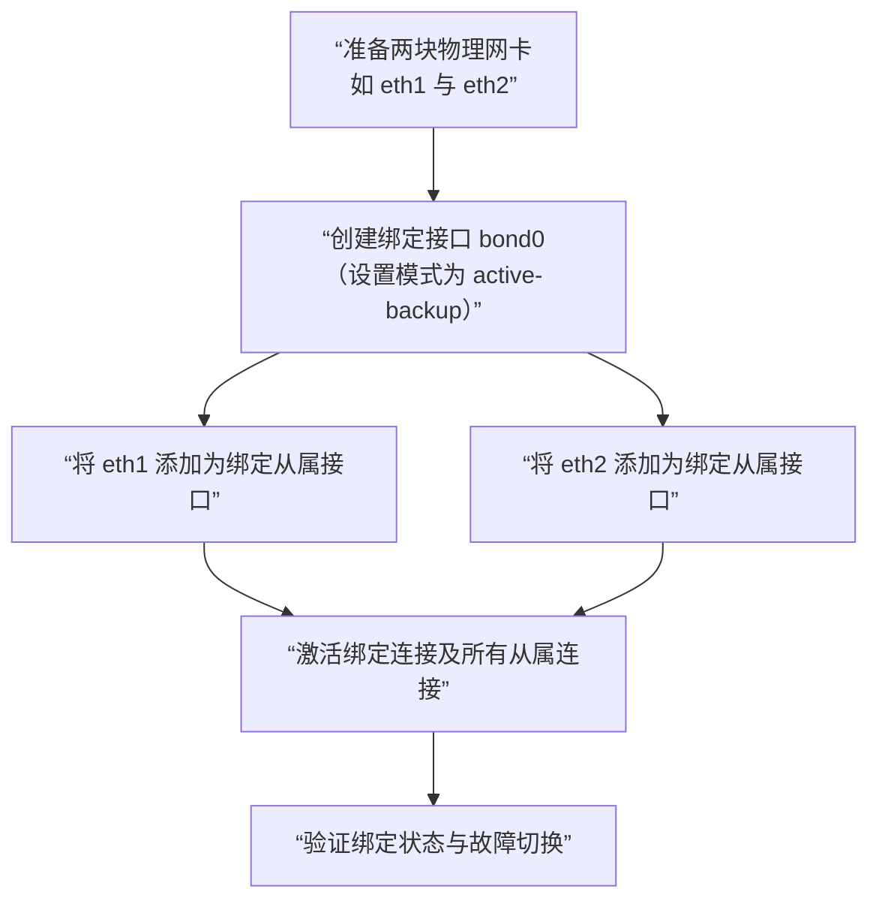

# Linux杂谈：一些常用命令


# linux杂谈：一些常用命令

<!--more-->

## linux信息收集

```shell
##linux杂谈：一些常用命令
#查看操作系统版本信息
 cat /etc/openEuler-latest
 cat /etc/os-release
 cat /etc/openEuler-release
#查看操作系统版本信息
 uname -a

#备份yum源
 cp /etc/yum.repos.d/openEuler.repo /etc/yum.repos.d/openEuler.repo.bak

#系统升级openeuler
dnf update | tee update_log
reboot

#系统降级openeuler
dnf downgrade | tee downgrade_log
reboot


#查看内核版本 ,redhat-linux
rpm -p kernel
#删除....内核版本
dnf -y remove .......
#删除....内核版本
dnf remove --oldinstallonly --setopt installonly_limit=2 kernel
#查看文本文件所在行
grep root /etc/passwd
 
#执行如下命令可以设置一个新的系统时间：
date -s "20190712 18:30:50" 
#执行如下命令将系统时间同步到硬件，防止系统重启后时间被还原。 hwclock --systohc

#重启一下我们修改过的网卡，nmtui修改ip
[root@7-2 ~]# nmcli connection up ens3 ens33  ens34  ens35
```

## 查看硬件信息

1. 查看cpu的统计信息

   ```
   # lscpu
   ```

2. 查看CPU相关参数

   ```
   # cat /proc/cpuinfo
   ```

3. 查看系统内存信息

   ```
   # cat /proc/meminfo
   ```

4. 查看内存信息

   ```
   # dmidecode -t memory
   ```

5. 查看硬盘和分区分布

   ```
   # lsblk
   ```

6. 看硬盘和分区的详细信息

   ```
   # fdisk -l
   ```

7. 查看网卡硬件信息

   ```
   # lspci | grep -i 'eth'
   ```

8. 查看所有网络接口

   ```
   # ip a
   # yum install -y net-tools
   # ifconfig
   ```

9. 查看某个网络接口的详细信息

   ```
   # ethtool enp7s0 （以enp7s0为例）
   ```

## 查看软件信息 

1. 查看软件包的详细信息

   ```
   # rpm -qi systemd（以systemd为例）
   ```

2. 查看软件包提供的模块

   ```
   # rpm -q --provides systemd  （以systemd为例）
   ```

3. 查看所有已安装软件包

   ```
   # rpm -qa | grep systemd （以systemd为例）
   ```

4. 查看软件包文件列表

   ```
   # rpm -ql python3-rpm  （以python3-rpm为例）
   ```

## 查看OS日志

1. 查看系统启动后的信息和错误日志

   ```
   # cat  /var/log/messages
   ```

2. 查看安全相关的日志信息

   ```
   # cat /var/log/secure
   ```

3. 查看邮件相关的日志信息

   ```
   # cat /var/log/maillog
   ```

4. 查看定时任务相关的日志信息

   ```
   # cat /var/log/cron
   ```

5. 查看守护进程启动和停止相关的日志消息

   ```
   # cat /var/log/boot.log
   ```


## 内存 

### 基本概念

**内存**是计算机的重要组成部件，用于暂时存放CPU中的运算数据，以及与硬件等外部存储器交换的数据。特别地，**非统一内存访问架构**（non-uniform memory access，简称NUMA）是一种为多处理器的电脑设计的内存架构，**内存访问时间取决于内存相对于处理器的位置**。在NUMA下，处理器访问本地内存的速度比非本地内存速度（内存位于另一个处理器，或者是处理器之间共享的内存）快。

### 常用内存分析工具/方式

1. free：可用于**显示系统内存状态**。

   例如：

   ```shell
   # 显示系统内存状态，以MB单位显示
   free -m
   ```

   回显信息如下：

   

   ```shell
   [root@openEuler ~]# free -m
                  total        used        free      shared  buff/cache   available
   Mem:            2633         436         324          23        2072        2196
   Swap:           4043           0        4043
   ```

   在命令的输出信息中，各字段所代表的含义如下：

   | 标识       | 含义                                           |
   | :--------- | :--------------------------------------------- |
   | total      | 总内存数。                                     |
   | used       | 已经使用的内存数。                             |
   | free       | 空闲的内存数。                                 |
   | shared     | 多个进程共享的内存总数。                       |
   | buff/cache | 缓冲和缓存内存总数。                           |
   | available  | 估计有多少内存可用于启动新应用程序，而不交换。 |

2. vmstat：可以**动态地监控系统内存**，查看系统内存的使用情况。

   例如：

   ```shell
   # 监测系统内存，显示活跃和非活跃内存
   vmstat -a
   ```

   回显信息如下：

   ```shell
   [root@openEuler ~]# vmstat -a
   procs -----------memory---------- ---swap-- -----io---- -system-- ------cpu-----
   r  b   swpd   free  inact active   si   so    bi    bo   in   cs us sy id wa st
   2  0    520 331980 1584728 470332    0    0     0     2   15   19  0  0 100  0  0
   ```

   在命令的输出信息中，与内存相关的memory字段所代表的含义如下：

   | 字段   | 含义                                                         |
   | :----- | :----------------------------------------------------------- |
   | memory | 内存信息字段。-swpd：虚拟内存的使用情况，单位为 KB。-free：空闲的内存容量，单位为 KB。-inact：非活跃的内存容量，单位为 KB。-active：活跃的内存容量，单位为 KB。 |

   

## I/O 

### 基本概念

**I/O**表示输入（Input）/输出（Output），输入指系统接收信号或数据的操作，输出指从系统发出信号或数据的操作。对于CPU 和主存储器的组合，**任何信息传入或传出 CPU/内存组合，就会被认为是 I/O**。

### 常用I/O性能分析工具

1. vmstat

   ```shell
   # 使用vmstat进行监测，报告磁盘相关统计信息
   vmstat -d
   ```

   

   在命令的输出信息中，各字段所代表的含义如下：

   | 字段   | 含义                                                         |
   | :----- | :----------------------------------------------------------- |
   | reads  | -total：已成功完成的读取总数。-merged：分组读取（导致一次I/O）。-sectors：扇区读取成功。-ms：读取花费的毫秒数。 |
   | writes | -total：已成功完成的写入总数。-merged：分组写入（导致一次I/O）。-sectors：写入成功的扇区。-ms：写入所花费的毫秒数。 |
   | IO     | -cur：正在进行的 I/O 数。-sec：I/O 所花费的秒数。            |


# 基础配置 

## 设置语言环境 

您可以通过localectl修改系统的语言环境，对应的参数设置保存在/etc/locale.conf文件中。这些参数会在系统启动过程中被systemd的守护进程读取。

### 显示当前语言环境状态 

显示当前语言环境，命令如下：

```
localectl status
```

例如显示系统当前的设置，命令和输出如下：

```
# localectl status
   System Locale: LANG=zh_CN.UTF-8
       VC Keymap: cn
      X11 Layout: cn
```

### 列出可用的语言环境

显示当前可用的语言环境，命令如下：

```
# localectl list-locales
```

例如显示当前系统中所有可用的中文环境，命令和输出如下：

```
# localectl list-locales | grep zh
zh_CN.UTF-8
```

### 设置语言环境 

要设置语言环境，在root权限下执行如下命令，其中 *locale* 是您要设置的语言类型，取值范围可通过**localectl list-locales**获取，请根据实际情况修改。

```
# localectl set-locale LANG=locale
```

例如设置为简体中文语言环境，在root权限下执行如下命令：

```
# localectl set-locale LANG=zh_CN.UTF-8
```

说明：

修改后需要重新登录或者在root权限下执行`source /etc/locale.conf`命令刷新配置文件，使修改生效。

## 设置键盘 

您可以通过localectl修改系统的键盘设置，对应的参数设置保存在/etc/locale.conf文件中。这些参数，会在系统启动的早期被systemd的守护进程读取。

### 显示当前设置 

显示当前键盘设置，命令如下：

```
# localectl status
```

例如显示系统当前的设置，命令和输出如下：

```
# localectl status
   System Locale: LANG=zh_CN.UTF-8
       VC Keymap: cn
      X11 Layout: cn
```

### 列出可用的键盘布局 

显示当前可用的键盘布局，命令如下：

```
# localectl list-keymaps
```

例如显示系统当前的中文键盘布局，命令和输出如下：

```
# localectl list-keymaps | grep cn
cn
```

### 设置键盘布局 

设置键盘布局，在root权限下执行如下命令，其中 *map* 是您想要设置的键盘类型，取值范围可通过**localectl list-keymaps**获取，请根据实际情况修改：


```
# localectl set-keymap map
```

此时设置的键盘布局同样也会应用到图形界面中。

设置完成后，查看当前状态：


```
# localectl status
   System Locale: LANG=zh_CN.UTF-8
       VC Keymap: cn
      X11 Layout: us
```

## 设置日期和时间 

本节介绍如何通过timedatectl、date、hwclock命令来设置系统的日期、时间和时区等。

### 使用timedatectl命令设置 

#### 显示日期和时间 

显示当前的日期和时间，命令如下：

```
# timedatectl
```

例如显示系统当前的日期和时间，命令和输出如下：

```
# timedatectl
               Local time: Mon 2019-09-30 04:05:00 EDT
           Universal time: Mon 2019-09-30 08:05:00 UTC
                 RTC time: Mon 2019-09-30 08:05:00
                Time zone: China Standard Time (CST), UTC +8
System clock synchronized: no
              NTP service: inactive
          RTC in local TZ: no
```

#### 通过远程服务器进行时间同步 

您可以启用NTP远程服务器进行系统时钟的自动同步。是否启用NTP，可在root权限下执行如下命令进行设置。其中 *boolean* 可取值yes和no，分别表示启用和不启用NTP进行系统时钟自动同步，请根据实际情况修改。

说明：

若启用了NTP远程服务器进行系统时钟自动同步，则不能手动修改日期和时间。若需要手动修改日期或时间，则需确保已经关闭NTP系统时钟自动同步。可执行`timedatectl set-ntp no`命令进行关闭。

例如开启自动远程时间同步，命令如下：


```
# timedatectl set-ntp yes
```

#### 修改日期 

说明：

修改日期前，请确保已经关闭NTP系统时钟自动同步。

修改当前的日期，在root权限下执行如下命令，其中 *YYYY* 代表年份，*MM* 代表月份，*DD* 代表某天，请根据实际情况修改：


```
# timedatectl set-time YYYY-MM-DD
```

例如修改当前的日期为2019年8月14号，命令如下：


```
# timedatectl set-time '2019-08-14'
```

#### 修改时间 

说明：

修改时间前，请确保已经关闭NTP系统时钟自动同步。

修改当前的时间，在root权限下执行如下命令，其中 *HH* 代表小时，*MM* 代表分钟，*SS* 代表秒，请根据实际情况修改：


```
# timedatectl set-time HH:MM:SS
```

例如修改当前的时间为15点57分24秒，命令如下：


```
# timedatectl set-time 15:57:24
```

#### 修改时区 

显示当前可用时区，命令如下：

```
timedatectl list-timezones
```

要修改当前的时区，在root权限下执行如下命令，其中 *time_zone* 是您想要设置的时区，请根据实际情况修改：


```
# timedatectl set-timezone time_zone
```

例如修改当前的时区，首先查询所在地域的可用时区，此处以Asia为例：


```
# timedatectl list-timezones | grep Asia
Asia/Aden
Asia/Almaty
Asia/Amman
Asia/Anadyr
Asia/Aqtau
Asia/Aqtobe
Asia/Ashgabat
Asia/Baghdad
Asia/Bahrain
……

Asia/Seoul
Asia/Shanghai
Asia/Singapore
Asia/Srednekolymsk
Asia/Taipei
Asia/Tashkent
Asia/Tbilisi
Asia/Tehran
Asia/Thimphu
Asia/Tokyo
```

然后修改当前的时区为“Asia/Shanghai”，命令如下：


```
# timedatectl set-timezone Asia/Shanghai
```

### 使用date命令设置 

#### 显示当前的日期和时间 

显示当前的日期和时间，命令如下：


```
# date
```

默认情况下，date命令显示本地时间。要显示UTC时间，添加--utc或-u参数：


```
# date --utc
```

要自定义对应的输出信息格式，添加 +"format" 参数：


```
# date +"format"
```

**表 1** 参数说明


| 格式参数 | 说明                                                       |
| :------- | :--------------------------------------------------------- |
| %H       | 小时以HH格式（例如 17）。                                  |
| %M       | 分钟以MM格式（例如 37）。                                  |
| %S       | 秒以SS格式（例如 25）。                                    |
| %d       | 日期以DD格式（例如 15）。                                  |
| %m       | 月份以MM格式（例如 07）。                                  |
| %Y       | 年份以YYYY格式（例如 2019）。                              |
| %Z       | 时区缩写（例如CEST）。                                     |
| %F       | 日期整体格式为YYYY-MM-DD（例如 2019-7-15），等同%Y-%m-%d。 |
| %T       | 时间整体格式为HH:MM:SS（例如 18:30:25），等同%H:%M:%S。    |

实际使用示例如下：

- 显示当前的日期和本地时间。

  

  ```
  # date 
  2019年 08月 17日 星期六 17:26:34 CST
  ```

- 显示当前的日期和UTC时间。

  

  ```
  # date --utc
  2019年 08月 17日 星期六 09:26:18 UTC
  ```

- 自定义date命令的输出。

  

  ```
  # date +"%Y-%m-%d %H:%M"
  2019-08-17 17:24
  ```

#### 修改时间 

要修改当前的时间，添加--set或者-s参数。在root权限下执行如下命令，其中 *HH* 代表小时，*MM* 代表分钟，*SS* 代表秒，请根据实际情况修改：


```
# date --set HH:MM:SS
```

默认情况下， date命令设置本地时间。要设置UTC时间，添加--utc或-u参数：


```
# date --set HH:MM:SS --utc
```

例如修改当前的时间为23点26分00秒，在root权限下执行如下命令：


```
# date --set 23:26:00
```

#### 修改日期 

修改当前的日期，添加--set或者-s参数。在root权限下执行如下命令，其中 *YYYY* 代表年份，*MM* 代表月份，*DD* 代表某天，请根据实际情况修改：


```
# date --set YYYY-MM-DD
```

例如修改当前的日期为2019年11月2日，命令如下：


```
# date --set 2019-11-02
```

### 使用hwclock命令设置 

可以使用 hwclock 命令设置硬件时钟RTC (Real Time Clock) 。

#### 硬件时钟和系统时钟 

Linux 将时钟分为：

- 系统时钟 (System Clock) ：当前Linux Kernel中的时钟。
- 硬件时钟 RTC：主板上由电池供电的主板硬件时钟，该时钟可以在BIOS的 "Standard BIOS Feature" 项中进行设置。

当Linux启动时，会读取硬件时钟，并根据硬件时间来设置系统时间。

#### 显示日期和时间 

显示当前硬件的日期和时间，在root权限下执行如下命令：

```
# hwclock
```

例如显示当前硬件的日期和时间，命令和输出如下：

```
# hwclock
2019-08-26 10:18:42.528948+08:00
```

#### 设置日期和时间 

修改当前硬件的日期和时间，在root权限下执行如下命令，其中 *dd* 表示日，*mm* 表示月份，*yyyy* 表示年份，*HH* 表示小时，*MM* 表示分钟，请根据实际情况修改：

```
# hwclock --set --date "yyyy-mm-dd HH:MM"
```

例如修改当前的时间为2019年10月21日21点17分，命令如下：

```
# hwclock --set --date "2019-10-21 21:17"
```

## 设置kdump 

本节介绍如何设置kdump预留内存及修改kdump配置文件参数。

### 设置kdump预留内存 

#### 预留内存参数格式 

kdump预留内存参数必须添加到内核启动参数中，配置文件为/boot/efi/EFI/openEuler/grub.cfg（UEFI引导模式）或/boot/grub2/grub.cfg（legacy引导模式），openEuler发布版本中默认已经添加，可以根据实际使用情况调整。添加和修改启动参数后，重启系统生效。kdump预留内存参数格式如下：

| 内核启动参数                         | 描述                                                         | 缺省值                      | 备注                                                         |
| :----------------------------------- | :----------------------------------------------------------- | :-------------------------- | :----------------------------------------------------------- |
| crashkernel=x                        | 在4G以下的物理内存预留x大小的内存给kdump使用。               | x86版本默认配置512M         | 该配置方法只在4G以下内存预留，必须保证4G以下连续可用内存足够预留。 |
| crashkernel=x@y                      | 在y起始地址预留x大小的内存给kdump使用。                      | 未使用                      | 需要确保y起始地址的x大小的内存未被其他模块预留。             |
| crashkernel=x,high                   | 在4G以下的物理内存中预留256M内存，在4G以上预留x大小内存给kdump使用。 | arm64版本默认配置1024M,high | 需要确保4G以下有256M连续可用的物理内存，4G以上有连续的x大小的连续物理内存。实际预留内存大小为256M+x。 |
| crashkernel=x,low crashkernel=y,high | 在4G以下的物理内存中预留x大小，在4G以上预留y大小内存给kdump使用。 | 未使用                      | 需要确保4G以下有连续的x大小物理内存，4G以上有连续的y大小物理内存。 |

### 预留内存推荐值 

| 推荐方案 | 预留参数               | 参数说明                                                     |
| :------- | :--------------------- | :----------------------------------------------------------- |
| 通用方案 | crashkernel=2048M,high | 4G以下预留256M，4G以上预留2048M内存给kdump使用。共256+2048M。 |
| 经济方案 | crashkernel=1024M,high | 4G以下预留256M，4G以上预留1024M内存给kdump使用。共256+1024M。 推荐系统512M内存以内的场景，并不使用网络转储kdump文件。对于虚拟机场景，可以适当减少内存预留值，推荐虚拟机设置为crashkernel=512M或者crashkernel=256M,high |

说明：

不通过网络转储kdump文件时，需要设置kdump文件系统不打包网络相关驱动。网络驱动加载需要申请较大内存，可能导致预留内存不足，kdump失败。因此建议禁用网络相关驱动。

### 禁用网络相关驱动 

kdump配置文件（/etc/kdump.conf）中，dracut参数可以设置裁剪的驱动模块，可以将网络驱动配置到裁剪驱动列表中，让kdump文件系统中不加载该驱动，修改配置文件后，重启kdump服务生效。dracut参数配置如下所示：

```
dracut_args --omit-drivers "mdio-gpi usb_8dev et1011c rt2x00usb bcm-phy-lib mac80211_hwsim rtl8723be rndis_host hns3_cae amd vrf rtl8192cu mt76x02-lib int51x1 ppp_deflate team_mode_loadbalance smsc911x aweth bonding mwifiex_usb hnae dnet rt2x00pci vaser_pci hdlc_ppp marvell rtl8xxxu mlxsw_i2c ath9k_htc rtl8150 smc91x cortina at803x rockchip cxgb4 spi_ks8995 mt76x2u smsc9420 mdio-cavium bnxt_en ch9200 dummy macsec ice mt7601u rtl8188ee ixgbevf net1080 liquidio_vf be2net mlxsw_switchx2 gl620a xilinx_gmii2rgmii ppp_generic rtl8192de sja1000_platform ath10k_core cc770_platform realte igb c_can_platform c_can ethoc dm9601 smsc95xx lg-vl600 ifb enic ath9 mdio-octeon ppp_mppe ath10k_pci cc770 team_mode_activebackup marvell10g hinic rt2x00lib mlx4_en iavf broadcom igc c_can_pci alx rtl8192se rtl8723ae microchip lan78xx atl1c rtl8192c-common almia ax88179_178a qed netxen_nic brcmsmac rt2800usb e1000 qla3xxx mdio-bitbang qsemi mdio-mscc-miim plx_pci ipvlan r8152 cx82310_eth slhc mt76x02-usb ems_pci xen-netfront usbnet pppoe mlxsw_minimal mlxsw_spectrum cdc_ncm rt2800lib rtl_usb hnae3 ath9k_common ath9k_hw catc mt76 hns_enet_drv ppp_async huawei_cdc_ncm i40e rtl8192ce dl2 qmi_wwan mii peak_usb plusb can-dev slcan amd-xgbe team_mode_roundrobin ste10Xp thunder_xcv pptp thunder_bgx ixgbe davicom icplus tap tun smsc75xx smsc dlci hns_dsaf mlxsw_core rt2800mmi softing uPD60620 vaser_usb dp83867 brcmfmac mwifiex_pcie mlx4_core micrel team macvlan bnx2 virtio_net rtl_pci zaurus hns_mdi libcxgb hv_netvsc nicvf mt76x0u teranetics mlxfw cdc_eem qcom-emac pppox mt76-usb sierra_net i40evf bcm87xx mwifiex pegasus rt2x00mmi sja1000 ena hclgevf cnic cxgb4vf ppp_synctty iwlmvm team_mode_broadcast vxlan vsockmon hdlc_cisc rtl8723-common bsd_comp fakelb dp83822 dp83tc811 cicada fm10 8139t sfc hs geneve hclge xgene-enet-v2 cdc_mbim hdlc asix netdevsim rt2800pci team_mode_random lxt ems_usb mlxsw_pci sr9700 mdio-thunder mlxsw_switchib macvtap atlantic cdc_ether mcs7830 nicpf mdi peak_pci atl1e cdc_subset ipvtap btcoexist mt76x0-common veth slip iwldvm bcm7xxx vitesse netconsole epic100 myri10ge r8169 qede microchip_t1 liquidi bnx2x brcmutil mwifiex_sdi mlx5_core rtlwifi vmxnet3 nlmon hns3 hdlc_raw esd_usb2 atl2 mt76x2-common iwlwifi mdio-bcm-unimac national ath rtwpci rtw88 nfp rtl8821ae fjes thunderbolt-net 8139cp atl1 mscc vcan dp83848 dp83640 hdlc_fr e1000e ipheth net_failover aquantia rtl8192ee igbvf rocker intel-xway tg3" --omit "ramdisk network ifcfg qemu-net" --install "chmod" --nofscks
```

## 设置磁盘调度算法 

本节介绍如何设置磁盘调度算法。

### 临时修改调度策略 

### 例如将所有IO调度算法修改为mq-deadline，此修改重启后会失效。

```
# echo mq-deadline > /sys/block/sd*/queue/scheduler
```

### 永久设置调度策略 

可以通过在内核启动配置文件grub.cfg中的kernel行追加：elevator=mq-deadline，重启后生效。


```
linux   /vmlinuz-4.19.90-2003.4.0.0036.oe1.x86_64 root=/dev/mapper/openeuler-root ro resume=/dev/mapper/openeuler-swap rd.lvm.lv=openeuler/root rd.lvm.lv=openeuler/swap quiet crashkernel=512M elevator=mq-deadline
```

## 设置NMI watchdog 

本节介绍openEuler在arm64架构上NMI watchdog方案的差异以及配置。

### 概述 

NMI watchdog（Hard lockup detector）是一种用来检测系统是否出现Hard lockup（硬死锁）的机制。一般的watchdog依赖时钟中断进行挂死检测，当系统在原子上下文（中断，或者中断关闭的上下文中，etc）中出现挂死时，时钟中断处理，检测失效。NMI watchdog一般通过PMC（或者PMU）的NMI中断进行检测，NMI中断可以在原子上下文中产生并处理，因此可以用来检测原子上下文中挂死的场景。

NMI watchdog主线已经支持，当硬件满足以下条件时可以使能NMI watchdog：

1. 支持NMI中断
2. 支持PMC（PMU）

在arm64上，openEuler基于arm64的SDEI功能实现了SDEI watchdog作为NMI watchdog。因此openEuler在arm64上存在2种NMI watchdog方案：

1. SDEI watchdog（默认方式）
2. 基于PMC（PMU）中断的NMI watchdog

### 注意事项 

对于arm64机器，需要注意以下事项：

- 默认情况下使用SDEI watchdog。当SDEI watchdog使能失败时，不会切换到NMI watchdog
- 需要使用NMI watchdog时，需要显式的在启动参数中禁用SDEI watchdog：disable_sdei_nmi_watchdog
- 当需要使用NMI watchdog时，需要保证硬件支持NMI中断：
  - 当硬件支持NMI中断时，不需要额外处理
  - 当硬件不支持NMI中断，但是支持伪NMI中断时，需要显式的在启动参数中使能伪NMI中断：irqchip.gicv3_pseudo_nmi=1

以上事项不影响非arm64平台。

### 操作步骤 

针对arm64架构配置NMI watchdog的操作步骤如下：

1. 在OS的引导配置文件grub.cfg中添加如下参数：irqchip.gicv3_pseudo_nmi=1（仅通过Pseudo-NMI实现NMI watchdog时添加） disable_sdei_nmi_watchdog
2. 检查NMI watchdog是否加载成功，如果加载成功，内核dmesg日志打印类似如下内容


```
[   11.361889][  T129] NMI watchdog: Enabled. Permanently consumes one hw-PMU counter.
```

### 关闭NMI watchdog 

将NMI watchdog临时关闭，此修改重启后会失效；默认nmi_watchdog=1。


```
#  echo 0 > /proc/sys/kernel/nmi_watchdog
```

在OS启动时，可以通过配置内核参数nmi_watchdog=0关闭NMI watchdog。

### 修改NMI watchdog阈值 

修改NMI watchdog阈值，此修改重启后会失效；默认watchdog_thresh=10。


```
#  echo 10 > /proc/sys/kernel/watchdog_thresh
```

在OS启动时，可以通过配置内核参数watchdog_thresh=[0-60]修改阈值。

# 管理用户 

在Linux中，每个普通用户都有一个帐户，包括用户名、密码和主目录等信息。除此之外，还有一些系统本身创建的特殊用户，它们具有特殊的意义，其中最重要的是管理员帐户，默认用户名是root。同时Linux也提供了用户组，使每一个用户至少属于一个组，从而便于权限管理。

用户和用户组管理是系统安全管理的重要组成部分，本章主要介绍openEuler提供的用户管理和组管理命令，以及为普通用户分配特权的方法。

## 管理用户 

### 增加用户 

#### useradd命令 

在root权限下，通过useradd命令可以为系统添加新用户信息，其中 *options* 为相关参数， *username* 为用户名称。

```
useradd [options] username
```

#### 用户信息文件 

与用户帐号信息有关的文件如下：

- /etc/passwd：用户帐号信息文件。
- /etc/shadow：用户帐号信息加密文件。
- /etc/group：组信息文件。
- /etc/default/useradd：定义默认设置文件。
- /etc/login.defs：系统广义设置文件。
- /etc/skel：默认的初始配置文件目录。

#### 创建用户实例 

例如新建一个用户名为userexample的用户，在root权限下执行如下命令：

```
# useradd userexample
```

说明：

没有任何提示，表明用户建立成功。这时并没有设置用户的口令，请使用passwd命令修改用户的密码，没有设置密码的新帐号不能登录系统。

使用id命令查看新建的用户信息，命令如下：

```
# id userexample
uid=1001(userexample)    gid=1001(userexample)    groups=1001(userexample)
```

修改用户userexample的密码：


```
# passwd userexample
```

建议在修改用户密码时满足密码复杂度要求，密码的复杂度的要求如下：

1. 口令长度至少8个字符。

2. 口令至少包含大写字母、小写字母、数字和特殊字符中的任意3种。

3. 口令不能和帐号一样。

4. 口令不能使用字典词汇。

   - 查询字典 在已装好的openEuler环境中，可以通过如下命令导出字典库文件dictionary.txt，用户可以查询密码是否在该字典中。

     

     ```
     cracklib-unpacker /usr/share/cracklib/pw_dict > dictionary.txt
     ```

   - 修改字典

     1. 修改上面导出的字典文件，执行如下命令更新系统字典库。

        

        ```
        # create-cracklib-dict dictionary.txt
        ```

     2. 在原字典库基础上新增其他字典内容custom.txt。

        

        ```
        # create-cracklib-dict dictionary.txt custom.txt
        ```

根据提示两次输入新用户的密码，完成密码更改。过程如下：


```
# passwd userexample
Changing password for user userexample.
New password:
Retype new password:
passwd: all authentication tokens updated successfully.
```

说明：

若打印信息中出现“BAD PASSWORD: The password fails the dictionary check - it is too simplistic/systematic”，表示设置的密码过于简单，建议设置复杂度较高的密码。

### 修改用户帐号 

#### 修改密码 

普通用户可以用passwd修改自己的密码，只有管理员才能用passwd username为其他用户修改密码。

#### 修改用户shell设置 

使用chsh命令可以修改自己的shell，只有管理员才能用chsh username为其他用户修改shell设置。

用户也可以使用usermod命令修改shell信息，在root权限下执行如下命令，其中 *new_shell_path* 为目标shell路径，*username* 为要修改用户的用户名，请根据实际情况修改：

```
usermod -s new_shell_path username
```

例如，将用户userexample的shell改为csh，命令如下：

```
# usermod -s /bin/csh userexample
```

#### 修改主目录 

- 修改主目录，可以在root权限下执行如下命令，其中 *new_home_directory* 为已创建的目标主目录的路径，*username* 为要修改用户的用户名，请根据实际情况修改：

  ```
  usermod -d new_home_directory username
  ```

- 如果想将现有主目录的内容转移到新的目录，应该使用-m选项，命令如下：

  ```
  usermod -d new_home_directory -m username
  ```

#### 修改UID 

修改用户ID，在root权限下执行如下命令，其中 *UID* 代表目标用户ID，*username* 代表用户名，请根据实际情况修改：

```
usermod -u UID username
```

该用户主目录中所拥有的文件和目录都将自动修改UID设置。但是，对于主目录外所拥有的文件，只能使用chown命令手动修改所有权。

#### 修改帐号的有效期 

如果使用了影子口令，则可以在root权限下，执行如下命令来修改一个帐号的有效期，其中 *MM* 代表月份，*DD* 代表某天，*YY* 代表年份，*username* 代表用户名，请根据实际情况修改：

```
usermod -e MM/DD/YY username
```

### 删除用户 

在root权限下，使用userdel命令可删除现有用户。

例如，删除用户Test，命令如下：

```
# userdel Test
```

如果想同时删除该用户的主目录以及其中所有内容，要使用-r参数递归删除。

说明：

不建议直接删除已经进入系统的用户，如果需要强制删除，请使用 userdel -f *Test* 命令。

### 管理员帐户授权 

使用sudo命令可以允许普通用户执行管理员帐户才能执行的命令。

sudo命令允许已经在/etc/sudoers文件中指定的用户运行管理员帐户命令。例如，一个已经获得许可的普通用户可以运行如下命令：

```
sudo /usr/sbin/useradd newuserl
```

实际上，sudo的配置完全可以指定某个已经列入/etc/sudoers文件的普通用户可以做什么，不可以做什么。

/etc/sudoers的配置行如下所示。

- 空行或注释行（以#字符打头）：无具体功能的行。

- 可选的主机别名行：用来创建主机列表的简称。必须以Host_Alias关键词开头，列表中的主机必须用逗号隔开，如：

  

  ```
  Host_Alias  linux=ted1,ted2
  ```

  其中ted1和ted2是两个主机名，可使用linux（别名）称呼它们。

- 可选的用户别名行：用来创建用户列表的简称。用户别名行必须以User_Alias关键词开头，列表中的用户名必须以逗号隔开。其格式同主机别名行。

- 可选的命令别名行：用来创建命令列表的简称。必须以Cmnd_Alias开头，列表中的命令必须用逗号隔开。

- 可选的运行方式别名行：用来创建用户列表的简称。不同的是，使用这样的别名可以告诉sudo程序以列表中某一用户的身份来运行程序。

- 必要的用户访问说明行。

  用户访问的说明语法如下：

  

  ```
  user host = [ run as user ] command list
  ```

  在user处指定一个真正的用户名或定义过的别名，host也可以是一个真正的主机名或者定义过的主机别名。默认情况下，sudo执行的所有命令都是以root身份执行。如果您想使用其他身份可以指定。command list可以是以逗号分隔的命令列表，也可以是一个已经定义过的别名，如：

  

  ```
  ted1   ted2=/sbin/shutdown
  ```

  这一句说明ted1可以在ted2主机上运行关机命令。

  

  ```
  newuser1 ted1=(root) /usr/sbin/useradd,/usr/sbin/userdel
  ```

  这一句说明ted1主机上的newuser1具有以root用户权限执行useradd，userdel命令的功能。

  说明：

  

  - 可以在一行定义多个别名，中间用冒号 (:) 隔开。
  - 可在命令或命令别名之前加上感叹号 (!)，使该命令或命令别名无效。
  - 有两个关键词：ALL和NOPASSWD。ALL意味着“所有”（所有文件、所有主机或所有命令），NOPASSWD意味着不用密码。
  - 通过修改用户访问，将普通用户的访问权限修改为同root一样，则可以给普通用户分配特权。

下面是一个sudoers文件的例子：


```
#sudoers files
#User alias specification
User_Alias ADMIN=ted1:POWERUSER=globus,ted2
#user privilege specification
ADMIN ALL=ALL
POWERUSER ALL=ALL,!/bin/su
```

其中：

- User_Alias ADMIN=ted1:POWERUSER=globus,ted2

  定义了两个别名ADMIN和POWERUSER

- ADMIN ALL=ALL

  说明在所有主机上，ADMIN用户都可以以root身份执行所有命令

- POWERUSER ALL=ALL,!/bin/su

  给POWERUSER用户除了运行su命令外等同ADMIN的权限

## 管理用户组 

### 增加用户组 

#### groupadd命令 

在root权限下，通过groupadd命令可以为系统添加新用户组信息，其中 *options* 为相关参数， *groupname* 为用户组名称。

```
groupadd [options] groupname
```

#### 用户组信息文件 

与用户组信息有关的文件如下：

- /etc/gshadow：用户组信息加密文件。
- /etc/group：组信息文件。
- /etc/login.defs：系统广义设置文件。

#### 创建用户组实例 

例如新建一个用户组名为groupexample的用户，在root权限下执行如下命令：

```
# groupadd groupexample
```

### 修改用户组 

#### 修改GID 

修改用户组ID，在root权限下执行如下命令，其中 *GID* 代表目标用户组ID， *groupname* 代表用户组，请根据实际情况修改：

```
# groupmod -g GID groupname
```

#### 修改用户组名 

修改用户组名，在root权限下执行如下命令，其中 *newgroupname* 代表新用户组名， *oldgroupname* 代表已经存在的待修改的用户组名，请根据实际情况修改：

```
# groupmod -n newgroupname oldgroupname
```

### 删除用户组 

在root权限下，使用groupdel命令可删除用户组。

例如，删除用户组Test，命令如下：

```
# groupdel Test
```

说明：

groupdel不能直接删除用户的主组，如果需要强制删除用户主组，请使用 groupdel -f *Test* 命令。

### 将用户加入用户组或从用户组中移除 

在root权限下，使用gpasswd命令将用户加入用户组或从用户组中移除。

例如，将用户 *userexample* 加入用户组 *Test* ，命令如下：

```
# gpasswd -a userexample Test
```

例如，将用户 *userexample* 从 *Test* 用户组中移除，命令如下：

```
# gpasswd -d userexample Test
```

### 切换用户组 

一个用户同时属于多个用户组时，则在用户登录后，使用newgrp命令可以切换到其他用户组，以便具有其他用户组的权限。

例如，将用户 *userexample* 切换到 *Test* 用户组，命令如下：

```
newgrp Test
```

# 使用DNF管理软件包 

DNF是一款Linux软件包管理工具，用于管理RPM软件包。DNF可以查询软件包信息，从指定软件库获取软件包，自动处理依赖关系以安装或卸载软件包，以及更新系统到最新可用版本。

说明：

- DNF与YUM完全兼容，提供了YUM兼容的命令行以及为扩展和插件提供的API。
- 使用DNF需要管理员权限，本章所有命令需要在管理员权限下执行。

## 配置DNF 

### DNF配置文件 

DNF 的主要配置文件是 /etc/dnf/dnf.conf，该文件包含两部分：

- “main”部分保存着DNF的全局设置。
- “repository”部分保存着软件源的设置，可以有零个或多个“repository”。

另外，在/etc/yum.repos.d 目录中保存着零个或多个repo源相关文件，它们也可以定义不同的“repository”。

所以openEuler软件源的配置一般有两种方式，一种是直接配置/etc/dnf/dnf.conf文件中的“repository”部分，另外一种是在/etc/yum.repos.d目录下增加.repo文件。

#### 配置main部分 

/etc/dnf/dnf.conf 文件包含的“main”部分，配置示例如下：

```
[main]
gpgcheck=1
installonly_limit=3
clean_requirements_on_remove=True
best=True
```

常用选项说明：

**表 1** main参数说明


| 参数                         | 说明                                                         |
| :--------------------------- | :----------------------------------------------------------- |
| cachedir                     | 缓存目录，该目录用于存储RPM包和数据库文件。                  |
| keepcache                    | 可选值是1和0，表示是否要缓存已安装成功的那些RPM包及头文件，缺省值为0，即不缓存。 |
| debuglevel                   | 设置dnf生成的debug信息。取值范围：[0-10]，数值越大会输出越详细的debug信息。缺省值为2，设置为0表示不输出debug信息。 |
| clean_requirements_on_remove | 删除在dnf remove期间不再使用的依赖项，如果软件包是通过DNF安装的，而不是通过显式用户请求安装的，则只能通过clean_requirements_on_remove删除软件包，即它是作为依赖项引入的。 缺省值为True。 |
| best                         | 升级包时，总是尝试安装其最高版本，如果最高版本无法安装，则提示无法安装的原因并停止安装。缺省值为True。 |
| obsoletes                    | 可选值1和0，设置是否允许更新陈旧的RPM包。缺省值为1，表示允许更新。 |
| gpgcheck                     | 可选值1和0，设置是否进行gpg校验。缺省值为1，表示需要进行校验。 |
| plugins                      | 可选值1和0，表示启用或禁用dnf插件。缺省值为1，表示启用dnf插件。 |
| installonly_limit            | 设置可以同时安装“installonlypkgs”指令列出包的数量。缺省值为3，不建议降低此值。 |

#### 配置repository部分 

repository部分允许您定义定制化的openEuler软件源仓库，各个仓库的名称不能相同，否则会引起冲突。配置repository部分有两种方式，一种是直接配置/etc/dnf/dnf.conf文件中的“repository”部分，另外一种是配置/etc/yum.repos.d目录下的.repo文件。

- 直接配置/etc/dnf/dnf.conf文件中的“repository”部分

  下面是[repository]部分的一个最小配置示例：

  

  ```
  [repository]
  name=repository_name
  baseurl=repository_url
  ```

  说明：

  openEuler提供在线的镜像源，地址：https://repo.openeuler.org/。以 openEuler 23.09的aarch64版本为例，baseurl可配置为https://repo.openeuler.org/openEuler-23.09/OS/aarch64/。

  选项说明：

  **表 2** repository参数说明

  | 参数                   | 说明                                                         |
  | :--------------------- | :----------------------------------------------------------- |
  | name=repository_name   | 软件仓库（repository ）描述的字符串。                        |
  | baseurl=repository_url | 软件仓库（repository ）的地址。使用http协议的网络位置：例如 http://path/to/repo使用ftp协议的网络位置：例如 ftp://path/to/repo本地位置：例如 file:///path/to/local/repo |

- 配置/etc/yum.repos.d目录下的.repo文件

  openEuler提供了多种repo源供用户在线使用，各repo源含义可参考[系统安装](https://docs.openeuler.openatom.cn/zh/docs/24.03_LTS_SP1/server/releasenotes/releasenotes/os_installation.html)。使用root权限添加openEuler repo源，示例如下：

  

  ```
  # vi /etc/yum.repos.d/openEuler.repo
  
  [OS]
  name=openEuler-$releasever-OS
  baseurl=https://repo.openeuler.org/openEuler-{version}/OS/$basearch/
  enabled=1
  gpgcheck=1
  gpgkey=https://repo.openeuler.org/openEuler-{version}/OS/$basearch/RPM-GPG-KEY-openEuler
  ```

  说明：

  

  - enabled为是否启用该软件源仓库，可选值为1和0。缺省值为1，表示启用该软件源仓库。
  - gpgkey为验证签名用的公钥。

#### 显示当前配置 

- 显示当前的配置信息：

  

  ```
  # dnf config-manager --dump
  ```

- 显示相应软件源的配置，首先查询repo id：

  

  ```
  # dnf repolist
  ```

  然后执行如下命令，显示对应id的软件源配置，其中 *repository* 为查询得到的repo id：

  

  ```
  # dnf config-manager --dump repository
  ```

- 您也可以使用一个全局正则表达式，来显示所有匹配部分的配置：

  

  ```
  # dnf config-manager --dump glob_expression
  ```

### 创建本地软件源仓库 

要建立一个本地软件源仓库，请按照下列步骤操作。

1. 安装createrepo软件包。

   ```
   # dnf install createrepo
   ```

2. 将需要的软件包复制到一个目录下，如/mnt/local_repo/ 。

3. 创建软件源。

   ```
   # createrepo /mnt/local_repo
   ```

### 添加、启用和禁用软件源

本节将介绍如何通过“dnf config-manager”命令添加、启用和禁用软件源仓库。

#### 添加软件源 

要定义一个新的软件源仓库，您可以在 /etc/dnf/dnf.conf 文件中添加“repository”部分，或者在/etc/yum.repos.d/目录下添加“.repo”文件进行说明。建议您通过添加“.repo”的方式，每个软件源都有自己对应的“.repo”文件，以下介绍该方式的操作方法。

要在您的系统中添加一个这样的源，请在root权限下执行如下命令，执行完成之后会在/etc/yum.repos.d/目录下生成对应的repo文件。其中 *repository_url* 为repo源地址，详情请参见[表2](https://docs.openeuler.openatom.cn/zh/docs/24.03_LTS_SP1/server/administration/administrator/using_dnf_to_manage_software_packages.html#zh-cn_topic_0151921080_t7c83ace02ab94e9986c0684f417e3436)。

```
# dnf config-manager --add-repo repository_url
```

#### 启用软件源 

要启用软件源，请在root权限下执行如下命令，其中 *repository* 为新增.repo文件中的repo id（可通过dnf repolist查询）：

```
# dnf config-manager --set-enable repository
```

您也可以使用一个全局正则表达式，来启用所有匹配的软件源。其中 *glob_expression* 为对应的正则表达式，用于同时匹配多个repo id：

```
# dnf config-manager --set-enable glob_expression
```

#### 禁用软件源 

要禁用软件源，请在root权限下执行如下命令：

```
# dnf config-manager --set-disable repository
```

同样的，您也可以使用一个全局正则表达式来禁用所有匹配的软件源：

```
# dnf config-manager --set-disable glob_expression
```

## 管理软件包 

使用dnf能够让您方便的进行查询、安装、删除软件包等操作。

### 搜索软件包 

您可以使用rpm包名称、缩写或者描述搜索需要的RPM包，使用命令如下：

```
# dnf search httpd (以httpd为例)
```

### 列出软件包清单 

要列出系统中所有已安装的以及可用的RPM包信息，使用命令如下：

```
# dnf list all
```

要列出系统中特定的RPM包信息，使用命令如下：

```
# dnf list httpd  (以httpd为例)
```

### 显示RPM包信息 

要显示一个或者多个RPM包信息，多个包之间以空格分隔，使用命令如下：

```
# dnf info httpd zip  (以httpd，zip两个包为例)
```

### 安装RPM包 

要安装一个软件包及其所有未安装的依赖，请在root权限下执行如下命令：

```
# dnf install package_name
```

您也可以通过添加软件包名字同时安装多个软件包。配置文件/etc/dnf/dnf.conf添加参数strict=False，运行dnf命令参数添加--setopt=strict=0。请在root权限下执行如下命令：

```
# dnf install package_name package_name... --setopt=strict=0
```

示例如下：

```
# dnf install httpd
```

说明：

安装RPM包过程中，若出现安装失败，可参考[问题5：安装时出现软件包冲突、文件冲突或缺少软件包导致安装失败](https://docs.openeuler.openatom.cn/zh/docs/common/faq/server/administration_faqs.html#问题5-安装时出现软件包冲突、文件冲突或缺少软件包导致安装失败)。

### 下载软件包 

使用dnf下载软件包，请在root权限下输入如下命令：

```
# dnf download package_name
```

如果需要同时下载未安装的依赖，则加上--resolve，使用命令如下：

```
# dnf download --resolve package_name
```

示例如下：

```
# dnf download --resolve httpd
```

### 删除软件包 

要卸载软件包以及相关的依赖软件包，请在root权限下执行如下命令：

```
# dnf remove package_name...
```

示例如下：

```
# dnf remove totem
```

## 管理软件包组 

软件包集合是服务于一个共同的目的一组软件包，例如系统工具集等。使用dnf可以对软件包组进行安装/删除等操作，使相关操作更高效。

### 列出软件包组清单 

使用summary参数，可以列出系统中所有已安装软件包组、可用的组，可用的环境组的数量，命令如下：

```
# dnf groups summary
```

要列出所有软件包组和它们的组ID ，命令如下：

```
# dnf group list
```

### 显示软件包组信息 

要列出包含在一个软件包组中必须安装的包和可选包，使用命令如下：

```
# dnf group info glob_expression...
```

例如显示Development Tools信息，示例如下：

```
# dnf group info "Development Tools"
```

### 安装软件包组 

每一个软件包组都有自己的名称以及相应的ID（groupid），您可以使用软件包组名称或它的ID进行安装。

要安装一个软件包组，请在root权限下执行如下命令：

```
# dnf group install group_name
# dnf group install groupid
```

例如安装Development Tools相应的软件包组，命令如下：

```
# dnf group install "Development Tools"
# dnf group install development
```

### 删除软件包组 

要卸载软件包组，您可以使用软件包组名称或它的ID，在root权限下执行如下命令：

```
# dnf group remove group_name
# dnf group remove groupid
```

例如删除Development Tools相应的软件包组，命令如下：


```
# dnf group remove "Development Tools"
# dnf group remove development
```

## 检查并更新 

dnf可以检查您的系统中是否有软件包需要更新。您可以通过dnf列出需要更新的软件包，并可以选择一次性全部更新或者只对指定包进行更新。

### 检查更新 

如果您需要显示当前系统可用的更新，使用命令如下：

```
# dnf check-update
```

### 升级 

### 如果您需要升级单个软件包，在root权限下执行如下命令：

```
# dnf update package_name
```

例如升级rpm包，示例如下：

```
# dnf update anaconda-gui.aarch64 （以anaconda-gui包为例）
```

类似的，如果您需要升级软件包组，在root权限下执行如下命令：

```
# dnf group update group_name
```

### 更新所有的包和它们的依赖 

要更新所有的包和它们的依赖，在root权限下执行如下命令：

```
# dnf update
```

# 管理服务 

本章介绍如何使用systemd进行系统和服务管理。

## 简介 

systemd是在Linux下，与SysV和LSB初始化脚本兼容的系统和服务管理器。systemd使用socket和D-Bus来开启服务，提供基于守护进程的按需启动策略，支持快照和系统状态恢复，维护挂载和自挂载点，实现了各服务间基于从属关系的一个更为精细的逻辑控制，拥有更高的并行性能。

### 概念介绍 

systemd开启和监督整个系统是基于unit的概念。unit是由一个与配置文件对应的名字和类型组成的（例如：avahi.service unit有一个具有相同名字的配置文件，是守护进程Avahi的一个封装单元）。unit有多种类型，如[表1](https://docs.openeuler.openatom.cn/zh/docs/24.03_LTS_SP1/server/administration/administrator/service_management.html#zh-cn_topic_0151921012_t2dcb6d973cc249ed9ccd56729751ca6b)所示。

**表 1** unit说明

| unit名称       | 后缀名     | 描述                                  |
| :------------- | :--------- | :------------------------------------ |
| Service unit   | .service   | 系统服务。                            |
| Target unit    | .target    | 一组systemd units。                   |
| Automount unit | .automount | 文件系统挂载点。                      |
| Device unit    | .device    | 内核识别的设备文件。                  |
| Mount unit     | .mount     | 文件系统挂载点。                      |
| Path unit      | .path      | 在一个文件系统中的文件或目录。        |
| Scope unit     | .scope     | 外部创建的进程。                      |
| Slice unit     | .slice     | 一组用于管理系统进程分层组织的units。 |
| Socket unit    | .socket    | 一个进程间通信的Socket。              |
| Swap unit      | .swap      | swap设备或者swap文件。                |
| Timer unit     | .timer     | systemd计时器。                       |

所有的可用systemd unit类型，可在如[表2](https://docs.openeuler.openatom.cn/zh/docs/24.03_LTS_SP1/server/administration/administrator/service_management.html#zh-cn_topic_0151921012_t2523a0a9a0c54f9b849e52d1efa0160c)所示的路径下查看。

**表 2** 可用systemd unit类型

| 路径                     | 描述                                    |
| :----------------------- | :-------------------------------------- |
| /usr/lib/systemd/system/ | 随安装的RPM产生的systemd units。        |
| /run/systemd/system/     | 在运行时创建systemd units。             |
| /etc/systemd/system/     | 由系统管理员创建和管理的systemd units。 |

## 特性说明 

### 更快的启动速度 

systemd提供了比UpStart更激进的并行启动能力，采用了socket/D-Bus activation等技术启动服务，带来了更快的启动速度。

为了减少系统启动时间，systemd的目标是：

- 尽可能启动更少的进程。
- 尽可能将更多进程并行启动。

### 提供按需启动能力 

当sysvinit系统初始化的时候，它会将所有可能用到的后台服务进程全部启动运行。并且系统必须等待所有的服务都启动就绪之后，才允许用户登录。这种做法有两个缺点：首先是启动时间过长；其次是系统资源浪费。

某些服务很可能在很长一段时间内，甚至整个服务器运行期间都没有被使用过。比如CUPS，打印服务在多数服务器上很少被真正使用到。您可能没有想到，在很多服务器上SSHD也是很少被真正访问到的。花费在启动这些服务上的时间是不必要的；同样，花费在这些服务上的系统资源也是一种浪费。

systemd可以提供按需启动的能力，只有在某个服务被真正请求的时候才启动它。当该服务结束，systemd可以关闭它，等待下次需要时再次启动它。

### 采用cgroup特性跟踪和管理进程的生命周期 

init系统的一个重要职责就是负责跟踪和管理服务进程的生命周期。它不仅可以启动一个服务，也能够停止服务。这看上去没有什么特别的，然而在真正用代码实现的时候，您或许会发现停止服务比一开始想的要困难。

服务进程一般都会作为守护进程（daemon）在后台运行，为此服务程序有时候会派生（fork）两次。在UpStart中，需要在配置文件中正确地配置expect小节。这样UpStart通过对fork系统调用进行计数，从而获知真正的运行进程的PID号。

cgroup已经出现了很久，它主要用来实现系统资源配额管理。cgroup提供了类似文件系统的接口，使用方便。当进程创建子进程时，子进程会继承父进程的cgroup。因此无论服务如何启动新的子进程，所有的这些相关进程都会属于同一个cgroup，systemd只需要简单地遍历指定的cgroup即可正确地找到所有的相关进程，将它们逐一停止即可。

### 启动挂载点和自动挂载的管理 

传统的Linux系统中，用户可以用/etc/fstab文件来维护固定的文件系统挂载点。这些挂载点在系统启动过程中被自动挂载，一旦启动过程结束，这些挂载点就会确保存在。这些挂载点都是对系统运行至关重要的文件系统，比如HOME目录。和sysvinit一样，systemd管理这些挂载点，以便能够在系统启动时自动挂载它们。systemd还兼容/etc/fstab文件，您可以继续使用该文件管理挂载点。

有时候用户还需要动态挂载点，比如打算访问DVD内容时，才临时执行挂载以便访问其中的内容，而不访问光盘时该挂载点被取消（umount），以便节约资源。传统地，人们依赖autofs服务来实现这种功能。

systemd内建了自动挂载服务，无需另外安装autofs服务，可以直接使用systemd提供的自动挂载管理能力来实现autofs的功能。

### 实现事务性依赖关系管理 

系统启动过程是由很多的独立工作共同组成的，这些工作之间可能存在依赖关系，比如挂载一个NFS文件系统必须依赖网络能够正常工作。systemd虽然能够最大限度地并发执行很多有依赖关系的工作，但是类似“挂载NFS”和“启动网络”这样的工作还是存在天生的先后依赖关系，无法并发执行。对于这些任务，systemd维护一个“事务一致性”的概念，保证所有相关的服务都可以正常启动而不会出现互相依赖，以至于死锁的情况。

### 与SysV初始化脚本兼容 

和UpStart一样，systemd引入了新的配置方式，对应用程序的开发也有一些新的要求。如果systemd想替代目前正在运行的初始化系统，就必须和现有程序兼容。任何一个Linux发行版都很难为了采用systemd而在短时间内将所有的服务代码都修改一遍。

systemd提供了和sysvinit以及LSB initscripts兼容的特性。系统中已经存在的服务和进程无需修改。这降低了系统向systemd迁移的成本，使得systemd替换现有初始化系统成为可能。

### 能够对系统进行快照和恢复 

systemd支持按需启动，因此系统的运行状态是动态变化的，人们无法准确地知道系统当前运行了哪些服务。systemd快照提供了一种将当前系统运行状态保存并恢复的能力。

比如系统当前正运行服务A和B，可以用systemd命令行对当前系统运行状况创建快照。然后将进程A停止，或者做其他的任意的对系统的改变，比如启动新的进程C。在这些改变之后，运行systemd的快照恢复命令，就可立即将系统恢复到快照时刻的状态，即只有服务A和B在运行。一个可能的应用场景是调试：比如服务器出现一些异常，为了调试用户将当前状态保存为快照，然后可以进行任意的操作，比如停止服务等等。等调试结束，恢复快照即可。

## 管理系统服务 

systemd提供systemctl命令来运行、关闭、重启、显示、启用/禁用系统服务。

### sysvinit命令和systemd命令 

systemd提供systemctl命令与sysvinit命令的功能类似。当前版本中依然兼容service和chkconfig命令，相关说明如[表3](https://docs.openeuler.openatom.cn/zh/docs/24.03_LTS_SP1/server/administration/administrator/service_management.html#zh-cn_topic_0151920917_ta7039963b0c74b909b72c22cbc9f2e28)，但建议用systemctl进行系统服务管理。

**表 3** sysvinit命令和systemd命令的对照表


| **sysvinit命令**              | **systemd命令**                                  | **备注**                                           |
| :---------------------------- | :----------------------------------------------- | :------------------------------------------------- |
| service *network* start       | systemctl start *network*.service                | 用来启动一个服务 (并不会重启现有的)。              |
| service *network* stop        | systemctl stop *network*.service                 | 用来停止一个服务 (并不会重启现有的)。              |
| service *network* restart     | systemctl restart *network*.service              | 用来停止并启动一个服务。                           |
| service *network* reload      | systemctl reload *network*.service               | 当支持时，重新装载配置文件而不中断等待操作。       |
| service *network* condrestart | systemctl condrestart *network*.service          | 如果服务正在运行那么重启它。                       |
| service *network* status      | systemctl status *network*.service               | 检查服务的运行状态。                               |
| chkconfig *network* on        | systemctl enable *network*.service               | 在下次启动时或满足其他触发条件时设置服务为启用。   |
| chkconfig *network* off       | systemctl disable *network*.service              | 在下次启动时或满足其他触发条件时设置服务为禁用。   |
| chkconfig *network*           | systemctl is-enabled *network*.service           | 用来检查一个服务在当前环境下被配置为启用还是禁用。 |
| chkconfig --list              | systemctl list-unit-files --type=service         | 输出在各个运行级别下服务的启用和禁用情况。         |
| chkconfig *network* --list    | ls /etc/systemd/system/*.wants/*network*.service | 用来列出该服务在哪些运行级别下启用和禁用。         |
| chkconfig *network* --add     | systemctl daemon-reload                          | 当您创建新服务文件或者变更设置时使用。             |

### 显示所有当前服务 

如果您需要显示当前正在运行的服务，使用命令如下：

```
systemctl list-units --type service
```

如果您需要显示所有的服务（包括未运行的服务），需要添加-all参数，使用命令如下：

```
# systemctl list-units --type service --all
```

例如显示当前正在运行的服务，命令如下：

```
# systemctl list-units --type service
UNIT                        LOAD   ACTIVE     SUB           DESCRIPTION  
atd.service                 loaded active     running       Deferred execution scheduler  
auditd.service              loaded active     running       Security Auditing Service  
avahi-daemon.service        loaded active     running       Avahi mDNS/DNS-SD Stack  
chronyd.service             loaded active     running       NTP client/server  
crond.service               loaded active     running       Command Scheduler  
dbus.service                loaded active     running       D-Bus System Message Bus  
dracut-shutdown.service     loaded active     exited        Restore /run/initramfs on shutdown  
firewalld.service           loaded active     running       firewalld - dynamic firewall daemon  
getty@tty1.service          loaded active     running       Getty on tty1  
gssproxy.service            loaded active     running       GSSAPI Proxy Daemon  
......
```

### 显示服务状态 

如果您需要显示某个服务的状态，可执行如下命令：

```
systemctl status name.service
```

相关状态显示参数说明如[表4](https://docs.openeuler.openatom.cn/zh/docs/24.03_LTS_SP1/server/administration/administrator/service_management.html#zh-cn_topic_0151920917_t36cd267d69244ed39ae06bb117ed8e62)所示。

**表 4** 状态参数说明

| **参数** | **描述**                                                   |
| :------- | :--------------------------------------------------------- |
| Loaded   | 说明服务是否被加载，并显示服务对应的绝对路径以及是否启用。 |
| Active   | 说明服务是否正在运行，并显示时间节点。                     |
| Main PID | 相应的系统服务的PID值。                                    |
| CGroup   | 相关控制组（CGroup）的其他信息。                           |

如果您需要鉴别某个服务是否运行，可执行如下命令：

```
systemctl status name.service
```

is-active命令的返回结果如下：

**表 5** is-active命令的返回结果

| 状态            | 含义                                                         |
| :-------------- | :----------------------------------------------------------- |
| active(running) | 有一个或多个程序正在系统中执行。                             |
| active(exited)  | 仅执行一次就正常结束的服务，目前并没有任何程序在系统中执行。 举例来说，开机或者 是挂载时才会进行一次的 quotaon 功能。 |
| active(waiting) | 正在执行当中，不过要等待其他的事件才能继续处理。例如：打印的队列相关服务 就是这种状态，虽然正在启动中，不过也需要真的有队列进来 (打印作业) 这样他才会继续唤醒打印机 服务来进行下一步打印的功能 |
| inactive        | 这个服务没有运行                                             |

同样，如果您需要判断某个服务是否被启用，可执行如下命令：


```
systemctl is-enabled name.service
```

is-enabled命令的返回结果如下：

**表 6** is-enabled命令的返回结果


| 状态              | 含义                                                         |
| :---------------- | :----------------------------------------------------------- |
| "enabled"         | 已经通过 /etc/systemd/system/ 目录下的 Alias= 别名、 .wants/ 或 .requires/ 软链接被永久启用。 |
| "enabled-runtime" | 已经通过 /run/systemd/system/ 目录下的 Alias= 别名、 .wants/ 或 .requires/ 软链接被临时启用。 |
| "linked"          | 虽然单元文件本身不在标准单元目录中，但是指向此单元文件的一个或多个软链接已经存在于 /etc/systemd/system/ 永久目录中。 |
| "linked-runtime"  | 虽然单元文件本身不在标准单元目录中，但是指向此单元文件的一个或多个软链接已经存在于 /run/systemd/system/ 临时目录中。 |
| "masked"          | 已经被 /etc/systemd/system/ 目录永久屏蔽(软链接指向 /dev/null 文件)，因此 **start** 操作会失败。 |
| "masked-runtime"  | 已经被 /run/systemd/systemd/ 目录临时屏蔽(软链接指向 /dev/null 文件)，因此 **start** 操作会失败。 |
| "static"          | 尚未被启用，并且单元文件的 "[Install]" 小节中没有可用于 **enable** 命令的选项。 |
| "indirect"        | 尚未被启用，但是单元文件的 "[Install]" 小节中 Also= 选项的值列表非空(也就是列表中的某些单元可能已被启用)、或者它拥有一个不在 Also= 列表中的其他名称的别名软链接。对于模版单元来说，表示已经启用了一个不同于 DefaultInstance= 的实例。 |
| "disabled"        | 尚未被启用，但是单元文件的 "[Install]" 小节中存在可用于 **enable** 命令的选项 |
| "generated"       | 单元文件是被单元生成器动态生成的。被生成的单元文件可能并未被直接启用，而是被单元生成器隐含的启用了。 |
| "transient"       | 单元文件是被运行时API动态临时生成的。该临时单元可能并未被启用。 |
| "bad"             | 单元文件不正确或者出现其他错误。 **is-enabled** 不会返回此状态，而是会显示一条出错信息。 **list-unit-files** 命令有可能会显示此单元。 |

例如查看gdm.service服务状态，命令如下：


```
# systemctl status gdm.service
gdm.service - GNOME Display Manager   Loaded: loaded (/usr/lib/systemd/system/gdm.service; enabled)   Active: active (running) since Thu 2013-10-17 17:31:23 CEST; 5min ago
 Main PID: 1029 (gdm)
   CGroup: /system.slice/gdm.service
           ├─1029 /usr/sbin/gdm
           ├─1037 /usr/libexec/gdm-simple-slave --display-id /org/gno...           
           └─1047 /usr/bin/Xorg :0 -background none -verbose -auth /r...Oct 17 17:31:23 localhost systemd[1]: Started GNOME Display Manager.
```

### 运行服务 

如果您需要运行某个服务，请在root权限下执行如下命令：

```
systemctl start name.service
```

例如运行httpd服务，命令如下：

```
# systemctl start httpd.service
```

### 关闭服务 

如果您需要关闭某个服务，请在root权限下执行如下命令：

```
systemctl stop name.service
```

例如关闭蓝牙服务，命令如下：

```
# systemctl stop bluetooth.service
```

### 重启服务 

如果您需要重启某个服务，请在root权限下执行如下命令：

```
systemctl restart name.service
```

执行命令后，当前服务会被关闭，但马上重新启动。如果您指定的服务，当前处于关闭状态，执行命令后，服务也会被启动。

例如重启蓝牙服务，命令如下：

```
# systemctl restart bluetooth.service
```

### 启用服务 

如果您需要在开机时启用某个服务，请在root权限下执行如下命令：

```
systemctl enable name.service
```

例如设置httpd服务开机时启动，命令如下：

```
# systemctl enable httpd.service
ln -s '/usr/lib/systemd/system/httpd.service' '/etc/systemd/system/multi-user.target.wants/httpd.service'
```

### 禁用服务 

如果您需要在开机时禁用某个服务，请在root权限下执行如下命令：

```
systemctl disable name.service
```

例如在开机时禁用蓝牙服务启动，命令如下：

```
# systemctl disable bluetooth.service
Removed /etc/systemd/system/bluetooth.target.wants/bluetooth.service.
Removed /etc/systemd/system/dbus-org.bluez.service.
```

## 改变运行级别 

### Target和运行级别 

systemd用目标（target）替代了运行级别的概念，提供了更大的灵活性，如您可以继承一个已有的目标，并添加其他服务，来创建自己的目标。[表7](https://docs.openeuler.openatom.cn/zh/docs/24.03_LTS_SP1/server/administration/administrator/service_management.html#zh-cn_topic_0151920939_t9af92c282ad240ea9a79fb08d26e8181)列举了systemd下的目标和常见runlevel的对应关系。

**表 7** 运行级别和systemd目标

| 运行级别     | systemd目标（target）                                 | 描述                                                      |
| :----------- | :---------------------------------------------------- | :-------------------------------------------------------- |
| 0            | runlevel0.target，poweroff.target                     | 关闭系统。                                                |
| 1, s, single | runlevel1.target，rescue.target                       | 单用户模式。                                              |
| 2, 4         | runlevel2.target，runlevel4.target，multi-user.target | 用户定义/域特定运行级别。默认等同于3。                    |
| 3            | runlevel3.target，multi-user.target                   | 多用户，非图形化。用户可以通过多个控制台或网络登录。      |
| 5            | runlevel5.target，graphical.target                    | 多用户，图形化。通常为所有运行级别3的服务外加图形化登录。 |
| 6            | runlevel6.target，reboot.target                       | 重启系统。                                                |
| emergency    | emergency.target                                      | 紧急Shell。                                               |

### 查看系统默认启动目标 

查看当前系统默认的启动目标，命令如下：

```
systemctl get-default
```

### 查看当前系统所有的启动目标 

查看当前系统所有的启动目标，命令如下：

```
systemctl list-units --type=target
```

### 改变默认目标 

改变系统默认的目标，在root权限下执行如下命令：

```
systemctl set-default name.target
```

### 改变当前目标 

改变当前系统的目标，在root权限下执行如下命令：

```
systemctl isolate name.target
```

### 切换到救援模式 

改变当前系统为救援模式，在root权限下执行如下命令：

```
systemctl rescue
```

这条命令和“systemctl isolate rescue.target”类似。命令执行后会在串口有如下打印信息：

```
You are in rescue mode. After logging in, type "journalctl -xb" to viewsystem logs, "systemctl reboot" to reboot, "systemctl default" or "exit"to boot into default mode.
Give root password for maintenance
(or press Control-D to continue):
```

说明：

从救援模式进入正常模式，用户需要重启系统。

### 切换到紧急模式 

改变当前系统为紧急模式，在root权限下执行如下命令：

```
systemctl emergency
```

这条命令和“systemctl isolate emergency.target”类似。命令执行后会在串口有如下打印信息：

```
You are in emergency mode. After logging in, type "journalctl -xb" to viewsystem logs, "systemctl reboot" to reboot, "systemctl default" or "exit"to boot into default mode.
Give root password for maintenance
(or press Control-D to continue):
```

说明：

从紧急模式进入正常模式，用户需要重启系统。

## 关闭、暂停和休眠系统 

### systemctl命令 

systemd通过systemctl命令可以对系统进行关机、重启、休眠等一系列操作。当前仍兼容部分Linux常用管理命令，对应关系如[表8](https://docs.openeuler.openatom.cn/zh/docs/24.03_LTS_SP1/server/administration/administrator/service_management.html#zh-cn_topic_0151920964_t3daaaba6a03b4c36be9668efcdb61f3b)。建议用户使用systemctl命令进行操作。

**表 8** 命令对应关系

| Linux常用管理命令 | systemctl命令      | 描述     |
| :---------------- | :----------------- | :------- |
| halt              | systemctl halt     | 关闭系统 |
| poweroff          | systemctl poweroff | 关闭电源 |
| reboot            | systemctl reboot   | 重启     |

### 关闭系统 

关闭系统并下电，在root权限下执行如下命令：

```
systemctl poweroff
```

关闭系统但不下电机器，在root权限下执行如下命令：

```
systemctl halt
```

执行上述命令会给当前所有的登录用户发送一条提示消息。如果不想让systemd发送该消息，您可以添加“--no-wall”参数。具体命令如下：

```
systemctl --no-wall poweroff
```

### 重启系统 

重启系统，在root权限下执行如下命令：

```
systemctl reboot
```

执行上述命令会给当前所有的登录用户发送一条提示消息。如果不想让systemd发送该消息，您可以添加“--no-wall”参数。具体命令如下：

```
systemctl --no-wall reboot
```

### 使系统待机 

使系统待机，在root权限下执行如下命令：

```
systemctl suspend
```

### 使系统休眠 

使系统休眠，在root权限下执行如下命令：

```
systemctl hibernate
```

使系统待机且处于休眠状态，在root权限下执行如下命令：

```
systemctl hybrid-sleep
```

# 管理进程 

操作系统管理多个用户的请求和多个任务。大多数系统都只有一个CPU和一个主要存储，但一个系统可能有多个二级存储磁盘和多个输入/输出设备。操作系统管理这些资源并在多个用户间共享资源，当用户提出一个请求时，造成好像系统被用户独占的假象。实际上操作系统监控着一个等待执行的任务队列，这些任务包括用户任务、操作系统任务、邮件和打印任务等。本章节将从用户的角度讲述如何控制进程。

## 查看进程 

Linux是一个多任务系统，经常需要对这些进程进行一些调配和管理。要进行管理，首先就要知道现在的进程情况：有哪些进程、进程的状态如何等。Linux提供了多种命令来了解进程的状况。

### who命令 

who命令主要用于查看当前系统中的用户情况。如果用户想和其他用户建立即时通讯，比如使用talk命令，那么首先要确定的就是该用户确实在线上，不然talk进程就无法建立起来。又如，系统管理员希望监视每个登录的用户此时此刻的所作所为，也要使用who命令。who命令应用起来非常简单，可以比较准确地掌握用户的情况，所以使用非常广泛。

例如查看系统中的用户及其状态。使用如下：

```
# who
admin     tty1         Jul 28 15:55
admin     pts/0        Aug  5 15:46 (192.168.0.110)
admin     pts/2        Jul 29 19:52 (192.168.0.110)
root     pts/3        Jul 30 12:07 (192.168.0.110)
root     pts/4        Jul 31 10:29 (192.168.0.144)
root     pts/5        Jul 31 14:52 (192.168.0.11)
root     pts/6        Aug  6 10:12 (192.168.0.234)
root     pts/8        Aug  6 11:34 (192.168.0.234)
```

### ps命令 

ps命令是最基本又非常强大的进程查看命令。使用该命令可以确定有哪些进程正在运行和运行的状态、进程是否结束、进程有没有僵尸、哪些进程占用了过多的资源等，大部分进程信息都是可以通过执行该命令得到的。

ps命令最常用的还是用来监控后台进程的工作情况，因为后台进程是不与屏幕、键盘这些标准输入/输出设备进行通信的，所以如果需要检测其状况，就可使用ps命令。ps命令的常见选项如[表1](https://docs.openeuler.openatom.cn/zh/docs/24.03_LTS_SP1/server/administration/administrator/process_management.html#zh-cn_topic_0151921029_t34619d964a3d41ad8694189ec383359c)所示。

**表 1** 选项说明

| 选项 | 描述                                       |
| :--- | :----------------------------------------- |
| -e   | 显示所有进程。                             |
| -f   | 全格式。                                   |
| -h   | 不显示标题。                               |
| -l   | 使用长格式。                               |
| -w   | 宽行输出。                                 |
| -a   | 显示终端上的所有进程，包括其他用户的进程。 |
| -r   | 只显示正在运行的进程。                     |
| -x   | 显示没有控制终端的进程。                   |

例如显示系统中终端上的所有进程。命令如下：


```
# ps -a
  PID TTY          TIME CMD
12175 pts/6    00:00:00 bash
24526 pts/0    00:00:00 vsftpd
29478 pts/5    00:00:00 ps
32461 pts/0    1-01:58:33 sh
```

### top命令 

top命令和ps命令的基本作用是相同的，显示系统当前的进程和其他状况，但是top是一个动态显示过程，即可以通过用户按键来不断刷新进程的当前状态，如果在前台执行该命令，它将独占前台，直到用户终止该程序为止。其实top命令提供了实时的对系统处理器的状态监视。它将显示系统中CPU的任务列表。该命令可以按CPU使用、内存使用和执行时间对任务进行排序，而且该命令的很多特性都可以通过交互式命令或者在定制文件中进行设定。

top命令输出的示例如[图1](https://docs.openeuler.openatom.cn/zh/docs/24.03_LTS_SP1/server/administration/administrator/process_management.html#zh-cn_topic_0151921029_f289234fcdbac453796200d80e9889cd1)所示：

**图 1** top显示


### kill命令 

当需要中断一个前台进程的时候，通常足使用“Ctrl+c”组合键，而对于后台进程不能用组合键来终止，这时就可以使用kill命令。该命令可以终止前台和后台进程。终止后台进程的原因包括：该进程占用CPU的时间过多、该进程已经死锁等。

kill命令是通过向进程发送指定的信号来结束进程的。如果没有指定发送的信号，那么缺省值为TERM信号。TERM信号将终止所有不能捕获该信号的进程。至于那些可以捕获该信号的进程可能就需要使用KILL信号（它的编号为9），而该信号不能被捕捉。

kill命令的浯法格式有以下两种方式：


```
kill [-s 信号 | -p] [-a] 进程号…
kill -l [信号]
```

其中进程号可以通过ps命令的输出得到。-s选项是给程序发送指定的信号，详细的信号可以用“kill -l”命令查看；-p选项只显示指定进程的ID号。

杀死pid为1409的进程，在root权限下执行如下命令：


```
# kill -9 1409
```

显示所有的信号及其编号对应关系，示例如下：


```
# kill -l
 1) SIGHUP       2) SIGINT       3) SIGQUIT      4) SIGILL       5) SIGTRAP
 6) SIGABRT      7) SIGBUS       8) SIGFPE       9) SIGKILL     10) SIGUSR1
11) SIGSEGV     12) SIGUSR2     13) SIGPIPE     14) SIGALRM     15) SIGTERM
16) SIGSTKFLT   17) SIGCHLD     18) SIGCONT     19) SIGSTOP     20) SIGTSTP
21) SIGTTIN     22) SIGTTOU     23) SIGURG      24) SIGXCPU     25) SIGXFSZ
26) SIGVTALRM   27) SIGPROF     28) SIGWINCH    29) SIGIO       30) SIGPWR
31) SIGSYS      34) SIGRTMIN    35) SIGRTMIN+1  36) SIGRTMIN+2  37) SIGRTMIN+3
38) SIGRTMIN+4  39) SIGRTMIN+5  40) SIGRTMIN+6  41) SIGRTMIN+7  42) SIGRTMIN+8
43) SIGRTMIN+9  44) SIGRTMIN+10 45) SIGRTMIN+11 46) SIGRTMIN+12 47) SIGRTMIN+13
48) SIGRTMIN+14 49) SIGRTMIN+15 50) SIGRTMAX-14 51) SIGRTMAX-13 52) SIGRTMAX-12
53) SIGRTMAX-11 54) SIGRTMAX-10 55) SIGRTMAX-9  56) SIGRTMAX-8  57) SIGRTMAX-7
58) SIGRTMAX-6  59) SIGRTMAX-5  60) SIGRTMAX-4  61) SIGRTMAX-3  62) SIGRTMAX-2
63) SIGRTMAX-1  64) SIGRTMAX
```

## 调度启动进程 

有时候需要对系统进行一些比较费时而且占用资源的维护工作，这些工作适合在深夜进行，这时候用户就可以事先进行调度安排，指定任务运行的时间或者场合，到时候系统会自动完成这些任务。要使用自动启动进程的功能，就需要掌握以下几个启动命令。

### 定时运行一批程序（at） 

#### at命令 

用户使用at命令在指定时刻执行指定的命令序列。该命令至少需要指定一个命令和一个执行时间。at命令可以只指定时间，也可以时间和日期一起指定。

at命令的语法格式如下：

```
 at [-V] [-q 队列] [-f 文件名] [-mldbv] 时间
 at -c 作业 [作业…]
```

#### 设置时间 

at允许使用一套相当复杂的时间指定方法，比如：

- 接受在当天的hh:mm（小时：分钟）式的时间指定。如果该时间已经过去，那么就放在第二天执行。
- 使用midnight（深夜）、noon（中午）、teatime（饮茶时间，一般是下午4点）等比较模糊的词语来指定时间。
- 采用12小时计时制，即在时间后面加上AM（上午）或者PM（下午）来说明是上午还是下午。
- 指定命令执行的具体日期，指定格式为month day（月日）或者mm/dd/yy（月/日/年）或者dd.mm.yy（日.月.年）。指定的日期必须跟在指定时间的后面。

上面介绍的都是绝对计时法，其实还可以使用相对计时法，这对于安排不久就要执行的命令是很有好处的。指定格式为now+count time-units，now就是当前时间，time-units是时间单位，这里可以是minutes（分钟）、hours（小时）、days（天）、weeks（星期）。count是时间的数量，究竟是几天，还是几小时等。还有一种计时方法就是直接使用today（今天）、tomorrow（明天）来指定完成命令的时间。下面通过一些例子来说明具体用法。

例如指定在今天下午4:30执行某个命令。假设现在时间是中午12:30，2019年6月7日，可用命令格式如下：

```
 at 4:30pm
 at 16:30
 at 16:30 today
 at now+4 hours
 at now+ 240 minutes
 at 16:30 7.6.19
 at 16:30 6/7/19
 at 16:30 Jun 7
```

以上这些命令表达的意义是完全一样的，所以在安排时间的时候完全可以根据个人喜好和具体情况自由选择。一般采用绝对时间的24小时计时法可以避免由于用户自己的疏忽造成计时错误，例如上例可以写成：at 16:30 6/7/19。

#### 执行权限 

对于at命令来说，需要定时执行的命令是从标准输入或者使用-f选项指定的文件中读取并执行的。如果at命令是从一个使用su命令切换到用户shell中执行的，那么当前用户被认为是执行用户，所有的错误和输出结果都会送给这个用户。但是如果有邮件送出的话，收到邮件的将是原来的用户，也就是登录时shell的所有者。

例如在6月8日上午10点执行slocate -u命令。在root权限下执行命令如下：


```
# at  10:00  6/8/19
at> slocate -u
at>
[1]+   Stopped    at  10:00  6/8/19
```

上面的结果中，输入at命令之后，会出现提示符at>，提示用户输入命令，在此输入了slocate -u，然后按回车键。还可以输入多条命令，当所有要执行的命令输入结束后，按“Ctrl+d”键结束at命令。

在任何情况下，管理员帐户都可以使用这个命令。对于其他用户来说，是否可以使用就取决于/etc/at.allow和/etc/at.deny文件。

### 周期性运行一批程序（cron） 

前面介绍at命令都会在一定时间内完成一定任务，但是它只能执行一次。也就是说，当指定了运行命令后，系统在指定时间完成任务，以后就不再执行了。但是在很多情况下需要周期性重复执行一些命令，这时候就需要使用cron命令来完成任务。

#### 运行机制 

首先cron命令会搜索/var/spool/cron目录，寻找以/etc/passwd文件中的用户名命名的crontab文件，被找到的这种文件将装入内存。比如一个用户名为userexample的用户，对应的crontab文件应该是/var/spool/cron/userexample，即以该用户命名的crontab文件存放在/var/spool/cron目录下面。

cron命令还将搜索/etc/crontab文件，这个文件是用不同的格式写成的。cron启动以后，它将首先检查是否有用户设置了crontab文件，如果没有就转入睡眠状态，释放系统资源。所以该后台进程占用资源极少，它每分钟被唤醒一次，查看当前是否有需要运行的命令。

命令执行结束后，任何输出都将作为邮件发送给crontab的所有者，或者是/etc/crontab文件中MAILTO环境变量中指定的用户。这是cron的工作原理，但是cron命令的执行不需要用户干涉，用户只需要修改crontab中要执行的命令。

#### crontab命令 

crontab命令用于安装、删除或者显示用于驱动cron后台进程的表格。用户把需要执行的命令序列放到crontab文件中以获得执行，而且每个用户都可以有自己的crontab文件。

crontab命令的常用方法如下：

- crontab -u //设置某个用户的cron服务，root用户在执行crontab时需要此参数。
- crontab -l //列出某个用户cron服务的详细内容。
- crontab -r //删除某个用户的cron服务。
- crontab -e //编辑某个用户的cron服务。

例如root查看自己的cron设置。命令如下：


```
# crontab -u root -l
```

#### crontab文件 

在crontab文件中输入需要执行的命令和时间。该文件中每行都包括6个域，其中前5个域是指定命令被执行的时间，最后一个域是要被执行的命令。每个域之间使用空格或者制表符分隔。格式如下：

```
minute hour day-of-month month-of-year day-of-week commands
```

对于每一项的说明如[表2](https://docs.openeuler.openatom.cn/zh/docs/24.03_LTS_SP1/server/administration/administrator/process_management.html#zh-cn_topic_0151921016_t7d97d1204fe249d7ae0a87b4cf9a9353)所示。

**表 2** 参数说明

| 参数          | 描述                               |
| :------------ | :--------------------------------- |
| minute        | 分钟（0~59）。                     |
| hour          | 小时（0~23）。                     |
| day-of-month  | 一个月的第几天（1~31）。           |
| month-of-year | 一年的第几个月（1~12）。           |
| day-of-week   | 一周的星期几（0~6），0代表星期天。 |
| commands      | 需要执行的命令。                   |

这些项都不能为空，必须指定值。除了数字还有几个特殊的符号“*”、“/”和“-”、“，”。其中，*代表所有的取值范围内的数字，/代表每的意思，“*/5”表示每5个单位，“-”代表从某个数字到某个数字，“，”用于分开几个离散数字。对于要执行的命令，调用的时候需要写出命令的完整路径。

例如晚上18点到22点之间每两个小时，在/tmp/test.txt文件中加入sleepy文本。在crontab文件中对应的行如下：


```
* 18-22/2 * * * echo "sleepy" >> /tmp/test.txt
```

每次编辑完某个用户的cron设置后，cron自动在/var/spool/cron下生成一个与此用户同名的文件。此用户的cron信息都记录在这个文件中，这个文件是不可以直接编辑的，只可以用crontab -e来编辑。用户也可以另外建立一个文件，使用“cron文件名”命令导入cron设置。

假设有个用户名为userexample，它需要为自己创建一个crontab文件。步骤如下：

1. 首先可以使用任何文本编辑器建立一个新文件，并向该文件加入需要运行的命令和要定期执行的时间，假设该文件为 ~/userexample.cron。

2. 然后在root权限下使用crontab命令安装这个文件，使之成为该用户的crontab文件。命令如下：

   

   ```
   # crontab -u userexample ~/userexample.cron
   ```

这样crontab文件就建立好了，可以转到/var/spool/cron目录下面查看，发现多了一个userexample文件。这个文件就是所需的crontab文件。

说明：

cron启动后，每过一分钟读一次crontab文件，检查是否要执行里面的命令。因此该文件被修改后不需要重新启动cron服务。

#### 编辑配置文件 

cron服务每分钟不仅要读一次/var/spool/cron内的所有文件，还需要读一次/etc/crontab，因此通过配置这个文件也能得到cron的服务。用crontab配置是针对某个用户的，而编辑/etc/crontab是针对系统的任务。此文件的文件格式如下：

```
SHELL=/bin/sh
PATH=/usr/bin:/usr/sbin:/sbin:/bin:/usr/lib/news/bin
MAILTO=root  //如果出现错误，或者有数据输出，将发邮件给这个帐号
HOME=/
#  run-parts
01  * * * *   root run-parts /etc/cron.hourly     //每个小时执行一次/etc/cron.hourly里的脚本
02 4 * * *   root run-parts /etc/cron.daily    //每天执行一次/etc/cron.daily里的脚本
22 4 * * 0  root run-parts /etc/cron.weekly     //每周执行一次/etc/cron.weekly里的脚本
42 4 1  * *  root run-parts /etc/cron.monthly     //每月执行一次/etc/cron.monthly里的脚本
```

说明：

如果去掉run-parts参数，其后面就是运行的某个脚本名，而不是目录名。

## 挂起/恢复进程 

作业控制允许进程挂起并可以在需要时恢复进程的运行，被挂起的作业恢复后将从中止处开始继续运行。只要在键盘上按“Ctrl+Z”键，即可挂起当前的前台作业。在键盘上按“Ctrl+Z”键后，将挂起当前执行的命令cat。使用jobs命令可以显示shell的作业清单，包括具体的作业、作业号以及作业当前所处的状态。

恢复进程执行时，有两种选择：用fg命令将挂起的作业放回到前台执行；用bg命令将挂起的作业放到后台执行。灵活使用上述命令，将给自己带来很大的方便。

# 搭建repo服务器 

说明：

openEuler提供了多种repo源供用户在线使用，各repo源含义可参考[系统安装](https://docs.openeuler.openatom.cn/zh/docs/24.03_LTS_SP1/server/releasenotes/releasenotes/os_installation.html)。若用户无法在线获取openEuler repo源，则可使用openEuler提供的ISO发布包创建为本地openEuler repo源。本章节中以openEuler-{version}-aarch64-dvd.iso发布包为例，请根据实际需要的ISO发布包进行修改。

## 概述 

将openEuler提供的ISO发布包openEuler-{version}-aarch64-dvd.iso创建为repo源，如下以使用nginx进行repo源部署，提供http服务为例进行说明。

## 创建/更新本地repo源 

使用mount挂载，将openEuler的ISO发布包openEuler-{version}-aarch64-dvd.iso创建为repo源，并能够对repo源进行更新。

### 获取ISO发布包 

请从如下网址获取openEuler的ISO发布包：

https://repo.openeuler.org/openEuler-{version}/ISO/

### 挂载ISO创建repo源 

在root权限下使用mount命令挂载ISO发布包。

示例如下：

```
# mount /home/openEuler/openEuler-{version}-aarch64-dvd.iso /mnt/
```

挂载好的mnt目录如下：


```
.
│── boot.catalog
│── docs
│── EFI
│── images
│── Packages
│── repodata
│── TRANS.TBL
└── RPM-GPG-KEY-openEuler
```

其中，Packages为rpm包所在的目录，repodata为repo源元数据所在的目录，RPM-GPG-KEY-openEuler为openEuler的签名公钥。

### 创建本地repo源 

可以拷贝ISO发布包中相关文件至本地目录以创建本地repo源，示例如下：

```
# mount /home/openEuler/openEuler-{version}-aarch64-dvd.iso /mnt/
# mkdir -p /home/openEuler/srv/repo/
# cp -r /mnt/Packages /home/openEuler/srv/repo/
# cp -r /mnt/repodata /home/openEuler/srv/repo/
# cp -r /mnt/RPM-GPG-KEY-openEuler /home/openEuler/srv/repo/
```

从而本地repo目录如下：

```
.
│── Packages
│── repodata
└── RPM-GPG-KEY-openEuler
```

Packages为rpm包所在的目录，repodata为repo源元数据所在的目录，RPM-GPG-KEY-openEuler为openEuler的签名公钥。

### 更新repo源 

更新repo源有两种方式：

- 通过新版本的ISO更新已有的repo源，与创建repo源的方式相同，即挂载ISO发布包或重新拷贝ISO发布包至本地目录。

- 在repo源的Packages目录下添加rpm包，然后通过createrepo命令更新repo源。

  ```
  # createrepo --update --workers=10 ~/srv/repo
  ```

  其中，--update表示更新，--workers表示线程数，可自定义。

  说明：

  若命令打印信息为“createrepo：未找到命令”，则表示未安装createrepo软件，可在root权限下执行**dnf install createrepo**进行安装。

## 部署远端repo源 

安装openEuler操作系统，在openEuler上通过nginx部署repo源。

### nginx安装与配置 

### 请自行下载nginx工具并在root权限下安装nginx。

2. 安装nginx之后，在root权限下配置/etc/nginx/nginx.conf。

   说明：

   文档中的配置内容仅供参考，请用户根据实际情况（例如安全加固需要）进行配置。

   

   ```
   user  nginx;
   worker_processes  auto;                          # 建议设置为core-1
   error_log  /var/log/nginx/error.log  warn;       # log存放位置
   pid        /var/run/nginx.pid;
   
   events {
       worker_connections  1024;
   }
   
   http {
       include       /etc/nginx/mime.types;
       default_type  application/octet-stream;
   
       log_format  main  '$remote_addr - $remote_user [$time_local] "$request" '
                         '$status $body_bytes_sent "$http_referer" '
                         '"$http_user_agent" "$http_x_forwarded_for"';
   
       access_log  /var/log/nginx/access.log  main;
       sendfile        on;
       keepalive_timeout  65;
   
       server {
           listen       80;
           server_name  localhost;                 # 服务器名（url）
           client_max_body_size 4G;
           root         /usr/share/nginx/repo;                 # 服务默认目录
   
           location / {
               autoindex            on;            # 开启访问目录下层文件
               autoindex_exact_size on;
               autoindex_localtime  on; 
           }
   
       }
   
   }
   ```

### 启动nginx服务 

1. 在root权限下通过systemctl命令启动nginx服务：

   

   ```
   # systemctl enable nginx
   # systemctl start nginx
   ```

2. nginx是否启动成功可通过下面命令查看：

   

   ```
   # systemctl status nginx
   ```

   - [图1](https://docs.openeuler.openatom.cn/zh/docs/24.03_LTS_SP1/server/administration/administrator/configuring_the_repo_server.html#zh-cn_topic_0151920971_fd25e3f1d664b4087ae26631719990a71)表示nginx服务启动成功

     **图 1** nginx服务启动成功
     

   - 若nginx服务启动失败，查看错误信息：

   

   ```
   # systemctl status nginx.service --full
   ```

   **图 2** nginx服务启动失败
   

   如[图2](https://docs.openeuler.openatom.cn/zh/docs/24.03_LTS_SP1/server/administration/administrator/configuring_the_repo_server.html#zh-cn_topic_0151920971_f1f9f3d086e454b9cba29a7cae96a4c54)所示nginx服务创建失败，是由于目录/var/spool/nginx/tmp/client_body创建失败，在root权限下手动进行创建，类似的问题也这样处理：

   

   ```
   # mkdir -p /var/spool/nginx/tmp/client_body
   # mkdir -p /var/spool/nginx/tmp/proxy
   # mkdir -p /var/spool/nginx/tmp/fastcgi
   # mkdir -p /usr/share/nginx/uwsgi_temp
   # mkdir -p /usr/share/nginx/scgi_temp
   ```

### repo源部署 

1. 在root权限下创建nginx配置文件/etc/nginx/nginx.conf中指定的目录/usr/share/nginx/repo：

   

   ```
   # mkdir -p /usr/share/nginx/repo
   ```

2. 在root权限下修改目录/usr/share/nginx/repo的权限：

   

   ```
   # chmod -R 755 /usr/share/nginx/repo
   ```

3. 设置防火墙规则，开启nginx设置的端口（此处为80端口），在root权限下通过firewall设置端口开启：

   

   ```
   # firewall-cmd --add-port=80/tcp --permanent
   # firewall-cmd --reload
   ```

   在root权限下查询80端口是否开启成功，输出为yes则表示80端口开启成功：

   

   ```
   # firewall-cmd --query-port=80/tcp
   ```

   也可在root权限下通过iptables来设置80端口开启：

   

   ```
   # iptables -I INPUT -p tcp --dport 80 -j ACCEPT
   ```

4. nginx服务设置好之后，即可通过ip直接访问网页，如[图3](https://docs.openeuler.openatom.cn/zh/docs/24.03_LTS_SP1/server/administration/administrator/configuring_the_repo_server.html#zh-cn_topic_0151921017_fig1880404110396)：

   **图 3** nginx部署成功
   

5. 通过下面几种方式将repo源放入到/usr/share/nginx/repo下：

   - 在root权限下拷贝镜像中相关文件至/usr/share/nginx/repo下，并修改目录权限。

     

     ```
     # mount /home/openEuler/openEuler-{version}-aarch64-dvd.iso  /mnt/
     # cp -r /mnt/Packages /usr/share/nginx/repo
     # cp -r /mnt/repodata /usr/share/nginx/repo
     # cp -r /mnt/RPM-GPG-KEY-openEuler /usr/share/nginx/repo
     # chmod -R 755 /usr/share/nginx/repo
     ```

     openEuler-{version}-aarch64-dvd.iso存放在/home/openEuler目录下。

   - 使用root在/usr/share/nginx/repo下创建repo源的软链接。

     

     ```
     # ln -s /mnt /usr/share/nginx/repo/os
     ```

     /mnt为已经创建好的repo源，/usr/share/nginx/repo/os将指向/mnt。

## 使用repo源 

repo可配置为yum源，yum（全称为 Yellow dog Updater, Modified）是一个Shell前端软件包管理器。基于RPM包管理，能够从指定的服务器自动下载RPM包并且安装，可以自动处理依赖性关系，并且一次安装所有依赖的软件包，无须繁琐地一次次下载和安装。

### repo配置为yum源（软件源） 

构建好的repo可以配置为yum源使用，在/etc/yum.repos.d/目录下使用root权限创建***.repo的配置文件（必须以.repo为扩展名），分为本地和http服务器配置yum源两种方式：

- 配置本地yum源

  在/etc/yum.repos.d目录下创建openEuler.repo文件，使用构建的本地repo源作为yum源，openEuler.repo的内容如下：

  

  ```
  [base]
  name=base
  baseurl=file:///home/openEuler/srv/repo
  enabled=1
  gpgcheck=1
  gpgkey=file:///home/openEuler/srv/repo/RPM-GPG-KEY-openEuler
  ```

  说明：

  

  - [*repoid*]中的repoid为软件仓库（repository）的ID号，所有.repo配置文件中的各repoid不能重复，必须唯一。示例中repoid设置为**base**。
  - name为软件仓库描述的字符串。
  - baseurl为软件仓库的地址。
  - enabled为是否启用该软件源仓库，可选值为1和0。缺省值为1，表示启用该软件源仓库。
  - gpgcheck可设置为1或0，1表示进行gpg（GNU Private Guard）校验，0表示不进行gpg校验，gpgcheck可以确定rpm包的来源是有效和安全的。
  - gpgkey为验证签名用的公钥。

- 配置http服务器yum源

  在/etc/yum.repos.d目录下创建openEuler.repo文件。

  - 若使用用户部署的http服务端的repo源作为yum源，openEuler.repo的内容如下：

    

    ```
    [base]
    name=base
    baseurl=http://192.168.139.209/
    enabled=1
    gpgcheck=1
    gpgkey=http://192.168.139.209/RPM-GPG-KEY-openEuler
    ```

    说明：

    “192.168.139.209”为示例地址，请用户根据实际情况进行配置。

  - 若使用openEuler提供的openEuler repo源作为yum源，以AArch64架构的OS repo源为例，openEuler.repo的内容如下：

    

    ```
    [base]
    name=base
    baseurl=http://repo.openeuler.org/openEuler-{version}/OS/aarch64/
    enabled=1
    gpgcheck=1
    gpgkey=http://repo.openeuler.org/openEuler-{version}/OS/aarch64/RPM-GPG-KEY-openEuler
    ```

### repo优先级 

当有多个repo源时，可通过在.repo文件的priority参数设置repo的优先级（如果不设置，默认优先级是99，当相同优先级的源中存在相同rpm包时，会安装最新的版本）。其中，1为最高优先级，99为最低优先级，如给openEuler.repo配置优先级为2：


```
[base]
name=base
baseurl=http://192.168.139.209/
enabled=1
priority=2
gpgcheck=1
gpgkey=http://192.168.139.209/RPM-GPG-KEY-openEuler
```

### dnf相关命令 

dnf命令在安装升级时能够自动解析包的依赖关系，一般的使用方式如下：

```
dnf <command> <packages name>
```

常用的命令如下：

- 安装，需要在root权限下执行。

  ```
  # dnf install <packages name>
  ```

- 升级，需要在root权限下执行。

  ```
  # dnf update <packages name>
  ```

- 回退，需要在root权限下执行。

  ```
  # dnf downgrade <packages name>
  ```

- 检查更新

  ```
  # dnf check-update
  ```

- 卸载，需要在root权限下执行。

  ```
  # dnf remove <packages name>
  ```

- 查询

  ```
  # dnf search <packages name>
  ```

- 本地安装，需要在root权限下执行。

  ```
  # dnf localinstall <absolute path to package name>
  ```

- 查看历史记录

  ```
  # dnf history
  ```

- 清除缓存目录

  ```
  # dnf clean all
  ```

- 更新缓存

  ```
  # dnf makecache
  ```


# 搭建FTP服务器 

## 总体介绍 

### FTP简介 

FTP（File Transfer Protocol）即文件传输协议，是互联网最早的传输协议之一，其最主要的功能是服务器和客户端之间的文件传输。FTP使用户可以通过一套标准的命令访问远程系统上的文件，而不需要直接登录远程系统。另外，FTP服务器还提供了如下主要功能：

- 用户分类

  默认情况下，FTP服务器依据登录情况，将用户分为实体用户（real user）、访客（guest）、匿名用户（anonymous）三类。三类用户对系统的访问权限差异较大，实体用户具有较完整的访问权限，匿名用户仅有下载资源的权限。

- 命令记录和日志文件记录

  FTP可以利用系统的syslogd记录数据，这些数据包括用户历史使用命令与用户传输数据（传输时间、文件大小等），用户可以在/var/log/中获得各项日志信息。

- 限制用户的访问范围

  FTP可以将用户的工作范围限定在用户主目录。用户通过FTP登录后系统显示的根目录就是用户主目录，这种环境被称为change root，简称chroot。这种方式可以限制用户只能访问主目录，而不允许访问/etc、/home、/usr/local等系统的重要目录，从而保护系统，使系统更安全。

### FTP使用到的端口 

FTP的正常工作需要使用到多个网络端口，服务器端会使用到的端口主要有：

- 命令通道，默认端口为21
- 数据通道，默认端口为20

两者的连接发起端不同，端口21主要接收来自客户端的连接，端口20则是FTP服务器主动连接至客户端。

### vsftpd简介 

由于FTP历史悠久，它采用未加密的传输方式，所以被认为是一种不安全的协议。为了更安全地使用FTP，这里介绍FTP较为安全的守护进程vsftpd（Very Secure FTP Daemon）。

之所以说vsftpd安全，是因为它最初的发展理念就是构建一个以安全为中心的FTP服务器。它具有如下特点：

- vsftpd服务的启动身份为一般用户，具有较低的系统权限。此外，vsftpd使用chroot改变根目录，不会误用系统工具。
- 任何需要较高执行权限的vsftpd命令均由一个特殊的上层程序控制，该上层程序的权限较低，以不影响系统本身为准。
- vsftpd整合了大部分FTP会使用到的额外命令（例如dir、ls、cd等），一般不需要系统提供额外命令，对系统来说比较安全。

## 使用vsftpd 

### 安装vsftpd 

使用vsftpd需要安装vsftpd软件，在已经配置yum源的情况下，通过root权限执行如下命令，即可完成vsftpd的安装。


```
# dnf install vsftpd
```

### 管理vsftpd服务 

启动、停止和重启vsftpd服务，请在root权限下执行对应命令。

- 启动vsftpd服务

  

  ```
  # systemctl start vsftpd
  ```

  可以通过netstat命令查看通信端口21是否开启，如下显示说明vsftpd已经启动。

  

  ```
  # netstat -tulnp | grep 21
  tcp6       0      0 :::21                   :::*                    LISTEN      19716/vsftpd
  ```

  说明：

  如果没有**netstat**命令，可以执行**dnf install net-tools**命令安装后再使用**netstat**命令。

- 停止vsftpd服务

  

  ```
  # systemctl stop vsftpd
  ```

- 重启vsftpd服务

  

  ```
  # systemctl restart vsftpd
  ```

## 配置vsftpd 

### vsftpd配置文件介绍 

用户可以通过修改vsftpd的配置文件，控制用户权限等。vsftpd的主要配置文件和含义如[表1](https://docs.openeuler.openatom.cn/zh/docs/24.03_LTS_SP1/server/administration/administrator/configuring_the_ftp_server.html#table1541615718372)所示，用户可以根据需求修改配置文件的内容。更多的配置参数含义可以通过man查看。

**表 1** vsftpd配置文件介绍


| 配置文件                | 含义                                                         |
| :---------------------- | :----------------------------------------------------------- |
| /etc/vsftpd/vsftpd.conf | vsftpd进程的主配置文件，配置内容格式为“参数=参数值”，且参数和参数值不能为空。vsftpd.conf 的详细介绍可以使用如下命令查看：man 5 vsftpd.conf |
| /etc/pam.d/vsftpd       | PAM（Pluggable Authentication Modules）认证文件，主要用于身份认证和限制一些用户的操作。 |
| /etc/vsftpd/ftpusers    | 禁止使用vsftpd的用户列表文件。默认情况下，系统帐号也在该文件中，因此系统帐号默认无法使用vsftpd。 |
| /etc/vsftpd/user_list   | 禁止或允许登录vsftpd服务器的用户列表文件。该文件是否生效，取决于主配置文件vsftpd.conf中的如下参数：userlist_enable：是否启用userlist机制，YES为启用，此时userlist_deny配置有效，NO为禁用。userlist_deny：是否禁止user_list中的用户登录，YES为禁止名单中的用户登录，NO为允许命令中的用户登录。例如userlist_enable=YES，userlist_deny=YES，则user_list中的用户都无法登录。 |
| /etc/vsftpd/chroot_list | 是否限制在主目录下的用户列表。该文件默认不存在，需要手动建立。它是主配置文件vsftpd.conf中参数chroot_list_file的参数值。其作用是限制还是允许，取决于主配置文件vsftpd.conf中的如下参数：chroot_local_user：是否将所有用户限制在主目录，YES为启用，NO禁用。chroot_list_enable：是否启用限制用户的名单，YES为启用，NO禁用。例如chroot_local_user=YES，chroot_list_enable=YES，且指定chroot_list_file=/etc/vsftpd/chroot_list时，表示所有用户被限制在其主目录下，而chroot_list中的用户不受限制。 |
| /usr/sbin/vsftpd        | vsftpd的唯一执行文件。                                       |
| /var/ftp/               | 匿名用户登录的默认根目录，与ftp帐户的用户主目录有关。        |

### 默认配置说明 

说明：

文档中的配置内容仅供参考，请用户根据实际情况（例如安全加固需要）进行修改。

openEuler系统中 ，vsftpd默认不开放匿名用户，使用vim命令查看主配置文件，其内容如下：


```
# vim /etc/vsftpd/vsftpd.conf
anonymous_enable=NO
local_enable=YES
write_enable=YES
local_umask=022
dirmessage_enable=YES
xferlog_enable=YES
connect_from_port_20=YES
xferlog_std_format=YES
listen=NO
listen_ipv6=YES
pam_service_name=vsftpd
userlist_enable=YES
```

其中各参数含义如[表2](https://docs.openeuler.openatom.cn/zh/docs/24.03_LTS_SP1/server/administration/administrator/configuring_the_ftp_server.html#table18185162512499)所示。

**表 2** 参数说明


| 参数                 | 含义                                                         |
| :------------------- | :----------------------------------------------------------- |
| anonymous_enable     | 是否允许匿名用户登录，YES为允许匿名登录，NO为不允许。        |
| local_enable         | 是否允许本地用户登入，YES 为允许本地用户登入，NO为不允许。   |
| write_enable         | 是否允许登录用户有写权限，YES为启用上传写入功能，NO为禁用。  |
| local_umask          | 本地用户新增档案时的umask值。                                |
| dirmessage_enable    | 当用户进入某个目录时，是否显示该目录需要注意的内容，YES为显示注意内容，NO为不显示。 |
| xferlog_enable       | 是否记录使用者上传与下载文件的操作，YES为记录操作，NO为不记录。 |
| connect_from_port_20 | Port模式进行数据传输是否使用端口20，YES为使用端口20，NO为不使用端口20。 |
| xferlog_std_format   | 传输日志文件是否以标准xferlog格式书写，YES为使用该格式书写，NO为不使用。 |
| listen               | 设置vsftpd是否以stand alone的方式启动，YES为使用stand alone方式启动，NO为不使用该方式。 |
| pam_service_name     | 支持PAM模块的管理，配置值为服务名称，例如vsftpd。            |
| userlist_enable      | 是否支持/etc/vsftpd/user_list文件内的帐号登录控制，YES为支持，NO为不支持。 |
| tcp_wrappers         | 是否支持TCP Wrappers的防火墙机制，YES为支持，NO为不支持。    |
| listen_ipv6          | 是否侦听IPv6的FTP请求，YES为侦听，NO为不侦听。listen和listen_ipv6不能同时开启。 |

### 配置本地时间 

#### 概述 

openEuler系统中，vsftpd默认使用GMT时间（格林尼治时间），可能和本地时间不一致，例如GMT时间比北京时间晚8小时，请用户改为本地时间，否则服务器和客户端时间不一致，在上传下载文件时可能引起错误。

#### 设置方法 

在root权限下设置vsftpd时间为本地时间的操作步骤如下：

1. 打开配置文件vsftpd.conf，将参数use_localtime的参数值改为YES。命令如下：

   

   ```
   # vim /etc/vsftpd/vsftpd.conf
   ```

   配置内容如下：

   

   ```
   use_localtime=YES
   ```

2. 重启vsftpd服务。

   

   ```
   # systemctl restart vsftpd
   ```

3. 设置vsftpd服务开机启动。

   

   ```
   # systemctl enable vsftpd
   ```

### 配置欢迎信息 

使用vsftpd服务，建议新建欢迎信息文件（没有也不影响使用）。在root权限下设置vsftpd的欢迎信息welcome.txt文件的操作步骤如下：

1. 打开配置文件vsftpd.conf，加入欢迎信息文件配置内容后保存退出。

   

   ```
   # vim /etc/vsftpd/vsftpd.conf
   ```

   需要加入的配置行如下：

   

   ```
   banner_file=/etc/vsftpd/welcome.txt
   ```

2. 建立欢迎信息。即打开welcome.txt文件，写入欢迎信息后保存退出。

   

   ```
   # vim /etc/vsftpd/welcome.txt
   ```

   欢迎信息举例如下：

   

   ```
   Welcome to this FTP server!
   ```

### 配置系统帐号登录权限 

一般情况下，用户需要限制部分帐号的登录权限。用户可根据需要进行配置。

vsftpd有两个默认存放用户名单的文件，来对访问FTP服务的用户身份进行管理和限制。vsftpd会分别检查两个配置文件，只要是被任何一个文件所禁止的用户，FTP访问到本机的请求都会被拒绝。

- /etc/vsftpd/user_list：可以作为用户白名单，或者是黑名单，或者无效名单，由userlist_enable和userlist_deny这两个参数决定。
- /etc/vsftpd/ftpusers：只能是用户黑名单，不受任何参数限制。

## 验证FTP服务是否搭建成功 

可以使用openEuler提供的FTP客户端进行验证。命令和回显如下，根据提示输入用户名（用户为系统中存在的用户）和密码。如果显示Login successful，即说明FTP服务器搭建成功。


```
# ftp localhost
Trying 127.0.0.1...
Connected to localhost (127.0.0.1).
220-Welcome to this FTP server!
220
Name (localhost:root): USERNAME
331 Please specify the password.
Password:
230 Login successful.
Remote system type is UNIX.
Using binary mode to transfer files.
ftp> bye
221 Goodbye.
```

说明：

如果没有**ftp**命令，可以在root权限下执行**dnf install ftp**命令安装后再使用**ftp**命令。

## 配置防火墙 

如果要将FTP开放给Internet使用，需要在root权限下对防火墙和SElinux进行设置。

```
# firewall-cmd --add-service=ftp --permanent
success
# firewall-cmd --reload
success
# setsebool -P ftpd_full_access on
```

## 传输文件 

### 概述 

这里给出vsftpd服务启动后，如何进行文件传输的指导。

### 连接服务器 

#### 命令格式 

**ftp** [*hostname* | *ip-address*]

其中hostname为服务器名称，ip-address为服务器IP地址。

#### 操作说明 

在openEuler系统的命令行终端，执行如下命令：

```
# ftp ip-address
```

根据提示输入用户名和密码，认证通过后显示如下，说明ftp连接成功，此时进入了连接到的服务器目录。

```
ftp>
```

在该提示符下，可以输入不同的命令进行相关操作：

- 显示服务器当前路径

  ```
  ftp>pwd
  ```

- 显示本地路径，用户可以将该路径下的文件上传到FTP服务器对应位置

  ```
  ftp>lcd
  ```

- 退出当前窗口，返回本地Linux终端

  ```
  ftp>！
  ```

### 下载文件 

通常使用get或mget命令下载文件。

#### get使用方法 

- 功能说明：将文件从远端主机中传送至本地主机中

- 命令格式：**get** [*remote-file*] [*local-file*]

  其中 *remote-file* 为远程文件，*local-file* 为本地文件

- 示例：获取远程服务器上的/home/openEuler/openEuler.htm文件到本地/home/myopenEuler/，并改名为myopenEuler.htm，命令如下：

  

  ```
  ftp> get /home/openEuler/openEuler.htm /home/myopenEuler/myopenEuler.htm
  ```

#### mget使用方法 

- 功能说明：从远端主机接收一批文件至本地主机

- 命令格式：**mget** [*remote-file*]

  其中 *remote-file* 为远程文件

- 示例：获取服务器上/home/openEuler/目录下的所有文件，命令如下：

  

  ```
  ftp> cd /home/openEuler/
  ftp> mget *.*
  ```

  说明：

  

  - 此时每下载一个文件，都会有提示信息。如果要屏蔽提示信息，则在 **mget \*.\*** 命令前先执行**prompt off**
  - 文件都被下载到Linux主机的当前目录下。比如，在/home/myopenEuler/下运行的ftp命令，则文件都下载到/home/myopenEuler/下。

### 上传文件 

通常使用put或mput命令上传文件。

#### put使用方法 

- 功能说明：将本地的一个文件传送到远端主机中

- 命令格式：**put** [*local-file*] [*remote-file*]

  其中 *remote-file* 为远程文件，*local-file* 为本地文件

- 示例：将本地的myopenEuler.htm传送到远端主机/home/openEuler/，并改名为openEuler.htm，命令如下：

  

  ```
  ftp> put myopenEuler.htm /home/openEuler/openEuler.htm
  ```

#### mput使用方法 

- 功能说明：将本地主机中一批文件传送至远端主机

- 命令格式：**mput** [*local-file*]

  其中 *local-file* 为本地文件

- 示例：将本地当前目录下所有htm文件上传到服务器/home/openEuler/下，命令如下：

  

  ```
  ftp> cd /home/openEuler/
  ftp> mput *.htm
  ```

### 删除文件 

通常使用delete或mdelete命令删除文件。

#### delete使用方法 

- 功能说明：删除远程服务器上的一个或多个文件

- 命令格式：**delete** [*remote-file*]

  其中 *remote-file* 为远程文件

- 示例：删除远程服务器上/home/openEuler/下的openEuler.htm文件，命令如下：

  

  ```
  ftp> cd /home/openEuler/
  ftp> delete openEuler.htm
  ```

#### mdelete使用方法 

#### 功能说明：删除远程服务器上的文件，常用于批量删除

- 命令格式：**mdelete** [*remote-file*]

  其中 *remote-file* 为远程文件

- 示例：删除远程服务器上/home/openEuler/下所有a开头的文件，命令如下：

  

  ```
  ftp> cd /home/openEuler/
  ftp> mdelete a*
  ```

### 断开服务器 

断开与服务器的连接，使用bye命令，如下：

```
ftp> bye
```


# 搭建web服务器 

## Apache服务器 

### 概述 

Web（World Wide Web）是目前最常用的Internet协议之一。目前在Unix-Like系统中的web服务器主要通过Apache服务器软件实现。为了实现运营动态网站，产生了LAMP（Linux + Apache +MySQL + PHP）。web服务可以结合文字、图形、影像以及声音等多媒体，并支持超链接（Hyperlink）的方式传输信息。

openEuler系统中的web服务器版本是Apache HTTP服务器2.4版本，即httpd，一个由Apache软件基金会发展而来的开源web服务器。

### 管理httpd 

#### 概述 

通过systemctl工具，可以对httpd服务进行管理，包括启动、停止、重启服务，以及查看服务状态等。本章介绍Apache HTTP服务的管理操作，以指导用户使用。

#### 前提条件 

- 为了能够使用Apache HTTP服务，请确保您的系统中已经安装httpd服务的rpm包。在root权限下执行如下命令进行安装：

  

  ```
  # dnf install httpd
  ```

  更多关于管理服务的内容，请参见[管理服务](https://docs.openeuler.openatom.cn/zh/docs/24.03_LTS_SP1/server/administration/administrator/service_management.html)。

- 启动、停止和重启httpd服务，需要使用root权限。

#### 启动服务 

- 启动并运行httpd服务，命令如下：

  

  ```
  # systemctl start httpd
  ```

- 假如希望在系统启动时，httpd服务自动启动，则命令和回显如下：

  

  ```
  # systemctl enable httpd
  Created symlink /etc/systemd/system/multi-user.target.wants/httpd.service → /usr/lib/systemd/system/httpd.service.
  ```

说明：

假如正在运行的Apache HTTP服务器作为一个安全服务器，系统开机启动后需要密码，这个密码使用的是加密的私有SSL密钥。

#### 停止服务 

- 停止运行的httpd服务，命令如下：

  

  ```
  # systemctl stop httpd
  ```

- 如果希望防止服务在系统开机阶段自动开启，命令和回显如下：

  

  ```
  # systemctl disable httpd
  Removed /etc/systemd/system/multi-user.target.wants/httpd.service.
  ```

#### 重启服务 [](https://docs.openeuler.openatom.cn/zh/docs/24.03_LTS_SP1/server/administration/administrator/configuring_the_web_server.html#user-content-重启服务)

重启服务有三种方式：

- 完全重启服务

  

  ```
  # systemctl restart httpd
  ```

  该命令会停止运行的httpd服务并且立即重新启动它。一般在服务安装以后或者去除一个动态加载的模块（例如PHP）时使用这个命令。

- 重新加载配置

  

  ```
  # systemctl reload httpd
  ```

  该命令会使运行的httpd服务重新加载它的配置文件。任何当前正在处理的请求将会被中断，从而造成客户端浏览器显示一个错误消息或者重新渲染部分页面。

- 重新加载配置而不影响激活的请求

  

  ```
  # apachectl graceful
  ```

  该命令会使运行的httpd服务重新加载它的配置文件。任何当前正在处理的请求将会继续使用旧的配置文件。

#### 验证服务状态 [](https://docs.openeuler.openatom.cn/zh/docs/24.03_LTS_SP1/server/administration/administrator/configuring_the_web_server.html#user-content-验证服务状态)

验证httpd服务是否正在运行。


```
# systemctl is-active httpd
```

回显为“active”说明服务处于运行状态。

### 配置文件说明 [](https://docs.openeuler.openatom.cn/zh/docs/24.03_LTS_SP1/server/administration/administrator/configuring_the_web_server.html#user-content-配置文件说明)

当httpd服务启动后，默认情况下它会读取如[表1](https://docs.openeuler.openatom.cn/zh/docs/24.03_LTS_SP1/server/administration/administrator/configuring_the_web_server.html#table24341012096)所示的配置文件。

**表 1** 配置文件说明


| 文件                       | 说明                                                         |
| :------------------------- | :----------------------------------------------------------- |
| /etc/httpd/conf/httpd.conf | 主要的配置文件                                               |
| /etc/httpd/conf.d          | 配置文件的辅助目录，这些配置文件也被包含在主配置文件当中一个配置文件的辅助目录被包含在主要的配置文件中 |

虽然默认配置可以适用于多数情况，但是用户至少需要熟悉里面的一些重要配置项。配置文件修改完成后，可以在root权限下使用如下命令检查配置文件可能出现的语法错误。


```
# apachectl configtest
```

如果回显如下，说明配置文件语法正确。


```
Syntax OK
```

说明：


- 在修改配置文件之前，请先备份原始文件，以便出现问题时能够快速恢复配置文件。
- 需要重启web服务，才能使修改后的配置文件生效。

### 管理模块和SSL [](https://docs.openeuler.openatom.cn/zh/docs/24.03_LTS_SP1/server/administration/administrator/configuring_the_web_server.html#user-content-管理模块和ssl)

#### 概述 [](https://docs.openeuler.openatom.cn/zh/docs/24.03_LTS_SP1/server/administration/administrator/configuring_the_web_server.html#user-content-概述-2)

httpd服务是一个模块化的应用，它和许多动态共享对象DSO（Dynamic Shared Objects）一起分发。动态共享对象DSO，在必要情况下，可以在运行时被动态加载或卸载。服务器操作系统中这些模块位于/usr/lib64/httpd/modules/目录下。本节介绍如何加载和写入模块。

#### 加载模块 [](https://docs.openeuler.openatom.cn/zh/docs/24.03_LTS_SP1/server/administration/administrator/configuring_the_web_server.html#user-content-加载模块)

为了加载一个特殊的DSO模块，在配置文件中使用加载模块指示。独立软件包提供的模块一般在/etc/httpd/conf.modules.d目录下有他们自己的配置文件。

例如，加载asis DSO模块的操作步骤如下：

1. 在/etc/httpd/conf.modules.d/00-optional.conf文件中，使用root权限取消注释如下配置行。

   

   ```
   LoadModule asis_module modules/mod_asis.so
   ```

2. 加载完成后，请使用root权限重启httpd服务以便于重新加载配置文件。

   

   ```
   # systemctl restart httpd
   ```

3. 加载完成后，在root权限下使用httpd -M的命令查看是否已经加载了asis DSO模块。

   

   ```
   # httpd -M | grep asis
   ```

   回显如下，说明asis DSO模块加载成功。

   

   ```
   asis_module (shared)
   ```

说明：

**httpd 的常用命令**

- httpd -v : 查看httpd的版本号。
- httpd -l：查看编译进httpd程序的静态模块。
- httpd -M：查看已经编译进httpd程序的静态模块和已经加载的动态模块。

#### SSL介绍 [](https://docs.openeuler.openatom.cn/zh/docs/24.03_LTS_SP1/server/administration/administrator/configuring_the_web_server.html#user-content-ssl介绍)

安全套接层SSL（Secure Sockets Layer）是一个允许服务端和客户端之间进行安全通信的加密协议。其中，传输层安全性协议TLS（Transport Layer Security）为网络通信提供了安全性和数据完整性保障。openEuler支持Mozilla NSS（Network Security Services）作为安全性协议TLS进行配置。加载SSL的操作步骤如下：

1. 在root权限下安装mod_ssl的rpm包。

   

   ```
   # dnf install mod_ssl
   ```

2. 安装完成后，请在root权限下重启httpd服务以便于重新加载配置文件。

   

   ```
   # systemctl restart httpd
   ```

3. 加载完成后，在root权限下使用httpd -M的命令查看是否已经加载了SSL。

   

   ```
   # httpd -M | grep ssl
   ```

   回显如下，说明SSL已加载成功。

   

   ```
   ssl_module (shared)
   ```

### 验证web服务是否搭建成功 [](https://docs.openeuler.openatom.cn/zh/docs/24.03_LTS_SP1/server/administration/administrator/configuring_the_web_server.html#user-content-验证web服务是否搭建成功)

Web服务器搭建完成后，可以通过如下方式验证是否搭建成功。

1. 在root权限下查看服务器的IP地址，命令如下：

   

   ```
   # ip a
   ```

2. 在root权限下配置防火墙：

   

   ```
   # firewall-cmd --add-service=http --permanent
   success
   # firewall-cmd --reload
   success
   ```

3. 验证web服务器是否搭建成功，用户可选择Linux或Windows系统进行验证。

   - 使用Linux系统验证

     执行如下命令，查看是否可以访问网页信息，服务搭建成功时，该网页可以正常访问。

     

     ```
     # curl http://192.168.1.60
     ```

     执行如下命令，查看命令返回值是否为0，返回值为0，说明httpd服务器搭建成功。

     

     ```
     # echo $?
     ```

   - 使用Windows系统验证

     打开浏览器，在地址栏输入如下地址，如果能正常访问网页，说明httpd服务器搭建成功。

     [http://192.168.1.60](http://192.168.1.60/)

     如果修改了端口号，输入地址格式如下：

     [http://192.168.1.60:端口号](http://192.168.1.60:80/)

## Nginx服务器 [](https://docs.openeuler.openatom.cn/zh/docs/24.03_LTS_SP1/server/administration/administrator/configuring_the_web_server.html#user-content-nginx服务器)

### 概述 [](https://docs.openeuler.openatom.cn/zh/docs/24.03_LTS_SP1/server/administration/administrator/configuring_the_web_server.html#user-content-概述-3)

Nginx 是一款轻量级的 Web 服务器/反向代理服务器及电子邮件（IMAP/POP3）代理服务器，其特点是占有内存少，并发能力强，支持FastCGI、SSL、Virtual Host、URL Rewrite、Gzip等功能，并且支持很多第三方的模块扩展。

### 安装 [](https://docs.openeuler.openatom.cn/zh/docs/24.03_LTS_SP1/server/administration/administrator/configuring_the_web_server.html#user-content-安装)

1. 配置本地yum源，详细信息请参考[搭建repo服务器](https://docs.openeuler.openatom.cn/zh/docs/24.03_LTS_SP1/server/administration/administrator/configuring_the_repo_server.html)。

2. 清除缓存。

   

   ```
   # dnf clean all
   ```

3. 创建缓存。

   

   ```
   # dnf makecache
   ```

4. 在root权限下安装nginx服务。

   

   ```
   # dnf install nginx
   ```

5. 查看安装后的rpm包。

   

   ```
   # dnf list all | grep nginx
   ```

### 管理nginx [](https://docs.openeuler.openatom.cn/zh/docs/24.03_LTS_SP1/server/administration/administrator/configuring_the_web_server.html#user-content-管理nginx)

#### 概述 [](https://docs.openeuler.openatom.cn/zh/docs/24.03_LTS_SP1/server/administration/administrator/configuring_the_web_server.html#user-content-概述-4)

通过systemctl工具，可以对nginx服务进行管理，包括启动、停止、重启服务，以及查看服务状态等。本章介绍nginx服务的管理操作，以指导用户使用。

#### 前提条件 [](https://docs.openeuler.openatom.cn/zh/docs/24.03_LTS_SP1/server/administration/administrator/configuring_the_web_server.html#user-content-前提条件-1)

- 为了能够使用nginx服务，请确保您的系统中已经安装nginx服务。若未安装，可参考[安装](https://docs.openeuler.openatom.cn/zh/docs/24.03_LTS_SP1/server/administration/administrator/configuring_the_web_server.html#安装)进行安装。
- 更多关于管理服务的内容，请参见[管理服务](https://docs.openeuler.openatom.cn/zh/docs/24.03_LTS_SP1/server/administration/administrator/service_management.html)。
- 启动、停止和重启nginx服务，需要使用root权限。

#### 启动服务 [](https://docs.openeuler.openatom.cn/zh/docs/24.03_LTS_SP1/server/administration/administrator/configuring_the_web_server.html#user-content-启动服务-1)

- 启动并运行nginx服务，命令如下：

  

  ```
  # systemctl start nginx
  ```

- 假如希望在系统启动时，nginx服务自动启动，则命令和回显如下：

  

  ```
  # systemctl enable nginx
  Created symlink /etc/systemd/system/multi-user.target.wants/nginx.service → /usr/lib/systemd/system/nginx.service.
  ```

说明：

假如正在运行的nginx服务器作为一个安全服务器，系统开机启动后需要密码，这个密码使用的是加密的私有SSL密钥。

#### 停止服务 [](https://docs.openeuler.openatom.cn/zh/docs/24.03_LTS_SP1/server/administration/administrator/configuring_the_web_server.html#user-content-停止服务-1)

- 停止运行的nginx服务，命令如下：

  

  ```
  # systemctl stop nginx
  ```

- 如果希望防止服务在系统开机阶段自动开启，命令和回显如下：

  

  ```
  # systemctl disable nginx
  Removed /etc/systemd/system/multi-user.target.wants/nginx.service.
  ```

#### 重启服务 [](https://docs.openeuler.openatom.cn/zh/docs/24.03_LTS_SP1/server/administration/administrator/configuring_the_web_server.html#user-content-重启服务-1)

重启服务有三种方式：

- 完全重启服务

  

  ```
  # systemctl restart nginx
  ```

  该命令会停止运行的nginx服务并且立即重新启动它。一般在服务安装以后或者去除一个动态加载的模块（例如PHP）时使用这个命令。

- 重新加载配置

  

  ```
  # systemctl reload nginx
  ```

  该命令会使运行的nginx服务重新加载它的配置文件。任何当前正在处理的请求将会被中断，从而造成客户端浏览器显示一个错误消息或者重新渲染部分页面。

- 平滑重启nginx

  

  ```
  # kill -HUP 主进程ID
  ```

  该命令会使运行的nginx服务重新加载它的配置文件。任何当前正在处理的请求将会继续使用旧的配置文件。

#### 验证服务状态 [](https://docs.openeuler.openatom.cn/zh/docs/24.03_LTS_SP1/server/administration/administrator/configuring_the_web_server.html#user-content-验证服务状态-1)

验证nginx服务是否正在运行


```
# systemctl is-active nginx
```

回显为“active”说明服务处于运行状态。

### 配置文件说明 [](https://docs.openeuler.openatom.cn/zh/docs/24.03_LTS_SP1/server/administration/administrator/configuring_the_web_server.html#user-content-配置文件说明-1)

当nginx服务启动后，默认情况下它会读取如[表2](https://docs.openeuler.openatom.cn/zh/docs/24.03_LTS_SP1/server/administration/administrator/configuring_the_web_server.html#table24341012096)所示的配置文件。

**表 2** 配置文件说明


| 文件                  | 说明                                                         |
| :-------------------- | :----------------------------------------------------------- |
| /etc/nginx/nginx.conf | 主要的配置文件                                               |
| /etc/nginx/conf.d     | 配置文件的辅助目录，这些配置文件也被包含在主配置文件当中一个配置文件的辅助目录被包含在主要的配置文件中 |

虽然默认配置可以适用于多数情况，但是用户至少需要熟悉里面的一些重要配置项。配置文件修改完成后，可以在root权限下使用如下命令检查配置文件可能出现的语法错误。


```
# nginx -t
```

如果回显信息中有“syntax is ok”，说明配置文件语法正确。

说明：


- 在修改配置文件之前，请先备份原始文件，以便出现问题时能够快速恢复配置文件。
- 需要重启web服务，才能使修改后的配置文件生效。

### 管理模块 [](https://docs.openeuler.openatom.cn/zh/docs/24.03_LTS_SP1/server/administration/administrator/configuring_the_web_server.html#user-content-管理模块)

#### 概述 [](https://docs.openeuler.openatom.cn/zh/docs/24.03_LTS_SP1/server/administration/administrator/configuring_the_web_server.html#user-content-概述-5)

nginx服务是一个模块化的应用，它和许多动态共享对象DSO（Dynamic Shared Objects）一起分发。动态共享对象DSO，在必要情况下，可以在运行时被动态加载或卸载。服务器操作系统中这些模块位于/usr/lib64/nginx/modules/目录下。本节介绍如何加载和写入模块。

#### 加载模块 [](https://docs.openeuler.openatom.cn/zh/docs/24.03_LTS_SP1/server/administration/administrator/configuring_the_web_server.html#user-content-加载模块-1)

为了加载一个特殊的DSO模块，在配置文件中使用加载模块指示。独立软件包提供的模块一般在/usr/share/nginx/modules目录下有他们自己的配置文件。

openEuler操作系统中使用dnf install nginx安装nginx时会自动加载DSO。

### 验证web服务是否搭建成功 [](https://docs.openeuler.openatom.cn/zh/docs/24.03_LTS_SP1/server/administration/administrator/configuring_the_web_server.html#user-content-验证web服务是否搭建成功-1)

Web服务器搭建完成后，可以通过如下方式验证是否搭建成功。

1. 在root权限下查看服务器的IP地址，命令如下：

   

   ```
   # ip a
   ```

   回显信息如下，说明服务器IP为 192.168.1.60。

   

   ```
   enp3s0: flags=4163<UP,BROADCAST,RUNNING,MULTICAST>  mtu 1500
   inet 192.168.1.60  netmask 255.255.255.0  broadcast 192.168.1.255
   inet6 fe80::5054:ff:fe95:499f  prefixlen 64  scopeid 0x20<link>
   ether 52:54:00:95:49:9f  txqueuelen 1000  (Ethernet)
   RX packets 150713207  bytes 49333673733 (45.9 GiB)
   RX errors 0  dropped 43  overruns 0  frame 0
   TX packets 2246438  bytes 203186675 (193.7 MiB)
   TX errors 0  dropped 0 overruns 0  carrier 0  collisions 0
   
   enp4s0: flags=4163<UP,BROADCAST,RUNNING,MULTICAST>  mtu 1500
   ether 52:54:00:7d:80:9e  txqueuelen 1000  (Ethernet)
   RX packets 149937274  bytes 44652889185 (41.5 GiB)
   RX errors 0  dropped 1102561  overruns 0  frame 0
   TX packets 0  bytes 0 (0.0 B)
   TX errors 0  dropped 0 overruns 0  carrier 0  collisions 0
   
   lo: flags=73<UP,LOOPBACK,RUNNING>  mtu 65536
   inet 127.0.0.1  netmask 255.0.0.0
   inet6 ::1  prefixlen 128  scopeid 0x10<host>
   loop  txqueuelen 1000  (Local Loopback)
   RX packets 37096  bytes 3447369 (3.2 MiB)
   RX errors 0  dropped 0  overruns 0  frame 0
   TX packets 37096  bytes 3447369 (3.2 MiB)
   TX errors 0  dropped 0 overruns 0  carrier 0  collisions 0
   ```

2. 在root权限下配置防火墙：

   

   ```
   # firewall-cmd --add-service=http --permanent
   success
   # firewall-cmd --reload
   success
   ```

3. 验证web服务器是否搭建成功，用户可选择Linux或Windows系统进行验证。

   - 使用Linux系统验证

     执行如下命令，查看是否可以访问网页信息，服务搭建成功时，该网页可以正常访问。

     

     ```
     # curl http://192.168.1.60
     ```

     执行如下命令，查看命令返回值是否为0，返回值为0，说明nginx服务器搭建成功。

     

     ```
     # echo $?
     ```

   - 使用Windows系统验证

     打开浏览器，在地址栏输入如下地址，如果能正常访问网页，说明nginx服务器搭建成功。

     [http://192.168.1.60](http://192.168.1.60/)

     如果修改了端口号，输入地址格式如下：

     [http://192.168.1.60:端口号](http://192.168.1.60:80/)

# 搭建数据库服务器 [](https://docs.openeuler.openatom.cn/zh/docs/24.03_LTS_SP1/server/administration/administrator/setting_up_the_database_server.html#user-content-搭建数据库服务器)

## PostgreSql服务器 [](https://docs.openeuler.openatom.cn/zh/docs/24.03_LTS_SP1/server/administration/administrator/setting_up_the_database_server.html#user-content-postgresql服务器)

### 软件介绍 [](https://docs.openeuler.openatom.cn/zh/docs/24.03_LTS_SP1/server/administration/administrator/setting_up_the_database_server.html#user-content-软件介绍)

PostgreSQL的架构如[图1](https://docs.openeuler.openatom.cn/zh/docs/24.03_LTS_SP1/server/administration/administrator/setting_up_the_database_server.html#fig26022387391)所示，主要进程说明如[表1](https://docs.openeuler.openatom.cn/zh/docs/24.03_LTS_SP1/server/administration/administrator/setting_up_the_database_server.html#table62020913417)所示。

**图 1** PostgreSql架构


**表 1** PostgreSql中的主要进程说明


| 进程类别                   | 进程名称                                                     | 说明                                                         |
| :------------------------- | :----------------------------------------------------------- | :----------------------------------------------------------- |
| 主进程                     | Postmaster                                                   | Postmaster是整个数据库实例的总控进程，负责启动和关闭该数据库实例。 |
| 常驻进程                   | Postgres（常驻进程）                                         | 管理后端的常驻进程，也称为“postmaster”。其默认侦听UNIXDomain Socket和TCP/IP（Windows等，一部分的平台只侦听TCP/IP）的5432端口，等待来自前端的连接处理。侦听的端口号可以在PostgreSql的设置文件postgresql.conf中修改。 |
| 子进程                     | Postgres（子进程）                                           | 子进程根据pg_hba.conf定义的安全策略来判断是否允许进行连接，根据策略，会拒绝某些特定的IP及网络，或者也可以只允许某些特定的用户或者对某些数据库进行连接。Postgres会接受前端过来的查询，然后对数据库进行检索，最后把结果返回，有时也会对数据库进行更新。更新的数据同时还会记录在事务日志里面（PostgreSQL称为WAL日志）。这个主要是当停电、服务器宕机、重新启动的时候进行恢复处理的时候使用。另外，把日志归档保存起来，可在需要进行恢复的时候使用。在PostgreSQL 9.0以后，通过把WAL日志传送其他的postgreSQL，可以实时的进行数据库复制，这就是所谓的“数据库复制”功能。 |
| 辅助进程                   | SysLogger（系统日志）                                        | 需要在Postgres.conf中logging_collection设置为on，此时主进程才会启动Syslogger辅助进程。 |
| BgWriter（后台写）         | 把共享内存中的脏页写到磁盘上的进程。主要是为了提高插入、更新和删除数据的性能。 |                                                              |
| WALWriter（预写式日志）    | 在修改数据之前把修改操作记录到磁盘中，以便后面更新实时数据时就不需要数据持久化到文件中。 |                                                              |
| PgArch（归档）             | WAL日志会被循环使用，PgArch在归档前会把WAL日志备份出来。通过PITY（Point in Time Recovery）技术，可以在数据库进行一次全量备份后，将全量备份时间点之后的WAL日志通过归档进行备份，然后凭借数据库的全量备份再加上后面产生的WAL日志，即可把数据库向前推到全量备份后的任意一个时间点。 |                                                              |
| AutoVacuum（系统自动清理） | 在PostgreSQL数据库中，对表进行DELETE操作后，旧的数据并不会立即被删除，并且，在更新数据时，也并不会在旧的数据上做更新，而是新生成一行数据。旧的数据只是被标识为删除状态，只有在没有并发的其他事务读到这些就数据时，它们才会被清除。这个清除工作就由AutoVacuum进程完成。 |                                                              |
| PgStat（统计收集）         | 做数据的统计收集工作。主要用于查询优化时的代价估算，包括一个表和索引进行了多少次的插入、更新、删除操作，磁盘块读写的次数、行的读次数。pg_statistic中存储了PgStat收集的各类信息。 |                                                              |
| CheckPoint（检查点）       | 检查点是系统设置的事务序列点，设置检查点保证检查点前的日志信息刷到磁盘中。 |                                                              |

### 配置环境 [](https://docs.openeuler.openatom.cn/zh/docs/24.03_LTS_SP1/server/administration/administrator/setting_up_the_database_server.html#user-content-配置环境)

说明：

以下环境配置仅为参考示例，具体配置视实际需求做配置

#### 关闭防火墙并取消开机自启动 [](https://docs.openeuler.openatom.cn/zh/docs/24.03_LTS_SP1/server/administration/administrator/setting_up_the_database_server.html#user-content-关闭防火墙并取消开机自启动)

说明：

测试环境下通常会关闭防火墙以避免部分网络因素影响，视实际需求做配置。

1. 在root权限下停止防火墙。

   

   ```
   systemctl stop firewalld
   ```

2. 在root权限下关闭防火墙。

   

   ```
   systemctl disable firewalld
   ```

   说明：

   执行disable命令关闭防火墙的同时，也取消了开机自启动。

#### 修改SELINUX为disabled [](https://docs.openeuler.openatom.cn/zh/docs/24.03_LTS_SP1/server/administration/administrator/setting_up_the_database_server.html#user-content-修改selinux为disabled)

在root权限下修改配置文件。


```
sed -i 's/SELINUX=enforcing/SELINUX=disabled/g' /etc/selinux/config
```

#### 创建组和用户 [](https://docs.openeuler.openatom.cn/zh/docs/24.03_LTS_SP1/server/administration/administrator/setting_up_the_database_server.html#user-content-创建组和用户)

说明：

服务器环境下，为了系统安全，通常会为进程分配单独的用户，以实现权限隔离。本章节创建的组和用户都是操作系统层面的，不是数据库层面的。

1. 在root权限下创建PostgreSQL用户（组）。

   

   ```
   groupadd postgres
   useradd -g postgres postgres
   ```

2. 在root权限下设置postgres用户密码（重复输入密码）。

   

   ```
   passwd postgres
   ```

#### 搭建数据盘 [](https://docs.openeuler.openatom.cn/zh/docs/24.03_LTS_SP1/server/administration/administrator/setting_up_the_database_server.html#user-content-搭建数据盘)

说明：


- 测试极限性能时，建议单独挂载IO性能更优的NVME SSD存储介质创建PostgreSQL测试实例，避免磁盘IO对性能测试结果的影响，本文以单独挂载NVME SSD为例，参考步骤1~步骤4。
- 非性能测试时，在root权限下执行以下命令，创建数据目录即可。然后跳过本小节：
  mkdir /data

1. 在root权限下创建文件系统（以xfs为例，根据实际需求创建文件系统），若磁盘之前已做过文件系统，执行此命令会出现报错，可使用-f参数强制创建文件系统。

   

   ```
   mkfs.xfs /dev/nvme0n1
   ```

2. 在root权限下创建数据目录。

   

   ```
   mkdir /data
   ```

3. 在root权限下挂载磁盘。

   

   ```
   mount -o noatime,nobarrier /dev/nvme0n1 /data
   ```

#### 数据目录授权 [](https://docs.openeuler.openatom.cn/zh/docs/24.03_LTS_SP1/server/administration/administrator/setting_up_the_database_server.html#user-content-数据目录授权)

1. 在root权限下修改目录权限。

   

   ```
   chown -R postgres:postgres /data/
   ```

### 安装、运行和卸载 [](https://docs.openeuler.openatom.cn/zh/docs/24.03_LTS_SP1/server/administration/administrator/setting_up_the_database_server.html#user-content-安装运行和卸载)

#### 安装 [](https://docs.openeuler.openatom.cn/zh/docs/24.03_LTS_SP1/server/administration/administrator/setting_up_the_database_server.html#user-content-安装)

1. 配置本地yum源，详细信息请参考[搭建repo服务器](https://docs.openeuler.openatom.cn/zh/docs/24.03_LTS_SP1/server/administration/administrator/configuring_the_repo_server.html)。

2. 清除缓存。

   

   ```
   dnf clean all
   ```

3. 创建缓存。

   

   ```
   dnf makecache
   ```

4. 在root权限下安装PostgreSQL服务器。

   

   ```
   dnf install postgresql-server
   ```

5. 查看安装后的rpm包。

   

   ```
   rpm -qa | grep postgresql
   ```

#### 运行 [](https://docs.openeuler.openatom.cn/zh/docs/24.03_LTS_SP1/server/administration/administrator/setting_up_the_database_server.html#user-content-运行)

##### 初始化数据库 [](https://docs.openeuler.openatom.cn/zh/docs/24.03_LTS_SP1/server/administration/administrator/setting_up_the_database_server.html#user-content-初始化数据库)

须知：

此步骤在postgres用户下操作。

1. 切换到已创建的PostgreSQL用户。

   

   ```
   su - postgres
   ```

2. 初始化数据库，其中命令中的/usr/bin是命令initdb所在的目录。

   

   ```
   usr/bin/initdb -D /data/
   ```

##### 启动数据库 [](https://docs.openeuler.openatom.cn/zh/docs/24.03_LTS_SP1/server/administration/administrator/setting_up_the_database_server.html#user-content-启动数据库)

1. 启动PostgreSQL数据库。

   

   ```
   /usr/bin/pg_ctl -D /data/ -l /data/logfile start
   ```

2. 确认PostgreSQL数据库进程是否正常启动。

   

   ```
   ps -ef | grep postgres
   ```

   命令执行后，打印信息如下图所示，PostgreSQL相关进程已经正常启动了。

   

##### 登录数据库 [](https://docs.openeuler.openatom.cn/zh/docs/24.03_LTS_SP1/server/administration/administrator/setting_up_the_database_server.html#user-content-登录数据库)

1. 登录数据库。

   

   ```
   /usr/bin/psql -U postgres
   ```

   ![img](data:image/png;base64,iVBORw0KGgoAAAANSUhEUgAAAZ4AAABTCAIAAAAgH/aGAAAACXBIWXMAAA7EAAAOxAGVKw4bAAAMu0lEQVR4nO2dO4jjSBrHy8ulzSVqjrukGdHjoTeYTAp6kwtEg8zCXOhIoTG0YQ83lzlU2sILNvg2O0XiomsYZGgUbDSBlF2wDW2j5aJLKlkmucwX6C2VXn5L/f8x0ExZ/qokVf391VcvstlsSAGCalNDKbpidwTFsCmllFLbUITD5gUAeBuUSBsAADSQb5L/VQzPfTq0o3Zqbq9WG3GzETcb0Rwc0/7FdHWYHHdAUO3GvvWyXsUxeh0VCB9xIx9yM/kmk+IuZI7r6ycoyxH58p/3HbvTeflx3Uz7e8WZiBw3tk5djIPgTMRzqMzOROQ4jpMX7qlL8nbIStshUYyT/GoJihpF89QWRfMuzQN5nRGKscULO7Sv1HT725NsQccu54na73YcV9pOgmIstbv1TOY4jpOf+eG8TeJ2SBTDplSTJI3atqEI1Z+a8jDkLfNwvlLT7YNjUCZtgmpTQw2cnuQIpqCyRjaj8c54shds0CRCJC0dcwgDEbaqGtSOlEcxqG2EmYTfYI+osvMliqFJ1lic6A4hhDiTmcXffSpupbfTD36kbPVhcBtLH0Tp0yj9YjBlphdwaa68SNxHc3BRku9teLG4Mi+D5IvpStxs3smEyH/3Pv2wZ+9NMTTJHctjyxpz4r3ZffhU9eda6Unu4tFThpRfoUTvN+d9BVcx3jvLPiGEkC6zfgZx48T3vfIUD8lnys+s//nlj6yn6vMJaHz73YHkCKmSfhVesb2sBEW1o4895zSTrhjUVqN7UBPVkuXQpuykHg2ltpqp9/71RCjPN8zRf3K2YcTaGiuoP/iw2XjKcjGYftysrm6j9I9TT4luL6fTy+D6K3PqK87t9ENSYrL2L6arSLluB7Hrc/IdmOIqyOt28GGasLbHDmn61QSaVLtDmhSzXGkrqifM955vn10/mfl71wdNR2DVx4r2c8tfUJ/30IGs2yFtevvdhQrSltLhWNVkp1Nbzem+MB5Nnh1maWrnG777IOdkbWZI28AUV9PQk7o0Nx89RyyZnkd0fY79i+mqiv1E+mZ1NbhlZl1D2pTYD7dXD7NyYijpb9iGYddzO1LvrEjacusJ670X2C+qMSxpK6xhVe3nlb+wBp9G2hrcfnehSqzNfXUyaUKXZ6YTvS8v3LvRfFktZp9rp+B6frgMRtI1qVq+QpcnlqkT4rysCwepLr59T1a/fK2cTgi5nK4+bvypHu/kCvdQy/5PvZcfV7//2z9uNhtxZV5V6u9mEdTe+p7jOE6+N3vzJaV03ls/FUeT9L7IiY9rQq4fbNuu1iIFdSRZs0mF91mznhTZr1N/Sq6vbj+n/HXrcxHRjJFIDEqqL5MWtN9tqCJtfDebkfPqMtMJIc6kL4oix8ljVxo+lLSIAju511tjLoYYVMS8fPmuQJxXl0g9hRDh5povsv/1lxV5/23WRcpLJwPz3Q+r/37XsTsdu9P5dVn5TiraJ+TrX3v/fv/e7nz360r+w2S77qcz6XuPyXH0vshxHCf2qwgQcV5d1+yLM1caVahuteLvtepJkf069WeP9pnlr1ufi/BnjMTr+FY0vP1uSyVpGz4EfemR5D4/OYQQopsWK11QjZwYCSHeb07qQaTtlBVGNy1JC8KMgqL63aqcfJ1Xl/DXN4Toj2OL1yid90jsZ+/rLysi/+Uy/o2f/vXb9Q9/CmJef5TXv/3zS5j+jhFrI2T9Sr6Q4PpE9gz7eeTkezE1rwa5rtr/Xtd5grgrgmrEgsjdwt+DgEx833sBgSrG329xPalun5Cc+rkNNeznlr+wPoe/sFvjW/Cf56c73l2/lH2nwe13JyrE2mqOsBTOIVMY416B420bjBEWhq8QH2GJnkdOvkI2tJwgGH9cRX29eiOkt1ex4c6rZKwtaz8VfUvE5nJGSGP2s8G+sEi7jpBmwyiCYth1xqzyAj/x8bDY+y2oJ+z3zrSfqZ/xD5J4o0m5I7YV7Veo54UjpGHMc+s+V5RxhdfS+Pa7AxlpS5b7yJMCiwLI2yKoNtbdF1G40KryCOkhXt3p7e9Y/w9d6FJa0H635vQ7fyhq6J+WeFhbE3NAzufJN4OK0tb09QF59iFtpRyh/W7H6aUNmxqBswXSViGPM22/2NQIANA+9ryGdJfNWxTj2EtvlbrzUQEATeEgXtsWbvBJXPfz3eEBALAT57Lzh9JLz0hizcUOPgnHssvFMDUJIClkzmRmVZqLCgBoFmcibVllC+ZiZ7ZIVIzlkDzLHMfJMzJcVnG63IUczH1Ob0v4snb565sdSw8AODcCaTvt5i01VqJ5M8YnDiHE0R8X7m6Tu4nz9LyrCQDA+RH32qThtXnPcZw8fua1YMNG5UHjn/1FX/dmL9q0y9/Py/Oe7koXWBRyc11lwQghaRGsuIItWI/bri12AQD5xKXNXTzqnjeU3LCRv+t6m404en8SdOj89Xbh9ccsdGJyYEl/MlpjLI+f+WodWABA00lI24k2b9ki4uVMxGDLgIruHiGOPrnfuQMLAGgEcWk71eYtdawlr9xdYIVPd9gGH4D2kZC2023eopvlRxbE81W9fDPbawnZLZuj8gvqPLMdV/UoHwCgSfhTdk++eYugplcGhMd2pGe3Fcxry0hb/KC+7BI3TNkFoK3Epe20y4Cx0AoAsC9+d+oCROh97sgxL70vIsoGQCs5k9UIAACwV7CpEQCgfZyr11Yz9rfLZkr1iMYw9hqlO9v7BaCZnKu01cRfcyAv6p/SWA/lYcg/y7sfoLYjR7tfABqKL22piRbHPUbA91iOPhNji3z3uwgDAHAo/BHScHRSMehoLZ/UIwEAgF0p7ZCmzqcMXJzC8w33dgwE21Ad+0XlrIUX3VoOeSJpeVOIs7s+UdtQGSc35nFG9wtAsymVtuSeaImlTcxNkIhiLDUykzmO4+R4en2kUc+89/bscCUtWL1a3z67nDXxolvywiWWt8VT4NkqxnLolYdln5fu1jOZvQ3mWd8vAA0nNfmDsawgFouKXLjUkYPR15Qq50eXs539bNgs1852ZDMoKk+N3M70fgFoKhVWIzhPz+5ypAr65KYnuQs59D1Y8XShyxNeWtJhmOKuty3bvuwfMu4vdHnimvux34T7BaAhVFlo5Uxm1nD0SXi9ltznx6jZ8F2BkFQrcl5dYs1K+15bs419Vjn3WZ67A9s/p/sFoCFUm9emmxY/XGqpo1lYmyAR3bQkLYheC4pqqPudz1Fon72ZErOceyzPoe3v8X6zO6MA0E4qTtnVTYsQYs0Sk0Ksxbo3p5QutTt3fB98pPflMRl5hxHMe8R82rMDV2hf748tXktNymOXc4/lWXjlOZj9s7pfAJpBxTWk6YB1U3Y6a0o598Vbu18AcqjotWX3swUAgPOlfBhBMagmEdcaY28zAEBjwKZGAID20ZKdPwAAIA6kDQDQQiBtAIAWAmkDALQQSBsAoIVA2gAALQTSBgBoIZA2AEALgbQBAFoIpA0A0EIgbQCAFgJpAwC0EEgbAKCFQNoAAC2kyrEvb4jPn39mpn///Z+PWg4AwG7AawMAtJA3Im2CatuqEP0FALSbw0hbdMr8mXBzzbuvDhE+3fE4gBiAN8Db8NqELu+uXwi5ucbhNQC8CQJpE1SbGqpq2JRSSu3gTF//Mz85kS4oQWo8WVBtSqkmESJp3oeR9+Z9Rim1VdWIH5ypGNQ2wkzCb0Q5lOebh2JQSulyyPPDJaWaRCQNZwwD8Abwj33xZMcITh23o+bvdS4z6YpBbTXSoOQZ8awOacpOStootdWkTkXXE6E031A144QlUAxqKJUCbZ8//8z8V/IQAQDnRkzaUn6U9z8l41+F6dRWFYEpFQxpy7OT/V/xFYX5svGVLfxbAKQNgHYQj7WxAuxCl2emE70vL9y70XxJKbWN0h5erp2C6/nhMnDANGmrfL3uqN8NDf6e1fgGAOAgxKWN72aFwnl1memEEGfSF0WR4+SxKw0fSvSiwE7u9daYiyFOnPx8czqkep/j5IXrLuToL9fHOAIArSchbcOHIBY2ktznJ4cQQnTTYqULqqHmx/Bf1hkhS9spK5huWpIWDBMIiupH1XLydSYil8HTsGjeB/FvCQDQeuLSZi3WvTmldKndueP7wEnS+/KCjJapdGfySHpzSimlyxFZyElXyJnMLOJ3J4P+n96XF7y2pJTOe+TZKi2Z3pfHXr6UznvEfNLL82UQm/eBGW0AvBk6m82m0+kQQbWX17OjddYUg47WctjHPBuwhhSAdnDEKbuKGvYvYx1eAADYP0eUNv3JDLqS8Q4vAADsH39eGwAAtIi3sYYUAPDGgLQBAFoIpA0A0EIgbQCAFgJpAwC0EEgbAKCF/B+voS+V4E8bXgAAAABJRU5ErkJggg==)

   说明：

   初次登录数据库，无需密码。

##### 配置数据库帐号密码 [](https://docs.openeuler.openatom.cn/zh/docs/24.03_LTS_SP1/server/administration/administrator/setting_up_the_database_server.html#user-content-配置数据库帐号密码)

1. 登录后，设置postgres密码。

   

   ```
   postgres=#alter user postgres with password '123456';
   ```

   

##### 退出数据库 [](https://docs.openeuler.openatom.cn/zh/docs/24.03_LTS_SP1/server/administration/administrator/setting_up_the_database_server.html#user-content-退出数据库)

1. 执行\q退出数据库。

   

   ```
   postgres=#\q
   ```

##### 停止数据库 [](https://docs.openeuler.openatom.cn/zh/docs/24.03_LTS_SP1/server/administration/administrator/setting_up_the_database_server.html#user-content-停止数据库)

1. 停止PostgreSQL数据库。

   

   ```
   /usr/bin/pg_ctl -D /data/ -l /data/logfile stop
   ```

#### 卸载 [](https://docs.openeuler.openatom.cn/zh/docs/24.03_LTS_SP1/server/administration/administrator/setting_up_the_database_server.html#user-content-卸载)

1. 在postgres用户下停止数据库。

   

   ```
   /usr/bin/pg_ctl -D /data/ -l /data/logfile stop
   ```

2. 在root用户下执行**dnf remove postgresql-server**卸载PostgreSQL数据库。

   

   ```
   dnf remove postgresql-server
   ```

### 管理数据库角色 [](https://docs.openeuler.openatom.cn/zh/docs/24.03_LTS_SP1/server/administration/administrator/setting_up_the_database_server.html#user-content-管理数据库角色)

#### 创建角色 [](https://docs.openeuler.openatom.cn/zh/docs/24.03_LTS_SP1/server/administration/administrator/setting_up_the_database_server.html#user-content-创建角色)

可以使用CREATE ROLE语句或createuser来创建角色。createuser是对CREATE ROLE命令的封装，需要在shell界面执行，而不是在数据库界面。


```
CREATE ROLE rolename [ [ WITH ] option [ ... ] ];
```


```
createuser rolename
```

其中：

- rolename：角色名。
- option为参数选项，常用的有：
  - SUPERUSER | NOSUPERUSER：决定一个新角色是否为"超级用户"，若未指定，则默认为NOSUPERUSER，即不是超级用户。
  - CREATEDB | NOCREATEDB：定义一个角色是否能创建数据库，若未指定，则默认为NOCREATEDB，即不能创建数据库。
  - CREATEROLE | NOCREATEROLE：决定一个角色是否可以创建新角色，若未指定，则默认为NOCREATEROLE，即不能创建新角色。
  - INHERIT | NOINHERIT：决定一个角色是否"继承"它所在组的角色的权限。一个带有 INHERIT 属性的角色可以自动使用已经赋与它直接或间接所在组的任何权限。若未指定，则默认为INHERIT。
  - LOGIN | NOLOGIN：决定一个角色是否可以登录，一个拥有LOGIN属性的角色可以认为是一个用户，若无此属性的角色可以用于管理数据库权限，但是并不是用户，若未指定，则默认为NOLOGIN。但若创建角色是使用的是CREATE USER而不是CREATE ROLE，则默认是LOGIN属性。
  - [ ENCRYPTED | UNENCRYPTED ] PASSWORD 'password'：设置角色的密码，密码只对那些拥有 LOGIN 属性的角色有意义。ENCRYPTED | UNENCRYPTED表示是否对密码进行加密，若未指定，则默认为ENCRYPTED，即加密。
  - VALID UNTIL 'timestamp'：角色的密码失效的时间戳，若为指定，则表示密码永久有效。
  - IN ROLE rolename1：列出一个或多个现有的角色，新角色rolename将立即加入这些角色，成为rolename1的成员。
  - ROLE rolename2：列出一个或多个现有的角色，它们将自动添加为新角色rolename的成员，即新角色为"组"。

要使用这条命令，必须拥有 CREATEROLE 权限或者是数据库超级用户。

##### 示例 [](https://docs.openeuler.openatom.cn/zh/docs/24.03_LTS_SP1/server/administration/administrator/setting_up_the_database_server.html#user-content-示例)

创建一个可以登录的角色roleexample1。


```
postgres=# CREATE ROLE roleexample1 LOGIN;
```

创建一个密码为123456的角色roleexample2。


```
postgres=# CREATE ROLE roleexample2 WITH LOGIN PASSWORD '123456';
```

创建角色名为roleexample3的角色。


```
[postgres@localhost ~]# createuser roleexample3
```

#### 查看角色 [](https://docs.openeuler.openatom.cn/zh/docs/24.03_LTS_SP1/server/administration/administrator/setting_up_the_database_server.html#user-content-查看角色)

可以使用SELECT语句或psql的元命令\du查看角色。


```
SELECT rolename FROM pg_roles;
```


```
\du
```

其中：rolename：角色名。

##### 示例 [](https://docs.openeuler.openatom.cn/zh/docs/24.03_LTS_SP1/server/administration/administrator/setting_up_the_database_server.html#user-content-示例-1)

查看roleexample1角色。


```
postgres=# SELECT roleexample1 from pg_roles;
```

查看现有角色。


```
postgres=# \du
```

#### 修改角色 [](https://docs.openeuler.openatom.cn/zh/docs/24.03_LTS_SP1/server/administration/administrator/setting_up_the_database_server.html#user-content-修改角色)

##### 修改用户名 [](https://docs.openeuler.openatom.cn/zh/docs/24.03_LTS_SP1/server/administration/administrator/setting_up_the_database_server.html#user-content-修改用户名)

可以使用ALTER ROLE语句修改一个已经存在的角色名。


```
ALTER ROLE oldrolername RENAME TO newrolename;
```

其中：

- oldrolername：旧的角色名。
- newrolename：新的角色名。

##### 修改用户示例 [](https://docs.openeuler.openatom.cn/zh/docs/24.03_LTS_SP1/server/administration/administrator/setting_up_the_database_server.html#user-content-修改用户示例)

将角色名roleexample1修改为roleexapme2。


```
postgres=# ALTER ROLE roleexample1 RENAME TO roleexample2;
```

##### 修改用户密码 [](https://docs.openeuler.openatom.cn/zh/docs/24.03_LTS_SP1/server/administration/administrator/setting_up_the_database_server.html#user-content-修改用户密码)

可以使用ALTER ROLE语句修改一个角色的登录密码。


```
ALTER ROLE rolename PASSWORD 'password'
```

其中：

- rolename：角色名。
- password：密码。

##### 修改角色密码示例 [](https://docs.openeuler.openatom.cn/zh/docs/24.03_LTS_SP1/server/administration/administrator/setting_up_the_database_server.html#user-content-修改角色密码示例)

将roleexample1的密码修改为456789。


```
postgres=# ALTER ROLE roleexample1 WITH PASSWORD '456789';
```

#### 删除角色 [](https://docs.openeuler.openatom.cn/zh/docs/24.03_LTS_SP1/server/administration/administrator/setting_up_the_database_server.html#user-content-删除角色)

可以使用DROP ROLE语句或dropuser来删除角色。dropuser是对DROP ROLE命令的封装，需要在shell界面执行，而不是在数据库界面。


```
DROP ROLE rolename;
```


```
dropuser rolename
```

其中：rolename为角色名。

##### 示例 [](https://docs.openeuler.openatom.cn/zh/docs/24.03_LTS_SP1/server/administration/administrator/setting_up_the_database_server.html#user-content-示例-2)

删除userexample1角色。


```
postgres=# DROP ROLE userexample1;
```

删除userexample2角色。


```
[postgres@localhost ~]# dropuser userexample2
```

#### 角色授权 [](https://docs.openeuler.openatom.cn/zh/docs/24.03_LTS_SP1/server/administration/administrator/setting_up_the_database_server.html#user-content-角色授权)

可以使用GRANT语句来对角色授权。

对角色授予表的操作权限：


```
GRANT { { SELECT | INSERT | UPDATE | DELETE | REFERENCES | TRIGGER } [,...] | ALL [ PRIVILEGES ] } ON [ TABLE ] tablename [, ...] TO { rolename | GROUP groupname | PUBLIC } [, ...] [ WITH GRANT OPTION ]
```

对角色授予序列的操作权限：


```
GRANT { { USAGE | SELECT | UPDATE } [,...] | ALL [ PRIVILEGES ] } ON SEQUENCE sequencename [, ...] TO { rolename | GROUP groupname | PUBLIC } [, ...] [ WITH GRANT OPTION ]
```

对角色授予数据库的操作权限：


```
GRANT { { CREATE | CONNECT | TEMPORARY | TEMP } [,...] | ALL [ PRIVILEGES ] } ON DATABASE databasename [, ...] TO { rolename | GROUP groupname | PUBLIC } [, ...] [ WITH GRANT OPTION ]
```

对角色授予函数的操作权限：


```
GRANT { EXECUTE | ALL [ PRIVILEGES ] } ON FUNCTION funcname ( [ [ argmode ] [ argname ] argtype [, ...] ] ) [, ...] TO { rolename | GROUP groupname | PUBLIC } [, ...] [ WITH GRANT OPTION ]
```

对角色授予过程语言的操作权限：


```
GRANT { USAGE | ALL [ PRIVILEGES ] } ON LANGUAGE langname [, ...] TO { rolename | GROUP groupname | PUBLIC } [, ...] [ WITH GRANT OPTION ]
```

对角色授予模式的操作权限：


```
GRANT { { CREATE | USAGE } [,...] | ALL [ PRIVILEGES ] } ON SCHEMA schemaname [, ...] TO { rolename | GROUP groupname | PUBLIC } [, ...] [ WITH GRANT OPTION ]
```

对角色授予表空间的操作权限：


```
GRANT { CREATE | ALL [ PRIVILEGES ] } ON TABLESPACE tablespacename [, ...] TO { rolename | GROUP groupname | PUBLIC } [, ...] [ WITH GRANT OPTION ]
```

将角色rolename1的成员关系赋予角色rolename2：


```
GRANT rolename1 [, ...] TO rolename2 [, ...] [ WITH ADMIN OPTION ]
```

其中：

- SELECT、INSERT、UPDATE、DELETE、REFERENCES、TRIGGER、USAGE、CREATE、CONNECT、TEMPORARY、TEMP、EXECUTE、ALL [ PRIVILEGES ]：用户的操作权限，ALL [ PRIVILEGES ]表示所有的权限，PRIVILEGES关键字在 PostgreSQL里是可选的，但是严格的SQL 要求有这个关键字。
- ON字句：用于指定权限授予的对象。
- tablename：表名。
- TO字句：用来指定被赋予权限的角色。
- rolename、rolename1、rolename2：角色名。
- groupname：角色组名。
- PUBLIC：表示该权限要赋予所有角色，包括那些以后可能创建的用户。
- WITH GRANT OPTION：表示权限的接收者也可以将此权限赋予他人，否则就不能授权他人。该选项不能赋予给PUBLIC。
- sequencename：序列名。
- databasename：数据库名。
- funcname ( [ [ argmode ] [ argname ] argtype [, ...] ] )：函数名及其参数。
- langname：过程语言名。
- schemaname：模式名。
- tablespacename：表空间名。
- WITH ADMIN OPTION：表示成员随后就可以将角色的成员关系赋予其他角色，以及撤销其他角色的成员关系。

##### 示例 [](https://docs.openeuler.openatom.cn/zh/docs/24.03_LTS_SP1/server/administration/administrator/setting_up_the_database_server.html#user-content-示例-3)

对userexample授予数据库database1的CREATE权限。


```
postgres=# GRANT CREATE ON DATABASE database1 TO userexample;
```

对所有用户授予表table1的所有权限。


```
postgres=# GRANT ALL PRIVILEGES ON TABLE table1 TO PUBLIC;
```

#### 删除用户权限 [](https://docs.openeuler.openatom.cn/zh/docs/24.03_LTS_SP1/server/administration/administrator/setting_up_the_database_server.html#user-content-删除用户权限)

可以使用REVOKE语句来撤销以前赋予一个或多个角色的权限。

撤销角色对表的操作权限：


```
REVOKE [ GRANT OPTION FOR ] { { SELECT | INSERT | UPDATE | DELETE | REFERENCES | TRIGGER } [,...] | ALL [ PRIVILEGES ] } ON [ TABLE ] tablename [, ...] FROM { rolename | GROUP groupname | PUBLIC } [, ...]
```

撤销角色对序列的操作权限：


```
REVOKE [ GRANT OPTION FOR ] { { USAGE | SELECT | UPDATE } [,...] | ALL [ PRIVILEGES ] } ON SEQUENCE sequencename [, ...] FROM { rolename | GROUP groupname | PUBLIC } [, ...] [ CASCADE | RESTRICT ]
```

撤销角色对数据库的操作权限：


```
REVOKE [ GRANT OPTION FOR ] { { CREATE | CONNECT | TEMPORARY | TEMP } [,...] | ALL [ PRIVILEGES ] } ON DATABASE databasename [, ...] FROM { rolename | GROUP groupname | PUBLIC } [, ...] [ CASCADE | RESTRICT ]
```

撤销角色对函数的操作权限：


```
REVOKE [ GRANT OPTION FOR ] { EXECUTE | ALL [ PRIVILEGES ] } ON FUNCTION funcname ( [ [ argmode ] [ argname ] argtype [, ...] ] ) [, ...] FROM { rolename | GROUP groupname | PUBLIC } [, ...] [ CASCADE | RESTRICT ]
```

撤销角色对过程语言的操作权限：


```
REVOKE [ GRANT OPTION FOR ] { USAGE | ALL [ PRIVILEGES ] } ON LANGUAGE langname [, ...] FROM { rolename | GROUP groupname | PUBLIC } [, ...] [ CASCADE | RESTRICT ]
```

撤销角色对模式的操作权限：


```
REVOKE [ GRANT OPTION FOR ] { { CREATE | USAGE } [,...] | ALL [ PRIVILEGES ] } ON SCHEMA schemaname [, ...] FROM { rolename | GROUP groupname | PUBLIC } [, ...] [ CASCADE | RESTRICT ]
```

撤销角色对表空间的操作权限：


```
REVOKE [ GRANT OPTION FOR ] { CREATE | ALL [ PRIVILEGES ] } ON TABLESPACE tablespacename [, ...] FROM { rolename | GROUP groupname | PUBLIC } [, ...] [ CASCADE | RESTRICT ]
```

删除rolename2的rolename1的成员关系：


```
REVOKE [ ADMIN OPTION FOR ] rolename1 [, ...] FROM rolename2 [, ...] [ CASCADE | RESTRICT ]
```

其中：

- GRANT OPTION FOR：表示只是撤销对该权限的授权的权力，而不是撤销该权限本身。
- SELECT、INSERT、UPDATE、DELETE、REFERENCES、TRIGGER、USAGE、CREATE、CONNECT、TEMPORARY、TEMP、EXECUTE、ALL [ PRIVILEGES ]：用户的操作权限，ALL [ PRIVILEGES ]表示所有的权限，PRIVILEGES关键字在 PostgreSQL里是可选的，但是严格的SQL 要求有这个关键字。
- ON字句：用于指定撤销权限的对象。
- tablename：表名。
- FROM字句：用来指定被撤销权限的角色。
- rolename、rolename1、rolename2：角色名。
- groupname：角色组名。
- PUBLIC：表示撤销隐含定义的、拥有所有角色的组，但并不意味着所有角色都失去了权限，那些直接得到的权限以及通过一个组得到的权限仍然有效。
- sequencename：序列名。
- CASCADE：撤销所有依赖性权限。
- RESTRICT：不撤销所有依赖性权限。
- databasename：数据库名。
- funcname ( [ [ argmode ] [ argname ] argtype [, ...] ] )：函数名及其参数。
- langname：过程语言名。
- schemaname：模式名。
- tablespacename：表空间名。
- ADMIN OPTION FOR：表示传递的授权不会自动收回。

##### 示例 [](https://docs.openeuler.openatom.cn/zh/docs/24.03_LTS_SP1/server/administration/administrator/setting_up_the_database_server.html#user-content-示例-4)

对userexample授予数据库database1的CREATE权限。


```
postgres=# GRANT CREATE ON DATABASE database1 TO userexample;
```

对所有用户授予表table1的所有权限。


```
postgres=# GRANT ALL PRIVILEGES ON TABLE table1 TO PUBLIC;
```

### 管理数据库 [](https://docs.openeuler.openatom.cn/zh/docs/24.03_LTS_SP1/server/administration/administrator/setting_up_the_database_server.html#user-content-管理数据库)

#### 创建数据库 [](https://docs.openeuler.openatom.cn/zh/docs/24.03_LTS_SP1/server/administration/administrator/setting_up_the_database_server.html#user-content-创建数据库)

可以使用CREATE DATABASE语句或createdb来创建数据库。createrdb是对CREATE DATABASE命令的封装，需要在shell界面执行，而不是在数据库界面。


```
CREATE DATABASE databasename;
```


```
createdb databasename
```

其中：databasename为数据库名。

要使用这条命令，必须拥有CREATEDB权限。

##### 示例 [](https://docs.openeuler.openatom.cn/zh/docs/24.03_LTS_SP1/server/administration/administrator/setting_up_the_database_server.html#user-content-示例-5)

创建一个数据库database1。


```
postgres=# CREATE DATABASE database1;
```

#### 选择数据库 [](https://docs.openeuler.openatom.cn/zh/docs/24.03_LTS_SP1/server/administration/administrator/setting_up_the_database_server.html#user-content-选择数据库)

可以使用\c语句来选择数据库。


```
\c databasename;
```

其中：databasename为数据库名称。

##### 示例 [](https://docs.openeuler.openatom.cn/zh/docs/24.03_LTS_SP1/server/administration/administrator/setting_up_the_database_server.html#user-content-示例-6)

选择databaseexample数据库。


```
postgres=# \c databaseexample;
```

#### 查看数据库 [](https://docs.openeuler.openatom.cn/zh/docs/24.03_LTS_SP1/server/administration/administrator/setting_up_the_database_server.html#user-content-查看数据库)

可以使用\l语句来查看数据库。


```
\l;
```

##### 示例 [](https://docs.openeuler.openatom.cn/zh/docs/24.03_LTS_SP1/server/administration/administrator/setting_up_the_database_server.html#user-content-示例-7)

查看所有数据库。


```
postgres=# \l;
```

#### 删除数据库 [](https://docs.openeuler.openatom.cn/zh/docs/24.03_LTS_SP1/server/administration/administrator/setting_up_the_database_server.html#user-content-删除数据库)

可以使用DROP DATABASE语句或dropdb来删除数据库。dropdb是对DROP DATABASE命令的封装，需要在shell界面执行，而不是在数据库界面。

注意：

删除数据库要谨慎操作，一旦删除，数据库中的所有表和数据都会删除。


```
DROP DATABASE databasename;
```


```
dropdb databasename
```

其中：databasename为数据库名称。

DROP DATABASE会删除数据库的系统目录项并且删除包含数据的文件目录。

DROP DATABASE只能由超级管理员或数据库拥有者执行。

##### 示例 [](https://docs.openeuler.openatom.cn/zh/docs/24.03_LTS_SP1/server/administration/administrator/setting_up_the_database_server.html#user-content-示例-8)

删除databaseexample数据库。


```
postgres=# DROP DATABASE databaseexample;
```

#### 备份数据库 [](https://docs.openeuler.openatom.cn/zh/docs/24.03_LTS_SP1/server/administration/administrator/setting_up_the_database_server.html#user-content-备份数据库)

可以使用pg_dump命令备份数据库，将数据库转储到一个脚本文件或其他归档文件中。


```
pg_dump [option]... [databasename] > outfile
```

其中：

- databasename：数据库名称。如果没有声明这个参数，那么使用环境变量 PGDATABASE 。如果那个环境变量也没声明，那么使用发起连接的用户名。
- outfile：数据库备份的文件。
- option：pg_dump命令参数选项，多个参数之间可以使用空格分隔。常用的pg_dump命令参数选项如下：
  - -f，--file= *filename* ：指输出到指定的文件。如果忽略，则使用标准输出。
  - -d，--dbname= *databasename* ：指定转储的数据库。
  - -h，--host= *hostname* ：指定主机名。
  - -p，--port= *portnumber* ：指定端口。
  - -U，--username= *username* ：指定连接的用户名。
  - -W，--password：强制口令提示（自动）。

##### 示例 [](https://docs.openeuler.openatom.cn/zh/docs/24.03_LTS_SP1/server/administration/administrator/setting_up_the_database_server.html#user-content-示例-9)

备份主机为192.168.202.144，端口为3306，postgres用户下的database1数据库到db1.sql中。


```
[postgres@localhost ~]#  pg_dump -h 192.168.202.144 -p 3306 -U postgres -W database1 > db1.sql
```

#### 恢复数据库 [](https://docs.openeuler.openatom.cn/zh/docs/24.03_LTS_SP1/server/administration/administrator/setting_up_the_database_server.html#user-content-恢复数据库)

可以使用psql命令恢复数据库。


```
psql [option]... [databasename [username]] < infile
```

其中：

- databasename：数据库名称。如果没有声明这个参数，那么使用环境变量 PGDATABASE 。如果那个环境变量也没声明，那么使用发起连接的用户名。
- username：用户名。
- infile：pg_dump命令中的outfile参数。
- option：psql命令参数选项，多个参数之间可以使用空格分隔。常用的psql命令参数选项如下：
  - -f，--file=filename：指输出到指定的文件。如果忽略，则使用标准输出。
  - -d，--dbname=databasename：指定转储的数据库。
  - -h，--host=hostname：指定主机名。
  - -p，--port=portnumber：指定端口。
  - -U，--username=username：指定连接的用户名。
  - -W，--password：强制口令提示（自动）。

psql命令不会自动创建databasename数据库，所以在执行psql恢复数据库之前需要先创建databasename数据库。

##### 示例 [](https://docs.openeuler.openatom.cn/zh/docs/24.03_LTS_SP1/server/administration/administrator/setting_up_the_database_server.html#user-content-示例-10)

将db1.sql脚本文件导入到主机为192.168.202.144，端口为3306，postgres用户下newdb数据库中。


```
[postgres@localhost ~]# createdb newdb
[postgres@localhost ~]# psql -h 192.168.202.144 -p 3306 -U postgres -W -d newdb < db1.sql
```

## Mariadb服务器 [](https://docs.openeuler.openatom.cn/zh/docs/24.03_LTS_SP1/server/administration/administrator/setting_up_the_database_server.html#user-content-mariadb服务器)

### 软件介绍 [](https://docs.openeuler.openatom.cn/zh/docs/24.03_LTS_SP1/server/administration/administrator/setting_up_the_database_server.html#user-content-软件介绍-1)

MariaDB数据库管理系统是MySQL的一个分支，主要由开源社区在维护，采用GPL授权许可。MariaDB的目的是完全兼容MySQL，包括API和命令行，使之能轻松成为MySQL的代替品，MariaDB还提供了许多更好的新特性。

MariaDB的架构如[图2](https://docs.openeuler.openatom.cn/zh/docs/24.03_LTS_SP1/server/administration/administrator/setting_up_the_database_server.html#fig13492418164520)所示。

**图 2** MariaDB逻辑架构


当Mariadb接受到Sql语句时，其详细的执行过程如下：

1. 当客户端连接到mariadb的时候，会认证客户端的主机名、用户、密码，认证功能可以做成插件。
2. 如果登录成功，客户端发送sql命令到服务端。由解析器解析sql语句。
3. 服务端检查客户端是否有权限去获取它想要的资源。
4. 如果查询已经存储在query cache当中，那么结果立即返回。
5. 优化器将会找出最快的执行策略，或者是执行计划，也就是说优化器可以决定什么表将会被读，以及哪些索引会被访问，哪些临时表会被使用，一个好的策略能够减少大量的磁盘访问和排序操作等。
6. 存储引擎读写数据和索引文件，cache用来加速这些操作，其他的诸如事物和外键特性，都是在存储引擎层处理的。

存储引擎在物理层管控数据，它负责数据文件、数据、索引、cache等的管理，这使得管理和读取数据变得更高效，每一张表，都有一个.frm文件，这些文件包含着表的定义。

每一个存储引擎管理、存储数据的方式都是不同的，所支持的特性和性能也不尽相同。例如：

- MyISAM，适合读多写少的环境，且不支持事务，支持全文索引等。
- noDB，支持事务，支持行锁和外键等。
- MEMORY，将数据存储在内存当中。
- CSV，将数据存储为CSV格式。

### 配置环境 [](https://docs.openeuler.openatom.cn/zh/docs/24.03_LTS_SP1/server/administration/administrator/setting_up_the_database_server.html#user-content-配置环境-1)

说明：

以下环境配置仅为参考示例，具体配置视实际需求做配置

#### 关闭防火墙并取消开机自启动 [](https://docs.openeuler.openatom.cn/zh/docs/24.03_LTS_SP1/server/administration/administrator/setting_up_the_database_server.html#user-content-关闭防火墙并取消开机自启动-1)

说明：

测试环境下通常会关闭防火墙以避免部分网络因素影响，视实际需求做配置。

1. 在root权限下停止防火墙。

   

   ```
   systemctl stop firewalld
   ```

2. 在root权限下关闭防火墙。

   

   ```
   systemctl disable firewalld
   ```

   说明：

   执行disable命令关闭防火墙的同时，也取消了开机自启动。

#### 修改SELINUX为disabled [](https://docs.openeuler.openatom.cn/zh/docs/24.03_LTS_SP1/server/administration/administrator/setting_up_the_database_server.html#user-content-修改selinux为disabled-1)

1. 在root权限下修改配置文件。

   

   ```
   sed -i 's/SELINUX=enforcing/SELINUX=disabled/g' /etc/sysconfig/selinux
   ```

#### 创建组和用户 [](https://docs.openeuler.openatom.cn/zh/docs/24.03_LTS_SP1/server/administration/administrator/setting_up_the_database_server.html#user-content-创建组和用户-1)

说明：

服务器环境下，为了系统安全，通常会为进程分配单独的用户，以实现权限隔离。本章节创建的组和用户都是操作系统层面的，不是数据库层面的。

1. 在root权限下创建MySQL用户（组）。

   

   ```
   groupadd mysql
   ```

   

   ```
   useradd -g mysql mysql
   ```

2. 在root权限下设置MySQL用户密码。

   

   ```
   passwd mysql
   ```

   重复输入密码（根据实际需求设置密码）。

#### 搭建数据盘 [](https://docs.openeuler.openatom.cn/zh/docs/24.03_LTS_SP1/server/administration/administrator/setting_up_the_database_server.html#user-content-搭建数据盘-1)

说明：


- 进行性能测试时，数据目录使用单独硬盘，需要对硬盘进行格式化并挂载，参考方法一或者方法二。
- 非性能测试时，在root权限下执行`mkdir /data`创建数据目录即可。然后跳过本小节。

##### 方法一：在root权限下使用fdisk进行磁盘管理 [](https://docs.openeuler.openatom.cn/zh/docs/24.03_LTS_SP1/server/administration/administrator/setting_up_the_database_server.html#user-content-方法一在root权限下使用fdisk进行磁盘管理)

1. 创建分区（以/dev/sdb为例，根据实际情况创建）

   

   ```
   fdisk /dev/sdb
   ```

2. 输入n，按回车确认。

3. 输入p，按回车确认。

4. 输入1，按回车确认。

5. 采用默认配置，按回车确认。

6. 采用默认配置，按回车确认。

7. 输入w，按回车保存。

8. 创建文件系统（以xfs为例，根据实际需求创建文件系统）

   

   ```
   mkfs.xfs /dev/sdb1
   ```

9. 挂载分区到“/data”以供操作系统使用。

   

   ```
   mkdir /data
   ```

   

   ```
   mount /dev/sdb1 /data
   ```

10. 执行命令“vi /etc/fstab", 编辑“/etc/fstab”使重启后自动挂载数据盘。如下图中，添加最后一行内容。

    其中，/dev/nvme0n1p1为示例，具体名称以实际情况为准。

    

##### 方法二：在root权限下使用LVM进行磁盘管理 [](https://docs.openeuler.openatom.cn/zh/docs/24.03_LTS_SP1/server/administration/administrator/setting_up_the_database_server.html#user-content-方法二在root权限下使用lvm进行磁盘管理)

说明：

此步骤需要安装镜像中的lvm2相关包，步骤如下：

- 配置本地yum源，详细信息请参考[搭建repo服务器](https://docs.openeuler.openatom.cn/zh/docs/24.03_LTS_SP1/server/administration/administrator/configuring_the_repo_server.html)。如果已经执行，则可跳过此步。
- 在root权限下执行`yum install lvm2`命令安装lvm2。

1. 创建物理卷（sdb为硬盘名称，具体名字以实际为准）。

   

   ```
   pvcreate /dev/sdb
   ```

2. 创建物理卷组（其中datavg为创建的卷组名称，具体名字以实际规划为准）。

   

   ```
   vgcreate datavg  /dev/sdb
   ```

3. 创建逻辑卷（其中600G为规划的逻辑卷大小，具体大小以实际情况为准；datalv为创建的逻辑卷的名字，具体名称以实际规划为准）。

   

   ```
   lvcreate -L 600G -n datalv datavg
   ```

4. 创建文件系统。

   

   ```
   mkfs.xfs /dev/datavg/datalv
   ```

5. 创建数据目录并挂载。

   

   ```
   mkdir /data
   mount /dev/datavg/datalv /data
   ```

6. 执行命令**vi /etc/fstab**，编辑“/etc/fstab”使重启后自动挂载数据盘。如下图中，添加最后一行内容。

   其中，/dev/datavg/datalv为示例，具体名称以实际情况为准。

   

#### 创建数据库目录并且授权 [](https://docs.openeuler.openatom.cn/zh/docs/24.03_LTS_SP1/server/administration/administrator/setting_up_the_database_server.html#user-content-创建数据库目录并且授权)

1. 在已创建的数据目录 **/data** 基础上，使用root权限继续创建进程所需的相关目录并授权MySQL用户（组）。

   

   ```
   mkdir -p /data/mariadb
   cd /data/mariadb
   mkdir data tmp run log
   chown -R mysql:mysql /data
   ```

### 安装、运行和卸载 [](https://docs.openeuler.openatom.cn/zh/docs/24.03_LTS_SP1/server/administration/administrator/setting_up_the_database_server.html#user-content-安装运行和卸载-1)

#### 安装 [](https://docs.openeuler.openatom.cn/zh/docs/24.03_LTS_SP1/server/administration/administrator/setting_up_the_database_server.html#user-content-安装-1)

1. 配置本地yum源，详细信息请参考[搭建repo服务器](https://docs.openeuler.openatom.cn/zh/docs/24.03_LTS_SP1/server/administration/administrator/configuring_the_repo_server.html)。

2. 清除缓存。

   

   ```
   dnf clean all
   ```

3. 创建缓存。

   

   ```
   dnf makecache
   ```

4. 在root权限下安装mariadb服务器。

   

   ```
   dnf install mariadb-server
   ```

5. 查看安装后的rpm包。

   

   ```
   rpm -qa | grep mariadb
   ```

#### 运行 [](https://docs.openeuler.openatom.cn/zh/docs/24.03_LTS_SP1/server/administration/administrator/setting_up_the_database_server.html#user-content-运行-1)

1. 在root权限下开启mariadb服务器。

   

   ```
   systemctl start mariadb
   ```

2. 在root权限下初始化数据库。

   

   ```
   /usr/bin/mysql_secure_installation
   ```

   命令执行过程中需要输入数据库的root设置的密码，若没有密码则直接按“Enter”。然后根据提示及实际情况进行设置。

3. 登录数据库。

   

   ```
   mysql -u root -p
   ```

   命令执行后提示输入密码。密码为[2](https://docs.openeuler.openatom.cn/zh/docs/24.03_LTS_SP1/server/administration/administrator/setting_up_the_database_server.html#li197143190587)中设置的密码。

   说明：

   执行 **\q** 或者 **exit** 可退出数据库。

#### 卸载 [](https://docs.openeuler.openatom.cn/zh/docs/24.03_LTS_SP1/server/administration/administrator/setting_up_the_database_server.html#user-content-卸载-1)

1. 在root权限下关闭数据库进程。

   

   ```
   ps -ef | grep mysql
   kill -9 进程ID
   ```

2. 在root权限下执行**dnf remove mariadb-server**命令卸载mariadb。

   

   ```
   dnf remove mariadb-server
   ```

### 管理数据库用户 [](https://docs.openeuler.openatom.cn/zh/docs/24.03_LTS_SP1/server/administration/administrator/setting_up_the_database_server.html#user-content-管理数据库用户)

#### 创建用户 [](https://docs.openeuler.openatom.cn/zh/docs/24.03_LTS_SP1/server/administration/administrator/setting_up_the_database_server.html#user-content-创建用户)

可以使用CREATE USER语句来创建一个或多个用户，并设置相应的口令。


```
CREATE USER 'username'@'hostname' IDENTIFIED BY 'password';
```

其中：

- username：用户名。
- host：主机名，即用户连接数据库时所在的主机的名字。若是本地用户可用localhost，若在创建的过程中，未指定主机名，则主机名默认为“%”，表示一组主机。
- password：用户的登录密码，密码可以为空，如果为空则该用户可以不需要密码登录服务器，但从安全的角度而言，不推荐这种做法。

使用CREATE USER语句必须拥有数据库的INSERT权限或全局CREATE USER权限。

使用CREATE USER语句创建一个用户帐号后，会在系统自身的数据库的user表中添加一条新记录。若创建的帐户已经存在，则语句执行时会出现错误。

新创建的用户拥有的权限很少，只允许进行不需要权限的操作，如使用SHOW语句查询所有存储引擎和字符集的列表等。

##### 示例 [](https://docs.openeuler.openatom.cn/zh/docs/24.03_LTS_SP1/server/administration/administrator/setting_up_the_database_server.html#user-content-示例-11)

创建密码为123456，用户名为userexample1的本地用户。


```
> CREATE USER 'userexample1'@'localhost' IDENTIFIED BY '123456';
```

创建密码为123456，用户名为userexample2，主机名为192.168.1.100的用户。


```
> CREATE USER 'userexample2'@'192.168.1.100' IDENTIFIED BY '123456';
```

#### 查看用户 [](https://docs.openeuler.openatom.cn/zh/docs/24.03_LTS_SP1/server/administration/administrator/setting_up_the_database_server.html#user-content-查看用户)

可以使用SHOW GRANTS语句或SELECT语句查看一个或多个用户。

查看特定用户：


```
SHOW GRANTS [FOR 'username'@'hostname'];
```


```
SELECT USER,HOST,PASSWORD FROM mysql.user WHERE USER='username';
```

查看所有用户：


```
SELECT USER,HOST,PASSWORD FROM mysql.user;
```

其中：

- username：用户名。
- hostname：主机名。

##### 示例 [](https://docs.openeuler.openatom.cn/zh/docs/24.03_LTS_SP1/server/administration/administrator/setting_up_the_database_server.html#user-content-示例-12)

查看userexample1用户。


```
> SHOW GRANTS FOR 'userexample1'@'localhost';
```

查看mysql数据库中所有用户。


```
> SELECT USER,HOST,PASSWORD FROM mysql.user;
```

#### 修改用户 [](https://docs.openeuler.openatom.cn/zh/docs/24.03_LTS_SP1/server/administration/administrator/setting_up_the_database_server.html#user-content-修改用户)

##### 修改用户名 [](https://docs.openeuler.openatom.cn/zh/docs/24.03_LTS_SP1/server/administration/administrator/setting_up_the_database_server.html#user-content-修改用户名-1)

可以使用RENAME USER语句修改一个或多个已经存在的用户名。


```
RENAME USER 'oldusername'@'hostname' TO 'newusername'@'hostname';
```

其中：

- oldusername：旧的用户名。
- newusername：新的用户名。
- hostname：主机名。

RENAME USER语句用于对原有的帐号进行重命名。若系统中旧帐号不存在或者新帐号已存在，则该语句执行时会出现错误。

使用RENAME USER语句，必须拥有数据库的UPDATE权限或全局CREATE USER权限。

##### 修改用户示例 [](https://docs.openeuler.openatom.cn/zh/docs/24.03_LTS_SP1/server/administration/administrator/setting_up_the_database_server.html#user-content-修改用户示例-1)

将用户名userexample1修改为userexapme2，主机名为locahost。


```
> RENAME USER 'userexample1'@'localhost' TO 'userexample2'@'localhost';
```

##### 修改用户密码 [](https://docs.openeuler.openatom.cn/zh/docs/24.03_LTS_SP1/server/administration/administrator/setting_up_the_database_server.html#user-content-修改用户密码-1)

可以使用SET PASSWORD语句修改一个用户的登录密码。


```
SET PASSWORD FOR 'username'@'hostname' = PASSWORD('newpassword');
```

其中：

- FOR 'username'@'hostname'：FOR字句，可选项，指定欲修改密码的用户名及主机名。
- PASSWORD('newpassword')：表示使用函数PASSWORD()设置新口令，即新口令必须传递到函数PASSWORD()中进行加密。

注意：

PASSWORD()函数为单向加密函数，一旦加密后不能解密出原明文。

在SET PASSWORD语句中，若不加上FOR子句，表示修改当前用户的密码。

FOR字句中必须以'username'@'hostname'的格式给定，username为帐户的用户名，hostname为帐户的主机名。

欲修改密码的帐号必须在系统中存在，否则语句执行时会出现错误。

##### 修改用户密码示例 [](https://docs.openeuler.openatom.cn/zh/docs/24.03_LTS_SP1/server/administration/administrator/setting_up_the_database_server.html#user-content-修改用户密码示例)

将用户名为userexample的密码修改为0123456，主机名为locahost。


```
> SET PASSWORD FOR 'userexample'@'localhost' = PASSWORD('0123456') ;
```

#### 删除用户 [](https://docs.openeuler.openatom.cn/zh/docs/24.03_LTS_SP1/server/administration/administrator/setting_up_the_database_server.html#user-content-删除用户)

可以使用DROP USER语句来删除一个或多个用户帐号以及相关的权限。


```
DROP USER 'username1'@'hostname1' [,'username2'@'hostname2']…;
```

注意：

用户的删除不会影响他们之前所创建的表、索引或其他数据库对象，因为数据库并不会记录创建了这些对象的帐号。

DROP USER语句可用于删除一个或多个数据库帐号，并删除其原有权限。

使用DROP USER语句必须拥有数据库的DELETE权限或全局CREATE USER权限。

在DROP USER语句的使用中，若没有明确地给出帐号的主机名，则该主机名默认为“%”。

##### 示例 [](https://docs.openeuler.openatom.cn/zh/docs/24.03_LTS_SP1/server/administration/administrator/setting_up_the_database_server.html#user-content-示例-13)

删除用户名为userexample的本地用户。


```
> DROP USER 'userexample'@'localhost';
```

#### 用户授权 [](https://docs.openeuler.openatom.cn/zh/docs/24.03_LTS_SP1/server/administration/administrator/setting_up_the_database_server.html#user-content-用户授权)

可以使用GRANT语句来对新建用户的授权。


```
GRANT privileges ON databasename.tablename TO 'username'@'hostname';
```

其中：

- ON字句：用于指定权限授予的对象和级别。
- privileges：用户的操作权限，如SELECT，INSERT，UPDATE等，如果要授予所有的权限则使用ALL。
- databasename：数据库名。
- tablename：表名。
- TO字句：用来设定用户密码，以及指定被赋予权限的用户。
- username：用户名。
- hostname：主机名。

如果要授予该用户对所有数据库和表的相应操作权限则可用*表示，如*.*。

如果在TO子句中给系统中存在的用户指定密码，则新密码会将原密码覆盖。

如果权限被授予给一个不存在的用户，则会自动执行一条CREATE USER语句来创建这个用户，但同时必须为该用户指定密码。

##### 示例 [](https://docs.openeuler.openatom.cn/zh/docs/24.03_LTS_SP1/server/administration/administrator/setting_up_the_database_server.html#user-content-示例-14)

对本地用户userexample授予SELECT和INSERT权限。


```
> GRANT SELECT,INSERT ON *.* TO 'userexample'@'localhost';
```

#### 删除用户权限 [](https://docs.openeuler.openatom.cn/zh/docs/24.03_LTS_SP1/server/administration/administrator/setting_up_the_database_server.html#user-content-删除用户权限-1)

可以使用REVOKE语句来删除一个用户的权限，但此用户不会被删除。


```
REVOKE privilege ON databasename.tablename FROM 'username'@'hostname';
```

其中REVOKE语句的参数与GRANT语句的参数含义相同。

要使用 REVOKE 语句，必须拥有数据库的全局CREATE USER权限或UPDATE权限。

##### 示例 [](https://docs.openeuler.openatom.cn/zh/docs/24.03_LTS_SP1/server/administration/administrator/setting_up_the_database_server.html#user-content-示例-15)

删除本地用户userexample的INSERT权限。


```
> REVOKE INSERT ON *.* FROM 'userexample'@'localhost';
```

### 管理数据库 [](https://docs.openeuler.openatom.cn/zh/docs/24.03_LTS_SP1/server/administration/administrator/setting_up_the_database_server.html#user-content-管理数据库-1)

#### 创建数据库 [](https://docs.openeuler.openatom.cn/zh/docs/24.03_LTS_SP1/server/administration/administrator/setting_up_the_database_server.html#user-content-创建数据库-1)

可以使用CREATE DATABASE语句来创建数据库。


```
CREATE DATABASE databasename;
```

其中：databasename为数据库名称，且数据库名称不区分大小写。

##### 示例 [](https://docs.openeuler.openatom.cn/zh/docs/24.03_LTS_SP1/server/administration/administrator/setting_up_the_database_server.html#user-content-示例-16)

创建数据库名为databaseexample的数据库。


```
> CREATE DATABASE databaseexample;
```

#### 查看数据库 [](https://docs.openeuler.openatom.cn/zh/docs/24.03_LTS_SP1/server/administration/administrator/setting_up_the_database_server.html#user-content-查看数据库-1)

可以使用SHOW DATABASES语句来查看数据库。


```
SHOW DATABASES;
```

##### 示例 [](https://docs.openeuler.openatom.cn/zh/docs/24.03_LTS_SP1/server/administration/administrator/setting_up_the_database_server.html#user-content-示例-17)

查看所有数据库。


```
> SHOW DATABASES;
```

#### 选择数据库 [](https://docs.openeuler.openatom.cn/zh/docs/24.03_LTS_SP1/server/administration/administrator/setting_up_the_database_server.html#user-content-选择数据库-1)

一般创建表，查询表等操作首先需要选择一个目标数据库。可以使用USE语句来选择数据库。


```
USE databasename;
```

其中：databasename为数据库名称。

##### 示例 [](https://docs.openeuler.openatom.cn/zh/docs/24.03_LTS_SP1/server/administration/administrator/setting_up_the_database_server.html#user-content-示例-18)

选择databaseexample数据库。


```
> USE databaseexample;
```

#### 删除数据库 [](https://docs.openeuler.openatom.cn/zh/docs/24.03_LTS_SP1/server/administration/administrator/setting_up_the_database_server.html#user-content-删除数据库-1)

可以使用DROP DATABASE语句来删除数据库。

注意：

删除数据库要谨慎操作，一旦删除，数据库中的所有表和数据都会删除。


```
DROP DATABASE databasename;
```

其中：databasename为数据库名称。

DROP DATABASE命令用于删除创建过(已存在)的数据库，且会删除数据库中的所有表，但数据库的用户权限不会自动删除。

要使用DROP DATABASE，您需要数据库的DROP权限。

DROP SCHEMA是DROP DATABASE的同义词。

##### 示例 [](https://docs.openeuler.openatom.cn/zh/docs/24.03_LTS_SP1/server/administration/administrator/setting_up_the_database_server.html#user-content-示例-19)

删除databaseexample数据库。


```
> DROP DATABASE databaseexample;
```

#### 备份数据库 [](https://docs.openeuler.openatom.cn/zh/docs/24.03_LTS_SP1/server/administration/administrator/setting_up_the_database_server.html#user-content-备份数据库-1)

可以在root权限下使用mysqldump命令备份数据库。

备份一个或多个表：


```
mysqldump [options] databasename [tablename ...] > outfile
```

备份一个或多个库：


```
mysqldump [options] -databases databasename ... > outfile
```

备份所有库：


```
mysqldump [options] -all-databases > outputfile
```

其中：

- databasename：数据库名称。
- tablename：数据表名称。
- outfile：数据库备份的文件。
- options：mysqldump命令参数选项，多个参数之间可以使用空格分隔。常用的mysqldump命令参数选项如下：
  - -u, --user= *username* ：指定用户名。
  - -p, --password[= *password*]：指定密码。
  - -P, --port= *portnumber* ：指定端口。
  - -h, --host= *hostname* ：指定主机名。
  - -r, --result-file= *filename* ：将导出结果保存到指定的文件中，等同于“>”。
  - -t：只备份数据。
  - -d：只备份表结构。

##### 示例 [](https://docs.openeuler.openatom.cn/zh/docs/24.03_LTS_SP1/server/administration/administrator/setting_up_the_database_server.html#user-content-示例-20)

备份主机为192.168.202.144，端口为3306，root用户下的所有数据库到alldb.sql中。


```
mysqldump -h 192.168.202.144 -P 3306 -uroot -p123456 --all-databases > alldb.sql
```

备份主机为192.168.202.144，端口为3306，root用户下的db1数据库到db1.sql中。


```
mysqldump -h 192.168.202.144 -P 3306 -uroot -p123456 --databases db1 > db1.sql
```

备份主机为192.168.202.144，端口为3306，root用户下的db1数据库的tb1表到db1tb1.sql中。


```
mysqldump -h 192.168.202.144 -P 3306 -uroot -p123456 db1 tb1 > db1tb1.sql
```

只备份主机为192.168.202.144，端口为3306，root用户下的db1数据库的表结构到db1.sql中。


```
mysqldump -h 192.168.202.144 -P 3306 -uroot -p123456 -d db1 > db1.sql
```

只备份主机为192.168.202.144，端口为3306，root用户下的db1数据库的数据到db1.sql中。


```
mysqldump -h 192.168.202.144 -P 3306 -uroot -p123456 -t db1 > db1.sql
```

#### 恢复数据库 [](https://docs.openeuler.openatom.cn/zh/docs/24.03_LTS_SP1/server/administration/administrator/setting_up_the_database_server.html#user-content-恢复数据库-1)

可以在root权限下使用mysql命令恢复数据库。

恢复一个或多个表：


```
mysql -h hostname -P portnumber -u username -ppassword databasename < infile
```

其中：

- hostname：主机名。
- portnumber：端口号。
- username：用户名。
- password：密码。
- databasename：数据库名。
- infile：mysqldump命令中的outfile参数。

##### 示例 [](https://docs.openeuler.openatom.cn/zh/docs/24.03_LTS_SP1/server/administration/administrator/setting_up_the_database_server.html#user-content-示例-21)

恢复数据库。


```
# mysql -h 192.168.202.144 -P 3306 -uroot -p123456 -t db1 < db1.sql
```

## MySQL服务器 [](https://docs.openeuler.openatom.cn/zh/docs/24.03_LTS_SP1/server/administration/administrator/setting_up_the_database_server.html#user-content-mysql服务器)

### 软件介绍 [](https://docs.openeuler.openatom.cn/zh/docs/24.03_LTS_SP1/server/administration/administrator/setting_up_the_database_server.html#user-content-软件介绍-2)

MySQL是一个关系型数据库管理系统，由瑞典MySQL AB公司开发，目前属于Oracle旗下产品。MySQL是业界最流行的RDBMS (Relational Database Management System，关系数据库管理系统)之一，尤其在WEB应用方面。

关系数据库将数据保存在不同的表中，而不是将所有数据放在一个大仓库内，这样就加快了速度并提高了灵活性。

MySQL所使用的SQL语言是用于访问数据库的最常用标准化语言。MySQL软件采用了双授权模式，分为社区版和商业版，由于其体积小、速度快、总体拥有成本低，尤其是开放源码这一特点，一般中小型网站的开发都选择MySQL作为网站数据库。

### 配置环境 [](https://docs.openeuler.openatom.cn/zh/docs/24.03_LTS_SP1/server/administration/administrator/setting_up_the_database_server.html#user-content-配置环境-2)

说明：

以下环境配置仅为参考示例，具体配置视实际需求做配置

#### 关闭防火墙并取消开机自启动 [](https://docs.openeuler.openatom.cn/zh/docs/24.03_LTS_SP1/server/administration/administrator/setting_up_the_database_server.html#user-content-关闭防火墙并取消开机自启动-2)

说明：

测试环境下通常会关闭防火墙以避免部分网络因素影响，视实际需求做配置。

1. 在root权限下停止防火墙。

   

   ```
   systemctl stop firewalld
   ```

2. 在root权限下关闭防火墙。

   

   ```
   systemctl disable firewalld
   ```

   说明：

   执行disable命令关闭防火墙的同时，也取消了开机自启动。

#### 修改SELINUX为disabled [](https://docs.openeuler.openatom.cn/zh/docs/24.03_LTS_SP1/server/administration/administrator/setting_up_the_database_server.html#user-content-修改selinux为disabled-2)

1. 在root权限下修改配置文件。

   

   ```
   sed -i 's/SELINUX=enforcing/SELINUX=disabled/g' /etc/sysconfig/selinux
   ```

#### 创建组和用户 [](https://docs.openeuler.openatom.cn/zh/docs/24.03_LTS_SP1/server/administration/administrator/setting_up_the_database_server.html#user-content-创建组和用户-2)

说明：

服务器环境下，为了系统安全，通常会为进程分配单独的用户，以实现权限隔离。本章节创建的组和用户都是操作系统层面的，不是数据库层面的。

1. 在root权限下创建MySQL用户（组）。

   

   ```
   groupadd mysql
   ```

   

   ```
   useradd -g mysql mysql
   ```

2. 在root权限下设置MySQL用户密码。

   

   ```
   passwd mysql
   ```

   重复输入密码（根据实际需求设置密码）。

#### 搭建数据盘 [](https://docs.openeuler.openatom.cn/zh/docs/24.03_LTS_SP1/server/administration/administrator/setting_up_the_database_server.html#user-content-搭建数据盘-2)

说明：


- 进行性能测试时，数据目录使用单独硬盘，需要对硬盘进行格式化并挂载，参考方法一或者方法二。
- 非性能测试时，在root权限下执行`mkdir /data`创建数据目录即可。然后跳过本小节：

##### 方法一：在root权限下使用fdisk进行磁盘管理 [](https://docs.openeuler.openatom.cn/zh/docs/24.03_LTS_SP1/server/administration/administrator/setting_up_the_database_server.html#user-content-方法一在root权限下使用fdisk进行磁盘管理-1)

1. 创建分区（以/dev/sdb为例，根据实际情况创建）

   

   ```
   fdisk /dev/sdb
   ```

2. 输入n，按回车确认。

3. 输入p，按回车确认。

4. 输入1，按回车确认。

5. 采用默认配置，按回车确认。

6. 采用默认配置，按回车确认。

7. 输入w，按回车保存。

8. 创建文件系统（以xfs为例，根据实际需求创建文件系统）

   

   ```
   mkfs.xfs /dev/sdb1
   ```

9. 挂载分区到“/data”以供操作系统使用。

   

   ```
   mkdir /data
   ```

   

   ```
   mount /dev/sdb1 /data
   ```

10. 执行命令“vi /etc/fstab", 编辑“/etc/fstab”使重启后自动挂载数据盘。如下图中，添加最后一行内容。

    其中，/dev/nvme0n1p1为示例，具体名称以实际情况为准。

    

##### 方法二：在root权限下使用LVM进行磁盘管理 [](https://docs.openeuler.openatom.cn/zh/docs/24.03_LTS_SP1/server/administration/administrator/setting_up_the_database_server.html#user-content-方法二在root权限下使用lvm进行磁盘管理-1)

说明：

此步骤需要安装镜像中的lvm2相关包，步骤如下：

- 配置本地yum源，详细信息请参考[搭建repo服务器](https://docs.openeuler.openatom.cn/zh/docs/24.03_LTS_SP1/server/administration/administrator/configuring_the_repo_server.html)。如果已经执行，则可跳过此步。
- 执行`yum install lvm2`安装lvm2。

1. 创建物理卷（sdb为硬盘名称，具体名字以实际为准）。

   

   ```
   pvcreate /dev/sdb
   ```

2. 创建物理卷组（其中datavg为创建的卷组名称，具体名字以实际规划为准）。

   

   ```
   vgcreate  datavg  /dev/sdb
   ```

3. 创建逻辑卷（其中600G为规划的逻辑卷大小，具体大小以实际情况为准；datalv为创建的逻辑卷的名字，具体名称以实际规划为准）。

   

   ```
   lvcreate -L 600G -n datalv datavg
   ```

4. 创建文件系统。

   

   ```
   mkfs.xfs /dev/datavg/datalv
   ```

5. 创建数据目录并挂载。

   

   ```
   mkdir /data
   ```

   

   ```
   mount /dev/datavg/datalv /data
   ```

6. 执行命令**vi /etc/fstab**，编辑“/etc/fstab”使重启后自动挂载数据盘。如下图中，添加最后一行内容。

   其中，/dev/datavg/datalv为示例，具体名称以实际情况为准。

   

#### 创建数据库目录并且授权 [](https://docs.openeuler.openatom.cn/zh/docs/24.03_LTS_SP1/server/administration/administrator/setting_up_the_database_server.html#user-content-创建数据库目录并且授权-1)

1. 在已创建的数据目录 **/data** 基础上，使用root权限继续创建进程所需的相关目录并授权MySQL用户（组）。

   

   ```
   mkdir -p /data/mysql
   cd /data/mysql
   mkdir data tmp run log
   chown -R mysql:mysql /data
   ```

### 安装、运行和卸载 [](https://docs.openeuler.openatom.cn/zh/docs/24.03_LTS_SP1/server/administration/administrator/setting_up_the_database_server.html#user-content-安装运行和卸载-2)

#### 安装 [](https://docs.openeuler.openatom.cn/zh/docs/24.03_LTS_SP1/server/administration/administrator/setting_up_the_database_server.html#user-content-安装-2)

1. 配置本地yum源，详细信息请参考[搭建repo服务器](https://docs.openeuler.openatom.cn/zh/docs/24.03_LTS_SP1/server/administration/administrator/configuring_the_repo_server.html)章节。

2. 清除缓存。

   

   ```
   dnf clean all
   ```

3. 创建缓存。

   

   ```
   dnf makecache
   ```

4. 在root权限下安装MySQL服务器。

   

   ```
   dnf install mysql-server
   ```

5. 查看安装后的rpm包。

   

   ```
   rpm -qa | grep mysql-server
   ```

#### 运行 [](https://docs.openeuler.openatom.cn/zh/docs/24.03_LTS_SP1/server/administration/administrator/setting_up_the_database_server.html#user-content-运行-2)

1. 修改配置文件。

   1. 在root权限下创建my.cnf文件，其中文件路径（包括软件安装路径basedir、数据路径datadir等）根据实际情况修改。

      

      ```
      vi /etc/my.cnf
      ```

      编辑my.cnf内容如下：

      

      ```
      [mysqld_safe]
      log-error=/data/mysql/log/mysql.log
      pid-file=/data/mysql/run/mysqld.pid
      [mysqldump]
      quick
      [mysql]
      no-auto-rehash
      [client]
      default-character-set=utf8
      [mysqld]
      basedir=/usr/local/mysql
      socket=/data/mysql/run/mysql.sock
      tmpdir=/data/mysql/tmp
      datadir=/data/mysql/data
      default_authentication_plugin=mysql_native_password
      port=3306
      user=mysql
      ```

   2. 确保my.cnf配置文件修改正确。

      

      ```
      cat /etc/my.cnf
      ```

      

      注意：

      其中basedir为软件安装路径，请根据实际情况修改。

   3. 在root权限下修改/etc/my.cnf文件的组和用户为mysql:mysql

      

      ```
      chown mysql:mysql /etc/my.cnf
      ```

2. 配置环境变量。

   1. 安装完成后，在root权限下将MySQL二进制文件路径到PATH。

      

      ```
      echo export  PATH=$PATH:/usr/local/mysql/bin  >> /etc/profile
      ```

      注意：

      其中PATH中的“/usr/local/mysql/bin“路径，为MySQL软件安装目录下的bin文件的绝对路径。请根据实际情况修改。

   2. 在root权限下使环境变量配置生效。

      

      ```
      source /etc/profile
      ```

3. 在root权限下初始化数据库。

   说明：

   本步骤倒数第2行中有初始密码，请注意保存，登录数据库时需要使用。

   

   ```
   # mysqld --defaults-file=/etc/my.cnf --initialize
   2020-03-18T03:27:13.702385Z 0 [System] [MY-013169] [Server] /usr/local/mysql/bin/mysqld (mysqld 8.0.17) initializing of server in progress as process 34014
   2020-03-18T03:27:24.112453Z 5 [Note] [MY-010454] [Server] A temporary password is generated for root@localhost: iNat=)#V2tZu
   2020-03-18T03:27:28.576003Z 0 [System] [MY-013170] [Server] /usr/local/mysql/bin/mysqld (mysqld 8.0.17) initializing of server has completed
   ```

   查看打印信息，打印信息中包括“initializing of server has completed”表示初始化数据库完成，且打印信息中“A temporary password is generated for root@localhost: iNat=)V2tZu”的“iNat=)V2tZu”为初始密码。

4. 启动数据库。

   注意：

   如果第一次启动数据库服务，以root用户启动数据库，则启动时会提示缺少mysql.log文件而导致失败。使用mysql用户启动之后，会在/data/mysql/log目录下生成mysql.log文件，再次使用root用户启动则不会报错。

   1. 在root权限下修改文件权限。

      

      ```
      chmod 777 /usr/local/mysql/support-files/mysql.server
      chown mysql:mysql /var/log/mysql/*
      ```

   2. 在root权限下启动MySQL。

      

      ```
      cp /usr/local/mysql/support-files/mysql.server /etc/init.d/mysql
      chkconfig mysql on
      ```

      以mysql用户启动数据库。

      

      ```
      su - mysql
      service mysql start
      ```

5. 登录数据库。

   说明：

   

   - 提示输入密码时，请输入[3](https://docs.openeuler.openatom.cn/zh/docs/24.03_LTS_SP1/server/administration/administrator/setting_up_the_database_server.html#li15634560582)产生的初始密码。
   - 如果采用官网RPM安装方式，则mysql文件在/usr/bin目录下。登录数据库的命令根据实际情况修改。

   

   ```
   # /usr/local/mysql/bin/mysql -uroot -p  -S /data/mysql/run/mysql.sock
   ```

   

6. 配置数据库帐号密码。

   1. 登录数据库以后，修改通过root用户登录数据库的密码。

      

      ```
      mysql> alter user 'root'@'localhost' identified by "123456";
      ```

   2. 创建全域root用户（允许root从其他服务器访问）。

      

      ```
      mysql> create user 'root'@'%' identified by '123456';
      ```

   3. 进行授权。

      

      ```
      mysql> grant all privileges on *.* to 'root'@'%';
      mysql> flush privileges;
      ```

      

7. 退出数据库。

   执行 **\q** 或者 **exit** 退出数据库。

   

   ```
   mysql> exit
   ```

   ![img](data:image/png;base64,iVBORw0KGgoAAAANSUhEUgAAANQAAAAgCAYAAABq3VYXAAAEI0lEQVR4Ae1b7dmrIAxlKddxGodxFmdxB+4DAUwgUHptX6WeH31sBSEJ5+QDqTHGWHxgA2DgYxj42ECXEtMaY0f4ALi/gbfGOv6Ggo5MDSVv0TaCjHe34QDyXQfEadnsvu/hs9r5BCm+DVYv6zqfIua3ZRwAbKfsN4h+1xEqGWha7Lbfm1BJ1huT/hMyYozTfDg9wHmvMzqh5tXuHQ4BEeoGWDvhEDudzQ2UBKHOO6XvAwUy9th42ze7bVTHrItLvdz3zS6TI9ps132368xJN9llY/e8d451ELufJqcxqFba7LKsdt8WO6V2Y02FUL5uyfvy59j3lvef10O+PauDfBufw8vC9OD6Zc+S3GzsWA/m/YKcLRk7vR9Azdb8ljZzhHLkoQ0CqmMcyLZl8otXFOMivXFkieQj0s2rrIU8YBPAiIy9hPIGY4COMmmGrIFVmz8f59BXcyCkV2EHvrDCJtz5yO81GTV9cE/abhh7pM0AB4rgqQ+AldFDApQAmAP0UL4knGHzpH6VCJXaA3iJ9BQRZNSkd1B5f4qwkvDq/CES+yiayC8XFISS9ihtjXZvk5eEMhRViDQKQUKKFLe/Bbk0ovwloTLZoozRcXBQEFlldC3aK2TzJMWmBNJR5/hfE8rY5NU1MjRTH4WA2hga8eK4rn+oTQRZY3u46umUm79OkkSYMP/i3ovxeorNgQiFCJTwwnBR3OsiFEuJBKinxa6h1vIDe/BLAMsUsVJDqZsfoa6rADxXRCeUsXL+kMKKSONId2xCFP2D8ZqE8oTMUkvF6DUZc13we2Dy9hEqAFPx9pQqxZ0uDVQEWIoylV0+B77OSFQDWwusniRxB04QNMimEIx2A4MDiM+mq3QaTiYxhxjvAEdLxppeuH/YbxBb9Anc9NCKN64qr6V87zxf6TsCWEeQsbpuFbujf8Gf4oZSXMq06JQRQSjFvj1rgD6ncPd3DqG9UCmVqaQxbysJQoFQfwfuK2zdJtTbhLnIWC6dGuEzij0h53/z4r8fvIL9mPMihwWCdfOkuyPADDADA68wEF+apuunaqVXE6Md4PxFDMj/8fBjRohcSHOAgbcxIAkVTiekKKVtlxPp+OHUtBPoXnymZ7EYby/GL3rsp+kkCVVGqOKFrj/RcJwU8GRKJCqfB6jgWB6FgVQ7+WM1ytGh7OCqJJCLYNkzX3rP9KhFeZpX/yV9tQgl0zYedTICebLFc3zsKs7LwUPDGTwIA5JQ8ZDqkdJ5MMSoE6/JoziCZX1T24OMCJ2xYxkxkBPK10xFhKHNCZceir9vxFPWqYbS/h4BYiFCPQgDsoZyaZsecWgnr9UWUr6CjA8yZvRSuD45YvUBvtjtA2ieDBroXsd/D6Eo5ePvnpDG9NgNfR6Ik/aip5e2vE6qsxOeC7Z5NAb+ASmk1aK9qEsiAAAAAElFTkSuQmCC)

#### 卸载 [](https://docs.openeuler.openatom.cn/zh/docs/24.03_LTS_SP1/server/administration/administrator/setting_up_the_database_server.html#user-content-卸载-2)

1. 在root权限下关闭数据库进程。

   

   ```
   ps -ef | grep mysql
   kill -9 进程ID
   ```

2. 在root权限下执行**dnf remove mysql**命令卸载MySQL。

   

   ```
   dnf remove mysql
   ```

### 管理数据库用户 [](https://docs.openeuler.openatom.cn/zh/docs/24.03_LTS_SP1/server/administration/administrator/setting_up_the_database_server.html#user-content-管理数据库用户-1)

#### 创建用户 [](https://docs.openeuler.openatom.cn/zh/docs/24.03_LTS_SP1/server/administration/administrator/setting_up_the_database_server.html#user-content-创建用户-1)

可以使用CREATE USER语句来创建一个或多个用户，并设置相应的口令。


```
CREATE USER 'username'@'hostname' IDENTIFIED BY 'password';
```

其中：

- username：用户名。
- host：主机名，即用户连接数据库时所在的主机的名字。若是本地用户可用localhost，若在创建的过程中，未指定主机名，则主机名默认为“%”，表示一组主机。
- password：用户的登录密码，密码可以为空，如果为空则该用户可以不需要密码登录服务器，但从安全的角度而言，不推荐这种做法。

使用CREATE USER语句必须拥有数据库的INSERT权限或全局CREATE USER权限。

使用CREATE USER语句创建一个用户帐号后，会在系统自身的数据库的user表中添加一条新记录。若创建的帐户已经存在，则语句执行时会出现错误。

新创建的用户拥有的权限很少，只允许进行不需要权限的操作，如使用SHOW语句查询所有存储引擎和字符集的列表等。

##### 示例 [](https://docs.openeuler.openatom.cn/zh/docs/24.03_LTS_SP1/server/administration/administrator/setting_up_the_database_server.html#user-content-示例-22)

创建密码为123456，用户名为userexample1的本地用户。


```
> CREATE USER 'userexample1'@'localhost' IDENTIFIED BY '123456';
```

创建密码为123456，用户名为userexample2，主机名为192.168.1.100的用户。


```
> CREATE USER 'userexample2'@'192.168.1.100' IDENTIFIED BY '123456';
```

#### 查看用户 [](https://docs.openeuler.openatom.cn/zh/docs/24.03_LTS_SP1/server/administration/administrator/setting_up_the_database_server.html#user-content-查看用户-1)

可以使用SHOW GRANTS语句或SELECT语句查看一个或多个用户。

查看特定用户：


```
SHOW GRANTS [FOR 'username'@'hostname'];
```


```
SELECT USER,HOST,PASSWORD FROM mysql.user WHERE USER='username';
```

查看所有用户：


```
SELECT USER,HOST FROM mysql.user;
```

其中：

- username：用户名。
- hostname：主机名。

##### 示例 [](https://docs.openeuler.openatom.cn/zh/docs/24.03_LTS_SP1/server/administration/administrator/setting_up_the_database_server.html#user-content-示例-23)

查看userexample1用户。


```
> SHOW GRANTS FOR 'userexample1'@'localhost';
```

查看mysql数据库中所有用户。


```
> SELECT USER,HOST FROM mysql.user;
```

#### 修改用户 [](https://docs.openeuler.openatom.cn/zh/docs/24.03_LTS_SP1/server/administration/administrator/setting_up_the_database_server.html#user-content-修改用户-1)

##### 修改用户名 [](https://docs.openeuler.openatom.cn/zh/docs/24.03_LTS_SP1/server/administration/administrator/setting_up_the_database_server.html#user-content-修改用户名-2)

可以使用RENAME USER语句修改一个或多个已经存在的用户名。


```
RENAME USER 'oldusername'@'hostname' TO 'newusername'@'hostname';
```

其中：

- oldusername：旧的用户名。
- newusername：新的用户名。
- hostname：主机名。

RENAME USER语句用于对原有的帐号进行重命名。若系统中旧帐号不存在或者新帐号已存在，则该语句执行时会出现错误。

使用RENAME USER语句，必须拥有数据库的UPDATE权限或全局CREATE USER权限。

##### 修改用户示例 [](https://docs.openeuler.openatom.cn/zh/docs/24.03_LTS_SP1/server/administration/administrator/setting_up_the_database_server.html#user-content-修改用户示例-2)

将用户名userexample1修改为userexapme2，主机名为locahost。


```
> RENAME USER 'userexample1'@'localhost' TO 'userexample2'@'localhost';
```

##### 修改用户密码 [](https://docs.openeuler.openatom.cn/zh/docs/24.03_LTS_SP1/server/administration/administrator/setting_up_the_database_server.html#user-content-修改用户密码-2)

可以使用SET PASSWORD语句修改一个用户的登录密码。


```
SET PASSWORD FOR 'username'@'hostname' = 'newpassword';
```

其中：

- FOR 'username'@'hostname'：FOR字句，可选项，指定欲修改密码的用户名及主机名。
- 'newpassword'：新密码。

在SET PASSWORD语句中，若不加上FOR子句，表示修改当前用户的密码。

FOR字句中必须以'username'@'hostname'的格式给定，username为帐户的用户名，hostname为帐户的主机名。

欲修改密码的帐号必须在系统中存在，否则语句执行时会出现错误。

##### 修改用户密码示例 [](https://docs.openeuler.openatom.cn/zh/docs/24.03_LTS_SP1/server/administration/administrator/setting_up_the_database_server.html#user-content-修改用户密码示例-1)

将用户名为userexample的密码修改为0123456，主机名为locahost。


```
> SET PASSWORD FOR 'userexample'@'localhost' = '0123456';
```

#### 删除用户 [](https://docs.openeuler.openatom.cn/zh/docs/24.03_LTS_SP1/server/administration/administrator/setting_up_the_database_server.html#user-content-删除用户-1)

可以使用DROP USER语句来删除一个或多个用户帐号以及相关的权限。


```
DROP USER 'username1'@'hostname1' [,'username2'@'hostname2']…;
```

注意：

用户的删除不会影响他们之前所创建的表、索引或其他数据库对象，因为数据库并不会记录创建了这些对象的帐号。

DROP USER语句可用于删除一个或多个数据库帐号，并删除其原有权限。

使用DROP USER语句必须拥有数据库的DELETE权限或全局CREATE USER权限。

在DROP USER语句的使用中，若没有明确地给出帐号的主机名，则该主机名默认为“%”。

##### 示例 [](https://docs.openeuler.openatom.cn/zh/docs/24.03_LTS_SP1/server/administration/administrator/setting_up_the_database_server.html#user-content-示例-24)

删除用户名为userexample的本地用户。


```
> DROP USER 'userexample'@'localhost';
```

#### 用户授权 [](https://docs.openeuler.openatom.cn/zh/docs/24.03_LTS_SP1/server/administration/administrator/setting_up_the_database_server.html#user-content-用户授权-1)

可以使用GRANT语句来对新建用户的授权。


```
GRANT privileges ON databasename.tablename TO 'username'@'hostname';
```

其中：

- ON字句：用于指定权限授予的对象和级别。
- privileges：用户的操作权限，如SELECT，INSERT，UPDATE等，如果要授予所有的权限则使用ALL。
- databasename：数据库名。
- tablename：表名。
- TO字句：用来设定用户密码，以及指定被赋予权限的用户。
- username：用户名。
- hostname：主机名。

如果要授予该用户对所有数据库和表的相应操作权限则可用*表示，如*.*。

如果在TO子句中给系统中存在的用户指定密码，则新密码会将原密码覆盖。

如果权限被授予给一个不存在的用户，则会自动执行一条CREATE USER语句来创建这个用户，但同时必须为该用户指定密码。

##### 示例 [](https://docs.openeuler.openatom.cn/zh/docs/24.03_LTS_SP1/server/administration/administrator/setting_up_the_database_server.html#user-content-示例-25)

对本地用户userexample授予SELECT和INSERT权限。


```
> GRANT SELECT,INSERT ON *.* TO 'userexample'@'localhost';
```

#### 删除用户权限 [](https://docs.openeuler.openatom.cn/zh/docs/24.03_LTS_SP1/server/administration/administrator/setting_up_the_database_server.html#user-content-删除用户权限-2)

可以使用REVOKE语句来删除一个用户的权限，但此用户不会被删除。


```
REVOKE privilege ON databasename.tablename FROM 'username'@'hostname';
```

其中REVOKE语句的参数与GRANT语句的参数含义相同。

要使用 REVOKE 语句，必须拥有数据库的全局CREATE USER权限或UPDATE权限。

##### 示例 [](https://docs.openeuler.openatom.cn/zh/docs/24.03_LTS_SP1/server/administration/administrator/setting_up_the_database_server.html#user-content-示例-26)

删除本地用户userexample的INSERT权限。


```
> REVOKE INSERT ON *.* FROM 'userexample'@'localhost';
```

### 管理数据库 [](https://docs.openeuler.openatom.cn/zh/docs/24.03_LTS_SP1/server/administration/administrator/setting_up_the_database_server.html#user-content-管理数据库-2)

#### 创建数据库 [](https://docs.openeuler.openatom.cn/zh/docs/24.03_LTS_SP1/server/administration/administrator/setting_up_the_database_server.html#user-content-创建数据库-2)

可以使用CREATE DATABASE语句来创建数据库。


```
CREATE DATABASE databasename;
```

其中：databasename为数据库名称，且数据库名称不区分大小写。

##### 示例 [](https://docs.openeuler.openatom.cn/zh/docs/24.03_LTS_SP1/server/administration/administrator/setting_up_the_database_server.html#user-content-示例-27)

创建数据库名为databaseexample的数据库。


```
> CREATE DATABASE databaseexample;
```

#### 查看数据库 [](https://docs.openeuler.openatom.cn/zh/docs/24.03_LTS_SP1/server/administration/administrator/setting_up_the_database_server.html#user-content-查看数据库-2)

可以使用SHOW DATABASES语句来查看数据库。


```
SHOW DATABASES;
```

##### 示例 [](https://docs.openeuler.openatom.cn/zh/docs/24.03_LTS_SP1/server/administration/administrator/setting_up_the_database_server.html#user-content-示例-28)

查看所有数据库。


```
> SHOW DATABASES;
```

#### 选择数据库 [](https://docs.openeuler.openatom.cn/zh/docs/24.03_LTS_SP1/server/administration/administrator/setting_up_the_database_server.html#user-content-选择数据库-2)

一般创建表，查询表等操作首先需要选择一个目标数据库。可以使用USE语句来选择数据库。


```
USE databasename;
```

其中：databasename为数据库名称。

##### 示例 [](https://docs.openeuler.openatom.cn/zh/docs/24.03_LTS_SP1/server/administration/administrator/setting_up_the_database_server.html#user-content-示例-29)

选择databaseexample数据库。


```
> USE databaseexample;
```

#### 删除数据库 [](https://docs.openeuler.openatom.cn/zh/docs/24.03_LTS_SP1/server/administration/administrator/setting_up_the_database_server.html#user-content-删除数据库-2)

可以使用DROP DATABASE语句来删除数据库。

注意：

删除数据库要谨慎操作，一旦删除，数据库中的所有表和数据都会删除。


```
DROP DATABASE databasename;
```

其中：databasename为数据库名称。

DROP DATABASE命令用于删除创建过(已存在)的数据库，且会删除数据库中的所有表，但数据库的用户权限不会自动删除。

要使用DROP DATABASE，您需要数据库的DROP权限。

DROP SCHEMA是DROP DATABASE的同义词。

##### 示例 [](https://docs.openeuler.openatom.cn/zh/docs/24.03_LTS_SP1/server/administration/administrator/setting_up_the_database_server.html#user-content-示例-30)

删除databaseexample数据库。


```
> DROP DATABASE databaseexample;
```

#### 备份数据库 [](https://docs.openeuler.openatom.cn/zh/docs/24.03_LTS_SP1/server/administration/administrator/setting_up_the_database_server.html#user-content-备份数据库-2)

可以在root权限下使用mysqldump命令备份数据库。

备份一个或多个表：


```
mysqldump [options] databasename [tablename ...] > outfile
```

备份一个或多个库：


```
mysqldump [options] -databases databasename ... > outfile
```

备份所有库：


```
mysqldump [options] -all-databases > outputfile
```

其中：

- databasename：数据库名称。
- tablename：数据表名称。
- outfile：数据库备份的文件。
- options：mysqldump命令参数选项，多个参数之间可以使用空格分隔。常用的mysqldump命令参数选项如下：
  - -u, --user= *username* ：指定用户名。
  - -p, --password[= *password*]：指定密码。
  - -P, --port= *portnumber* ：指定端口。
  - -h, --host= *hostname* ：指定主机名。
  - -r, --result-file= *filename* ：将导出结果保存到指定的文件中，等同于“>”。
  - -t：只备份数据。
  - -d：只备份表结构。

##### 示例 [](https://docs.openeuler.openatom.cn/zh/docs/24.03_LTS_SP1/server/administration/administrator/setting_up_the_database_server.html#user-content-示例-31)

备份主机为192.168.202.144，端口为3306，root用户下的所有数据库到alldb.sql中。


```
mysqldump -h 192.168.202.144 -P 3306 -uroot -p123456 --all-databases > alldb.sql
```

备份主机为192.168.202.144，端口为3306，root用户下的db1数据库到db1.sql中。


```
mysqldump -h 192.168.202.144 -P 3306 -uroot -p123456 --databases db1 > db1.sql
```

备份主机为192.168.202.144，端口为3306，root用户下的db1数据库的tb1表到db1tb1.sql中。


```
mysqldump -h 192.168.202.144 -P 3306 -uroot -p123456 db1 tb1 > db1tb1.sql
```

只备份主机为192.168.202.144，端口为3306，root用户下的db1数据库的表结构到db1.sql中。


```
mysqldump -h 192.168.202.144 -P 3306 -uroot -p123456 -d db1 > db1.sql
```

只备份主机为192.168.202.144，端口为3306，root用户下的db1数据库的数据到db1.sql中。


```
mysqldump -h 192.168.202.144 -P 3306 -uroot -p123456 -t db1 > db1.sql
```

#### 恢复数据库 [](https://docs.openeuler.openatom.cn/zh/docs/24.03_LTS_SP1/server/administration/administrator/setting_up_the_database_server.html#user-content-恢复数据库-2)

可以在root权限下使用mysql命令恢复数据库。

恢复一个或多个表：


```
mysql -h hostname -P portnumber -u username -ppassword databasename < infile
```

其中：

- hostname：主机名。
- portnumber：端口号。
- username：用户名。
- password：密码。
- databasename：数据库名。
- infile：mysqldump命令中的outfile参数。

##### 示例 [](https://docs.openeuler.openatom.cn/zh/docs/24.03_LTS_SP1/server/administration/administrator/setting_up_the_database_server.html#user-content-示例-32)

恢复数据库。


```
# mysql -h 192.168.202.144 -P 3306 -uroot -p123456 -t db1 < db1.sql
```

## openGauss服务器 [](https://docs.openeuler.openatom.cn/zh/docs/24.03_LTS_SP1/server/administration/administrator/setting_up_the_database_server.html#user-content-opengauss服务器)

### 软件介绍 [](https://docs.openeuler.openatom.cn/zh/docs/24.03_LTS_SP1/server/administration/administrator/setting_up_the_database_server.html#user-content-软件介绍-3)

openGauss是一款开源关系型数据库管理系统，采用木兰宽松许可证v2发行。openGauss内核深度融合华为在数据库领域多年的经验，结合企业级场景需求，持续构建竞争力特性。

### 安装 [](https://docs.openeuler.openatom.cn/zh/docs/24.03_LTS_SP1/server/administration/administrator/setting_up_the_database_server.html#user-content-安装-3)

安装指南请参见[《openGauss rpm安装》](https://docs.opengauss.org/zh/docs/latest/docs/InstallationGuide/RPM安装.html)。

### 管理数据库角色 [](https://docs.openeuler.openatom.cn/zh/docs/24.03_LTS_SP1/server/administration/administrator/setting_up_the_database_server.html#user-content-管理数据库角色-1)

#### 创建角色 [](https://docs.openeuler.openatom.cn/zh/docs/24.03_LTS_SP1/server/administration/administrator/setting_up_the_database_server.html#user-content-创建角色-1)

可以使用CREATE ROLE语句来创建角色，在数据库界面执行。


```
CREATE ROLE role_name [ [ WITH ] option [ ... ] ] [ ENCRYPTED | UNENCRYPTED ] { PASSWORD | IDENTIFIED BY } { 'password' [EXPIRED] | DISABLE };
```

其中：

- role_name：角色名。
- password：登录密码。
- option为参数选项，常用的有：
  - SYSADMIN | NOSYSADMIN：决定一个新角色是否为"系统管理员"，具有SYSADMIN属性的角色拥有系统最高权限。缺省为NOSYSADMIN。
  - CREATEDB | NOCREATEDB：定义一个角色是否能创建数据库，若未指定，则默认为NOCREATEDB，即不能创建数据库。
  - CREATEROLE | NOCREATEROLE：决定一个角色是否可以创建新角色，若未指定，则默认为NOCREATEROLE，即不能创建新角色。
  - INHERIT | NOINHERIT：这些子句决定一个角色是否“继承”它所在组的角色的权限。不推荐使用。
  - LOGIN | NOLOGIN：具有LOGIN属性的角色才可以登录数据库。一个拥有LOGIN属性的角色可以认为是一个用户。
  - ENCRYPTED | UNENCRYPTED：控制密码存储在系统表里的口令是否加密。按照产品安全要求，密码必须加密存储，所以，UNENCRYPTED在openGauss中禁止使用。因为系统无法对指定的加密口令字符串进行解密，所以如果目前的口令字符串已经是用SHA256加密的格式，则会继续照此存放，而不管是否声明了ENCRYPTED或UNENCRYPTED。这样就允许在dump/restore的时候重新加载加密的口令。
  - VALID UNTIL：设置角色失效的时间戳。如果省略了该子句，角色无有效结束时间限制。
  - IN ROLE：新角色立即拥有IN ROLE子句中列出的一个或多个现有角色拥有的权限。不推荐使用。
  - ROLE：ROLE子句列出一个或多个现有的角色，它们将自动添加为这个新角色的成员，拥有新角色所有的权限。

要使用这条命令，必须拥有 CREATE ROLE 权限或者是系统管理员。

##### 示例 [](https://docs.openeuler.openatom.cn/zh/docs/24.03_LTS_SP1/server/administration/administrator/setting_up_the_database_server.html#user-content-示例-33)

创建一个角色，名为manager，密码为xxxxxxxxx。


```
openGauss=# CREATE ROLE manager IDENTIFIED BY 'xxxxxxxxx';
```

创建一个角色，从2015年1月1日开始生效，到2026年1月1日失效。


```
openGauss=# CREATE ROLE miriam WITH LOGIN PASSWORD 'xxxxxxxxx' VALID BEGIN '2015-01-01' VALID UNTIL '2026-01-01';
```

#### 查看角色 [](https://docs.openeuler.openatom.cn/zh/docs/24.03_LTS_SP1/server/administration/administrator/setting_up_the_database_server.html#user-content-查看角色-1)

可以使用SELECT语句或gsql的元命令du或者du+查看角色。


```
SELECT * FROM pg_roles;
```


```
\du
```


```
\du+
```

##### 示例 [](https://docs.openeuler.openatom.cn/zh/docs/24.03_LTS_SP1/server/administration/administrator/setting_up_the_database_server.html#user-content-示例-34)

查看所有角色名包括内置角色。


```
openGauss=# SELECT rolname from pg_roles;
```

查看现有角色不包含内置角色。


```
openGauss=# \du
```

#### 修改角色 [](https://docs.openeuler.openatom.cn/zh/docs/24.03_LTS_SP1/server/administration/administrator/setting_up_the_database_server.html#user-content-修改角色-1)

##### 修改用户名 [](https://docs.openeuler.openatom.cn/zh/docs/24.03_LTS_SP1/server/administration/administrator/setting_up_the_database_server.html#user-content-修改用户名-3)

可以使用ALTER ROLE语句修改一个已经存在的角色名。


```
ALTER ROLE oldrolename RENAME TO newrolename;
```

其中：

- oldrolename：旧的角色名。
- newrolename：新的角色名。

##### 修改用户示例 [](https://docs.openeuler.openatom.cn/zh/docs/24.03_LTS_SP1/server/administration/administrator/setting_up_the_database_server.html#user-content-修改用户示例-3)

将角色名manager修改为newmanager。


```
openGauss=# ALTER ROLE manager RENAME TO newmanager;
```

##### 修改用户密码 [](https://docs.openeuler.openatom.cn/zh/docs/24.03_LTS_SP1/server/administration/administrator/setting_up_the_database_server.html#user-content-修改用户密码-3)

可以使用ALTER ROLE语句修改一个角色的登录密码。


```
ALTER ROLE rolename with PASSWORD 'password'
```

其中：

- rolename：角色名。
- password：密码。

##### 修改角色密码示例 [](https://docs.openeuler.openatom.cn/zh/docs/24.03_LTS_SP1/server/administration/administrator/setting_up_the_database_server.html#user-content-修改角色密码示例-1)

将manager的密码修改为xxxxxxxxx。


```
openGauss=# ALTER ROLE manager with PASSWORD 'xxxxxxxxx';
```

#### 删除角色 [](https://docs.openeuler.openatom.cn/zh/docs/24.03_LTS_SP1/server/administration/administrator/setting_up_the_database_server.html#user-content-删除角色-1)

可以使用DROP ROLE语句来删除角色。在数据库界面执行。


```
DROP ROLE rolename;
```

其中：rolename为角色名。

##### 示例 [](https://docs.openeuler.openatom.cn/zh/docs/24.03_LTS_SP1/server/administration/administrator/setting_up_the_database_server.html#user-content-示例-35)

删除manager角色。


```
openGauss=# DROP ROLE manager;
```

#### 角色授权 [](https://docs.openeuler.openatom.cn/zh/docs/24.03_LTS_SP1/server/administration/administrator/setting_up_the_database_server.html#user-content-角色授权-1)

可以使用GRANT语句来对角色授权。

对角色授予表或视图的操作权限：


```
GRANT { { SELECT | INSERT | UPDATE | DELETE | TRUNCATE | REFERENCES | TRIGGER | ALTER | DROP | COMMENT | INDEX | VACUUM } [, ...] 
      | ALL [ PRIVILEGES ] }
    ON { [ TABLE ] table_name [, ...]
       | ALL TABLES IN SCHEMA schema_name [, ...] }
    TO { [ GROUP ] role_name | PUBLIC } [, ...] 
    [ WITH GRANT OPTION ];
```

对角色授予序列的操作权限：


```
GRANT { { SELECT | UPDATE | USAGE | ALTER | DROP | COMMENT } [, ...] 
      | ALL [ PRIVILEGES ] }
    ON { [ [ LARGE ] SEQUENCE ] sequence_name [, ...]
       | ALL SEQUENCES IN SCHEMA schema_name [, ...] }
    TO { [ GROUP ] role_name | PUBLIC } [, ...] 
    [ WITH GRANT OPTION ];
```

对角色授予数据库的操作权限：


```
GRANT { { CREATE | CONNECT | TEMPORARY | TEMP | ALTER | DROP | COMMENT } [, ...]
      | ALL [ PRIVILEGES ] }
    ON DATABASE database_name [, ...]
    TO { [ GROUP ] role_name | PUBLIC } [, ...]
    [ WITH GRANT OPTION ];
```

对角色授予函数的操作权限：


```
GRANT { { EXECUTE | ALTER | DROP | COMMENT } [, ...] | ALL [ PRIVILEGES ] }
    ON { FUNCTION {function_name ( [ {[ argmode ] [ arg_name ] arg_type} [, ...] ] )} [, ...]
       | ALL FUNCTIONS IN SCHEMA schema_name [, ...] }
    TO { [ GROUP ] role_name | PUBLIC } [, ...]
    [ WITH GRANT OPTION ];
```

对角色授予过程语言的操作权限：


```
GRANT { USAGE | ALL [ PRIVILEGES ] }
    ON LANGUAGE lang_name [, ...]
    TO { [ GROUP ] role_name | PUBLIC } [, ...]
    [ WITH GRANT OPTION ];
```

将模式的访问权限赋予指定的角色：


```
GRANT { { CREATE | USAGE | ALTER | DROP | COMMENT } [, ...] | ALL [ PRIVILEGES ] }
    ON SCHEMA schema_name [, ...]
    TO { [ GROUP ] role_name | PUBLIC } [, ...]
    [ WITH GRANT OPTION ];
```

对角色授予表空间的操作权限：


```
GRANT { { CREATE | ALTER | DROP | COMMENT } [, ...] | ALL [ PRIVILEGES ] }
    ON TABLESPACE tablespace_name [, ...]
    TO { [ GROUP ] role_name | PUBLIC } [, ...]
    [ WITH GRANT OPTION ];
```

将角色rolename1的成员关系赋予角色rolename2：


```
GRANT rolename1 [, ...] TO rolename2 [, ...] [ WITH ADMIN OPTION ]
```

其中：

- SELECT、INSERT、UPDATE、DELETE、REFERENCES、TRIGGER、USAGE、CREATE、CONNECT、TEMPORARY、TEMP、EXECUTE、ALL PRIVILEGES：用户的操作权限，ALL PRIVILEGES表示所有的权限。
- ON字句：用于指定权限授予的对象。
- tablename：表名。
- TO字句：用来指定被赋予权限的角色。
- rolename1、rolename2：角色名。
- PUBLIC：表示该权限要赋予所有角色，包括那些以后可能创建的用户。
- WITH GRANT OPTION：被授权的用户也可以将此权限赋予他人，否则就不能授权给他人。这个选项不能赋予PUBLIC。
- sequence_name：序列名。
- database_name：数据库名。
- function_name ( [ {[ argmode ] [ arg_name ] arg_type} [, ...] ] )} [, ...]：函数名及其参数。
- lang_name：过程语言名。
- schema_name：模式名。
- tablespace_name：表空间名。
- WITH ADMIN OPTION：表示成员随后就可以将角色的成员关系赋予其他角色，以及撤销其他角色的成员关系。

##### 示例 [](https://docs.openeuler.openatom.cn/zh/docs/24.03_LTS_SP1/server/administration/administrator/setting_up_the_database_server.html#user-content-示例-36)

对manager授予数据库database1的CREATE权限。·


```
openGauss=# GRANT CREATE ON DATABASE database1 TO manager;
```

对所有用户授予表table1的所有权限。


```
openGauss=# GRANT ALL PRIVILEGES ON TABLE table1 TO PUBLIC;
```

#### 删除用户权限 [](https://docs.openeuler.openatom.cn/zh/docs/24.03_LTS_SP1/server/administration/administrator/setting_up_the_database_server.html#user-content-删除用户权限-3)

可以使用REVOKE语句来撤销一个或多个角色的权限。

撤销角色对表的操作权限：


```
REVOKE [ GRANT OPTION FOR ]
    { { SELECT | INSERT | UPDATE | DELETE | TRUNCATE | REFERENCES | ALTER | DROP | COMMENT | INDEX | VACUUM }[, ...] 
    | ALL [ PRIVILEGES ] }
    ON { [ TABLE ] table_name [, ...]
       | ALL TABLES IN SCHEMA schema_name [, ...] }
    FROM { [ GROUP ] role_name | PUBLIC } [, ...]
    [ CASCADE | RESTRICT ];
```

撤销角色对序列的操作权限：


```
REVOKE [ GRANT OPTION FOR ]
    { { SELECT | UPDATE | ALTER | DROP | COMMENT }[, ...] 
    | ALL [ PRIVILEGES ] }
     ON { [ [ LARGE ] SEQUENCE ] sequence_name [, ...]
       | ALL SEQUENCES IN SCHEMA schema_name [, ...] }
    FROM { [ GROUP ] role_name | PUBLIC } [, ...]
    [ CASCADE | RESTRICT ];
```

撤销角色对数据库的操作权限：


```
REVOKE [ GRANT OPTION FOR ]
    { { CREATE | CONNECT | TEMPORARY | TEMP | ALTER | DROP | COMMENT } [, ...] 
    | ALL [ PRIVILEGES ] }
    ON DATABASE database_name [, ...]
    FROM { [ GROUP ] role_name | PUBLIC } [, ...]
    [ CASCADE | RESTRICT ];
```

撤销角色对函数的操作权限：


```
REVOKE [ GRANT OPTION FOR ]
    { { EXECUTE | ALTER | DROP | COMMENT } [, ...] | ALL [ PRIVILEGES ] }
    ON { FUNCTION {function_name ( [ {[ argmode ] [ arg_name ] arg_type} [, ...] ] )} [, ...]
       | ALL FUNCTIONS IN SCHEMA schema_name [, ...] }
    FROM { [ GROUP ] role_name | PUBLIC } [, ...]
    [ CASCADE | RESTRICT ];
```

撤销角色对过程语言的操作权限：


```
REVOKE [ GRANT OPTION FOR ]
   { USAGE | ALL [ PRIVILEGES ] }
    ON LANGUAGE lang_name [, ...]
    FROM { [ GROUP ] role_name | PUBLIC } [, ...]
    [ CASCADE | RESTRICT ];
```

撤销角色对模式的操作权限：


```
REVOKE [ GRANT OPTION FOR ]
    { { CREATE | USAGE | ALTER | DROP | COMMENT } [, ...] | ALL [ PRIVILEGES ] }
    ON SCHEMA schema_name [, ...]
    FROM { [ GROUP ] role_name | PUBLIC } [, ...]
    [ CASCADE | RESTRICT ];
```

撤销角色对表空间的操作权限：


```
REVOKE [ GRANT OPTION FOR ]
    { { CREATE | ALTER | DROP | COMMENT } [, ...] | ALL [ PRIVILEGES ] }
    ON TABLESPACE tablespace_name [, ...]
    FROM { [ GROUP ] role_name | PUBLIC } [, ...]
    [ CASCADE | RESTRICT ];
```

删除rolename2的rolename1之间的成员关系：


```
REVOKE [ ADMIN OPTION FOR ] rolename1 [, ...] FROM rolename2 [, ...] [ CASCADE | RESTRICT ]
```

其中：

- GRANT OPTION FOR：表示只是撤销对该权限的授权的权力，而不是撤销该权限本身。
- SELECT、INSERT、UPDATE、DELETE、REFERENCES、TRIGGER、USAGE、CREATE、CONNECT、TEMPORARY、TEMP、EXECUTE、ALL PRIVILEGES：用户的操作权限，ALL PRIVILEGES表示所有的权限。
- ON字句：用于指定撤销权限的对象。
- table_name：表名。
- FROM字句：用来指定被撤销权限的角色。
- rolename1、rolename2：角色名。
- PUBLIC：表示撤销隐含定义的、拥有所有角色的组，但并不意味着所有角色都失去了权限，那些直接得到的权限以及通过一个组得到的权限仍然有效。
- sequence_name：序列名。
- CASCADE：撤销所有依赖性权限。
- RESTRICT：不撤销所有依赖性权限。
- database_name：数据库名。
- function_name ( [ {[ argmode ] [ arg_name ] arg_type} [, ...] ] )} [, ...]：函数名及其参数。
- lang_name：过程语言名。
- schema_name：模式名。
- tablespace_name：表空间名。
- ADMIN OPTION FOR：表示传递的授权不会自动收回。

##### 示例 [](https://docs.openeuler.openatom.cn/zh/docs/24.03_LTS_SP1/server/administration/administrator/setting_up_the_database_server.html#user-content-示例-37)

对manager授予数据库database1的CREATE权限。


```
openGauss=# GRANT CREATE ON DATABASE database1 TO manager;
```

对所有用户撤销表table1的所有权限。


```
openGauss=# REVOKE ALL PRIVILEGES ON TABLE table1 FROM PUBLIC;
```

### 管理数据库 [](https://docs.openeuler.openatom.cn/zh/docs/24.03_LTS_SP1/server/administration/administrator/setting_up_the_database_server.html#user-content-管理数据库-3)

#### 创建数据库 [](https://docs.openeuler.openatom.cn/zh/docs/24.03_LTS_SP1/server/administration/administrator/setting_up_the_database_server.html#user-content-创建数据库-3)

可以使用CREATE DATABASE语句来创建数据库。在数据库界面使用。


```
CREATE DATABASE databasename;
```

其中：databasename为数据库名。

要使用这条命令，必须拥有CREATEDB权限。

##### 示例 [](https://docs.openeuler.openatom.cn/zh/docs/24.03_LTS_SP1/server/administration/administrator/setting_up_the_database_server.html#user-content-示例-38)

创建一个数据库database1。


```
openGauss=# CREATE DATABASE database1;
```

#### 选择数据库 [](https://docs.openeuler.openatom.cn/zh/docs/24.03_LTS_SP1/server/administration/administrator/setting_up_the_database_server.html#user-content-选择数据库-3)

可以使用\c语句来选择数据库。


```
\c databasename;
```

其中：databasename为数据库名称。

##### 示例 [](https://docs.openeuler.openatom.cn/zh/docs/24.03_LTS_SP1/server/administration/administrator/setting_up_the_database_server.html#user-content-示例-39)

选择database_example数据库。


```
openGauss=# \c database_example;
```

#### 查看数据库 [](https://docs.openeuler.openatom.cn/zh/docs/24.03_LTS_SP1/server/administration/administrator/setting_up_the_database_server.html#user-content-查看数据库-3)

可以使用\l语句来查看数据库。


```
\l;
```

##### 示例 [](https://docs.openeuler.openatom.cn/zh/docs/24.03_LTS_SP1/server/administration/administrator/setting_up_the_database_server.html#user-content-示例-40)

查看所有数据库。


```
openGauss=# \l;
```

#### 删除数据库 [](https://docs.openeuler.openatom.cn/zh/docs/24.03_LTS_SP1/server/administration/administrator/setting_up_the_database_server.html#user-content-删除数据库-3)

可以使用DROP DATABASE语句来删除数据库。

注意：

删除数据库要谨慎操作，一旦删除，数据库中的所有表和数据都会删除。


```
DROP DATABASE databasename;
```

其中：databasename为数据库名称。

DROP DATABASE会删除数据库的系统目录项并且删除包含数据的文件目录。

DROP DATABASE只能由超级管理员或数据库管理者执行。

##### 示例 [](https://docs.openeuler.openatom.cn/zh/docs/24.03_LTS_SP1/server/administration/administrator/setting_up_the_database_server.html#user-content-示例-41)

删除databaseexample数据库。


```
openGauss=# DROP DATABASE databaseexample;
```

#### 备份数据库 [](https://docs.openeuler.openatom.cn/zh/docs/24.03_LTS_SP1/server/administration/administrator/setting_up_the_database_server.html#user-content-备份数据库-3)

gs_dump支持将数据库信息导出至纯文本格式的SQL脚本文件或其他归档文件中。


```
gs_dump [OPTION]... [DBNAME]
gs_dump -p port_number postgres -f dump1.sql
```

其中：

- DBNAME前面不需要加短或长选项。DBNAME指定要连接的数据库。 例如： 不需要-d，直接指定DBNAME。
- dump1.sql：数据库备份的文件。
- option：gs_dump命令参数选项，多个参数之间可以使用空格分隔。常用的gs_dump命令参数选项如下：
  - -F, --format=c|d|t|p：选择输出格式。格式如下：
    - p|plain：输出一个文本SQL脚本文件（默认）。
    - c|custom：输出一个自定义格式的归档，并且以目录形式输出，作为gs_restore输入信息。该格式是最灵活的输出格式，因为能手动选择，而且能在恢复过程中将归档项重新排序。该格式默认状态下会被压缩。
    - d|directory：该格式会创建一个目录，该目录包含两类文件，一类是目录文件，另一类是每个表和blob对象对应的数据文件。
    - t|tar：输出一个tar格式的归档形式，作为gs_restore输入信息。tar格式与目录格式兼容；tar格式归档形式在提取过程中会生成一个有效的目录格式归档形式。但是，tar格式不支持压缩且对于单独表有8GB的大小限制。此外，表数据项的相应排序在恢复过程中不能更改.
  - -h, --host=HOSTNAME：指定主机名。
  - -p, --port=PORT：指定端口。
  - -U, --username=NAME：指定连接的用户名。
  - -W, --password=PASSWORD：指定用户连接的密码。如果主机的认证策略是trust，则不会对系统管理员进行密码验证，即无需输入-W选项；如果没有-W选项，并且不是系统管理员，“Dump Restore工具”会提示用户输入密码。
  - -w, --no-password：不出现输入密码提示。如果主机要求密码认证并且密码没有通过其它形式给出，则连接尝试将会失败。 该选项在批量工作和不存在用户输入密码的脚本中很有帮助。

##### 示例 [](https://docs.openeuler.openatom.cn/zh/docs/24.03_LTS_SP1/server/administration/administrator/setting_up_the_database_server.html#user-content-示例-42)

执行gs_dump，导出postgres数据库全量信息，导出的MPPDB_backup.sql文件格式为纯文本格式。


```
[openGauss@localhost ~]#  gs_dump -U omm -W password -f backup/MPPDB_backup.sql -p port postgres -F p
```

执行gs_dump，导出postgres数据库全量信息，导出的MPPDB_backup.dmp文件格式为自定义归档格式。


```
gs_dump -U omm -W password -f backup/MPPDB_backup.dmp -p port postgres -F c
```

#### 恢复数据库 [](https://docs.openeuler.openatom.cn/zh/docs/24.03_LTS_SP1/server/administration/administrator/setting_up_the_database_server.html#user-content-恢复数据库-3)

gs_restore是openGauss提供的针对gs_dump导出数据的导入工具。通过此工具可将由gs_dump生成的导出文件进行导入。


```
gs_restore [OPTION]... FILE
```

其中：

- FILE没有短选项或长选项。用来指定归档文件所处的位置。
- 作为前提条件，需输入dbname或-l选项。不允许用户同时输入dbname和-l选项。
- gs_restore默认是以追加的方式进行数据导入。为避免多次导入造成数据异常，在进行导入时，建议使用“-c” 参数，在重新创建数据库对象前，清理（删除）已存在于将要还原的数据库中的数据库对象。
- option：通用参数如下：
  - -f，--file=FILENAME：指定生成脚本的输出文件，或使用-l时列表的输出文件。
  - -d, --dbname=NAME：连接数据库dbname并直接导入到该数据库中。
  - -h, --host=HOSTNAME：指定主机名。
  - -p, --port=PORT：指定端口。
  - -U, --username=NAME：指定连接的用户名。
  - -W, --password=PASSWORD：指定用户连接的密码。如果主机的认证策略是trust，则不会对系统管理员进行密码验证，即无需输入-W参数；如果没有-W参数，并且不是系统管理员，“gs_restore”会提示用户输入密码。

##### 示例 [](https://docs.openeuler.openatom.cn/zh/docs/24.03_LTS_SP1/server/administration/administrator/setting_up_the_database_server.html#user-content-示例-43)

执行gs_restore，将导出的MPPDB_backup.dmp文件（自定义归档格式）导入到postgres数据库。

```shell
[openGauss@localhost ~]# gs_restore -W password backup/MPPDB_backup.dmp -p port -d postgres
```


## **网卡无法启动**

```shell
#用ifconfig查看，发现网卡不见了。用ifconfig -a查看，发现ens33网卡是在的，只是状态是down的。
#临时的解决方法：
#使用ifconfig命令，直接启动ens33网卡
[root@centos7 ~]# ifconfig ens33 up
#然后，临时配置一个IP地址
[root@centos7 ~]# ifconfig ens33 192.168.100.1 netmask 255.255.255.0
 
注意：此方法再虚拟机重启后失效。
```


## 管理RPM包 

**RPM**的全名是**Red Hat Package Manager**，本意是Red Hat 软件包管理。在**openEuler、Fedora 、Redhat、Mandriva、SuSE、YellowDog**等主流发行版本，以及在这些版本基础上二次开发出来的发行版采用。

**RPM**以数据库记录的方式将需要的软件安装到Linux主机的一套管理程序，特点是将要安装的软件**先编译并打包**，通过包装好的软件中默认的数据库记录，记录这个软件在安装的时候需要的依赖属性模块，在用户的Linux主机安装时，**RPM**会先根据软件里的记录数据，查询Linux主机的依赖属性软件是否满足：

- 若满足则予以安装。
- 若不满足则不安装。

安装时将该软件的信息全部写入RPM的数据库中以便后续查询、验证与卸载。


1. rpm包默认安装路径

通常情况下，**RPM**采用系统默认的安装路径（默认安装路径可以通过命令查询，后续章节中将会详细介绍），所有安装文件都会按照类别分散到如下表格所示的目录中。

**表 1** RPM安装路径及其含义

| 安装路径        | 含义                         |
| :-------------- | :--------------------------- |
| /etc/           | 配置文件安装目录。           |
| /usr/bin/       | 可执行命令安装目录。         |
| /usr/lib/       | 程序所使用的函数库保存位置。 |
| /usr/share/doc  | 基本软件使用手册保存位置。   |
| /usr/share/man/ | 帮助文件保存位置。           |

**注意:** RPM包支持手动指定安装路径，但此方式不推荐使用。通过手动指定安装路径后，所有的安装文件会集中安装到指定位置，且系统中用来查询安装路径的命令也无法使用（需手动配置才能被系统识别）。

### rpm命令选项

**操作1. 软件包RPM签名检查**

Linux机器安装RPM包之前，需要检查PGP签名，确保签名的完整性和来源无问题后，使用RPM命令中的以下选项来验证有效性。


```
rpm --checksig nano-2.3.1-10.el7.x86_64.rpm
```

**操作2. 安装RPM包**

Linux系统中安装RPM包时，请在rpm命令中使用 **-i** 选项。


```
rpm -ivh nano-2.3.1-10.el7.x86_64.rpm
```

- **-i** : 安装软件包
- **-v**: 详细信息
- **-h**: 套件安装时列出标记

**操作3. 查询已安装的RPM包**

查询Linux系统中已经安装的RPM包（dnf），可以在rpm命令中使用 **-q** 选项。


```
rpm -q dnf
```

- **-q:** 查询操作

如果系统未安装给定的包，会出现以下错误信息。


```
# rpm -q dnf
package dnf is not installed
```

**操作4. 查询所有已安装的RPM包**

查询Linux系统中安装的所有RPM包，请在rpm命令中使用 **-qa** 选项。


```
# rpm -qa 
dracut-config-rescue-055-7.oe2203sp2.x86_64
parted-3.5-1.oe2203sp2.x86_64
irqbalance-1.8.0-9.oe2203sp2.x86_64
......
```

**注意**：一般在使用 **-qa** 选项时，会配合管道符 “|” 一起使用，提升查找的准确率。

**操作5. 查看已安装的RPM包详细信息**

在rpm命令中使用 **-qi** 选项来验证系统中安装的RPM包的详细信息。


```
# rpm -qi python3
Name        : python3
Version     : 3.9.9
Release     : 24.oe2203sp2
Architecture: x86_64
Install Date: Wed 30 Mar 2022 08:30:23 AM UTC
Group       : Unspecified
Size        : 35916839
License     : Python
Signature   : RSA/SHA1, Wed 30 Mar 2022 03:29:30 AM UTC, Key ID d557065eb25e7f66
Source RPM  : python3-3.9.9-24.oe2203sp2.x86_64.rpm
Build Date  : Tue 15 Mar 2022 12:00:00 AM UTC
Build Host  : obs-worker1639015616-x86-0001
Packager    : http://openeuler.org
Vendor      : http://openeuler.org
URL         : https://www.python.org/
Summary     : Interpreter of the Python3 programming language
Description :
Python combines remarkable power with very clear syntax. It has modules,
classes, exceptions, very high level dynamic data types, and dynamic
typing. There are interfaces to many system calls and libraries, as well
as to various windowing systems. New built-in modules are easily written
in C or C++ (or other languages, depending on the chosen implementation).
Python is also usable as an extension language for applications written
in other languages that need easy-to-use scripting or automation interfaces.

This package Provides python version 3.
```

**操作6. 查看未安装的RPM包所有文件**

查看未安装的RPM包的文件列表，可以在rpm命令中使用 **-qlp** 选项。


```
# rpm -qlp pkgship-2.2.0-10.oe2203sp2.noarch.rpm
/etc/ima/digest_lists.tlv/0-metadata_list-compact_tlv-pkgship-2.2.0-10.oe2203sp2.noarch
/etc/ima/digest_lists/0-metadata_list-compact-pkgship-2.2.0-10.oe2203sp2.noarch
/etc/pkgship/auto_install_pkgship_requires.sh
/etc/pkgship/conf.yaml
/etc/pkgship/package.ini
......
```

**操作7. 查看未安装的RPM包依赖项**

查看未安装的RPM包编译的依赖包列表，可以在rpm命令中使用 **-qRp** 选项。


```
# rpm -qRp pkgship-2.2.0-10.oe2203sp2.noarch.rpm
/bin/bash
/bin/sh
/usr/bin/python3
config(pkgship) = 2.2.0-10.oe2203sp2
python3
python3-Flask-Limiter
......
```

**操作8. 验证所有已安装的RPM包**

验证已安装的RPM包时，将包中安装的文件信息与**rpm数据库**中存储的包元数据中获取的文件的信息进行比较，可以通过在rpm命令中使用 **-Va** 选项。


```
# rpm -Va
S.5....T.  c /root/.bashrc
.......T.  c /etc/yum.repos.d/openEuler.repo
S.5....T.  c /etc/issue
S.5....T.  c /etc/issue.net
S.5....T.  c /etc/csh.login
S.5....T.  c /etc/profile
.M....G..  g /var/log/lastlog
.M.......  c /boot/grub2/grubenv
......
```

rpm -Va命令相关输出字段及其含义:

| 字段 | 含义                                   |
| :--- | :------------------------------------- |
| S    | 文件长度发生变化。                     |
| M    | 文件的访问权限或文件类型发生变化。     |
| 5    | MD5校验和发生变化。                    |
| D    | 设备节点的属性发生变化。               |
| L    | 文件的符号链接发生变化。               |
| U    | 文件/子目录/ 设备节点的owner发生变化。 |
| G    | 文件/子目录/ 设备节点的group发生变化。 |
| T    | 文件最后一次的修改时间发生变化。       |

**操作9. 查看特定文件的RPM包**

在Linux上找到一个提供特定二进制文件的RPM包，可以在rpm命令中使用 **-qf** 选项。


```
# rpm -qf /usr/share/doc/pkgship
pkgship-2.2.0-10.oe2203sp2.noarch.rpm
```

**操作10. 查看已安装RPM包中的文件**

查看特定RPM包的安装文件列表，可以在rpm命令中使用 **-ql** 选项。


```
# rpm -ql dnf
/etc/bash_completion.d/dnf
/etc/ima/digest_lists.tlv/0-metadata_list-compact_tlv-dnf-4.14.0-14.oe2203sp2.noarch
/etc/ima/digest_lists/0-metadata_list-compact-dnf-dnf-4.14.0-14.oe2203sp2.noarch
/usr/bin/dnf
/usr/lib/systemd/system/dnf-makecache.service
/usr/lib/systemd/system/dnf-makecache.timer
/usr/share/doc/dnf
/usr/share/doc/dnf/AUTHORS
/usr/share/doc/dnf/README.rst
/usr/share/licenses/dnf
/usr/share/licenses/dnf/COPYING
/usr/share/licenses/dnf/PACKAGE-LICENSING
/var/cache/dnf
```

**操作11. 查看最近安装的RPM包**

Linux是一个多用户操作系统，在使用过程中，其他用户可能已经安装了部分软件包。如需在系统中找到最近安装的包，可以在rpm命令中使用 **-qa** **--last** 选项。


```
# rpm -qa --last
ntp-4.2.8p15-11.oe2203sp2.x86_64
ntpstat-0.6-4.oe2203sp2.noarch
ntp-help-4.2.8p15-11.oe2203sp2.noarch
```

**操作12. 只查看已安装RPM包的文档**

可以从Linux Man页面获得任何命令的帮助（**/usr/share/doc/Package_Name-Version_Number/docs*** 文档存放路径），查看安装的RPM包相关联的文档列表，请在rpm命令中使用 **-qdf** 选项，并输入**二进制文件路径**。


```
# rpm -qdf /usr/bin/grep
/usr/share/doc/grep/NEWS
/usr/share/doc/grep/README
/usr/share/doc/grep/THANKS
/usr/share/doc/grep/TODO
/usr/share/info/grep.info.gz
/usr/share/man/man1/egrep.1.gz
/usr/share/man/man1/fgrep.1.gz
/usr/share/man/man1/grep.1.gz
```

**操作13. 升级已安装的RPM包**

通过使用 **-Uvh** 选项和rpm命令，可以轻松地将已经安装的rpm包升级到最新版本。


```
# rpm -Uvh pkgship-2.2.0-10.oe2203sp2.noarch.rpm
Preparing...        ################################# [100%]
```

**注意**：升级安装的RPM包时，会删除旧RPM包，安装新RPM包。

**操作14. 移除已安装的RPM包**

删除安装在系统上的rpm包，请在rpm命令中使用 **-ev** 或 **-e** 选项。


```
rpm -ev pkgship
```

**操作15. 重建损坏的RPM数据库**

在尝试使用**yum update**命令更新系统时，可能会收到一条错误消息（**RPM数据库已损坏**），如果收到该信息，请在RPM命令中使用 **--rebuilddb** 选项。


```
rm /var/lib/rpm/__db*
rpm --rebuilddb
```

**操作16. 检查特定包的漏洞是否已修复**

可以通过在rpm命令中使用 **--changelog** 选项并输入相应的**CVE**来实现。


```
rpm -q --changelog python-2.6.6 | grep -i "CVE-2019-9636"
```

**操作17. 导入RPM GPG密钥**

默认情况下，当向Linux系统添加新的存储库时，GPG密钥将自动导入。同时，也可在RPM命令中添加**--import** 手动导入RPM GPG密钥，用于从存储库下载时检查包的完整性。


```
rpm --import /etc/pki/rpm-gpg/RPM-GPG-KEY-OpenEuler-24.03-LTS-SP1
```


## dnf命令

dnf命令及其相关概述

| 命令               | 概述                                           |
| :----------------- | :--------------------------------------------- |
| repolist           | 显示已配置的软件repo源。                       |
| install            | Linux上安装单个或多个软件包。                  |
| upgrade            | 升级Linux上的一个或多个软件包。                |
| list               | 列出一个或一组软件包。                         |
| info               | 显示关于软件包或软件包组的详细信息。           |
| updateinfo         | 显示关于包的公告信息。                         |
| search             | 在软件包详细信息中搜索指定字符串。             |
| check-update       | 检查是否有软件包升级。                         |
| remove             | 从系统中移除一个或多个软件包。                 |
| reinstall          | 重装一个包。                                   |
| downgrade          | 降级软件包。                                   |
| autoremove         | 删除所有原先因为依赖关系安装的不需要的软件包。 |
| distro-sync        | 同步已经安装的软件包到最新可用版本。           |
| makecache          | 创建元数据缓存。                               |
| repository-package | 对指定仓库中的所有软件包运行命令。             |
| provides           | 查找提供指定内容的软件包。                     |
| group              | 显示或使用组信息。                             |
| history            | 显示或使用事务历史。                           |
| clean              | 删除已缓存的数据。                             |

**操作1. 已配置的软件repo**

显示已配置的软件仓库，默认添加 **--enabled** 选项（显示启用的仓库）。


```
# dnf repolist --enabled
repo id                                                                   repo name
EPOL                                                                      EPOL
OS                                                                        OS
debuginfo                                                                 debuginfo
everything                                                                everything
pkgship_elasticsearch                                                     Elasticsearch repositor
source                                                                    source
update                                                                    update
```

- **--all**: 显示所有的软件仓库
- **--disabled**: 显示被禁用的软件仓库
- **--enabled**: 显示已经启用的仓库（默认）

**操作2. 安装单个或多个软件包**

通过**install** 命令可以安装RPM包。


```
# dnf install 软件包
```

安装软件包的过程中可能会存在**冲突**的包或**无法安装**的包，可以在命令中增加 **--allowerasing** 来替换冲突的软件包或 **--skip-broken** 来跳过无法安装的软件包。


```
# dnf install 软件包 [软件包 ...] --allowerasing --skip-broken
```

当使用dnf安装软件包时，通过添加 **--installroot** 设置软件包安装的根目录。


```
# dnf install 软件包 --installroot 软件包安装的根目录
```

需要临时指定特定的repo源安装时，可以添加 **--setopt=reposdir=** 选项来指定repo源的加载目录。


```
# dnf install 软件包 --setopt=reposdir=repo源的加载目录
```

在安装选项时，不需要交互式确认时，可以通过添加 **-y** 或**--assumeyes** 使需要安装的软件包全部自动应答为**是**。


```
# dnf install 软件包 -y
```

指定特定的repo源安装rpm包时，可以通过指定 **--repo** 或 **--enablerepo** 选项。为了达到相同的效果，也可以通过使用 **--disablerepo** 选项来禁用匹配的repo源，此处推荐您使用--repo选项来安装RPM包。


```
# dnf install 软件包 --repo=repo源
```

**操作3. 重新安装软件包**

系统上的软件包需要执行重新安装操作时，可以执行 **reinstall** 命令。


```
# dnf reinstall 软件包
```

**操作4. 升级一个或多个软件包**

- 通过**upgrade**或 **update**升级Linux上的一个或多个软件包。


```
# dnf upgrade 软件包 [软件包 ...]
# dnf update 软件包 [软件包 ...]
```

**操作5. 软件包降级**

当软件包版本过高发生兼容性问题时，可以采用降级的方式解决。


```
# dnf downgrade 软件包
```

**操作6. 列出一个或一组软件包**

罗列系统中已安装的软件包和配置的repo仓中存在的软件包列表，可以使用 `list` 命令。


```
# dnf list
```

可以通过添加选项过滤显示的包列表

- **--all**: 显示所有的软件包（默认）
- **--available**: 只显示可用的软件包
- **--installed**: 只显示已安装的软件包
- **--extras**: 只显示额外的软件包
- **--updates**: 只显示需要被升级的软件包
- **--upgrades**: 只显示需要被升级的软件包
- **--autoremove**: 只显示需要被删除的软件包
- **--recent**: 限制最近被改变的软件包

**操作7. 查看软件包详细信息**

查看软件包的详细信息时，可以使用`info` 命令。


```
# dnf info 软件包
```

**操作8. 搜索软件包**

如需在系统中安装软件包，但不确定软件包全称时，可使用`search`命令查找匹配的包。


```
# dnf search 软件包
```

**操作9. 卸载一个或多个软件包**

删除已过期或重复的软件包时，可使用`remove`命令移除一个软件包。

```
# dnf remove 软件包
```

- **--duplicates**: **删除已安装（重复）的软件包**
- **--oldinstallonly**: **移除过期的“仅安装”软件包**

**操作10. 自动删除因为依赖关系安装的软件包**

删除因为依赖关系安装的不需要的软件包时，可使用`autoremove`命令。

```
# dnf autoremove 软件包
```

## **RPM 包的常用操作命令**

```shell
#1. 安装
rpm -ivh package.rpm：安装指定的 RPM 包，其中-i表示安装，-v表示显示详细信息，-h表示以哈希符号显示安装进度。
 
#2. 升级
rpm -Uvh package.rpm：升级指定的 RPM 包，如果系统中未安装该包，则会进行安装。-U选项用于升级操作。
 
#3. 卸载
rpm -e package：卸载指定的已安装软件包，-e表示卸载操作。
 
#4. 查询
rpm -qa：查询系统中已安装的所有 RPM 包。可以通过管道符|与grep命令结合使用，来查找特定的软件包。例如，rpm -qa | grep openssh可以查找系统中已安装的 OpenSSH 相关的 RPM 包。
rpm -qi package：查询指定软件包的详细信息，包括软件的描述、版本、依赖关系等。
rpm -ql package：查询指定软件包安装的文件列表，显示该软件包在系统中安装的所有文件及其路径。
```


## 配置SSH

1. SSH服务介绍

**SSH（Secure Shell）\**是目前较可靠，专为远程登录会话和其他网络服务\**提供安全性保障**的协议。利用SSH协议可以有效防止远程管理过程中的信息泄露问题。透过SSH可以对所有传输的数据进行加密，并防止DNS欺骗和IP欺骗。OpenSSH是SSH协议的免费开源实现。

1. 配置SSH服务

```
# 打开并修改/etc/ssh/sshd_config文件
vi /etc/ssh/sshd_config

# 重新启动SSH服务
systemctl restart sshd

# 检查SSH服务状态
systemctl status sshd
```

1. SSH服务配置文件主要选项

```
# 指定SSH协议版本(Specify SSH Protocol Version)
Protocol 2

# 允许的用户(Allowed Users)
AllowUsers xxx

# 被拒绝的用户(Denied Users)
DenyUser root

# 配置会话超时(Configure Session Timeout)
ClientAliveInterval 120

# 禁用SSH根登录(Disable SSH Root Login)
PermitRootLogin no

# 配置或更改SSH端口号(Configure or Change SSH Port Number)
Port 1234

# 禁用SSH密码身份验证 (Disable SSH Password Authentication)
PasswordAuthentication no
```


## **SSH时出现WARNING: REMOTE HOST IDENTIFICATION HAS CHANGED!**

**翻译过来就是 警告：远程主机标识已更改！**ssh服务是通过公钥和私钥来进行连接的，它会把每个曾经访问过计算机或服务器的公钥（public key），记录在~/.ssh/known_hosts 中，当下次访问曾经访问过的计算机或服务器时，ssh就会核对公钥，如果和上次记录的不同，OpenSSH会发出警告。 使用命令清除所连接的IP ssh-keygen -R XX.XX.XX.XX


## 配置网络 

1. 配置IP地址

   使用IP命令为接口配置地址，**interface-name**为网卡名称。

   ```
   ip addr [ add | del ] address dev interface-name
   ```

2. 配置静态地址

   ```
   # 配置静态IP地址
   ip address add 192.168.0.10/24 dev enp3s0
   
   # 查看配置结果，在root权限使用如下命令
   ip addr show dev enp3s0
   
   # 结果如下
   2: enp3s0: <BROADCAST,MULTICAST,UP,LOWER_UP> mtu 1500 qdisc fq_codel state UP group default qlen 1000
   link/ether 52:54:00:aa:ad:4a brd ff:ff:ff:ff:ff:ff
   inet 192.168.202.248/16 brd 192.168.255.255 scope global dynamic noprefixroute enp3s0
   valid_lft 9547sec preferred_lft 9547sec
   inet 192.168.0.10/24 scope global enp3s0
   valid_lft forever preferred_lft forever
   inet6 fe80::32e8:cc22:9db2:f4d4/64 scope link noprefixroute
   valid_lft forever preferred_lft forever
   ```

3. 配置静态路由

   静态路由，可使用 `ip route add` 命令**在路由表中添加**，使用 `ip route del` 命令删除。常用的 `ip route` 命令格式如下：

   

   ```
   ip route [ add | del | change | append | replace ] destination-address
   ```

   - **在主机地址中添加一个静态路由**，在 root 权限下，使用以下命令格式：

   

   ```
   ip route add 192.168.2.1 via 10.0.0.1 [dev interface-name]
   ```

   - **在网络中添加一个静态路由**，在root权限下运行以下命令格式：

   

   ```
   ip route add 192.168.2.0/24 via 10.0.0.1 [dev interface-name]
   ```

4. 通过ifcfg文件配置网络

   通过在root权限下**修改ifcfg文件**实现，在/etc/sysconfig/network-scripts/目录中生成名为ifcfg-enp4s0的文件中，修改参数配置，示例如下：

   

   ```
   TYPE=Ethernet
   PROXY_METHOD=none
   BROWSER_ONLY=no
   BOOTPROTO=none
   IPADDR=192.168.0.10
   PREFIX=24
   DEFROUTE=yes
   IPV4_FAILURE_FATAL=no
   IPV6INIT=yes
   IPV6_AUTOCONF=yes
   IPV6_DEFROUTE=yes
   IPV6_FAILURE_FATAL=no
   IPV6_ADDR_GEN_MODE=stable-privacy
   NAME=enp4s0static
   UUID=xx
   DEVICE=enp4s0
   ONBOOT=yes
   ```


# 配置网络

## 配置 IP 

`nmcli` 是 **NetworkManager 的命令行管理工具**，它让你能完全通过命令来查询、配置和控制Linux系统的网络连接，**非常适合服务器、远程终端或无图形界面的环境**。

它的设计哲学是“一个工具，完成所有”，**替代了传统的 `ifconfig`、`route` 和手动编辑 `/etc/network/interfaces` 或 `/etc/sysconfig/network-scripts/` 下配置文件的方式**，提供了更统一、强大的管理方式。

### 🔧 使用 nmcli 配置静态 IP（有线连接）

这是最常用的场景。假设你要为网卡 `enp3s0`（请用 `ip addr` 或 `nmcli device status` 确认你的实际网卡名）配置静态IP。

**核心思路是：修改（或新建）一个与该网卡绑定的“连接”**。在 NetworkManager 里，“设备”是物理网卡，“连接”是配置方案，一个设备可以有多个连接配置，但一次只能激活一个。

以下是两种最清晰、可靠的方法：

#### 方法一：直接修改现有连接（推荐，最直接）

此方法直接修改当前活跃的连接配置。

```bash
# 1. 先找到当前设备关联的连接名
nmcli connection show

# 假设找到的连接名是 “有线连接 1”，设备是 enp3s0
# 2. 一次性修改所有关键参数（执行后会立即生效并自动重新连接）
sudo nmcli connection modify "有线连接 1" \
    ipv4.addresses "192.168.1.100/24" \
    ipv4.gateway "192.168.1.1" \
    ipv4.dns "8.8.8.8 8.8.4.4" \
    ipv4.method manual \
    connection.autoconnect yes

# 3. 重新激活连接使配置生效
sudo nmcli connection up "有线连接 1"
```

#### 方法二：新建一个连接配置

如果不想改动原配置，或想保留多套配置方案，可以新建连接。

```bash
# 1. 为设备 enp3s0 新建一个名为 “my-static-ip” 的连接，并配置静态IP
sudo nmcli connection add type ethernet con-name "my-static-ip" ifname enp3s0 \
    ipv4.addresses "192.168.1.100/24" \
    ipv4.gateway "192.168.1.1" \
    ipv4.dns "8.8.8.8" \
    ipv4.method manual \
    autoconnect yes

# 2. 激活这个新连接（会自动断开旧连接）
sudo nmcli connection up "my-static-ip"
```

**关键参数解释**：

*   `ipv4.addresses "192.168.1.100/24"`：设置IP地址和子网掩码（`/24` 即 `255.255.255.0`）。
*   `ipv4.gateway "192.168.1.1"`：设置默认网关。
*   `ipv4.dns "8.8.8.8 ..."`：设置DNS服务器，多个用空格隔开。
*   `ipv4.method manual`：表示使用静态IP（手动配置）。`dhcp` 表示自动获取。
*   `connection.autoconnect yes`：设置开机自动连接。

### 📚 其他常用 nmcli 操作

你可以通过以下命令组合，完成绝大多数网络管理任务：

| 任务              | 命令                                                         | 说明                                                         |
| :---------------- | :----------------------------------------------------------- | :----------------------------------------------------------- |
| **查看设备状态**  | `nmcli device status`                                        | 查看所有网络设备（网卡）的**连接状态**。                     |
| **查看连接配置**  | `nmcli connection show` <br> `nmcli connection show "连接名"` | 列出所有连接配置，或查看某个配置的**详细信息**。             |
| **启用/禁用连接** | `sudo nmcli connection up "连接名"` <br> `sudo nmcli connection down "连接名"` | **激活**或**停用**一个连接配置。                             |
| **连接 WiFi**     | `nmcli device wifi list` <br> `nmcli device wifi connect "SSID" password "密码"` | 扫描WiFi列表并连接。                                         |
| **创建热点**      | `nmcli device wifi hotspot ifname wlan0 ssid "MyHotspot" password "12345678"` | 用指定网卡创建WiFi热点。                                     |
| **重载配置**      | `sudo nmcli connection reload`                               | 在手动修改了网络配置文件后，**重载配置**（不会断开当前连接）。 |
| **监控动态**      | `nmcli monitor`                                              | **实时监控**设备、连接的动态事件（如连接、断开），按 `Ctrl+C` 退出。 |

**重要提示**：

1.  **连接名（con-name）**：操作时，通常使用你在图形界面或命令中设置的**“连接名”**，而不是设备名。用 `nmcli connection show` 查看。
2.  **生效与持久化**：`nmcli` 的配置修改是**即时生效且自动持久化**的，配置会保存到 `/etc/NetworkManager/system-connections/` 目录下。
3.  **排错**：如果配置后网络不通，按顺序检查：
    *   `ip addr show` 确认IP是否配置上。
    *   `ping 网关IP` 检查局域网。
    *   `ping 8.8.8.8` 检查外网。
    *   `nslookup baidu.com` 检查DNS。

### 使用nmcli命令 

说明：

使用nmcli命令配置的网络配置可以立即生效且系统重启后配置也不会丢失。

#### nmcli介绍 

nmcli是NetworkManager的一个命令行工具，它提供了使用命令行配置由NetworkManager管理网络连接的方法。nmcli命令的基本格式为：

```
# nmcli [OPTIONS] OBJECT { COMMAND | help }
```

其中，OBJECT选项可以是general、networking、radio、connection或device等。在日常使用中，最常使用的是-t, --terse（用于脚本）、-p, --pretty选项（用于用户）及-h, --help选项，用户可以使用“nmcli help”获取更多参数及使用信息。

```
# nmcli help
```

常用命令使用举例如下：

- 显示NetworkManager状态：

  ```
  # nmcli general status
  ```

- 显示所有连接：

  ```
  # nmcli connection show
  ```

- 只显示当前活动连接，如下所示添加-a, --active：

  ```
  # nmcli connection show --active
  ```

- 显示由NetworkManager识别到的设备及其状态：

  ```
  # nmcli device status
  ```

- 使用nmcli工具启动和停止网络接口，在root权限下执行如下命令：

  ```
  # nmcli connection up id enp3s0
  # nmcli device disconnect enp3s0
  ```

#### 设备管理 

##### 连接到设备

使用如下命令，NetworkManager将连接到对应网络设备，尝试找到合适的连接配置，并激活配置。

```
# nmcli device connect "$IFNAME"
```

> 如果不存在相应的配置连接，NetworkManager将创建并激活具有默认设置的新配置文件。

##### 断开设备连接

使用如下命令，NetworkManager将断开设备连接，并防止设备自动激活。

```
# nmcli device disconnect "$IFNAME"
```

#### 设置网络连接

列出目前可用的网络连接：

```
# nmcli con show


NAME    UUID                                  TYPE      DEVICE
enp4s0  5afce939-400e-42fd-91ee-55ff5b65deab  ethernet  enp4s0
enp3s0  c88d7b69-f529-35ca-81ab-aa729ac542fd  ethernet  enp3s0
virbr0  ba552da6-f014-49e3-91fa-ec9c388864fa  bridge    virbr0
```

说明：

输出结果中的NAME字段代表连接ID（名称）。

添加一个网络连接会生成相应的配置文件，并与相应的设备关联。检查可用的设备，方法如下：


```
# nmcli dev status

DEVICE      TYPE      STATE      CONNECTION
enp3s0      ethernet  connected  enp3s0
enp4s0      ethernet  connected  enp4s0
virbr0      bridge    connected  virbr0
lo          loopback  unmanaged  --
virbr0-nic  tun       unmanaged  --
```

##### 配置动态IP连接

###### 配置IP

要使用 DHCP 分配网络时，可以使用动态IP配置添加网络配置文件，命令格式如下：

```shell
nmcli connection add type ethernet con-name connection-name ifname interface-name
```

例如创建名为net-test的动态连接配置文件，在root权限下使用以下命令：

```
# nmcli connection add type ethernet con-name net-test ifname enp3s0
Connection 'net-test' (a771baa0-5064-4296-ac40-5dc8973967ab) successfully added.
```

NetworkManager 会将参数 connection.autoconnect 设定为 yes，并将设置保存到 “/etc/sysconfig/network-scripts/ifcfg-net-test”文件中，在该文件中会将 ONBOOT 设置为 yes。

###### 激活连接并检查状态 

在root权限下使用以下命令激活网络连接：

```
# nmcli con up net-test 
Connection successfully activated (D-Bus active path:/org/freedesktop/NetworkManager/ActiveConnection/5)
```

检查这些设备及连接的状态，使用以下命令：

```
# nmcli device status

DEVICE      TYPE      STATE      CONNECTION
enp4s0      ethernet  connected  enp4s0
enp3s0      ethernet  connected  net-test
virbr0      bridge    connected  virbr0
lo          loopback  unmanaged  --
virbr0-nic  tun       unmanaged  --
```

##### 配置静态IP连接 

###### 配置IP

添加静态 IPv4 配置的网络连接，可使用以下命令：

```
nmcli connection add type ethernet con-name connection-name ifname interface-name ip4 address gw4 address
```

说明：

如果要添加 IPv6 地址和网关信息，使用 ip6 和 gw6 选项。

例如创建名为 net-static的静态连接配置文件，在root权限下使用以下命令：

```
# nmcli con add type ethernet con-name net-static ifname enp3s0 ip4 192.168.0.10/24 gw4 192.168.0.254
```

还可为该设备同时指定 IPv6 地址和网关，示例如下：

```
# nmcli con add type ethernet con-name test-lab ifname enp3s0 ip4 192.168.0.10/24 gw4 192.168.0.254 ip6 abbe::**** gw6 2001:***::*
Connection 'net-static' (63aa2036-8665-f54d-9a92-c3035bad03f7) successfully added.
```

NetworkManager 会将其内部参数 ipv4.method 设定为 manual，将 connection.autoconnect 设定为yes，并将设置写入 /etc/sysconfig/network-scripts/ifcfg-net-static 文件，其中会将对应 BOOTPROTO 设定为 none，将 ONBOOT 设定为 yes。

设定两个 IPv4 DNS 服务器地址，在root权限下使用以下命令：


```
# nmcli con mod net-static ipv4.dns "*.*.*.* *.*.*.*"
```

设置两个 IPv6 DNS 服务器地址，在root权限下使用以下命令：


```
# nmcli con mod net-static ipv6.dns "2001:4860:4860::**** 2001:4860:4860::****"
```

###### 激活连接并检查状态 

激活新的网络连接，在root权限下使用以下命令：


```
# nmcli con up net-static ifname enp3s0
Connection successfully activated (D-Bus active path: /org/freedesktop/NetworkManager/ActiveConnection/6)
```

检查这些设备及连接的状态，使用以下命令：


```
# nmcli device status

DEVICE      TYPE      STATE      CONNECTION
enp4s0      ethernet  connected  enp4s0
enp3s0      ethernet  connected  net-static
virbr0      bridge    connected  virbr0
lo          loopback  unmanaged  --
virbr0-nic  tun       unmanaged  --
```

查看配置的连接详情，使用以下命令（使用 -p，--pretty 选项在输出结果中添加标题和分段）：


```
# nmcli -p con show net-static 
===============================================================================
Connection profile details (net-static )
===============================================================================
connection.id:                          net-static
connection.uuid:                        b9f18801-6084-4aee-af28-c8f0598ff5e1
connection.stable-id:                   --
connection.type:                        802-3-ethernet
connection.interface-name:              enp3s0
connection.autoconnect:                 yes
connection.autoconnect-priority:        0
connection.autoconnect-retries:         -1 (default)
connection.multi-connect:               0 (default)
connection.auth-retries:                -1
connection.timestamp:                   1578988781
connection.read-only:                   no
connection.permissions:                 --
connection.zone:                        --
connection.master:                      --
connection.slave-type:                  --
connection.autoconnect-slaves:          -1 (default)
connection.secondaries:                 --
connection.gateway-ping-timeout:        0
connection.metered:                     unknown
connection.lldp:                        default
connection.mdns:                        -1 (default)
connection.llmnr:                       -1 (default)
```

##### 添加 Wi-Fi 连接

有两种方式添加Wi-Fi 连接。

###### 方法1. 通过网络接口连接wifi

连接到由SSID或BSSID指定的wifi网络。命令如下，该命令找到匹配的连接或创建一个连接，然后在设备上激活它。


```
nmcli device wifi connect "$SSID" password "$PASSWORD" ifname "$IFNAME"  
nmcli --ask device wifi connect "$SSID"
```

###### 方法2. 通过配置文件连接Wi-Fi

1，使用以下命令查看可用 Wi-Fi 访问点：

```
# nmcli dev wifi list
```

2，使用以下命令生成使用的静态 IP 配置，但允许自动 DNS 地址分配的 Wi-Fi 连接：

```
# nmcli con add con-name Wifi ifname wlan0 type wifi ssid MyWifi ip4 192.168.100.101/24 gw4 192.168.100.1
```

3，请使用以下命令设定 WPA2 密码，例如 “answer”：

```
# nmcli con modify Wifi wifi-sec.key-mgmt wpa-psk
# nmcli con modify Wifi wifi-sec.psk answer
```

4，使用以下命令更改 Wi-Fi 状态：

```
# nmcli radio wifi [ on | off ]
```

##### 更改属性

请使用以下命令检查具体属性，比如 mtu：

```
# nmcli connection show id 'Wifi ' | grep mtu
802-11-wireless.mtu: auto
```

使用如下命令更改设置的属性：

```
# nmcli connection modify id 'Wifi ' 802-11-wireless.mtu 1350
```

使用如下命令确认更改：

```
# nmcli connection show id 'Wifi ' | grep mtu
802-11-wireless.mtu: 1350
```

#### 配置静态路由 

- 使用nmcli命令为网络连接配置静态路由，使用命令如下：

  ```
  # nmcli connection modify enp3s0 +ipv4.routes "192.168.122.0/24 10.10.10.1"
  ```

- 使用编辑器配置静态路由，使用如下命令：

  ```
  # nmcli con edit type ethernet con-name enp3s0
  ===| nmcli interactive connection editor |===
  Adding a new '802-3-ethernet' connection
  Type 'help' or '?' for available commands.
  Type 'describe [<setting>.<prop>]' for detailed property description.
  You may edit the following settings: connection, 802-3-ethernet (ethernet), 802-1x, ipv4, ipv6, dcb
  nmcli> set ipv4.routes 192.168.122.0/24 10.10.10.1
  nmcli>
  nmcli> save persistent
  Saving the connection with 'autoconnect=yes'. That might result in an immediate activation of the connection.
  Do you still want to save? [yes] yes
  Connection 'enp3s0' (1464ddb4-102a-4e79-874a-0a42e15cc3c0) successfully saved.
  nmcli> quit
  ```

- 使用如下命令激活连接以生效配置：

  ```
  # nmcli con up enp3s0
  ```

### 使用ip命令 

说明：

使用ip命令配置的网络配置可以立即生效但系统重启后配置会丢失。

#### 配置IP地址 

使用ip命令为接口配置地址，命令格式如下，其中 *interface-name* 为网卡名称。

```
# ip addr [ add | del ] address dev interface-name
```

##### 配置静态地址 

在root权限下，配置静态IP地址，使用示例如下：

```
# ip address add 192.168.0.10/24 dev enp3s0
```

查看配置结果，在root权限使用如下命令：

```
# ip addr show dev enp3s0
2: enp3s0: <BROADCAST,MULTICAST,UP,LOWER_UP> mtu 1500 qdisc fq_codel state UP group default qlen 1000
    link/ether 52:54:00:aa:ad:4a brd ff:ff:ff:ff:ff:ff
    inet 192.168.202.248/16 brd 192.168.255.255 scope global dynamic noprefixroute enp3s0
       valid_lft 9547sec preferred_lft 9547sec
    inet 192.168.0.10/24 scope global enp3s0
       valid_lft forever preferred_lft forever
    inet6 fe80::32e8:cc22:9db2:f4d4/64 scope link noprefixroute
       valid_lft forever preferred_lft forever
```

##### 配置多个地址 

ip 命令支持为同一接口分配多个地址，可在root权限下重复多次使用 ip 命令实现分配多个地址。使用示例如下：

```
# ip address add 192.168.2.223/24 dev enp4s0
# ip address add 192.168.4.223/24 dev enp4s0
# ip addr

3: enp4s0: <BROADCAST,MULTICAST,UP,LOWER_UP> mtu 1500 qdisc fq_codel state UP group default qlen 1000
    link/ether 52:54:00:aa:da:e2 brd ff:ff:ff:ff:ff:ff
    inet 192.168.203.12/16 brd 192.168.255.255 scope global dynamic noprefixroute enp4s0
       valid_lft 8389sec preferred_lft 8389sec
    inet 192.168.2.223/24 scope global enp4s0
       valid_lft forever preferred_lft forever
    inet 192.168.4.223/24 scope global enp4s0
       valid_lft forever preferred_lft forever
    inet6 fe80::1eef:5e24:4b67:f07f/64 scope link noprefixroute
       valid_lft forever preferred_lft forever
```

#### 配置静态路由

如果需要静态路由，可使用 ip route add 命令在路由表中添加，使用 ip route del 命令删除。最常使用的 ip route 命令格式如下：

```
# ip route [ add | del | change | append | replace ] destination-address
```

在root权限下使用 ip route 命令显示当前的 IP 路由表。示例如下：

```
# ip route

default via 192.168.0.1 dev enp3s0 proto dhcp metric 100
default via 192.168.0.1 dev enp4s0 proto dhcp metric 101
192.168.0.0/16 dev enp3s0 proto kernel scope link src 192.168.202.248 metric 100
192.168.0.0/16 dev enp4s0 proto kernel scope link src 192.168.203.12 metric 101
192.168.122.0/24 dev virbr0 proto kernel scope link src 192.168.122.1 linkdown
```

在主机地址中添加一个静态路由，在 root 权限下，使用以下命令格式：

```
# ip route add 192.168.2.1 via 10.0.0.1 [dev interface-name]
```

其中 192.168.2.1 是用点分隔的十进制符号中的 IP 地址，10.0.0.1 是下一个跃点，*interface-name* 是进入下一个跃点的退出接口。

要在网络中添加一个静态路由，即代表 IP 地址范围的 IP 地址，请在root权限下运行以下命令格式：

```
# ip route add 192.168.2.0/24 via 10.0.0.1 [dev interface-name]
```

其中 192.168.2.1 是目标网络的 IP 地址，10.0.0.1 是网络前缀，*interface-name* 为网卡名称。

### 通过ifcfg文件配置网络

说明：

通过ifcfg文件配置的网络配置不会立即生效，修改文件后（以ifcfg-enp3s0为例），需要在root权限下执行**nmcli con reload;nmcli con up enp3s0**命令以重新加载配置文件并激活连接才生效。

#### 配置静态网络 

**以enp4s0网络接口进行静态网络设置为例，通过在root权限下修改ifcfg文件实现，在/etc/sysconfig/network-scripts/目录中生成名为ifcfg-enp4s0的文件中，修改参数配置，示例如下：**

```
TYPE=Ethernet
PROXY_METHOD=none
BROWSER_ONLY=no
BOOTPROTO=none
IPADDR=192.168.0.10
PREFIX=24
DEFROUTE=yes
IPV4_FAILURE_FATAL=no
IPV6INIT=yes
IPV6_AUTOCONF=yes
IPV6_DEFROUTE=yes
IPV6_FAILURE_FATAL=no
IPV6_ADDR_GEN_MODE=stable-privacy
NAME=enp4s0static
UUID=08c3a30e-c5e2-4d7b-831f-26c3cdc29293
DEVICE=enp4s0
ONBOOT=yes
```

#### 配置动态网络 

要通过ifcfg文件为em1接口配置动态网络，请按照如下操作在/etc/sysconfig/network-scripts/目录中生成名为 ifcfg-em1 的文件，示例如下：

```
DEVICE=em1
BOOTPROTO=dhcp
ONBOOT=yes
```

要配置一个向DHCP服务器发送不同的主机名的接口，请在ifcfg文件中新增一行内容，如下所示：

```
DHCP_HOSTNAME=hostname
```

要配置忽略由DHCP服务器发送的路由，防止网络服务使用从DHCP服务器接收的DNS服务器更新/etc/resolv.conf。请在ifcfg文件中新增一行内容，如下所示：

```
PEERDNS=no
```

要配置一个接口使用具体DNS服务器，请将参数PEERDNS=no，并在ifcfg文件中添加以下行：

```
DNS1=ip-address
DNS2=ip-address
```

其中ip-address是DNS服务器的地址。这样就会让网络服务使用指定的DNS服务器更新/etc/resolv.conf。

#### 配置默认网关

在确定默认网关时，首先解析 /etc/sysconfig/network 文件，然后解析 ifcfg 文件 ，将最后读取的 GATEWAY 的取值作为路由表中的默认路由。

在动态网络环境中，使用 NetworkManager 管理主机时，建议设置为由 DHCP 来分配。

### 通过 nmtui 工具 

nmtui 工具提供了一个交互式的界面，可以用来配置网络连接。要使用 nmtui 工具，以 root 权限执行以下命令：

```
# nmtui
```

选择 **Edit a connection** 选项，然后选择要编辑的网络连接，按 **Enter** 键，进入编辑界面。

在交互界面中，可以使用方向键选择要编辑的选项，按 **Tab** 键切换到下一个选项，按 **Enter** 键进入编辑状态，按 **Esc** 键退出编辑状态。可以使用方向键选择 IPV4 CONFIGURATION 或 IPV6 CONFIGURATION 的配置方式，并选择 Show 显示详细信息。

## 配置主机名 

### 简介 

hostname有三种类型：static、transient和pretty。

- static：静态主机名，可由用户自行设置，并保存在/etc/hostname 文件中。
- transient：动态主机名，由内核维护，初始是 static 主机名，缺省值为“localhost”。可由DHCP或mDNS在运行时更改。
- pretty：灵活主机名，允许使用自由形式（包括特殊/空白字符）进行设置。静态/动态主机名遵从域名的通用限制。

说明：

static和transient主机名只能包含a-z、A-Z、0-9、“-”和“.”，不能在开头或结尾处使用句点，不允许使用两个相连的句点，大小限制为 64 个字符。

### 使用hostnamectl配置主机名 

#### 查看所有主机名 

查看当前的主机名，使用如下命令：

```
# hostnamectl status
```

说明：

如果命令未指定任何选项，则默认使用status选项。

#### 设定所有主机名

在root权限下，设定系统中的所有主机名，使用如下命令：

```
# hostnamectl set-hostname name
```

#### 设定特定主机名 

在root权限下，通过不同的参数来设定特定主机名，使用如下命令：

```
# hostnamectl set-hostname name [option...]
```

其中option可以是--pretty、--static、--transient中的一个或多个选项。

如果--static或--transient与--pretty选项一同使用时，则会将static和transient主机名简化为pretty主机名格式，使用“-”替换空格，并删除特殊字符。

当设定pretty主机名时，如果主机名中包含空格或单引号，需要使用引号。命令示例如下：

```
# hostnamectl set-hostname "Stephen's notebook" --pretty
```

#### 清除特定主机名 

要清除特定主机名，并将其还原为默认形式，在root权限下，使用如下命令：

```
# hostnamectl set-hostname "" [option...]
```

其中 "" 是空白字符串，option是--pretty、--static和--transient中的一个或多个选项。

#### 远程更改主机名 

在远程系统中运行hostnamectl命令时，要使用-H，--host 选项，在root权限下使用如下命令：

```
# hostnamectl set-hostname -H [username]@hostname new_hostname
```

其中hostname是要配置的远程主机，username为自选项，new_hostname为新主机名。hostnamectl会通过SSH连接到远程系统。

### 使用nmcli配置主机名

查询static主机名，使用如下命令：

```
# nmcli general hostname
```

在root权限下，将static主机名设定为host-server，使用如下命令：

```
# nmcli general hostname host-server
```

要让系统hostnamectl感知到static主机名的更改，在root权限下，重启hostnamed服务，使用如下命令：

```
# systemctl restart systemd-hostnamed
```

### 通过 nmtui 工具 

nmtui 提供了一个交互式的界面，可以用来配置网络连接。要使用 nmtui 工具，以 root 权限执行以下命令：

```
# nmtui
```

选择 **Set system hostname** 选项，输入新的主机名，然后按 **Enter** 键。选择 OK 确认修改。

## 配置网络绑定 

Linux网络绑定（Bonding）是将**多个物理网卡（NIC）逻辑上聚合成一个单一逻辑网卡**的技术，其主要目的是提升**网络可靠性和/或带宽**。它类似于网络硬件中的“链路聚合组”（LAG）或“端口聚合”。

###  网络绑定的主要作用

| 作用               | 说明                                                         | 典型应用场景                               |
| :----------------- | :----------------------------------------------------------- | :----------------------------------------- |
| **1. 高可用/容错** | **最主要的作用**。当主网卡或链路故障时，流量**毫秒级切换**到备用网卡，实现业务不中断。 | 服务器、网关等对网络连续性要求极高的设备。 |
| **2. 带宽聚合**    | 将多个物理链路的带宽**叠加**，提升总吞吐量（需要交换机支持对应模式，如LACP）。 | 需要大带宽的数据传输、存储网络（如NAS）。  |
| **3. 负载均衡**    | 出站流量可以在多个网卡间**智能分发**，以优化资源利用。       | 高并发访问的Web服务器、计算集群。          |

### 使用 `nmcli` 配置网络绑定（以主备模式为例）

最常见且稳定的模式是 **`active-backup`（主备模式）**，它提供**故障切换**但不增加带宽。以下是使用 `nmcli` 创建名为 `mybond0` 的绑定连接的完整步骤。

**核心步骤流程图**：



#### **步骤1：创建绑定接口（Bond Interface）**

此命令会创建一个名为 `bond0` 的**逻辑绑定接口**，并设置其IP地址（示例为静态IP）。

```bash
sudo nmcli connection add type bond con-name bond0 ifname bond0 \
    bond.options "mode=active-backup,miimon=100" \
    ipv4.addresses "192.168.1.50/24" \
    ipv4.gateway "192.168.1.1" \
    ipv4.dns "8.8.8.8" \
    ipv4.method manual
```

**关键参数详解**：

*   `type bond`：创建类型为“bond”的连接。
*   `con-name bond0 ifname bond0`：连接名和设备名都设为 `bond0`。
*   `bond.options`：绑定的核心选项。
    *   `mode=active-backup`：设置为**主备模式**（故障切换）。
    *   `miimon=100`：每100毫秒检查一次链路状态，是实现快速切换的关键。
*   其余为标准的静态IP配置。

#### **步骤2：将物理网卡添加为“从属接口”（Slave）**

将两块物理网卡（例如 `eth1` 和 `eth2`）挂载到刚创建的 `bond0` 上。

```bash
# 添加 eth1 作为 bond0 的从属
sudo nmcli connection add type ethernet slave-type bond con-name bond0-port1 ifname eth1 master bond0
# 添加 eth2 作为 bond0 的从属
sudo nmcli connection add type ethernet slave-type bond con-name bond0-port2 ifname eth2 master bond0
```

**参数解释**：

*   `type ethernet`：连接类型是以太网。
*   `slave-type bond`：指定从属类型为bond。
*   `master bond0`：指明主设备是 `bond0`。

#### **步骤3：激活所有连接**

激活绑定连接，它会自动激活其从属连接。

```bash
sudo nmcli connection up bond0
```

### 验证与状态查看

配置后，务必进行验证。

1. **查看绑定状态**：

   ```bash
   cat /proc/net/bonding/bond0
   ```

   输出会详细显示绑定模式、当前活动接口、所有从接口状态及链路检查计数，这是**最重要的诊断文件**。

2. **查看网络设备状态**：

   ```bash
   nmcli device status
   ```

   确认 `bond0` 为“已连接”，`eth1`、`eth2` 为“已连接”且显示为 `bond0` 的从属。

3. **测试故障切换**：

   *   在持续ping服务器IP（例如 `ping 192.168.1.50 -t`）的同时，**断开 `eth1` 的网线**。
   *   观察ping日志，应该**只丢1-2个包**（约 `miimon` 设置的时间）就恢复，表示切换成功。
   *   查看 `/proc/net/bonding/bond0`，会显示当前活动接口已变为 `eth2`。

### 其他常用绑定模式简介

除了 `active-backup`，`bond.options` 中的 `mode` 参数还可以设置为其他模式以满足不同需求：

| 模式              | 名称               | 特点                                                         | 交换机要求               |
| :---------------- | :----------------- | :----------------------------------------------------------- | :----------------------- |
| **`balance-rr`**  | 轮询               | 出站流量轮流使用所有网卡，可**负载均衡和聚合带宽**。         | 无需特殊配置。           |
| **`balance-xor`** | XOR哈希            | 基于源/目IP和端口哈希选择网卡，保证同一会话流量走同一链路。  | 无需特殊配置。           |
| **`802.3ad`**     | LACP动态聚合       | **行业标准**，能动态聚合链路并提供**带宽聚合与容错**。       | **必须**支持并配置LACP。 |
| **`balance-tlb`** | 自适应传输负载均衡 | 智能出站负载均衡，入站由当前活动接口处理。**无需交换机支持**。 | 无需特殊配置。           |

###  总结与建议

- **入门首选**：对于追求高可用性的服务器，**`active-backup`（主备模式）** 是最简单、最稳定的选择。
- **生产环境**：若追求带宽聚合且网络设备支持，应使用 **`802.3ad`（LACP）** 模式。
- **关键排查**：配置后务必 **`cat /proc/net/bonding/bond0`** 查看详细状态。
- **永久生效**：`nmcli` 的配置会**自动持久化**，重启后依然有效。


### 使用nmcli 

- 创建名为mybond0的绑定，使用示例如下：

  ```
  # nmcli con add type bond con-name mybond0 ifname mybond0 mode active-backup
  ```

- 添加从属接口，使用示例如下：

  ```
  # nmcli con add type bond-slave ifname enp3s0 master mybond0
  ```

  要添加其他从属接口，重复上一个命令，并在命令中使用新的接口，使用示例如下：

  ```
  # nmcli con add type bond-slave ifname enp4s0 master mybond0
  Connection 'bond-slave-enp4s0' (05e56afc-b953-41a9-b3f9-0791eb49f7d3) successfully added.
  ```

- 要启动绑定，则必须首先启动从属接口，使用示例如下：

  ```
  
  ```

**nmcli con up bond-slave-enp3s0**

  Connection successfully activated (D-Bus active path: /org/freedesktop/NetworkManager/ActiveConnection/14)

  ```

  ```

**nmcli con up bond-slave-enp4s0**

  Connection successfully activated (D-Bus active path: /org/freedesktop/NetworkManager/ActiveConnection/15)

```
  
  现在可以启动绑定，使用示例如下：
  
```

**nmcli con up mybond0**

  Connection successfully activated (D-Bus active path: /org/freedesktop/NetworkManager/ActiveConnection/16)

```
### 使用命令行 

#### 检查是否已安装Bonding内核模块 

在系统中默认已加载相应模块。要载入绑定模块，可在root权限下使用如下命令：

```

**modprobe --first-time bonding**

```
显示该模块的信息，可在root权限下使用如下命令：

```

**modinfo bonding**

```
更多命令请在root权限下使用modprobe --help查看。

#### 创建频道绑定接口

要创建绑定接口，可在root权限下通过在 /etc/sysconfig/network-scripts/ 目录中创建名为 ifcfg-bondN 的文件（使用接口号码替换 N，比如 0）。

根据要绑定接口类型的配置文件来编写相应的内容，比如网络接口。接口配置文件示例如下：

```

DEVICE=bond0
NAME=bond0
TYPE=Bond
BONDING_MASTER=yes
IPADDR=192.168.1.1
PREFIX=24
ONBOOT=yes
BOOTPROTO=none
BONDING_OPTS="bonding parameters separated by spaces"

```
#### 创建从属接口 

创建频道绑定接口后，必须在从属接口的配置文件中添加 MASTER 和 SLAVE 指令。

例如将两个网络接口enp3s0 和 enp4s0 以频道方式绑定，其配置文件示例分别如下：

```

TYPE=Ethernet
NAME=bond-slave-enp3s0
UUID=3b7601d1-b373-4fdf-a996-9d267d1cac40
DEVICE=enp3s0
ONBOOT=yes
MASTER=bond0
SLAVE=yes

```


```

TYPE=Ethernet
NAME=bond-slave-enp4s0
UUID=00f0482c-824f-478f-9479-abf947f01c4a
DEVICE=enp4s0
ONBOOT=yes
MASTER=bond0
SLAVE=yes

```
#### 激活频道绑定 

要激活绑定，则需要启动所有从属接口。请在root权限下，运行以下命令：

```

**ifup enp3s0**

Connection successfully activated (D-Bus active path: /org/freedesktop/NetworkManager/ActiveConnection/7)

```

```

**ifup enp4s0**

Connection successfully activated (D-Bus active path: /org/freedesktop/NetworkManager/ActiveConnection/8)

```
说明：

对于已经处于“up”状态的接口，请首先使用“ifdown *enp3s0* ”命令修改状态为down，其中 *enp3s0* 为实际网卡名称。

完成后，启动所有从属接口以便启动绑定（不将其设定为 “down”）。

要让 NetworkManager 感知到系统所做的修改，在每次修改后，请在root权限下，运行以下命令：

```

**nmcli con load /etc/sysconfig/network-scripts/ifcfg-device**

```
查看绑定接口的状态，请在root权限下运行以下命令：

```

**ip link show**

1: lo: <LOOPBACK,UP,LOWER_UP> mtu 65536 qdisc noqueue state UNKNOWN mode DEFAULT group default qlen 1000
    link/loopback 00:00:00:00:00:00 brd 00:00:00:00:00:00
2: enp3s0: <BROADCAST,MULTICAST,UP,LOWER_UP> mtu 1500 qdisc fq_codel state UP mode DEFAULT group default qlen 1000
    link/ether 52:54:00:aa:ad:4a brd ff:ff:ff:ff:ff:ff
3: enp4s0: <BROADCAST,MULTICAST,UP,LOWER_UP> mtu 1500 qdisc fq_codel state UP mode DEFAULT group default qlen 1000
    link/ether 52:54:00:aa:da:e2 brd ff:ff:ff:ff:ff:ff
4: virbr0: <NO-CARRIER,BROADCAST,MULTICAST,UP> mtu 1500 qdisc noqueue state DOWN mode DEFAULT group default qlen 1000
    link/ether 86:a1:10:fb:ef:07 brd ff:ff:ff:ff:ff:ff
5: virbr0-nic: <BROADCAST,MULTICAST> mtu 1500 qdisc fq_codel master virbr0 state DOWN mode DEFAULT group default qlen 1000
    link/ether 52:54:00:29:35:4c brd ff:ff:ff:ff:ff:ff

```
#### 创建多个绑定

系统会为每个绑定创建一个频道绑定接口，包括 BONDING_OPTS 指令。使用这个配置方法可让多个绑定设备使用不同的配置。请按照以下操作创建多个频道绑定接口：

- 创建多个 ifcfg-bondN 文件，文件中包含 BONDING_OPTS 指令，让网络脚本根据需要创建绑定接口。
- 创建或编辑要绑定的现有接口配置文件，添加 SLAVE 指令。
- 使用 MASTER 指令工具在频道绑定接口中分配要绑定的接口，即从属接口。

以下是频道绑定接口配置文件示例：

```

DEVICE=bondN
NAME=bondN
TYPE=Bond
BONDING_MASTER=yes
IPADDR=192.168.1.1
PREFIX=24
ONBOOT=yes
BOOTPROTO=none
BONDING_OPTS="bonding parameters separated by spaces"

```
在这个示例中，使用绑定接口的号码替换 N。例如要创建两个接口，则需要使用正确的 IP 地址创建两个配置文件 ifcfg-bond0 和 ifcfg-bond1。

### 使用 nmtui 工具 

在 nmtui 工具中，选择 **Edit a connection**，然后选择 **Bond**，按照提示输入相关信息，即可创建绑定。

返回 nmtui 的主菜单，选择 **Activate a connection**，然后选择刚刚创建的绑定，即可激活绑定。

## IPv6使用差异说明（vs IPv4） 

### 配置说明 

#### 设置接口设备MTU值 

##### 概述 

IPv6场景中会发现整个路由路径中的最小mtu的值作为当前链接的PMTU的值，源端根据PMTU的值确定是否进行分片发送，而在整个路径中的其他设备将不再需要进行分片处理，从而可以降低中间路由设备的负载大小。其中IPv6 PMTU设置的最小值为1280。

##### 设置接口设备的mtu 

如果在配置了IPv6地址的接口上设置mtu的值小于1280（IPv6 PMTU设置的最小值），则会导致该接口的IPv6地址被删除。并且无法再次添加IPv6地址。所以在IPv6场景中，对接口设备的mtu的配置一定要大于等于1280。 请在root权限下运行如下命令查看具体现象：


```

**ip addr show enp3s0**

3: enp3s0: <BROADCAST,MULTICAST,UP,LOWER_UP> mtu 1500 qdisc pfifo_fast state UP group default qlen 1000
    link/ether 52:54:00:62:xx:xx brd ff:ff:ff:ff:xx:xx
    inet 10.41.125.236/16 brd 10.41.255.255 scope global noprefixroute dynamic enp3s0
       valid_lft 38663sec preferred_lft 38663sec
    inet6 2001:222::2/64 scope global
       valid_lft forever preferred_lft forever

**ip link set dev enp3s0 mtu 1200**

**ip addr show enp3s0**

3: enp3s0: <BROADCAST,MULTICAST,UP,LOWER_UP> mtu 1200 qdisc pfifo_fast state UP group default qlen 1000
    link/ether 52:54:00:62:xx:xx brd ff:ff:ff:ff:xx:xx
    inet 10.41.125.236/16 brd 10.41.255.255 scope global noprefixroute dynamic enp3s0
       valid_lft 38642sec preferred_lft 38642sec

```


```

**ip addr add 2001:222::2/64 dev enp3s0**

RTNETLINK answers: No buffer space available

```


```

**ip link set dev enp3s0 mtu 1500**

**ip addr show enp3s0**

3: enp3s0: <BROADCAST,MULTICAST,UP,LOWER_UP> mtu 1500 qdisc pfifo_fast state UP group default qlen 1000
    link/ether 52:54:00:62:xx:xx brd ff:ff:ff:ff:xx:xx
    inet 10.41.125.236/16 brd 10.41.255.255 scope global noprefixroute dynamic enp3s0
       valid_lft 38538sec preferred_lft 38538sec

```


```

**ip addr add 2001:222::2/64 dev enp3s0**

**ip addr show enp3s0**

3: enp3s0: <BROADCAST,MULTICAST,UP,LOWER_UP> mtu 1500 qdisc pfifo_fast state UP group default qlen 1000
    link/ether 52:54:00:62:xx:xx brd ff:ff:ff:ff:xx:xx
    inet 10.41.125.236/16 brd 10.41.255.255 scope global noprefixroute dynamic enp3s0
       valid_lft 38531sec preferred_lft 38531sec
    inet6 2001:222::2/64 scope global
       valid_lft forever preferred_lft forever

```
#### 有状态自动配置IPv6地址 

##### 概述 

IPv6与IPv4都可以在root权限下通过DHCP的方式获得IP地址。IPv6地址有两种配置方式：无状态自动配置和有状态自动配置。

- 无状态自动配置

  不需要DHCP服务进行管理，设备根据网络RA（路由公告）获得网络前缀，或者link-local地址为固定fe80::。而接口ID则根据ifcfg配置IPV6_ADDR_GEN_MODE的具体设置来进行自动获得：

  1. IPv6_ADDR_GEN_MODE="stable-privacy" 则根据设备及网络环境来确定一个随机接口ID。
  2. IPv6_ADDR_GEN_MODE="EUI64" 则根据设备MAC地址来确定接口ID。

- 有状态自动配置：需要DHCP服务器进行管理分配，服从DHCPv6协议来从DHCPv6服务器端租赁IPv6地址。

  在有状态自动配置IPv6地址时，DHCPv6服务端可以通过客户端设置的vendor class将客户端进行分类，不同类别分配不同地址段的IPv6地址。在IPv4场景中，客户端可以直接用dhclient的-V选项来设置vendor-class-identifier，DHCP服务端在配置文件中根据vendor-class-identifier来对客户端进行分类处理。而IPv6场景中，如果使用同样的方法对客户端分类，则分类并不会生效。

```

  dhclient -6 <interface> -V <vendor-class-identifier string> <interface>

  ```
  
  这是由于DHCPv6和DHCP协议存在较大差异，DHCPv6的可选项中使用vendor-class-option替代了DHCP中的vendor-class-identifier。而dhclient的-V选项并不能设置vendor-class-option。

##### 有状态自动配置IPv6地址时dhclient设置vendor class方法 

- 在客户端使用配置文件方式添加对vendor class的设置，使用方法如下：

  客户端配置文件（/etc/dhcp/dhclient6.conf），文件位置可以自定义，在使用时需要通过dhclient -cf选项来指定配置文件：

  ```

option dhcp6.vendor-class code 16 = {integer 32, integer 16, string};
  interface "enp3s0" {
          send dhcp6.vendor-class <Enterprise-ID number> <vendor class string length> <vendor class string>;
  }

  ```
  
  说明：

  

  - <Enterprise-ID number>，32位整型数字，企业标识号，企业通过IANA注册。
- <vendor class string length>，16位整型数字，vendor class字符串长度。
  - <vendor class string>，要设置的vendor class字符串，例如：“HWHW”。
  
  客户端使用方法：

  ```

dhclient -6 <interface> -cf /etc/dhcp/dhclient6.conf

  ```
- DHCPv6服务端配置文件（/etc/dhcp/dhcpd6.conf），需要dhcpd -cf选项来指定该配置文件：

  ```

  option dhcp6.vendor-class code 16 = {integer 32, integer 16, string};
  subnet6 fc00:4:12:ffff::/64 {
          class "hw" {
                  match if substring ( option dhcp6.vendor-class, 6, 10 ) = "HWHW";
          }
          pool6 {
                  allow members of "hw";
                  range6 fc00:4:12:ffff::ff10 fc00:4:12:ffff::ff20;
          }
          pool6 {
                  allow unknown clients;
                  range6 fc00:4:12:ffff::100 fc00:4:12:ffff::120;
          }
  }

  ```
  
  说明：

  substring ( option dhcp6.vendor-class, 6, 10 ) 其中子字符串的开始位置为6，因为前面包含4个字节的<Enterprise-ID number>和2个字节的<string length>。而子字符串的结束位置为：6+<vendor class string length>。这里vendor class string为“HWHW”，字符串的长度为4，所以子字符串的结束位置为6+4=10。用户可以根据实际需要来确定<vendor class string>及相应的<vendor class string length>。

  服务端使用方法：

  ```

  dhcpd -6 -cf /etc/dhcp/dhcpd6.conf <interface>

  ```
#### 内核支持socket相关系统调用 

##### 概述 

IPv6地址长度扩展到128比特，所以有足够的IPv6地址可供分配使用。同时IPv6头相比IPv4头进行了简化，并增强了IPv6的自动配置功能。IPv6地址分为单播地址，组播地址和任意播地址。常用的单播地址又包含：链路本地地址（link-local address），唯一本地地址（Unique local address）和全局地址（global address）。由于IPv6的全局地址十分充足，唯一本地地址一般不被使用（其前身为站点本地地址（site-local address），已于2004年被废弃）。当前主要使用的单播地址为：链路本地地址（link-local address）和全局地址（global address）。当前内核支持socket系统调用，在使用单播地址的链路本地地址和全局地址时存在差异。

##### link-local地址和global地址在socket调用时的差异 

RFC 2553： Basic Socket Interface Extensions for IPv6 定义sockaddr_in6的数据结构如下；

  ```

struct sockaddr_in6 {     
    uint8_t         sin6_len;       /* length of this struct */     
    sa_family_t     sin6_family;    /* AF_INET6 */     
    in_port_t       sin6_port;      /* transport layer port # */     
    uint32_t        sin6_flowinfo;  /* IPv6 flow information */     
    struct in6_addr sin6_addr;      /* IPv6 address */     
    uint32_t        sin6_scope_id;  /* set of interfaces for a scope */ 
};

```
说明：

sin6_scope_id： 32位整型，对于链路本地地址（link-local address），对于链路范围的sin6_addr，它可以用来标识指定的接口索引号。如果是站点范围的sin6_addr，则用来作为站点的标识符（站点本地地址已被抛弃）。

在使用link-local地址进行socket通信时，在构造目的地址时，需要指定该地址所对应的接口索引号。一般可以通过if_nametoindex函数将接口名转化为接口索引号。具体方式如下，

```

int port = 1234;
int sk_fd;
int iff_index = 0;
char iff_name[100] = "enp3s0";
char * ll_addr[100] = "fe80::123:456:789";
struct sockaddr_in6 server_addr;

memset(&server_addr,0,sizeof(structsockaddr_in6));
iff_index=if_nametoindex(iff_name);

server_addr.sin6_family=AF_INET6;
server_addr.sin6_port=htons(port);
server_addr.sin6_scope_id=iff_index;
inet_pton(AF_INET6, ll_addr, &(server_addr.sin6_addr));

sk_fd=socket(AF_INET6, SOCK_STREAM, IPPROTO_TCP);
connect(sk_fd, (struct sockaddr *)&server_addr, sizeof(struct sockaddr_in6));

```
#### IPv4的dhclient守护进程持久化配置 

##### 概述 

通过NetworkManager服务来管理网络服务时，如果接口ifcfg-<interface-name>配置文件中配置了DHCP方式获得IP地址，则相应地NetworkManager服务会拉起dhclient守护进程来通过DHCP协议方式来从DHCP服务器获取IP地址。

dhclient提供了"-1"选项来决定dhclient进程在未获得DHCP服务响应时，是会不断持久化尝试请求地址还是会尝试时间超时后退出。针对IPv4的dhclient守护进程，可以在ifcfg-<interface-name>配置文件中设置PERSISTENT_DHCLIENT来决定是否设置IPv4的dhclient进程的持久化。

##### 约束限制

1. 当dhclient进程在运行中被杀死，network服务无法自动将其拉起，可靠性需要用户自己保障。
2. 配置了持久化选项PERSISTENT_DHCLIENT，需要确保有相应的DHCP服务器。如果在拉起network时无可用DHCP服务器，dhclient进程不断尝试发送请求包但无回应，则会导致network服务卡死直到network服务超时失败。由于network服务在拉起多个网卡的IPv4 dhclient进程时，是通过串行的方式来拉起的。如果有网卡配置了持久化而DHCP服务器没有准备好，则会导致network服务在给该网卡获取IPv4地址超时卡死，进而导致后续网卡无法获得IPv4/IPv6地址。

以上两种约束限制是特殊的应用场景，需要用户自己进行可靠性保障。

##### IPv4 DHCP和IPv6 DHCPv6方式获取地址的配置差异 

可以通过配置接口ifcfg-<interface-name>参数来分别实现IPv4和IPv6通过DHCP/DHCPv6协议来动态获取IP地址，具体配置说明如下；

```

BOOTPROTO=none|bootp|dhcp
DHCPV6C=yes|no
PERSISTENT_DHCLIENT=yes|no|1|0

```
- BOOTPROTO： none表示静态配置IPv4地址，bootp|dhcp则会拉起DHCP dhclient来动态获取IPv4地址。

- DHCPV6C： no表示静态配置IPv6地址，yes则会拉起DHCPv6 dhclient来动态获取IPv6地址。

- PERSISTENT_DHCLIENT：no|0表示IPv4的dhclient进程配置为“非持久化”，当dhclient向DHCP服务器发送一次请求报文而无响应，则会间隔一段时间后退出，退出值为2。yes|1则表示IPv4的dhclient进程配置为“持久化”，dhclient会向DHCP服务器反复发送请求报文。**如果没有配置PERSISTENT_DHCLIENT项，则IPv4的dhclient会默认设置为“持久化”**。

  说明：

  PERSISTENT_DHCLIENT配置只针对IPv4生效，对IPv6相关dhclient -6进程不生效，IPv6默认不进行持久化配置。

#### iproute相关命令配置IPv4与IPv6时的差异说明

##### 概述

由于IPv4和IPv6是两个不同的协议标准，iproute相关命令在使用方法上存在一定的差异。本章节主要梳理iproute包中用户经常使用到命令在IPv4和IPv6使用方面的差异，从而可以更好地指导用户使用iproute包中相关命令。

iproute相关命令均需要在root权限下运行。

##### IPv6地址的生命周期

| **IPv6状态** | **解释**                                                     |
| :----------- | :----------------------------------------------------------- |
| tentative    | 临时状态：刚添加地址还处于地址重复检测DAD过程。              |
| preferred    | 首选状态：完成DAD过程，没有收到相应的NA报文，表示该地址没有冲突。 |
| deprecated   | 弃用状态：地址有一定的使用时限（valid_lft和preferred_lft），preferred_lft到期后地址会变化deprecated状态。该状态下的地址不能用于创建新的连接，但是原有的连接可以继续使用。 |
| invalid      | 无效状态：使用时限超过preferred_lft一段时间后仍然没有成功进行租约续约，则valid_lft时间到后地址状态会被设置为invalid，表示该地址不可以再被使用。 |

其他说明：

- preferred_lft：preferred lifetime，地址为首选状态的寿命，preferred_lft没有到期的地址可以用于正常通信使用，若有多个preferred地址则按照内核具体机制选择地址。
- valid_lft： valid lifetime，地址有效的寿命，在[preferred_lft, valid_lft]时间段内该地址不能被用于新建连接，已经创建的连接继续有效。

##### ip link 命令 

命令：

```

ip link set IFNAME mtu MTU

```
IPv6中PMTU的最小值为1280，如果mtu值设置小于1280则会导致IPv6地址丢失。其他设备无法ping通该IPv6地址。

##### ip addr命令 

1. 命令：

```

**ip [-6] addr add IFADDR dev IFNAME**

   ```
   添加IPv6地址可以选择添加-6选项也可以不添加，ip addr命令会根据具体地址类型来判断是ipv4地址还是IPv6地址。

   如果指定“-6”选项，但是IFADDR 是ipv4地址则会有错误返回。

2. 命令：

   ```

**ip [-6] addr add IFADDR  dev IFNAME [home|nodad]**

   ```
   [home|nodad] 选项只针对IPv6地址有效。

   - home：将该地址指定为RFC 6275中定义的家庭地址。（这是移动节点从家庭链路获取的地址， 是移动节点的永久地址，如果移动节点保持在相同的归属链路中，则各种实体之间的通信照常进行。）
   - nodad：配置该项（仅限IPv6）添加此地址时不执行重复地址检测DAD（RFC 4862）。如果一台设备上多个接口通过nodad配置了多个相同的IPv6地址，则会按照接口顺序使用该IPv6地址。同一个接口上不能添加一个nodad一个非nodad的相同IPv6地址。因为两个地址是一样的，所以会报“RTNETLINK answers: File exists”。

3. 命令：

   

   ```

**ip [-6] addr del IFADDR dev IFNAME**

   ```
   删除IPv6地址可以选择添加-6选项也可以不添加，ip addr del命令会根据具体地址类型来判断是ipv4地址还是IPv6地址。

4. 命令：

   

   ```

**ip [-6] addr show dev IFNAME [tentative|-tentative|deprecated|-deprecated|dadfailed|-dadfailed|temporary]**

   ```
   - 不指定-6选项，则会同时打印IPv4和IPv6地址。指定-6选项则只打印IPv6地址。
   - [tentative|-tentative|deprecated|-deprecated|dadfailed|-dadfailed|temporary]，这些选项只针对IPv6，可以根据IPv6地址状态对地址进行筛选查看。
     1. tentative：（仅限IPv6）仅列出尚未通过重复地址检测的地址。
     2. -tentative：（仅限IPv6）仅列出当前未处于重复地址检测过程中的地址。
     3. deprecated：（仅限IPv6）仅列出已弃用的地址。
     4. -deprecated：（仅限IPv6）仅列出未弃用的地址。
     5. dadfailed：（仅限IPv6）仅列出重复地址检测失败的地址。
     6. -dadfailed：（仅限IPv6）仅列出未重复地址检测失败的地址。
     7. temporary：（仅限IPv6）仅列出临时地址

##### ip route命令 

1. 命令：

   ```

**ip [-6] route add ROUTE [mtu lock MTU]**

   ```
   - -6选项：添加IPv6路由可以选择添加-6选项也可以不添加，ip route命令会根据具体地址类型来判断是IPv4地址还是IPv6地址。
   - mtu lock MTU：锁定路由的MTU值。如果不锁定MTU，则MTU的值则可能在PMTUD过程中被内核改变。如果锁定MTU，则不会尝试PMTUD，所有IPv4包都将不设置DF位发出，IPv6包则会按照MTU进行分段处理。

2. 命令：

   ```

**ip [-6] route del ROUTE**

   ```
   删除IPv6路由可以选择添加-6选项也可以不添加，ip route命令会根据具体地址类型来判断是IPv4地址还是IPv6地址。

##### ip rule命令 

1. 命令：

   ```

**ip [-6] rule list**

   ```
   -6选项：设置-6选项打印IPv6的策略路由，不设置-6选项打印IPv4的策略路由。所以需要根据具体协议类型来配置-6选项。

2. 命令：

   ```

**ip [-6] rule [add|del] [from|to] ADDR table TABLE pref PREF**

   ```
   -6选项：IPv6相关的策略路由表项需要设置-6选项，否则会报错：“Error: Invalid source address.”。相应地，IPv4相关的策略路由表项不可以设置-6选项，否则会报错：“Error: Invalid source address.”。

#### NetworkManager服务配置差异说明 

##### 概述 

NetworkManager服务使用ifup/ifdown的逻辑接口定义进行高级网络设置。其参数大多数都是在/etc/sysconfig/network和/etc/sysconfig/network-scripts/ifcfg-<interface-name>两个配置文件设置。前者为全局设置，后者为指定网卡的设置，当两者有冲突时，后者生效。

##### 配置差异说明 

其中在/etc/sysconfig/network下的配置差异有：

| **IPv4** | **IPv6**                                                     | **含义说明**                                       |
| :------- | :----------------------------------------------------------- | :------------------------------------------------- |
| NA       | IPV6FORWARDING=yes\|no                                       | IPv6转发，默认不转发。                             |
| NA       | IPV6_AUTOCONF=yes\|no                                        | IPv6转发打开是no，否则是yes。                      |
| NA       | IPV6_ROUTER=yes\|no                                          | IPv6转发打开是yes，否则是no。                      |
| NA       | IPV6_AUTOTUNNEL=yes\|no                                      | 指定Tunnel为自动隧道模式，默认是no。               |
| GATEWAY  | IPV6_DEFAULTGW=<IPv6 address[%interface]> (optional)         | 在IPv6中设置默认网关。                             |
| NA       | IPV6_DEFAULTDEV=<interface> (optional)                       | 指定默认转发的网卡。                               |
| NA       | IPV6_RADVD_PIDFILE=<pid-file> (optional)                     | 默认ipv6_radvd_pid路径：/var/run/radvd/radvd.pid。 |
| NA       | IPV6_RADVD_TRIGGER_ACTION=startstop\|reload\|restart\|SIGHUP (optional) | radvd默认触发动作。                                |

而在/etc/sysconfig/network-scripts/ifcfg-<interface-name>下的差异主要有：


| **IPv4**                   | **IPv6**                                             | **含义说明**                                              |
| :------------------------- | :--------------------------------------------------- | :-------------------------------------------------------- |
| IPADDRn                    | IPV6ADDR=<IPv6 address>[/<prefix length>]            | ip地址。                                                  |
| PREFIXn                    | NA                                                   | 网络前缀，网络别名和ppp无效，优先级高于NETMASK。          |
| NETMASKn                   | NA                                                   | 子网掩码，仅用于别名和ppp。                               |
| GATEWAY                    | IPV6_DEFAULTGW=<IPv6 address[%interface]> (optional) | 默认网关。                                                |
| MTU                        | IPV6_MTU=<MTU of link> (optional)                    | 默认MTU。                                                 |
| IPV4_FAILURE_FATAL=yes\|no | IPV6_FAILURE_FATAL                                   | 缺省值是no。若设置为yes，dhclient失败ifup-eth会直接退出。 |
| NA                         | IPV6_PRIVACY=rfc3041                                 | 默认禁用。                                                |
| NA                         | IPV6INIT=yes\|no                                     | 默认开启IPv6。                                            |
| NA                         | IPV6FORWARDING=yes\|no                               | 默认关闭，已废弃。                                        |

### FAQ

#### iscsi-initiator-utils不支持登录fe80 IPv6地址 

##### 问题现象 

客户端通过IPv6登录iscsi服务端时，使用如“iscsiadm -m node -p ipv6address -l”的命令格式登录，如果是全局地址（global address），直接替换将命令范例中的“ipv6address”替换为全局地址即可；但如果是链路本地地址（link-local address，fe80开头的IPv6地址）则无法使用，因为iscsi-initiator-utils目前机制还不支持用链路本地地址（link-local address）地址登录iscsi服务端。

##### 原因分析

如果使用格式如“iscsiadm -m node -p fe80::xxxx -l”登录，会登录超时返回，这是因为使用链路本地地址必须指定接口，否则使用iscsi_io_tcp_connect函数调用connect函数会失败，并且产生标准错误码22。

如果使用格式如“iscsiadm -m node -p fe80::xxxx%enp3s0 -l”登录时，iscsi_addr_match函数会将地址“fe80::xxxx%enp3s0”与服务端返回的node信息中的地址“fe80::xxxx”对比，对比结果不匹配，导致登录失败。

因此，**iscsi-initiator-utils目前机制还不支持用链路本地地址（link-local address）登录iscsi服务端**。

#### 网卡down掉之后，IPv6地址丢失

##### 问题现象 

通过ip link down+up网卡或ifconfig down+up网卡命令，将网卡down掉之后再上线，查看网卡上配置的ip地址，发现ipv4地址不丢失，而配置的IPv6地址丢失。

##### 原因分析

内核中的处理逻辑为如果网卡设置为down状态，会清空所有IPv4及IPv6地址，将网卡重新up之后，ipv4地址自动恢复，网卡上自动配置的IPv6链路本地地址也会恢复，但是其他IPv6地址默认会丢失。如果需要保留这些IPv6地址，可以通过“sysctl -w net.ipv6.conf.<网卡名>.keep_addr_on_down=1”来实现。

#### bond口已具有多个IPv6地址时，添加或删除IPv6地址耗时过久 

##### 问题现象 

下列方式配置或删除（包括flush）IPv6地址，X为动态变化的低16位，并且配置在bond口时，耗时会随已配置的IPv6地址数量成倍增加。例如由4个物理网卡组成的bond口添加IPv6地址时，单线程添加删除3000个IPv6地址均需大概5分钟，而普通物理网卡耗时在10秒内。


   ```

ip a add/del 192:168::18:X/64 dev DEVICE

```
##### 原因分析 

bond口在添加IPv6地址时，会生成IPv6组播地址，并进行同步到所有的物理网卡上，此耗时会随IPv6数量增加而增加，导致耗时过长。

##### 解决方法 

IPv6的组播地址是由IPv6地址的低24位与33-33-ff组合生成，组播地址过多会导致添加删除耗时增加，如果生成的组播地址为少量，耗时不会受此影响。

建议添加IPv6地址时，可保持低24位一致，保持高位变动，单网卡中仅需一个网段的一个地址即可与外部正常通信，此配置更符合常规使用。

#### Rsyslog在IPv4和IPv6混合使用场景中日志传输延迟 

##### 问题现象 

rsyslog客户端配置文件同时配置IPv4和IPv6地址，且端口配置相同的情况下，服务端收集log时会概率性出现日志打印延迟。

##### 原因分析 

延迟是因为rsyslog内部存在缓冲队列机制，默认情况下需要缓冲区队列达到一定数量才会写入文件。

##### 解决方法

可在root权限下通过配置Direct模式，关闭缓冲队列机制解决该问题。在rsyslog远程传输服务端的/etc/rsyslog.d目录下新增的远程传输配置文件中，最开头增加如下配置：

```

**ActionQueueType Direct**

**MainMsgQueueType Direct**

```
说明：
- Direct模式减少队列大小为1，所以在队列中会保留1条日志到下次日志打印；
- Direct模式会降低服务器端的rsyslog性能。

## 系统资源性能查看

## CPU 

### 基本概念 

中央处理器（Central Processing Unit，简称CPU）是计算机的主要设备之一，其功能是解释计算机指令以及处理计算机软件中的数据。

1. 物理核：可以真实看到的CPU核，有独立的电路元件以及L1、L2缓存，可以独立地执行指令。一个CPU可以有多个物理核。
2. 逻辑核：在同一个物理核内，逻辑层面上存在的核。一般一个物理核对应一个线程，但是如果开启了超线程，当超线程数量为n时，一个物理核可以分成n个逻辑核。可以通过lscpu命令查看服务器中有多少个CPU，每个CPU中有几个物理核，以及每个CPU有几个逻辑核。

### 常用CPU性能分析工具

1. uptime：可用于**打印系统平均负载**，通过查看最后三个数字，可以判断平均负载的变化趋势。 平均负载大于CPU数量时表示CPU不足以服务线程，部分线程在等待；平均负载小于CPU数量，代表当前还有余量。

   

2. vmstat：可以**动态地了解系统资源的使用情况**，以及查看系统中是哪一个环节最占用系统资源。 通过**vmstat -h**命令可以查看命令详解参数。 例如：

   ```shell
   #使用vmstat进行监测，每隔1秒刷新一次
   vmstat 1
```

   

   在命令的输出信息中，各字段所代表的含义如下：

| 字段   | 含义                                                         |
| :----- | :----------------------------------------------------------- |
| procs  | 进程信息字段。                                               |
| memory | 内存信息字段。                                               |
| swap   | 交换分区信息字段。                                           |
| io     | 磁盘读/写信息字段。                                          |
| system | 系统信息字段。                                               |
| cpu    | CPU信息字段。-us：非内核进程消耗 CPU 运算时间的百分比。-sy：内核进程消耗 CPU 运算时间的百分比。-id：空闲。-wa：等待 I/O 所消耗的 CPU 百分比。-st：被虚拟机所盗用的 CPU 百分比。 |

   

3. ps：可用于**查看正在运行的进程**。

   ```shell
   # 查看系统中所有的进程，以及查看进程的父进程的 PID 和进程优先级
   ps -le
   ```

   

   

   ```shell
   # 查看当前shell产生的进程
   ps -l
   ```

   

4. top：可以**动态地持续监听进程的运行状态，显示最消耗CPU的进程**。

   

   ```shell
   top
   ```

   

## 

# 安装配置 [](https://docs.openeuler.openatom.cn/zh/docs/24.03_LTS_SP1/cloud/container_engine/docker_engine/installation_and_configuration_3.html#user-content-安装配置)

本章节主要介绍和开源容器Docker安装相关的重要配置。

## 注意事项 [](https://docs.openeuler.openatom.cn/zh/docs/24.03_LTS_SP1/cloud/container_engine/docker_engine/installation_and_configuration_3.html#user-content-注意事项)

- Docker容器的安装需要使用root权限。
- docker-engine rpm包与containerd rpm包、runc rpm包、podman rpm包不能同时安装。因为docker-engine rpm包中已经包含Docker运行所需的所有组件，其中包括containerd、runc、docker二进制，且containerd、runc和podman rpm包也分别提供了对应的二进制，所以重复安装时会出现软件包冲突。

## 基本安装配置 [](https://docs.openeuler.openatom.cn/zh/docs/24.03_LTS_SP1/cloud/container_engine/docker_engine/installation_and_configuration_3.html#user-content-基本安装配置)

### 配置daemon参数 [](https://docs.openeuler.openatom.cn/zh/docs/24.03_LTS_SP1/cloud/container_engine/docker_engine/installation_and_configuration_3.html#user-content-配置daemon参数)

可以通过在/etc/docker/daemon.json文件中添加配置项自定义配置参数，相关配置项以及如何使用可以通过dockerd --help查看。配置示例如下：


```
cat /etc/docker/daemon.json 
{        
    "debug": true,        
    "storage-driver": "overlay2",        
    "storage-opts": ["overlay2.override_kernel_check=true"] 
}
```

### daemon运行目录配置 [](https://docs.openeuler.openatom.cn/zh/docs/24.03_LTS_SP1/cloud/container_engine/docker_engine/installation_and_configuration_3.html#user-content-daemon运行目录配置)

用户需要明白重新指定各种运行目录和文件（包括--graph、--exec-root等），可能会存在目录冲突，或文件属性变换，对应用的正常使用造成影响。

须知


用户指定的目录或文件应为docker专用，避免冲突导致的文件属性变化带来安全问题。

- 以--graph为例，当我们使用/new/path/作为daemon新的Root Dir时，如果/new/path/下已经存在文件，且目录或文件名与docker需要使用的目录或文件名冲突（例如： containers、hooks、tmp等目录）时，docker可能会更新原有目录或文件的属性，包括属主、权限等为自己的属主和权限。

须知


从docker-17.05开始，--graph参数被标记为Deprecated，用新的参数--data-root替代。

### daemon自带网络配置 [](https://docs.openeuler.openatom.cn/zh/docs/24.03_LTS_SP1/cloud/container_engine/docker_engine/installation_and_configuration_3.html#user-content-daemon自带网络配置)

- Docker daemon使用--bip参数指定docker0网桥的网段之后，如果在下一次重启的时候去掉--bip参数，docker0网桥会沿用上一次的--bip配置，即使重启之前已经删除docker0网桥。原因是docker会保存网络配置并在下一次重启的时候默认恢复上一次配置。
- Docker network create 并发创建网络的时候，可以创建具有相同名字的两个网络。原因是docker network是通过id来区分的，name只是个便于识别的别名而已，不保证唯一性。
- Docker在桥接bridge网络模式下，Docker容器是通过宿主机上的NAT模式，建立与宿主机之外世界的通信。Docker Daemon在启动一个容器时，每在宿主机上映射一个端口都会启动一个docker-proxy进程来实现访问代理。建议用户在使用这种userland-proxy时，只映射必须的端口，减少docker-proxy进行端口映射所消耗的资源。

### daemon-umask配置 [](https://docs.openeuler.openatom.cn/zh/docs/24.03_LTS_SP1/cloud/container_engine/docker_engine/installation_and_configuration_3.html#user-content-daemon-umask配置)

容器主进程和exec进程的默认umask为0022，为了满足安全性需求，避免容器受到攻击，修改runc的实现，将默认umask修改为0027。修改后others群组将无法访问新建文件或目录。

docker启动容器时的默认umask值为0027，可以在dockerd启动时，使用--exec-opt native.umask=normal参数将容器启动时的umask修改为0022。

须知


如果docker create/run也配置了native.umask参数，则以docker create/run中的配置为准。

详细的配置见[docker create](https://docs.openeuler.openatom.cn/zh/docs/24.03_LTS_SP1/cloud/container_engine/docker_engine/容器管理-4.html#create)和[docker run](https://docs.openeuler.openatom.cn/zh/docs/24.03_LTS_SP1/cloud/container_engine/docker_engine/容器管理-4.html#run)章节的参数说明。

### daemon启动时间 [](https://docs.openeuler.openatom.cn/zh/docs/24.03_LTS_SP1/cloud/container_engine/docker_engine/installation_and_configuration_3.html#user-content-daemon启动时间)

Docker服务由systemd管理，systemd对各个服务的启动时间有限制，如果指定时间内docker服务未能成功启动，则可能由以下原因导致：

- 如果使用devicemapper且为第一次启动，docker daemon需要对该设备做文件系统初始化操作，而该操作会进行大量磁盘IO操作，在磁盘性能不佳或存在大量IO竞争时，很可能会导致docker daemon启动超时。devicemapper设备只需要初始化一次，后续docker daemon启动时不再需要重复初始化。
- 如果当前系统资源占用太高，导致系统卡顿，系统所有的操作都会变慢，也可能会出现docker服务启动超时的情况。
- daemon重启过程中，需要遍历并读取docker工作目录下每一个容器的配置文件、容器init层和可写层的配置，如果当前系统存在过多容器（包含created和exited的容器），并且磁盘读写性能受限，也会出现daemon遍历文件过久导致docker服务启动超时的情况。

出现服务启动超时情况，建议对以下两种情况进行排查调整：

- 容器编排层定期清理不需要的容器，尤其是exited的容器。
- 结合解决方案的性能要求场景，调整编排层的清理周期和docker服务的启动时间。

### 关联组件journald [](https://docs.openeuler.openatom.cn/zh/docs/24.03_LTS_SP1/cloud/container_engine/docker_engine/installation_and_configuration_3.html#user-content-关联组件journald)

重启systemd-journald后需要重启docker daemon。journald通过pipe获取docker daemon的日志，如果journald服务重启，会导致该pipe被关闭，docker的日志写入操作便会触发SIGPIPE信号，该错误信号会导致docker daemon crash。由于忽略该信号影响严重，可能导致后续docker daemon的日志无法记录，因此建议用户在重启journald服务或者journald 异常后主动去重启docker daemon，保证docker日志能够被正常记录，避免daemon crash导致的状态异常。

### 关联组件firewalld [](https://docs.openeuler.openatom.cn/zh/docs/24.03_LTS_SP1/cloud/container_engine/docker_engine/installation_and_configuration_3.html#user-content-关联组件firewalld)

需要在重启或拉起firewalld之后重启docker服务，保证docker服务在firewalld之后启动。

- firewalld服务启动会清空当前系统的iptables规则，所以在启动docker daemon过程中，重启firewalld可能会导致docker服务插入iptables规则失败，从而导致docker服务启动失败。
- docker服务启动后重启firewalld服务，或者状态发生了变化（从启动到停止，或者从停止到启动），会导致docker的iptables规则被删除，创建带端口映射的容器失败。

### 关联组件iptables [](https://docs.openeuler.openatom.cn/zh/docs/24.03_LTS_SP1/cloud/container_engine/docker_engine/installation_and_configuration_3.html#user-content-关联组件iptables)

docker使用--icc=false选项时，可以限制容器之间互通，但若os自带某些规则，可以造成限制容器之间互通失效，例如：


```
Chain FORWARD (policy ACCEPT 0 packets, 0 bytes) 
... 
0     0 ACCEPT     icmp --  *      *       0.0.0.0/0            0.0.0.0/0 
... 
0     0 DROP       all  --  docker0 docker0  0.0.0.0/0            0.0.0.0/0
...
```

在Chain FORWARD中，DROP上面多出了一条ACCEPT icmp的规则，造成加了--icc=false后，容器之间也能ping通，但容器之间如果使用udp/tcp协议，对端仍然是不可达的。

因此，在容器os中使用docker，如果需要使用--icc=false选项时，建议先在host上清理一下iptables相关的规则。

### 关联组件audit [](https://docs.openeuler.openatom.cn/zh/docs/24.03_LTS_SP1/cloud/container_engine/docker_engine/installation_and_configuration_3.html#user-content-关联组件audit)

docker支持配置audit，但不是强制的。例如：


```
-w /var/lib/docker -k docker 
-w /etc/docker -k docker 
-w /usr/lib/systemd/system/docker.service -k docker 
-w /usr/lib/systemd/system/docker.socket -k docker 
-w /etc/sysconfig/docker -k docker 
-w /usr/bin/docker-containerd -k docker 
-w /usr/bin/docker-runc -k docker 
-w /etc/docker/daemon.json -k docker
```

配置docker的audit，好处在于可以记录更多信息便于审计，但从安全角度来看，它对防攻击并没有实质性的作用。另一方面，audit配置会导致严重的效率问题，可能导致系统卡顿，生产环境中请谨慎使用。

下面以“-w /var/lib/docker -k docker”为例，演示docker audit的配置：


```
[root@localhost signal]# cat /etc/audit/rules.d/audit.rules | grep docker -w /var/lib/docker/  -k docker 
[root@localhost signal]# auditctl -R /etc/audit/rules.d/audit.rules | grep docker 
[root@localhost signal]# auditctl -l | grep docker -w /var/lib/docker/ -p rwxa -k docker
```

说明


-p [r|w|x|a] 和-w一起使用，观察用户对这个目录的读、写、执行或者属性变化（如时间戳变化）。这样的话，在/var/lib/docker目录下的任何文件、目录操作，都会打印日志到audit.log中，从而会有太多的日志往audit.log中记录，会严重地影响auditd， 比如内存、cpu占用等，进而影响os的运行。例如：每次执行"ls /var/lib/docker/containers"都会有类似如下日志记录到/var/log/audit/audit.log中。


```
type=SYSCALL msg=audit(1517656451.457:8097): arch=c000003e syscall=257 success=yes exit=3 a0=ffffffffffffff9c a1=1b955b0 a2=90800 a3=0 items=1 ppid=17821 pid=1925 auid=0 uid=0 gid=0 euid=0 suid=0 fsuid=0 egid=0 sgid=0 fsgid=0 tty=pts6 ses=4 comm="ls" exe="/usr/bin/ls" subj=unconfined_u:unconfined_r:unconfined_t:s0-s0:c0.c1023 key="docker"type=CWD msg=audit(1517656451.457:8097):  cwd="/root"type=PATH msg=audit(1517656451.457:8097): item=0 name="/var/lib/docker/containers" inode=1049112 dev=fd:00 mode=040700 ouid=0 ogid=0 rdev=00:00 obj=unconfined_u:object_r:container_var_lib_t:s0 objtype=NORMAL
```

### 安全配置seccomp [](https://docs.openeuler.openatom.cn/zh/docs/24.03_LTS_SP1/cloud/container_engine/docker_engine/installation_and_configuration_3.html#user-content-安全配置seccomp)

在做容器网络性能测试时发现，Docker相对于原生内核namespace性能有所下降，经分析开启seccomp后，系统调用（如：sendto）不会通过system_call_fastpath进行，而是调用tracesys，这会带来性能大幅下降。因此，建议在有高性能要求的业务的容器场景下关闭seccomp，示例如下：


```
docker run -itd --security-opt seccomp=unconfined busybox:latest
```

### 禁止修改docker-daemon的私有目录 [](https://docs.openeuler.openatom.cn/zh/docs/24.03_LTS_SP1/cloud/container_engine/docker_engine/installation_and_configuration_3.html#user-content-禁止修改docker-daemon的私有目录)

不允许对Docker用的根目录（默认/var/lib/docker）和运行时目录（默认/run/docker）以及其文件作任何修改，包括在该目录下删除文件，添加文件，对目录或者文件做软/硬链接，修改文件的属性/权限，修改文件的内容等，如果确实需要做修改，后果自负。

### 普通用户大量部署容器场景下的配置注意事项 [](https://docs.openeuler.openatom.cn/zh/docs/24.03_LTS_SP1/cloud/container_engine/docker_engine/installation_and_configuration_3.html#user-content-普通用户大量部署容器场景下的配置注意事项)

普通用户在OS主机上能创建的进程数的上限，例如：可以在系统中创建配置文件“/etc/security/limits.d/20-nproc.conf”限制；类似的，普通用户在容器里也能创建的进程数的上限，由容器镜像中“/etc/security/limits.d/20-nproc.conf”文件对应的值决定，如下所示：


```
cat /etc/security/limits.conf 
*       soft    nproc   4096
```

当普通用户大量部署容器，导致容器内进程过多资源不够出现报错时，需要把容器镜像“/etc/security/limits.d/20-nproc.conf”文件中如上所示的4096配置值加大。

可配置的最大值请参考内核的最大能力，如下：


```
[root@localhost ~]# sysctl -a | grep pid_max 
kernel.pid_max = 32768
```

## 存储驱动配置 [](https://docs.openeuler.openatom.cn/zh/docs/24.03_LTS_SP1/cloud/container_engine/docker_engine/installation_and_configuration_3.html#user-content-存储驱动配置)

本发行版docker支持overlay2和devicemapper两种存储驱动。由于overlay2较devicemapper而言，拥有更好的性能，建议用户在生产环境中优先考虑。

### 配置overlay2存储驱动 [](https://docs.openeuler.openatom.cn/zh/docs/24.03_LTS_SP1/cloud/container_engine/docker_engine/installation_and_configuration_3.html#user-content-配置overlay2存储驱动)

#### 配置方法 [](https://docs.openeuler.openatom.cn/zh/docs/24.03_LTS_SP1/cloud/container_engine/docker_engine/installation_and_configuration_3.html#user-content-配置方法)

docker默认为使用overlay2存储驱动，也可以通过如下两种方式显式指定。

- 编辑/etc/docker/daemon.json，通过storage-driver字段显式指定。

  

  ```
  cat /etc/docker/daemon.json
  {
      "storage-driver": "overlay2"
  }
  ```

- 编辑/etc/sysconfig/docker-storage，通过docker daemon启动参数显式指定。

  

  ```
  cat /etc/sysconfig/docker-storage 
  DOCKER_STORAGE_OPTIONS="--storage-driver=overlay2"
  ```

#### 注意事项 [](https://docs.openeuler.openatom.cn/zh/docs/24.03_LTS_SP1/cloud/container_engine/docker_engine/installation_and_configuration_3.html#user-content-注意事项-1)

- 部分容器生命周期管理的操作会报找不到相应的rootfs或者相关的可执行文件。

- 如果容器的健康检查配置的是执行容器内的可执行文件，也会报错，导致容器的健康检查失败。

- 如果将overlay2作为graphdriver，在容器中第一次修改镜像中的文件时，若该文件的大小大于系统剩余的空间，修改将会失败。因为即使修改很小，也要把这个文件完整的拷贝到上层，剩余空间不足导致失败。

- overlay2文件系统相比普通文件系统天然存在一些行为差异，归纳如下：

  - 内核版本

    overlay2只兼容原生4.0以上内核，建议配合使用ext4文件系统。

  - Copy-UP性能问题

    修改lower层文件会触发文件复制到upper层，其中数据块复制和fsync比较耗时。

  - rename目录问题

    - 只有源路径和目标路径都在merged层时，才允许rename系统调用，否则rename系统调用会报错-EXDEV。

    - 内核4.10引入了redirect dir特性来修复rename问题，对应内核选项为CONFIG_OVERLAY_FS_REDIRECT_DIR。

      在使用overlay2场景下，对文件系统目录进行重命名时，如果系统配置文件/sys/module/overlay/parameters/redirect_dir中配置的特性开关为关闭状态，则会导致使用失败；如果用户要使用相关特性，需要用户手动设置/sys/module/overlay/parameters/redirect_dir为“Y”。

  - Hard link break问题

    - 当lower层目录中有多个硬链接，在merged层写入数据会触发Copy-UP，导致硬链接断开。
    - 内核4.13引入了index feature来修复这个问题，对应内核选项为 CONFIG_OVERLAY_FS_INDEX。注意这个选项没有前向兼容性，不支持热升级。

  - st_dev和st_ino变化

    触发Copy-UP之后，用户只能看到merged层中的新文件，inode会变化。虽然attr和xattr可以复制，但st_dev和st_ino具有唯一性，不可复制。这会导致stat和ls查看 到相应的变化。

  - fd变化

    Copy-UP之前，以只读模式打开文件得到描述符fd1，Copy-UP之后，打开同名文件得到文件描述符fd2， 二者实际指向不同的文件。向fd2写入的数据不会在fd1中体现。

#### 异常场景 [](https://docs.openeuler.openatom.cn/zh/docs/24.03_LTS_SP1/cloud/container_engine/docker_engine/installation_and_configuration_3.html#user-content-异常场景)

容器使用配置了overlay2存储驱动的过程中，可能出现挂载点被覆盖的异常情况。例如

#### 异常场景-挂载点被覆盖 [](https://docs.openeuler.openatom.cn/zh/docs/24.03_LTS_SP1/cloud/container_engine/docker_engine/installation_and_configuration_3.html#user-content-异常场景-挂载点被覆盖)

挂载关系：在问题容器的挂载点的下面，存在一个/var/lib/docker/overlay2的挂载点：


```
[root@localhost ~]# mount -l | grep overlay 
overlay on /var/lib/docker/overlay2/844fd3bca8e616572935808061f009d106a8748dfd29a0a4025645457fa21785/merged type overlay (rw,relatime,seclabel,lowerdir=/var/lib/docker/overlay2/l/JL5PZQLNDCIBU3ZOG3LPPDBHIJ:/var/lib/docker/overlay2/l/ELRPYU4JJG4FDPRLZJCZZE4UO6,upperdir=/var/lib/docker/overlay2/844fd3bca8e616572935808061f009d106a8748dfd29a0a4025645457fa21785/diff,workdir=/var/lib/docker/overlay2/844fd3bca8e616572935808061f009d106a8748dfd29a0a4025645457fa21785/work) 
/dev/mapper/dm-root on /var/lib/docker/overlay2 type ext4 (rw,relatime,seclabel,data=ordered)
```

执行部分docker命令会遇到错误，比如：


```
[root@localhost ~]# docker rm 1348136d32
docker rm: Error response from daemon: driver "overlay2" failed to remove root filesystem for 1348136d32: error while removing /var/lib/docker/overlay2/844fd3bca8e616572935808061f009d106a8748dfd29a0a4025645457fa21785: invalid argument
```

此时，在主机侧可以发现对应容器的rootfs找不到，但这并不意味着rootfs丢失，只是被/var/lib/docker/overlay2挂载点覆盖，业务仍然可以正常运行，不受影响。修复方案可以参考如下：

- 修复方案一

  1. 确定当前docker所使用graphdriver：

     

     ```
     docker info | grep "Storage Driver"
     ```

  2. 查询当前的挂载点：

     

     ```
     Devicemapper: mount -l | grep devicemapper 
     Overlay2: mount -l | grep overlay2
     ```

     输出格式为： A on B type C (D)

     其中，A：块设备名称或overlay，B：挂载点，C：文件系统类型，D：挂载属性。

  3. 从下往上逐一umount这些挂载点B。

  4. 然后全部docker restart这些容器，或者删除所有容器。

  5. 重启docker。

     

     ```
     systemctl restart docker
     ```

- 修复方案二

  1. 业务迁移
  2. 节点重启

### 配置devicemapper存储驱动 [](https://docs.openeuler.openatom.cn/zh/docs/24.03_LTS_SP1/cloud/container_engine/docker_engine/installation_and_configuration_3.html#user-content-配置devicemapper存储驱动)

用户如果需要使用devicemapper存储驱动，可以通过如下两种方式显式指定。

- 编辑/etc/docker/daemon.json，通过storage-driver字段显式指定。

  

  ```
  cat /etc/docker/daemon.json
  {
      "storage-driver": "devicemapper"
  }
  ```

- 编辑/etc/sysconfig/docker-storage，通过docker daemon启动参数显式指定。

  

  ```
  cat /etc/sysconfig/docker-storage 
  DOCKER_STORAGE_OPTIONS="--storage-driver=devicemapper"
  ```

#### 注意事项 [](https://docs.openeuler.openatom.cn/zh/docs/24.03_LTS_SP1/cloud/container_engine/docker_engine/installation_and_configuration_3.html#user-content-注意事项-2)

- 使用devicemapper必须使用devicemapper+direct-lvm的方式。

- 配置devicemapper时，如果系统上没有足够的空间给thinpool做自动扩容，请禁止自动扩容功能。

- 禁止把/etc/lvm/profile/docker-thinpool.profile中如下两个值都改成100。

  

  ```
  activation {   
    thin_pool_autoextend_threshold=80   
    thin_pool_autoextend_percent=20 
  }
  ```

- 使用devicemapper时推荐加上--storage-opt dm.use_deferred_deletion=true --storage-opt dm.use_deferred_removal=true。

- 使用devicemapper时，容器文件系统推荐使用ext4，需要在docker daemon的配置参数中加 上--storage-opt dm.fs=ext4。

- 当graphdriver为devicemapper时，如果metadata文件损坏且不可恢复，需要人工介入恢复。禁止直接操作或篡改daemon存储devicemapper的元数据。

- 使用devicemapper lvm时，异常掉电导致的devicemapper thinpool损坏，无法保证thinpool损坏后可以修复，也不能保证数据的完整性，需重建thinpool。

docker daemon开启了user namespace特性，切换devicemapper存储池时的**注意事项**

- 一般启动容器时，deviceset-metadata文件为：/var/lib/docker/devicemapper/metadata/deviceset-metadata。
- 使用了user namespace场景下，deviceset-metadata文件使用的是：/var/lib/docker/{userNSUID.GID}/devicemapper/metadata/deviceset-metadata。
- 使用devicemapper存储驱动，容器在user namespace场景和普通场景之间切换时，需要将对应deviceset-metadata文件中的BaseDeviceUUID内容清空；针对thinpool扩容或者重建的场景下，也同样的需要将对应deviceset-metadata文件中的BaseDeviceUUID内容清空，否则docker服务会重启失败。

## 强制退出docker相关后台进程的影响 [](https://docs.openeuler.openatom.cn/zh/docs/24.03_LTS_SP1/cloud/container_engine/docker_engine/installation_and_configuration_3.html#user-content-强制退出docker相关后台进程的影响)

### 信号量残留 [](https://docs.openeuler.openatom.cn/zh/docs/24.03_LTS_SP1/cloud/container_engine/docker_engine/installation_and_configuration_3.html#user-content-信号量残留)

使用devicemapper作为graphdriver时，强制退出强制退出可能导致信号量残留。docker在操作dm的过程中会创建信号量，如果在释放信号量前，daemon被强制退出，可能导致该信号量无法释放，一次强制退出最多泄露一个信号量，泄露概率低。而linux系统有信号量上限限制，当信号量泄露次数达到上限值时将无法创建新的信号量，进而导致docker daemon启动失败。排查方法如下：

1. 首先查看系统上残留的信号量

   

   ```
   $ ipcs 
   ------ Message Queues -------- 
   key        msqid      owner      perms      used-bytes   messages 
   ------ Shared Memory Segments -------- 
   key        shmid      owner      perms      bytes      nattch     status 
   ------ Semaphore Arrays -------- 
   key        semid      owner      perms      nsems 
   0x0d4d3358 238977024  root       600        1 
   0x0d4d0ec9 270172161  root       600        1 
   0x0d4dc02e 281640962  root       600        1
   ```

2. 接着用dmsetup查看devicemapper创建的信号量，该信号量集合是上一步中查看到的系统信号量的子集

   

   ```
   dmsetup udevcookies
   ```

3. 最后查看内核信号量设置上限，第四个值就是当前系统的信号量使用上限

   

   ```
   # cat /proc/sys/kernel/sem 
   250     32000   32      128
   ```

   如果步骤1中残留的信号量数量与步骤3中看到的信号量上限相等，则是达到上限，此时docker daemon无法正常启动。可以使用下述命令增加信号量使用上限值来让docker恢复启动

   

   ```
   echo 250 32000  32  1024 > /proc/sys/kernel/sem
   ```

   也可以手动清理devicemapper残留的信号量（下面是清理一分钟以前申请的dm相关信号量）

   

   ```
   # dmsetup udevcomplete_all 1 
   This operation will destroy all semaphores older than 1 minutes with keys that have a prefix 3405 (0xd4d). 
   Do you really want to continue? [y/n]: y 
   0 semaphores with keys prefixed by 3405 (0xd4d) destroyed. 0 skipped.
   ```

### 网卡残留 [](https://docs.openeuler.openatom.cn/zh/docs/24.03_LTS_SP1/cloud/container_engine/docker_engine/installation_and_configuration_3.html#user-content-网卡残留)

使用bridge模式启动容器的过程中，强制退出daemon可能导致网卡残留。使用bridge网络模式，当docker创建容器时，会先在host上创建一对veth，然后再把该网卡信息存到数据库中，如果在创建完成，存到docker的数据库之前，daemon被强制退出，那么该网卡无法被docker关联，下次启动也无法删除（docker本身会清理自己数据库中不用的网卡），从而造成网卡残留。

### 重启容器失败 [](https://docs.openeuler.openatom.cn/zh/docs/24.03_LTS_SP1/cloud/container_engine/docker_engine/installation_and_configuration_3.html#user-content-重启容器失败)

容器hook耗时较长，且启动阶段遇到containerd被强制退出，再次执行容器start操作可能失败。容器启动阶段遇到containerd被强制退出，docker start操作直接返回错误；containerd被重新拉起后，上次启动可能仍处于runc create执行阶段（执行用户自定义hook，可能耗时较长），此时再次下发docker start命令启动该容器，可能提示以下错误：


```
Error response from daemon: oci runtime error: container with id exists: xxxxxx
```

该错误是由runc create一个已经存在（创建中）的容器导致，等第一次start对应的runc操作结束后再次执行docker start便可以成功。

由于hook的执行不受docker控制，这种场景下尝试回收该容器有可能导致containerd进程启动卡死（执行未知hook程序），且问题的风险可控（短期影响当前容器的创建）：

- 问题出现后等待第一次操作结束可以再次成功启动该容器。
- 一般是在容器启动失败后创建新的容器，不复用已经失败的容器。

综上，该问题暂时作为场景约束。

### 服务无法正常重启 [](https://docs.openeuler.openatom.cn/zh/docs/24.03_LTS_SP1/cloud/container_engine/docker_engine/installation_and_configuration_3.html#user-content-服务无法正常重启)

短时间内频繁重启docker服务导致该服务无法正常重启。docker系统服务由systemd负责监控，如果docker服务在10s内重启次数超过5次，systemd服务就会监控到该异常行为，因此会禁止docker服务启动。只有等到下一个10s周期开始后，docker服务才能响应重启命令正常重启。

## 系统掉电影响 [](https://docs.openeuler.openatom.cn/zh/docs/24.03_LTS_SP1/cloud/container_engine/docker_engine/installation_and_configuration_3.html#user-content-系统掉电影响)

主机意外掉电或系统panic等场景下，由于docker daemon的状态无法及时刷新到磁盘，导致重启后docker daemon状态不正常，可能出现的问题有（包括但不限于）：

- 掉电前创建的容器，重启后docker ps -a看不到，该问题是因为该容器的状态文件没有刷新到磁盘，从而导致重启后daemon无法获取到该容器的状态（镜像、卷、网络等也可能会有类似问题）。

- 掉电前某个文件正处于写入状态，尚未完全写入，重启后daemon重新加载该文件发现文件格式不正常或内容不完整，导致重启加载出错。

- 针对掉电时会破坏docker DB的情况，在重启节点时会清理data-root下面的db文件。因此重启前创建的如下信息在重启后会被删除：

  - network，用docker network创建的资源会在重启后清除。

  - volume，用 docker volume创建的资源会在重启后删除。

  - 构建缓存，构建缓存信息会在重启后删除。

  - containerd保存的元数据，由于启动容器会重建containerd元数据，重启节点会清理containerd中保存的元数据。

    说明

    

    用户若选择采用手动清理恢复环境的方式，可通过配置环境变量“DISABLE_CRASH_FILES_DELETE=true”屏蔽daemon掉电重启时db文件清理功能。


# 容器管理 [](https://docs.openeuler.openatom.cn/zh/docs/24.03_LTS_SP1/cloud/container_engine/docker_engine/container_management_1.html#user-content-容器管理)

## 创建容器 [](https://docs.openeuler.openatom.cn/zh/docs/24.03_LTS_SP1/cloud/container_engine/docker_engine/container_management_1.html#user-content-创建容器)

### 下载镜像 [](https://docs.openeuler.openatom.cn/zh/docs/24.03_LTS_SP1/cloud/container_engine/docker_engine/container_management_1.html#user-content-下载镜像)

运行docker命令需要root权限，当你使用普通用户登录时，需要用sudo权限执行docker命令。


```
[root@localhost ~]# docker pull busybox
```

该命令行将在docker官方的镜像库中下载busybox:latest（命令行中没指定TAG，所以使用默认的TAG名latest），镜像在下载过程中将检测所依赖的层本地是否存在，如果存在就跳过。从私有镜像库下载镜像时，请带上registry描述，例如：假如建立了一个私有镜像库，地址为192.168.1.110:5000，里面有一些常用镜像。使用下面命令行从私有镜像库中下载镜像。


```
[root@localhost ~]# docker pull 192.168.1.110:5000/busybox
```

从私有镜像库中下载下来的image名字带有镜像库地址的信息名字比较长，可以用docker tag命令生成一个名字简单点的image。


```
[root@localhost ~]# docker tag 192.168.1.110:5000/busybox busybox
```

可以通过docker images命令查看本地镜像列表。

### 运行一个简单的应用 [](https://docs.openeuler.openatom.cn/zh/docs/24.03_LTS_SP1/cloud/container_engine/docker_engine/container_management_1.html#user-content-运行一个简单的应用)


```
[root@localhost ~]# docker run busybox /bin/echo "Hello world"
Hello world
```

该命令行使用busybox:latest（命令行中没有指定tag，所以使用默认的tag名latest）镜像创建了一个容器，在容器内执行了echo "Hello world"。使用下面命令行可以查看刚才创建的这个容器。


```
[root@localhost ~]# docker ps -l
CONTAINER ID        IMAGE               COMMAND                   CREATED             STATUS                     PORTS               NAMES
d8c0a3315bc0        busybox "/bin/echo 'Hello wo…"   5 seconds ago       Exited (0) 3 seconds ago                       practical_franklin
```

### 创建一个交互式的容器 [](https://docs.openeuler.openatom.cn/zh/docs/24.03_LTS_SP1/cloud/container_engine/docker_engine/container_management_1.html#user-content-创建一个交互式的容器)


```
[root@localhost ~]# docker run -it busybox /bin/bash
root@bf22919af2cf:/# ls 
bin  boot  dev  etc  home  lib  media  mnt  opt  proc  root  run  sbin  srv  sys  tmp  usr  var 
root@bf22919af2cf:/# pwd 
/
```

-ti选项分配一个伪终端给容器并可以使用STDIN进行交互，可以看到这时可以在容器内执行一些命令。这时的容器看起来完全是一个独立的linux虚拟机。使用exit命令退出容器。

### 后台运行容器 [](https://docs.openeuler.openatom.cn/zh/docs/24.03_LTS_SP1/cloud/container_engine/docker_engine/container_management_1.html#user-content-后台运行容器)

执行下面命令行，-d指示这个容器在后台运行，--name=container1 指定容器的名字为container1。


```
[root@localhost ~]# docker run -d --name=container1 busybox /bin/sh -c "while true;do echo hello world;sleep 1;done"
7804d3e16d69b41aac5f9bf20d5f263e2da081b1de50044105b1e3f536b6db1c
```

命令行的执行结果是返回了这个容器的ID，没有返回命令的执行结果hello world，此时容器在后台运行，可以用docker ps命令查看正在运行的容器:


```
[root@localhost ~]# docker ps
CONTAINER ID        IMAGE               COMMAND                  CREATED             STATUS              PORTS               NAMES
7804d3e16d69        busybox "/bin/sh -c 'while tr"   11 seconds ago      Up 10 seconds                           container1
```

用docker logs查看容器运行的输出：


```
[root@localhost ~]# docker logs container1
hello world
hello world
hello world
...
```

### 容器网络连接 [](https://docs.openeuler.openatom.cn/zh/docs/24.03_LTS_SP1/cloud/container_engine/docker_engine/container_management_1.html#user-content-容器网络连接)

默认情况下，容器可以访问外部网络，而外部网络访问容器时需要通过端口映射，下面以在docker中运行私有镜像库服务registry为例。下面的命令行中-P使registry镜像中开放的端口暴露给主机。


```
[root@localhost ~]# docker run --name=container_registry -d -P registry 
cb883f6216c2b08a8c439b3957fb396c847a99079448ca741cc90724de4e4731
```

container_registry这个容器已经启动了，但是并不知道容器中的服务映射到主机的哪个端口，通过docker port查看端口映射。


```
[root@localhost ~]# docker port container_registry 
5000/tcp -> 0.0.0.0:49155
```

从输出可以看出，容器内的5000端口映射到了主机的49155端口。通过主机IP:49155就可以访问registry服务了，在浏览器中输入[http://localhost:49155](http://localhost:49155/)就可以返回registry的版本信息。

在运行registry镜像的时候还可以直接指定端口映射如：


```
docker run --name=container_registry -d -p 5000:5000 registry
```

通过-p 5000:5000指定容器的5000端口映射到主机的5000端口。

### 注意事项 [](https://docs.openeuler.openatom.cn/zh/docs/24.03_LTS_SP1/cloud/container_engine/docker_engine/container_management_1.html#user-content-注意事项)

- **启动容器不能单独加-a stdin**

  启动容器时，不能单独加-a stdin，必须要同时加上-a stdout或者-a stderr，否则会导致终端即使在容器退出后也会卡住。

- **避免使用已有容器的长id、短id作为新容器的name**

  创建容器时，避免使用已有容器A的长id或短id作为新容器B的name。若使用容器A的长id作为容器B的name，当使用容器B的name作为指定容器进行操作时，docker匹配到的是容器A。若使用容器A的短id作为容器B的name，当使用容器A的短id作为指定容器进行相关操作时，docker匹配到的是容器B。这是因为，docker在匹配容器时，先精确匹配所有容器的长id。若未匹配成功，再根据container_name进行精确匹配；若还未匹配成功，直接对容器id进行模糊匹配。

- **使用sh/bash等依赖标准输入输出的容器应该使用`-ti`参数，避免出现异常**

  正常情况：不用`-ti`参数启动sh/bash等进程容器，容器会马上退出。

  出现这种问题的原因在于，docker会先创建一个匹配用于容器内业务的stdin，在不设置-ti等交互式参数时，docker会在容器启动后关闭该pipe，而业务容器进程sh/bash在检测到stdin被关闭后会直接退出。

  异常情况：如果在上述过程中的特定阶段（关闭该pipe之前）强制杀死docker daemon，会导致该pipe的daemon端没有被及时关闭，这样即使不带`-ti`的sh/bash进程也不会退出，导致异常场景，这种容器就需要手动清理。

  Daemon重启后会接管原有的容器stream，而不带`-ti`参数的容器可能就无法处理（因为正常情况下这些容器不存在stream需要接管）；真实业务下几乎不存在这种使用方式(不带 `-ti`的sh/bash没有任何作用)，为了避免这类问题发生，限制交互类容器应该使用 `-ti`参数。

- **容器存储卷**

  启动容器时如果通过`-v`参数将主机上的文件挂载到容器中，在主机或容器中使用vi或sed命令修改文件可能会使文件inode发生改变，从而导致主机和容器内的文件不同步。容器中挂载文件时应该尽量避免使用这种文件挂载的方式（或不与vi和sed同时使用），也可以通过挂载文件上层目录来避免该问题。在docker挂载卷时“nocopy”选项可以避免将容器内挂载点目录下原有的文件拷贝到主机源目录下，但是这个选项只能在挂载匿名卷时使用，不能在bind mount的场景下使用。

- **避免使用可能会对host造成影响的选项**

  --privileged 选项会让容器获得所有权限，容器可以做挂载操作和修改/proc、/sys等目录，可能会对host造成影响，普通容器需要避免使用该选项。

  共享host的namespace，比如--pid host/--ipc host/--net host等选项可以让容器跟host共享命名空间，同样会导致容器影响host的结果，需要避免使用。

- **kernel memory cgroup不稳定，禁止使用**

  kernel memory cgroup在小于4.0版本的Linux内核上仍属于实验阶段，运行起来不稳定，虽然Docker的Warning说是小于4.0就可以，但是我们评估认为，kmemcg在高版本内核仍然不稳定，所以不管是低版本还是高版本，均禁止使用。

  当docker run --kernel-memory时，会产生如下告警：

  

  ```
  WARNING: You specified a kernel memory limit on a kernel older than 4.0. Kernel memory limits are experimental on older kernels, it won't work as expected as expected and can cause your system to be unstable.
  ```

- **blkio-weight参数在支持blkio精确控制的内核下不可用**

  --blkio-weight-device 可以实现容器内更为精确的blkio控制，该控制需要指定磁盘设备，可以通过docker --blkio-weight-device参数实现。同时在这种内核下docker不再提供--blkio-weight方式限制容器blkio，使用该参数创建容器将会报错:

  

  ```
  docker: Error response from daemon: oci runtime error: container_linux.go:247: starting container process caused "process_linux.go:398: container init caused \"process_linux.go:369: setting cgroup config for ready process caused \\\"blkio.weight not supported, use weight_device instead\\\"\""
  ```

- **使用--blkio-weight-device需要磁盘支持CFQ调度策略**

  --blkio-weight-device参数需要磁盘工作于完全公平队列调度（CFQ：Completely Fair Queuing）的策略时才能工作。

  通过查看磁盘scheduler文件（‘/sys/block/<磁盘>/queue/scheduler’）可以获知磁盘支持的策略以及当前所采用的策略，如查看sda：

  

  ```
  # cat /sys/block/sda/queue/scheduler noop [deadline] cfq
  ```

  当前sda支持三种调度策略：noop, deadline, cfq，并且正在使用deadline策略。通过echo修改策略为cfq：

  

  ```
  # echo cfq > /sys/block/sda/queue/scheduler
  ```

- **容器基础镜像中systemd使用限制**

  通过基础镜像创建的容器在使用过程中，容器基础镜像中的systemd仅用于系统容器，普通容器不支持使用。

### 并发性能 [](https://docs.openeuler.openatom.cn/zh/docs/24.03_LTS_SP1/cloud/container_engine/docker_engine/container_management_1.html#user-content-并发性能)

- docker内部的消息缓冲有一个上限，超过这个上限就会将消息丢弃，因此在并发执行命令时建议不要超过1000条命令，否则有可能会造成docker内部消息丢失，从而造成容器无法启动等严重问题。
- 并发创建容器并对容器执行restart时会偶现“oci runtime error: container init still running”报错，这是因为containerd对事件等待队列进行了性能优化，容器stop过程中执行runc delete，尝试在1s内kill掉容器的init进程，如果1s内init进程还没有被kill掉的话runc会返回该错误。由于containerd的GC（垃圾回收机制）每隔10s会回收之前runc delete的残留资源， 所以并不影响下次对容器的操作，一般出现上述报错的话等待4~5s之后再次启动容器即可。

### 安全特性解读 [](https://docs.openeuler.openatom.cn/zh/docs/24.03_LTS_SP1/cloud/container_engine/docker_engine/container_management_1.html#user-content-安全特性解读)

1. docker默认的权能配置分析

   原生的docker默认配置如下，默认进程携带的Cap如下:

   

   ```
   "CAP_CHOWN", 
   "CAP_DAC_OVERRIDE", 
   "CAP_FSETID", 
   "CAP_FOWNER", 
   "CAP_MKNOD", 
   "CAP_NET_RAW", 
   "CAP_SETGID", 
   "CAP_SETUID", 
   "CAP_SETFCAP", 
   "CAP_SETPCAP", 
   "CAP_NET_BIND_SERVICE", 
   "CAP_SYS_CHROOT", 
   "CAP_KILL", 
   "CAP_AUDIT_WRITE",
   ```

   默认的seccomp配置是白名单，不在白名单的syscall默认会返回SCMP_ACT_ERRNO，根据给docker不同的Cap开放不同的系统调用，不在上面的权限，默认docker都不会给到容器。

2. CAP_SYS_MODULE

   CAP_SYS_MODULE这个Cap是让容器可以插入或移除ko，增加该Cap可以让容器逃逸，甚至破坏内核。因为容器最大的隔离是Namespace，在ko中只要把他的Namespace指向init_nsproxy即可。

3. CAP_SYS_ADMIN

   sys_admin权限给容器带来的能力有：

   - 文件系统（mount，umount，quotactl）
   - namespace设置相关的（setns，unshare，clone new namespace）
   - driver ioctl
   - 对pci的控制，pciconfig_read, pciconfig_write, pciconfig_iobase
   - sethostname

4. CAP_NET_ADMIN

   容器中有访问网络接口的和sniff网络流量的权限，容器可以获取到所有容器包括host的网络流量，对网络隔离破坏极大。

5. CAP_DAC_READ_SEARCH

   该权限开放了open_by_handle_at和name_to_handle_at两个系统调用，如果host上没有selinux保护，容器中可通过暴力搜索file_handle结构的inode号，进而可以打开host上的任意文件，影响文件系统的隔离性。

6. CAP_SYS_RAWIO

   容器中可对host写入io端口，可造成host内核崩溃。

7. CAP_SYS_PTRACE

   容器中有ptrace权限，可对容器的进程进行ptrace调试。现runc已经修补该漏洞，但有些工具比如nsenter和docker-enter并没有改保护，容器中可对这些工具执行的进程进行调试，获取这些工具带入的资源信息（Namespace、fd等），另外， ptrace可以绕过seccomp，极大增加内核攻击面。

8. Docker Cap接口 --cap-add all

   --cap-add all表示赋予容器所有的权能，包括本节提到的比较危险的权能，使得容器可以逃逸。

9. 不要禁用docker的seccomp特性

   默认的docker有一个seccomp的配置，配置中使用的是白名单，不在配置的sys_call会被seccomp禁掉，使用接口--security-opt 'seccomp:unconfined'可以禁止使用seccomp特性。如果禁用seccomp或使用自定义seccomp配置但过滤名单不全，都会增加容器对内核的攻击面。

10. 不要配置/sys和/proc目录可写

    /sys和/proc目录包含了linux维护内核参数、设备管理的接口，容器中配置该目录可写可能会导致容器逃逸。

11. Docker开放Cap --CAP_AUDIT_CONTROL

    容器可以通过控制系统audit系统，并且通过AUDIT_TTY_GET/AUDIT_TTY_SET等命令可以获取审计系统中记录的tty执行输入记录，包括root密码。

12. CAP_BLOCK_SUSPEND和CAP_WAKE_ALARM

    容器可拥有阻塞系统挂起(epoll)的能力。

13. CAP_IPC_LOCK

    容器拥有该权限后，可以突破ulimit中的max locked memory限制，任意mlock超大内存块，造成一定意义的DoS攻击。

14. CAP_SYS_LOG

    容器拥有该权限后，可以dmesg读取系统内核日志，突破内核kaslr防护。

15. CAP_SYS_NICE

    容器拥有该权限后，可以改变进程的调度策略和优先级，造成一定意义的DoS攻击。

16. CAP_SYS_RESOURCE

    容器可以绕过对其的一些资源限制，比如磁盘空间资源限制、keymaps数量限制、pipe-size-max限制等，造成一定意义的DoS攻击。

17. CAP_SYS_TIME

    容器可以改变host上的时间。

18. Docker默认Cap风险分析

    Docker默认的Cap，包含了CAP_SETUID和CAP_FSETID，如host和容器共享目录，容器可对共享目录的二进制文件进行+s设置，host上的普通用户可使用其进行提权CAP_AUDIT_WRITE，容器可以对host写入，容器可以对host写入日志，host需配置日志防爆措施。

19. Docker和host共享namespace参数，比如 --pid，--ipc, --uts

    该参数为容器和host共享namespace空间，容器和host的namespace隔离没有了，容器可对host进行攻击。比如，使用--pid 和host共享pid namespace，容器中可以看到host上的进程pid号，可以随意杀死host的进程。

20. --device 把host的敏感目录或者设备，映射到容器中

    Docker管理面有接口可以把host上的目录或者设备映射到容器中，比如--device，-v等参数，不要把host上的敏感目录或者设备映射到容器中。

## 创建容器使用hook-spec [](https://docs.openeuler.openatom.cn/zh/docs/24.03_LTS_SP1/cloud/container_engine/docker_engine/container_management_1.html#user-content-创建容器使用hook-spec)

### 原理及使用场景 [](https://docs.openeuler.openatom.cn/zh/docs/24.03_LTS_SP1/cloud/container_engine/docker_engine/container_management_1.html#user-content-原理及使用场景)

docker支持hook的扩展特性，hook应用与底层runc的执行过程中，遵循OCI标准：[https://github.com/opencontainers/runtime-spec/blob/main/config.md#hooks](https://docs.openeuler.openatom.cn/zh/docs/24.03_LTS_SP1/cloud/container_engine/docker_engine/container_management_1.html#https://github.com/opencontainers/runtime-spec/blob/main/config.md#hooks) 。

hook主要有三种类型：prestart，poststart，poststop。分别作用于容器内用户应用程序启动之前，容器应用程序启动之后，容器应用程序停止之后。

### 接口参考 [](https://docs.openeuler.openatom.cn/zh/docs/24.03_LTS_SP1/cloud/container_engine/docker_engine/container_management_1.html#user-content-接口参考)

当前为docker run和create命令增加了参数“--hook-spec”，后面接spec文件的绝对路径，可以指定容器启动时的需要添加的hook，这些hook会自动附加在docker自己动态创建的hook后面（当前docker只有一个libnetwork的prestart hook），随容器的启动/销毁过程执行用户指定的程序。

spec的结构体定义为：


```
// Hook specifies a command that is run at a particular event in the lifecycle of a container
type Hook struct{       
               Path    string   `json:"path"`    
               Args    []string `json:"args,omitempty"`    
               Env     []string `json:"env,omitempty"`      
               Timeout *int     `json:"timeout,omitempty"`
}
// Hooks for container setup and teardown
type  Hooks struct{
               // Prestart is a list of hooks to be run before the container process is executed.
               // On Linux, they are run after the container namespaces are created.         
               Prestart []Hook `json:"prestart,omitempty"`
               // Poststart is a list of hooks to be run after the container process is started.         
               Poststart []Hook `json:"poststart,omitempty"`
               // Poststop is a list of hooks to be run after the container process exits.         
               Poststop []Hook `json:"poststop,omitempty"`
}
```

- Spec文件的path、args、env 都是必填信息；
- Timeout选填(建议配置)，参数类型为int，不接受浮点数，范围为[1, 120]。
- Spec内容应该是json格式的，格式不对会报错，示例参考前面。
- 使用的时候既可以`docker run --hook-spec /tmp/hookspec.json xxx`, 也可以 `docker create --hook-spec /tmp/hookspec.json xxx && docker start xxx`。

### 为容器定制特有的hook [](https://docs.openeuler.openatom.cn/zh/docs/24.03_LTS_SP1/cloud/container_engine/docker_engine/container_management_1.html#user-content-为容器定制特有的hook)

以启动过程中添加一个网卡的过程来说明。下面是相应的hook spec文件内容：


```
{
    "prestart": [
         {
             "path": "/var/lib/docker/hooks/network-hook",             
             "args": ["network-hook", "tap0", "myTap"],             
             "env": [],
             "timeout": 5
         }
     ],
     "poststart":[],     
     "poststop":[]
}
```

指定prestart hook增加一个网络hook的执行。路径是/var/lib/docker/hooks/network-hook，args代表程序的参数，第一个参数一般是程序名字，第二个是程序接受的参数。对于network-hook这个hook程序，需要两个参数，第一个是主机上的网卡名字，第二个是在容器内的网卡重命名。

- 注意事项

  1. hook path必须为docker的graph目录（--graph）下的hooks文件夹下，默认一般为 /var/lib/docker/hooks，可以通过docker info命令查看root路径。

     

     ```
     [root@localhost ~]# docker info 
     ... 
     Docker Root Dir: /var/lib/docker 
     ...
     ```

     这个路径可能会跟随用户手动配置，以及user namespace的使用（daemon --userns-remap）而变化。 path进行软链接解析后，必须以Docker Root Dir/hooks开头（如本例中使用 /var/lib/docker/hooks开头），否则会直接报错。

  2. hooks path必须指定绝对路径，因为这个是由daemon处理，相对路径对daemon无意义。同时绝对路径也更满足安全要求。

  3. hook程序打印到stderr的输出会打印给客户端并对容器的声明周期产生影响（比如启动失败），而输出到stdout的打印信息会被直接忽略。

  4. 严禁在hook里反向调用docker的指令。

  5. 配置的hook执行文件必须要有可执行权限，否则hook执行会报错。

  6. 使用hook时，执行时间应尽量短。如果hook中的prestart时间过长（超过2分钟），则会导致容器启动超时失败，如果hook中的poststop时间过长（超过2分钟），也会导致容器异常。

     目前已知的异常如下：执行docker stop命令停止容器时，2分钟超时执行清理时，由于hook还没执行结束，因此会等待hook执行结束（该过程持有锁），从而导致和该容器相关的操作都会卡住，需要等到hook执行结束才能恢复。另外，由于docker stop命令的2分钟超时处理是异步的过程，因此即使docker stop命令返回了成功，容器的状态也依然是up状态，需要等到hook执行完后状态才会修改为exited。

- 使用建议

  1. 建议配置hook的Timeout超时时间阈值，超时时间最好在5s以内。
  2. 建议不要配置过多hook，每个容器建议prestart、poststart、poststop这三个hook都只配置一个，过多hook会导致启动时间长。
  3. 建议用户识别多个hook之间的依赖关系，如果存在依赖关系，在组合hook配置文件时要根据依赖关系灵活调整顺序，hook的执行顺序是按照配置的spec文件上的先后顺序。

### 多个hook-spec [](https://docs.openeuler.openatom.cn/zh/docs/24.03_LTS_SP1/cloud/container_engine/docker_engine/container_management_1.html#user-content-多个hook-spec)

当有多个hook配置文件，要运行多个hook时，用户必须自己手工将多个hook配置文件组合成一个配置文件，使用--hook-spec参数指定此合并后的配置文件，方可生效所有的hook；如果配置多个--hook-spec参数，则只有最后一个生效。

配置举例：

hook1.json内容如下：


```
# cat /var/lib/docker/hooks/hookspec.json 
{
    "prestart": [
        {
            "path": "/var/lib/docker/hooks/lxcfs-hook",             
            "args": ["lxcfs-hook", "--log", "/var/log/lxcfs-hook.log"],             
            "env": []
        }
     ],     
     "poststart":[],     
     "poststop":[]
}
```

hook2.json内容如下：


```
# cat /etc/isulad-tools/hookspec.json 
{
      "prestart": [
         {
               "path": "/docker-root/hooks/docker-hooks",             
               "args": ["docker-hooks", "--state", "prestart"],             
               "env": []
         }
       ],     
       "poststart":[],     
       "poststop":[
          {
               "path": "/docker-root/hooks/docker-hooks",             
               "args": ["docker-hooks", "--state", "poststop"],             
               "env": []
          }
        ]
}
```

手工合并后的json内容如下：


```
{
       "prestart":[
          {
                "path": "/var/lib/docker/hooks/lxcfs-hook",             
                "args": ["lxcfs-hook", "--log", "/var/log/lxcfs-hook.log"],             
                "env": []
           },         
           {
                "path": "/docker-root/hooks/docker-hooks",             
                "args": ["docker-hooks", "--state", "prestart"],             
                "env": []
           }
        ],     
        "poststart":[],     
        "poststop":[
            {
                "path": "/docker-root/hooks/docker-hooks",             
                "args": ["docker-hooks", "--state", "poststop"],             
                "env": []
            }
         ]
}
```

需要注意的是，docker daemon会按照数组顺序依次读取hook配置文件中prestart等action中的hook二进制，进行执行动作。用户需要识别多个hook之间的依赖关系，如果有依赖关系，在组合hook配置文件时要根据依赖关系灵活调整顺序。

### 为所有容器定制默认的hook [](https://docs.openeuler.openatom.cn/zh/docs/24.03_LTS_SP1/cloud/container_engine/docker_engine/container_management_1.html#user-content-为所有容器定制默认的hook)

Docker daemon同样可以接收--hook-spec的参数，--hook-spec的语义与docker create/run的--hook-spec参数相同，这里不再复述。也可以在/etc/docker/daemon.json里添加hook配置：


```
{
     "hook-spec": "/tmp/hookspec.json"
}
```

容器在运行时，会首先执行daemon定义的--hook-spec中指定的hooks，然后再执行每个容器单独定制的hooks。

## 创建容器配置健康检查 [](https://docs.openeuler.openatom.cn/zh/docs/24.03_LTS_SP1/cloud/container_engine/docker_engine/container_management_1.html#user-content-创建容器配置健康检查)

Docker提供了用户定义的对容器进行健康检查的功能。在Dockerfile中配置HEALTHCHECK CMD选项，或在容器创建时配置--health-cmd选项，在容器内部周期性地执行命令，通过命令的返回值来监测容器的健康状态。

### 配置方法 [](https://docs.openeuler.openatom.cn/zh/docs/24.03_LTS_SP1/cloud/container_engine/docker_engine/container_management_1.html#user-content-配置方法)

- 在Dockerfile中添加配置，如：

  

  ```
  HEALTHCHECK --interval=5m --timeout=3s --health-exit-on-unhealthy=true \
     CMD curl -f http://localhost/ || exit 1
  ```

  可配置的选项：

  1. --interval=DURATION，默认 30s，相邻两次命令执行的间隔时间。另外，容器启动后，经过interval时间进行第一次检查。

  2. --timeout=DURATION，默认 30s，单次检查命令执行的时间上限，超时则任务命令执行失败。

  3. --start-period=DURATION，默认 0s，容器初始化时间。初始化期间也会执行健康检查，健康检查失败不会计入最大重试次数。但是，如果在初始化期间运行状况检查成功，则认为容器已启动。之后所有连续的检查失败都将计入最大重试次数。

  4. --retries=N，默认 3，健康检查失败最大的重试次数。

  5. --health-exit-on-unhealthy=BOOLEAN，默认false，检测到容器非健康时是否杀死容器

  6. CMD，必选，在容器内执行的命令。返回值为0表示成功，非0表示失败。

     在配置了HEALTHCHECK后创建镜像，HEALTHCHECK相关配置会被写入镜像的配置中。通过docker inspect可以看到。如：

     

     ```
     "Healthcheck": {
         "Test": [
             "CMD-SHELL",
             "/test.sh"
         ]
     },
     ```

- 在容器创建时的配置：

  

  ```
  docker run -itd --health-cmd "curl -f http://localhost/ || exit 1" --health-interval 5m --health-timeout 3s --health-exit-on-unhealthy centos bash
  ```

  可配置的选项：

  1. --health-cmd，必选，在容器内执行的命令。返回值为0表示成功，非0表示失败。

  2. --health-interval，默认 30s，最大为int64上限（纳秒）相邻两次命令执行的间隔时间。

  3. --health-timeout，默认 30s，最大为int64上限（纳秒），单次检查命令执行的时间上限，超时则任务命令执行失败。

  4. --health-start-period，默认 0s，最大为int64上限（纳秒），容器初始化时间。

  5. --health-retries，默认 3，最大为int32上限，健康检查失败最大的重试次数。

  6. --health-exit-on-unhealthy，默认false，检测到容器非健康时是否杀死容器。

     容器启动后，HEALTHCHECK相关配置会被写入容器的配置中。通过docker inspect可以看到。如：

     

     ```
     "Healthcheck": {
         "Test": [
             "CMD-SHELL",
             "/test.sh"
         ]
     },
     ```

### 检查规则 [](https://docs.openeuler.openatom.cn/zh/docs/24.03_LTS_SP1/cloud/container_engine/docker_engine/container_management_1.html#user-content-检查规则)

1. 容器启动后，容器状态中显示health:starting。
2. 经过start-period时间后开始，以interval为间隔周期性在容器中执行CMD。即：当一次命令执行完毕后，经过interval时间，执行下一次命令。
3. 若CMD命令在timeout限制的时间内执行完毕，并且返回值为0，则视为一次检查成功，否则视为一次检查失败。检查成功后，容器状态变为health:healthy。
4. 若CMD命令连续retries次检查失败，则容器状态变为health:unhealthy。失败后容器也会继续进行健康检查。
5. 容器状态为health:unhealthy时，任意一次检查成功会使得容器状态变为health:healthy。
6. 设置--health-exit-on-unhealthy的情况下，如果容器因为非被杀死退出（退出返回值137）后，健康检查只有容器在重新启动后才会继续生效。
7. CMD执行完毕或超时时，docker daemon会将这次检查的起始时间、返回值和标准输出记录到容器的配置文件中。最多记录最新的5条数据。此外，容器的配置文件中还存储着健康检查的相关参数。

通过docker ps可以看到容器状态。


```
[root@bac shm]# docker ps
CONTAINER ID        IMAGE               COMMAND             CREATED             STATUS                         PORTS               NAMES
7de2228674a2        testimg             "bash"              About an hour ago   Up About an hour (unhealthy)                       cocky_davinci
```

运行中的容器的健康检查状态也会被写入容器配置中。通过docker inspect可以看到。


```
"Health": {
    "Status": "healthy",
    "FailingStreak": 0,
    "Log": [
        {
            "Start": "2018-03-07T07:44:15.481414707-05:00",
            "End": "2018-03-07T07:44:15.556908311-05:00",
            "ExitCode": 0,
            "Output": ""
        },
        {
            "Start": "2018-03-07T07:44:18.557297462-05:00",
            "End": "2018-03-07T07:44:18.63035891-05:00",
            "ExitCode": 0,
            "Output": ""
        },
        ......
}
```

说明


- 容器内健康检查的状态信息最多保存5条。会保存最后得到的5条记录。
- 容器内健康检查相关配置同时最多只能有一条生效。Dockerfile中配置的靠后的条目会覆盖靠前的；容器创建时的配置会覆盖镜像中的。
- 在Dockerfile中可以通过 HEALTHCHECK NONE来取消引用的镜像中的健康检查配置。在容器运行时可以通过配置--no-healthcheck来取消镜像中的健康检查配置。不允许在启动时同时配置健康检查相关选项与--no-healthcheck选项。
- 带有健康检查配置的容器启动后，若docker daemon退出，则健康检查不会执行，一直等待。docker daemon再次启动后，容器健康状态会变为starting。之后检查规则同上。
- 构建容器镜像时若健康检查相关参数配置为空，则按照缺省值处理。
- 容器启动时若健康检查相关参数配置为0，则按照缺省值处理。

## 停止与删除容器 [](https://docs.openeuler.openatom.cn/zh/docs/24.03_LTS_SP1/cloud/container_engine/docker_engine/container_management_1.html#user-content-停止与删除容器)

用docker stop停止名为container1的容器：


```
[root@localhost ~]# docker stop container1
```

也可以用docker kill来杀死容器达到停止容器的目的：


```
[root@localhost ~]# docker kill container1
```

当容器停止之后，可以使用docker rm删除容器：


```
[root@localhost ~]# docker rm container1
```

当然，使用docker rm -f 强制删除容器也是可以的：


```
[root@localhost ~]# docker rm -f container1
```

### 注意事项 [](https://docs.openeuler.openatom.cn/zh/docs/24.03_LTS_SP1/cloud/container_engine/docker_engine/container_management_1.html#user-content-注意事项-1)

- 禁止使用docker rm -f XXX 删除容器。如果使用强制删除，docker rm会忽略过程中的错误，可能导致容器相关元数据残留。如果使用普通删除，如果删除过程出错，则会删除失败，不会导致元数据残留。
- 避免使用docker kill命令。docker kill命令发送相关信号给容器内业务进程，依赖于容器内业务进程对信号的处理策略，可能导致业务进程的信号处理行为与指令的预期不符合的情况。
- docker stop处于restarting状态的容器可能容器不会马上停止。如果一个容器使用了重启规则，当容器处于restarting状态时，docker stop这个容器时有很低的概率会立即返回，容器仍然会在重启规则的作用下再次启动。
- 不能用docker restart重启加了--rm参数的容器。加了--rm参数的容器在退出时，容器会主动删除，如果重启一个加了--rm的参数的容器， 可能会导致一些异常情况，比如启动容器时，同时加了--rm与-ti参数，对容器执行restart操作，可能会概率性卡住无法退出。

### docker stop/restart 指定t参数且t<0时，请确保自己容器的应用会处理stop信号 [](https://docs.openeuler.openatom.cn/zh/docs/24.03_LTS_SP1/cloud/container_engine/docker_engine/container_management_1.html#user-content-docker-stoprestart-指定t参数且t0时请确保自己容器的应用会处理stop信号)

Stop的原理：（Restart会调用Stop流程）

1. Stop会首先给容器发送Stop 信号（15）
2. 然后等待一定的时间（这个时间就是用户输入的 t）
3. 过了一定时间，如果容器还活着，那么就发送kill信号（9）使容器强制退出

输入参数t（单位s）的含义：

- t<0 : 表示死等，不管多久都等待程序优雅退出，既然用户这么输入了，表示对自己的应用比较放心，认为自己的程序有合理的stop信号的处理机制
- t=0 ： 表示不等，立即发送kill -9 到容器
- t>0 ： 表示等一定的时间，如果容器还未退出，就发送kill -9 到容器

所以如果用户使用t<0 (比如t=-1)，请确保自己容器的应用会正确处理signal 15，如果容器忽略了该信号，会导致docker stop一直卡住。

### 如果容器处于Dead状态，可能底层文件系统处于busy状态，需要手动删除 [](https://docs.openeuler.openatom.cn/zh/docs/24.03_LTS_SP1/cloud/container_engine/docker_engine/container_management_1.html#user-content-如果容器处于dead状态可能底层文件系统处于busy状态需要手动删除)

Docker在执行容器删除时，先停止容器的相关进程，之后将容器状态更改为Dead，最后执行容器rootfs的删除操作。当文件系统或者device mapper处于忙碌状态时，最后一步rootfs的删除会失败。docker ps -a查看会发现容器处于Dead状态。Dead状态的容器不能再次启动，需要等待文件系统不繁忙时，手动再次执行docker rm进行删除。

### 共享pid namespace容器，子容器处于pause状态会使得父容器stop卡住，并影响docker run命令执行 [](https://docs.openeuler.openatom.cn/zh/docs/24.03_LTS_SP1/cloud/container_engine/docker_engine/container_management_1.html#user-content-共享pid-namespace容器子容器处于pause状态会使得父容器stop卡住并影响docker-run命令执行)

使用--pid参数创建共享pid namespace的父子容器，在执行docker stop父容器时，如果子容器中有进程无法退出（比如处于D状态、pause状态），会产生父容器docker stop命令等待的情况，需要手动恢复这些进程，才能正常执行命令。

遇到该问题的时候，请对pause状态的容器使用docker inspect 命令查询 PidMode对应的父容器是否为需要docker stop的容器。如果是该容器，请使用docker unpause将子容器解除pause状态，指令即可继续执行。

一般来说，导致该类问题的可能原因是容器对应的pid namespace由于进程残留导致无法被销毁。如果上述方法无法解决问题，可以通过借助linux工具，获取容器内残留进程，确定pid namespace中进程无法退出的原因，解决后容器就可以退出：

- 获取容器pid namespace id

  

  ```
  docker inspect --format={{.State.Pid}} CONTAINERID | awk '{print  "/proc/"$1"/ns/pid"}' |xargs readlink
  ```

- 获取该namespace下的线程

  

  ```
   ls -l /proc/*/task/*/ns/pid |grep -F PIDNAMESPACE_ID |awk '{print $9}' |awk -F  \/ '{print $5}'
  ```

## 容器信息查询 [](https://docs.openeuler.openatom.cn/zh/docs/24.03_LTS_SP1/cloud/container_engine/docker_engine/container_management_1.html#user-content-容器信息查询)

在任何情况下，容器的状态都不应该以docker命令执行是否成功返回为判断标准。如想查看容器状态，建议使用：


```
docker inspect <NAME|ID>
```

## 修改操作 [](https://docs.openeuler.openatom.cn/zh/docs/24.03_LTS_SP1/cloud/container_engine/docker_engine/container_management_1.html#user-content-修改操作)

### docker exec进入容器启动多个进程的注意事项 [](https://docs.openeuler.openatom.cn/zh/docs/24.03_LTS_SP1/cloud/container_engine/docker_engine/container_management_1.html#user-content-docker-exec进入容器启动多个进程的注意事项)

docker exec进入容器执行的第一个命令为 bash 命令时，当退出 exec 时，要保证在这次exec启动的进程都退出了，再执行exit退出，否则会导致exit退出时终端卡住的情况。如果要在exit退出时，exec中启动的进程仍然在后台保持运行，要在启动进程时加上nohup。

### docker rename和docker stats <container_name>的使用冲突 [](https://docs.openeuler.openatom.cn/zh/docs/24.03_LTS_SP1/cloud/container_engine/docker_engine/container_management_1.html#user-content-docker-rename和docker-stats-container_name的使用冲突)

如果使用`docker stats <container_name>` 实时监控容器，当使用docker rename重命名容器之后，docker stats中显示的名字将还是原来的名字，不是rename后的名字。

### docker rename操作restarting状态的容器可能会失败 [](https://docs.openeuler.openatom.cn/zh/docs/24.03_LTS_SP1/cloud/container_engine/docker_engine/container_management_1.html#user-content-docker-rename操作restarting状态的容器可能会失败)

对一个处于restarting状态的容器执行rename操作的时候，docker会同步修改容器网络的相关配置。由于restarting状态的容器可能还未真正启动起来，网络是不存在的，导致rename操作报错sandbox不存在。建议rename只操作非restarting的稳定状态的容器。

### docker cp [](https://docs.openeuler.openatom.cn/zh/docs/24.03_LTS_SP1/cloud/container_engine/docker_engine/container_management_1.html#user-content-docker-cp)

1. 使用docker cp向容器中拷贝文件时，docker ps以及所有对这个容器的操作都将等待docker cp结束之后才能进行。
2. 容器以非root用户运行，当使用docker cp命令复制主机上的一个非root权限的文件到容器时，文件在容器中的权限角色会变成root。docker cp与cp命令不同，docker cp会修改复制到容器中文件的uid和gid为root。

### docker login [](https://docs.openeuler.openatom.cn/zh/docs/24.03_LTS_SP1/cloud/container_engine/docker_engine/container_management_1.html#user-content-docker-login)

执行docker login后，会将user/passwd经 aes（256位）加密后保存在/root/.docker/config.json，同时生成 *root*.docker/aeskey(权限0600)，用来解密/root/.docker/config.json中的 user/passwd。目前不能定时更新aeskey，只能由用户手动删除aeskey来更新。aeskey更新后，不管是否重启过docker daemon，都需要重新login，才可以push。例如：


```
root@hello:~/workspace/dockerfile# docker login 
Login with your Docker ID to push and pull images from Docker Hub. If you don't have a Docker ID, head over to https://hub.docker.com to create one. 
Username: example Password: 
Login Succeeded 
root@hello:~/workspace/dockerfile# docker push example/empty 
The push refers to a repository [docker.io/example/empty] 
547b6288eb33: Layer already exists 
latest: digest: sha256:99d4fb4ce6c6f850f3b39f54f8eca0bbd9e92bd326761a61f106a10454b8900b size: 524 
root@hello:~/workspace/dockerfile# rm /root/.docker/aeskey 
root@hello:~/workspace/dockerfile# docker push example/empty 
WARNING: Error loading config file:/root/.docker/config.json - illegal base64 data at input byte 0 
The push refers to a repository [docker.io/example/empty] 
547b6288eb33: Layer already exists 
errors: 
denied: requested access to the resource is denied 
unauthorized: authentication required 
root@hello:~/workspace/dockerfile# docker login 
Login with your Docker ID to push and pull images from Docker Hub. If you don't have a Docker ID, head over to https://hub.docker.com to create one. 
Username: example 
Password: 
Login Succeeded 
root@hello:~/workspace/dockerfile# docker push example/empty 
The push refers to a repository [docker.io/example/empty] 
547b6288eb33: Layer already exists 
latest: digest: sha256:99d4fb4ce6c6f850f3b39f54f8eca0bbd9e92bd326761a61f106a10454b8900b size: 524
```

# 镜像管理 [](https://docs.openeuler.openatom.cn/zh/docs/24.03_LTS_SP1/cloud/container_engine/docker_engine/image_management_1.html#user-content-镜像管理)

## 创建镜像 [](https://docs.openeuler.openatom.cn/zh/docs/24.03_LTS_SP1/cloud/container_engine/docker_engine/image_management_1.html#user-content-创建镜像)

docker pull、docker build、docker commit、docker import、docker load都可以创建一个新的镜像，关于这些命令的使用详见命令行参考镜像管理。

### 注意事项 [](https://docs.openeuler.openatom.cn/zh/docs/24.03_LTS_SP1/cloud/container_engine/docker_engine/image_management_1.html#user-content-注意事项)

1. 避免并发docker load和docker rmi操作。 如果同时满足如下两个条件，可能导致并发性问题：

   - 某个镜像存在于系统中。
   - 同时对该镜像进行docker rmi和docker load操作。

   所以使用时应该避免这种场景（注：所有的镜像创建操作如tag，build，load和rmi并发都有可能会导致类似的错误，应该尽量避免这类操作与rmi的并发）。

2. 如果Docker操作镜像时系统掉电，可能导致镜像损坏，需要手动恢复。

   由于Docker在操作镜像（pull/load/rmi/build/combine/commit/import等）时,镜像数据的操作是异步的、镜像元数据是同步的。所以如果在镜像数据未全部刷到磁盘时掉电，可能导致镜像数据和元数据不一致。对用户的表现是镜像可以看到(有可能是none 镜像)，但是无法启动容器，或者启动后的容器有异常。这种情况下应该先使用docker rmi删除该镜像，然后重新进行之前的操作，系统可以恢复。

3. 生产环境节点应避免存留超大数量镜像，请及时清理不使用的镜像。

   镜像数目过多会导致docker image等命令执行过慢，从而导致docker build/docker commit等相关命令执行失败，并可能导致内存堆积。在生产环境中，请及时清理不再使用的镜像和中间过程镜像。

4. 使用--no-parent参数build镜像时，如果有多个build操作同时进行，并且Dockerfile里 FROM的镜像相同，则可能会残留镜像，分为以下两种情况：

   - FROM的镜像不是完整镜像，则有可能会残留FROM的镜像运行时生成的镜像。残留的镜像名类似base_v1.0.0-app_v2.0.0，或者残留<none>镜像。
   - 如果Dockerfile里的前几条指令相同，则有可能会残留<none>镜像。

### 可能会产生none镜像场景 [](https://docs.openeuler.openatom.cn/zh/docs/24.03_LTS_SP1/cloud/container_engine/docker_engine/image_management_1.html#user-content-可能会产生none镜像场景)

1. none镜像是指没有tag的最顶层镜像，比如ubuntu的imageID，只有一个tag是ubuntu，如果这个tag没了，但是imageID还在，那么这个imageID就变成了none镜像。
2. Save镜像的过程中因为要把镜像的数据导出来，所以对image进行保护，但是如果这个时候来一个删除操作，可能会untag成功，删除镜像ID失败，造成该镜像变成none镜像。
3. 执行docker pull时掉电，或者系统panic，可能出现none镜像，为保证镜像完整性，此时可通过docker rmi 删除镜像后重新拉取。
4. 执行docker save保存镜像时，如果指定的名字为镜像ID，则load后的镜像也没有tag，其镜像名为none。

### build镜像的同时删除该镜像，有极低概率导致镜像build失败 [](https://docs.openeuler.openatom.cn/zh/docs/24.03_LTS_SP1/cloud/container_engine/docker_engine/image_management_1.html#user-content-build镜像的同时删除该镜像有极低概率导致镜像build失败)

目前的build镜像的过程是通过引用计数来保护的，当build完一个镜像后，紧接着就给该镜像的引用计数加1（holdon操作），一旦holdon操作成功，该镜像就不会被删除了，但是在holdon之前，有极低的概率，还是可以删除成功，导致build镜像失败。

## 查看镜像 [](https://docs.openeuler.openatom.cn/zh/docs/24.03_LTS_SP1/cloud/container_engine/docker_engine/image_management_1.html#user-content-查看镜像)

查看本地镜像列表：


```
docker images
```

## 删除镜像 [](https://docs.openeuler.openatom.cn/zh/docs/24.03_LTS_SP1/cloud/container_engine/docker_engine/image_management_1.html#user-content-删除镜像)

删除镜像（image处为具体镜像名）：


```
docker rmi image
```

### 注意事项 [](https://docs.openeuler.openatom.cn/zh/docs/24.03_LTS_SP1/cloud/container_engine/docker_engine/image_management_1.html#user-content-注意事项-1)

禁止使用docker rmi -f XXX删除镜像。如果使用强制删除，docker rmi会忽略过程中的错误，可能导致容器或者镜像元数据残留。如果使用普通删除，如果删除过程出错，则会删除失败，不会导致元数据残留。


# docker命令行参考


# 容器引擎 [](https://docs.openeuler.openatom.cn/zh/docs/24.03_LTS_SP1/cloud/container_engine/docker_engine/container_engine.html#user-content-容器引擎)

Docker daemon是一个常驻后台的系统进程，docker 子命令执行前先要启动docker daemon。

如果是通过rpm包或者系统包管理工具安装的，就可以使用systemctl start docker来启动docker daemon。

docker命令支持多个参数选项，对于参数选项有以下约定：

1. 单个字符的选项可以合并在一起，如：

   

   ```
   docker run -t -i busybox /bin/sh
   ```

   可以写成

   

   ```
   docker run -ti busybox /bin/sh
   ```

2. 在命令帮助中看到的如--icc=true之类的bool命令选项，如果没有使用这个选项，则这个标志位的值就是在命令帮助中看到的缺省值，如果使用了这个选项则这个标志位的值就是命令帮助中看的值的相反值，如果启动docker daemon没有加上使用--icc选项，则默认设置了--icc=true,如果使用了--icc选项则表示是--icc=false。

3. 在命令帮助中看到的--attach=[]之类的选项，表示这类的选项可以多次设置，如：

   

   ```
   docker run --attach=stdin --attach=stdout -i -t busybox /bin/sh
   ```

4. 在命令帮助中看到的-a, --attach=[]之类的选项，表示这种选项既可以用-a value指定也可以用--attach=value指定。如：

   

   ```
   docker run -a stdin --attach=stdout -i -t busybox /bin/sh
   ```

5. --name=””之类的选项需要的是一个字符串，只能指定一次，-c=0之类的选项需要的是一个整数，只能指定一次。

**表 1** docker daemon启动时指定参数详解


| **参数名称**                          | **说明**                                                     |
| :------------------------------------ | :----------------------------------------------------------- |
| --api-cors-header                     | 开放远程API调用的 [CORS 头信息](https://en.wikipedia.org/wiki/Cross-Origin_Resource_Sharing)。这个接口开关对想进行二次开发的上层应用提供了支持。为remote API设置CORS头信息。 |
| --authorization-plugin=[]             | 指定认证插件。                                               |
| -b, --bridge=""                       | 挂载已经存在的网桥设备到 Docker 容器里。注意，使用 **none** 可以停用容器里的网络。 |
| --bip=""                              | 使用 CIDR 地址来设定自动创建的网桥的 IP。注意，此参数和 -b 不能一起使用。 |
| --cgroup-parent                       | 为所有容器设定cgroup父目录。                                 |
| --config-file=/etc/docker/daemon.json | 启动docker daemon的配置文件。                                |
| --containerd                          | 指定containerd的socket路径。                                 |
| -D, --debug=false                     | 开启Debug模式。                                              |
| --default-gateway                     | 容器IPv4地址的默认网关。                                     |
| --default-gateway-v6                  | 容器IPv6地址的默认网关。                                     |
| --default-ulimit=[]                   | 容器的默认ulimit值。                                         |
| --disable-legacy-registry             | 不允许使用原版registry。                                     |
| --dns=[]                              | 强制容器使用DNS服务器。例如： --dns 8.8.x.x                  |
| --dns-opt=[]                          | 指定使用DNS的选项。                                          |
| --dns-search=[]                       | 强制容器使用指定的DNS搜索域名。例如： --dns-search example.com |
| --exec-opt=[]                         | 设置运行时执行选项。例如支持native.umask选项：`# 启动的容器umask值为0022 --exec-opt native.umask=normal # 启动的容器umask值为0027（缺省值）--exec-opt  native.umask=secure`注意如果docker create/run也配置了native.umask参数则以docker create/run中的配置为准。 |
| --exec-root=/var/run/docker           | 指定执行状态文件存放的根目录。                               |
| --fixed-cidr=""                       | 设定子网固定IP（ex: 10.20.0.0/16），这个子网IP必须属于网桥内的。 |
| --fixed-cidr-v6                       | 同上，使用与IPv6。                                           |
| -G, --group="docker"                  | 在后台运行模式下，赋予指定的Group到相应的unix socket上。注意，当此参数 --group 赋予空字符串时，将去除组信息。 |
| -g, --graph="/var/lib/docker"         | 配置Docker运行时根目录。                                     |
| -H, --host=[]                         | 在后台模式下指定socket绑定，可以绑定一个或多个 tcp://host:port, unix:///path/to/socket, fd://* 或 fd://socketfd。例如：$ dockerd -H tcp://0.0.0.0:2375或者$ export DOCKER_HOST="tcp://0.0.0.0:2375" |
| --insecure-registry=[]                | 指定非安全连接的仓库，docker默认所有的连接都是TLS证书来保证安全的，如果仓库不支持https连接或者证书是docker daemon不清楚的证书颁发机构颁发的，则启动daemon的时候要指定如--insecure-registry=192.168.1.110:5000，使用私有仓库都要指定。 |
| --image-layer-check=true              | 开启镜像层完整性检查功能，设置为true；关闭该功能，设置为false。如果没有该参数，默认为关闭。docker启动时会检查镜像层的完整性，如果镜像层被破坏，则相关的镜像不可用。docker进行镜像完整性校验时，无法校验内容为空的文件和目录，以及链接文件。因此若镜像因掉电导致上述类型文件丢失，docker的镜像数据完整性校验可能无法识别。docker版本变更时需要检查是否支持该参数，如果不支持，需要从配置文件中删除。 |
| --icc=true                            | 启用容器间的通信。                                           |
| --ip="0.0.0.0"                        | 容器绑定端口时使用的默认IP地址。                             |
| --ip-forward=true                     | 启动容器的 net.ipv4.ip_forward。                             |
| --ip-masq=true                        | 使能IP伪装。                                                 |
| --iptables=true                       | 启动Docker容器自定义的iptable规则。                          |
| -l, --log-level=info                  | 设置日志级别。                                               |
| --label=[]                            | 设置daemon标签，以key=value形式设置。                        |
| --log-driver=json-file                | 设置容器日志的默认日志驱动。                                 |
| --log-opt=map[]                       | 设置日志驱动参数。                                           |
| --mtu=0                               | 设置容器网络的MTU值，如果没有这个参数，选用默认 route MTU，如果没有默认route，就设置成常量值 1500。 |
| -p, --pidfile="/var/run/docker.pid"   | 后台进程PID文件路径。                                        |
| --raw-logs                            | 带有全部时间戳并不带ANSI颜色方案的日志。                     |
| --registry-mirror=[]                  | 指定dockerd优先使用的镜像仓库。                              |
| -s, --storage-driver=""               | 强制容器运行时使用指定的存储驱动                             |
| --selinux-enabled=false               | 启用selinux支持，3.10.0-862.14及以上内核版本不支持--selinux-enabled=true。 |
| --storage-opt=[]                      | 配置存储驱动的参数，存储驱动为devicemapper的时候有效（e.g. dockerd --storage-opt dm.blocksize=512K）。 |
| --tls=false                           | 启动TLS认证开关。                                            |
| --tlscacert="/root/.docker/ca.pem"    | 通过CA认证过的certificate文件路径。                          |
| --tlscert="/root/.docker/cert.pem"    | TLS的certificate文件路径。                                   |
| --tlskey="/root/.docker/key.pem"      | TLS的key文件路径。                                           |
| --tlsverify=false                     | 使用TLS并做后台进程与客户端通讯的验证。                      |
| --insecure-skip-verify-enforce        | 是否强制跳过证书的主机名/域名验证，默认为false（不跳过）。   |
| --use-decrypted-key=true              | 指定使用解密私钥。                                           |
| --userland-proxy=true                 | 容器LO设备使用userland proxy。                               |
| --userns-remap                        | 容器内使用user命名空间的用户映射表。说明：当前版本不支持该参数。 |

# 容器管理 [](https://docs.openeuler.openatom.cn/zh/docs/24.03_LTS_SP1/cloud/container_engine/docker_engine/container_management_2.html#user-content-容器管理)

# 总体说明 [](https://docs.openeuler.openatom.cn/zh/docs/24.03_LTS_SP1/cloud/container_engine/docker_engine/container_management_2.html#user-content-总体说明)

当前docker支持的子命令，按照功能划分为以下几组：


| **功能划分**    | **命令**                                 | **命令功能**                     |                                 |
| :-------------- | :--------------------------------------- | :------------------------------- | ------------------------------- |
| 主机环境相关    | version                                  | 查看docker版本信息               |                                 |
| info            | 查看docker系统和主机环境信息             |                                  |                                 |
| 容器相关        | 容器生命周期管理                         | create                           | 由image创建一个容器             |
| run             | 由image创建一个容器并运行                |                                  |                                 |
| start           | 开始一个已停止运行的容器                 |                                  |                                 |
| stop            | 停止一个运行中的容器                     |                                  |                                 |
| restart         | 重启一个容器                             |                                  |                                 |
| wait            | 等待一个容器停止，并打印出退出码         |                                  |                                 |
| rm              | 删除一个容器                             |                                  |                                 |
| 容器内进程管理  | pause                                    | 暂停一个容器内的所有进程         |                                 |
| unpause         | 恢复一个容器内被暂停的所用进程           |                                  |                                 |
| top             | 查看容器内的进程                         |                                  |                                 |
| exec            | 在容器内执行进程                         |                                  |                                 |
| 容器检视工具    | ps                                       | 查看运行中的容器（不加任何选项） |                                 |
| logs            | 显示一个容器的日志信息                   |                                  |                                 |
| attach          | 连接到一个容器的标准输入输出             |                                  |                                 |
| inspect         | 返回容器的底层信息                       |                                  |                                 |
| port            | 列出容器与主机的端口映射                 |                                  |                                 |
| diff            | 返回容器相对于镜像中的rootfs所作的改动   |                                  |                                 |
| cp              | 容器与主机之间复制文件                   |                                  |                                 |
| export          | 将一个容器中的文件系统导出为一个tar包    |                                  |                                 |
| stats           | 实时查看容器的资源占用情况               |                                  |                                 |
| images相关      | 生成一个新image                          | build                            | 通过一个Dockerfile构建一个image |
| commit          | 基于容器的rootfs创建一个新的image        |                                  |                                 |
| import          | 将tar包中的内容作为文件系统创建一个image |                                  |                                 |
| load            | 从一个tar包中加载一个image               |                                  |                                 |
| 与image仓库有关 | login                                    | 登录一个registry                 |                                 |
| logout          | 登出一个registry                         |                                  |                                 |
| pull            | 从registry中拉取一个image                |                                  |                                 |
| push            | 将一个image推送到registry中              |                                  |                                 |
| search          | 在registry中搜寻image                    |                                  |                                 |
| 与image管理有关 | images                                   | 显示系统中的image                |                                 |
| history         | 显示一个image的变化历史                  |                                  |                                 |
| rmi             | 删除image                                |                                  |                                 |
| tag             | 给image打标签                            |                                  |                                 |
| save            | 将一个image保存到一个tar包中             |                                  |                                 |
| 其他            | events                                   | 从docker daemon中获取实时事件    |                                 |
| rename          | 重命名容器                               |                                  |                                 |

其中有些子命令还有一些参数选项如docker run,通过docker COMMAND --help可以查看相应COMMAND命令的帮助，命令选项参考上文的命令选项约定。下面详细介绍每个命令的使用。

## attach [](https://docs.openeuler.openatom.cn/zh/docs/24.03_LTS_SP1/cloud/container_engine/docker_engine/container_management_2.html#user-content-attach)

用法：**docker attach [OPTIONS] CONTAINER**

功能：附加到一个运行着的容器

选项：

--no-stdin=false 不附加STDIN

--sig-proxy=true 代理所有到容器内部的信号，不代理SIGCHLD, SIGKILL, SIGSTOP

示例：


```
$ sudo docker attach attach_test
root@2988b8658669:/# ls bin  boot  dev  etc  home  lib  lib64  media  mnt  opt  proc  root  run  sbin  srv  sys  tmp  usr  var
```sh

## commit

用法：**docker commit \[OPTIONS\] CONTAINER \[REPOSITORY\[:TAG\]\]**

功能：由一个容器创建一个新的image

选项：

-a, \--author=""    指定作者

-m, \--message=""  提交的信息

-p, \--pause=true   在提交过程中暂停容器

示例：

运行一个容器，然后将这个容器提交成一个新的image

```sh
$ sudo docker commit test busybox:test
sha256:be4672959e8bd8a4291fbdd9e99be932912fe80b062fba3c9b16ee83720c33e1

$ sudo docker images
REPOSITORY          TAG                 IMAGE ID            CREATED             SIZE
busybox             latest              e02e811dd08f        2 years ago         1.09MB
```

## cp [](https://docs.openeuler.openatom.cn/zh/docs/24.03_LTS_SP1/cloud/container_engine/docker_engine/container_management_2.html#user-content-cp)

用法：docker cp [OPTIONS] CONTAINER:SRC_PATH DEST_PATH|-

docker cp [OPTIONS] SRC_PATH|- CONTAINER:DEST_PATH

功能：从指定的容器内的一个路径复制文件或文件夹到主机的指定路径中，或者把主机的文件或者文件夹拷贝到容器内。

注意：docker cp不支持容器内/proc，/sys，/dev，/tmp等虚拟文件系统以及用户在容器内自行挂载的文件系统内的文件拷贝。

选项：

-a, --archive 将拷贝到容器的文件属主设置为容器运行用户（--user）

-L, --follow-link 解析并跟踪文件的符号链接

示例：

复制registry容器中/test目录到主机的/home/aaa目录中


```
$ sudo docker cp registry:/test /home/aaa
```

## create [](https://docs.openeuler.openatom.cn/zh/docs/24.03_LTS_SP1/cloud/container_engine/docker_engine/container_management_2.html#user-content-create)

用法：**docker create [OPTIONS] IMAGE [COMMAND] [ARG...]**

功能：使用image创建一个新的容器，并将返回一个容器的ID，创建之后的容器用docker start命令启动，OPTIONS用于创建容器时对容器进行配置，有些选项将覆盖image中对容器的配置，COMMAND指定容器启动时执行的命令。

选项：

**表 2** 参数说明


| 参数                       | 参数含义                                                     |
| :------------------------- | :----------------------------------------------------------- |
| -a --attach=[]             | 使控制台Attach到容器内进程的STDIN,STDOUT,STDERR              |
| --name=""                  | 指定容器的名字                                               |
| --add-host=[host:ip]       | 在容器内的/etc/hosts中添加一个hostname到IP地址的映射e.g. --add-host=test:10.10.10.10 |
| --annotation               | 设置容器的annotations。例如支持native.umask选项：`--annotation native.umask=normal  启动的容器umask值为0022 --annotation native.umask=secure # 启动的容器umask值为0027`注意如果没有配置该参数，则使用dockerd中的umask配置。 |
| --blkio-weight             | blockio的相对权重，从10到1000                                |
| --blkio-weight-device=[]   | blockio权重（设置相对权重）                                  |
| -c, --cpu-shares=0         | 容器获得主机CPU的相对权重，通过设置这个选项获得更高的优先级，默认所有的容器都是获得相同的CPU优先权。 |
| --cap-add=[]               | 添加Linux权能                                                |
| --cap-drop=[]              | 清除Linux权能                                                |
| --cgroup-parent            | 为容器设置cgroup父目录                                       |
| --cidfile=""               | 将容器的ID写到指定的文件中e.g. --cidfile=/home/cidfile-test 将该容器的ID写入到/home/cidfile-test中 |
| --cpu-period               | 设置CFS（完全公平调度策略）进程的CPU周期。缺省值为100ms；一般--cpu-period参数和--cpu-quota是配合使用的，比如--cpu-period=50000 --cpu-quota=25000，意味着如果有1个CPU，该容器可以每50ms获取到50%的CPU。使用--cpus=0.5也可达到同样的效果 |
| --cpu-quota                | 设置CFS(完全公平调度策略)进程的CPU配额，默认为0，即没有限制  |
| --cpuset-cpus              | 设置容器中进程允许运行的CPU (0-3, 0,1)。默认没有限制         |
| --cpuset-mems              | 设置容器中进程运行的内存节点 (0-3, 0,1)，只对NUMA系统起作用  |
| --device=[]                | 将主机的设备添加到容器中 (e.g. --device=/dev/sdc:/dev/xvdc:rwm) |
| --dns=[]                   | 强制容器使用指定的dns服务器（e.g. 创建容器时指定--dns=114.114.xxx.xxx，将在容器的/etc/resolv.conf中写入nameserver 114.114.xxx.xxx并将覆盖原来的内容） |
| --dns-opt=[]               | 设置DNS选项                                                  |
| --dns-search=[]            | 强制容器使用指定的dns搜索域名                                |
| -e, --env=[]               | 设置容器的环境变量--env=[KERNEL_MODULES=]:在容器中插入指定模块。目前仅支持Host主机上有的模块，且容器删除后Host主机上模块仍然驻留，且容器需要同时指定--hook-spec选项。以下都是参数的合法格式：KERNEL_MODULERS=KERNEL_MODULERS=aKERNEL_MODULERS=a,bKERNEL_MODULERS=a,b, |
| --entrypoint=""            | 覆盖image中原有的entrypoint，entrypoint设置容器启动时执行的命令 |
| --env-file=[]              | 从一个文件中读取环境变量，多个环境变量在文件中按行分割（e.g. --env-file=/home/test/env,其中env文件中存放了多个环境变量） |
| --expose=[]                | 开放一个容器内部的端口，使用下文介绍的-P选项将会使开放的端口映射到主机的一个端口。 |
| --group-add=[]             | 指定容器添加到额外的组                                       |
| -h, --hostname=""          | 设置容器主机名                                               |
| --health-cmd               | 设置容器健康检查执行的命令                                   |
| --health-interval          | 相邻两次命令执行的间隔时间，默认 30s                         |
| --health-timeout           | 单次检查命令执行的时间上限，超时则任务命令执行失败，默认30s  |
| --health-start-period      | 容器启动距离第一次执行健康检查开始的时间，默认0s             |
| --health-retries           | 健康检查失败最大的重试次数，默认3                            |
| --health-exit-on-unhealthy | 容器被检查为非健康后停止容器，默认false                      |
| --host-channel=[]          | 设置一个通道供容器内进程与主机进行通信，格式：<host path>:<container path>:<rw/ro>:<size limit> |
| -i, --interactive=false    | 设置STDIN打开即使没有attached                                |
| --ip                       | 设置容器的IPv4地址                                           |
| --ip6                      | 设置容器的IPv6地址                                           |
| --ipc                      | 指定容器的ipc命名空间                                        |
| --isolation                | 指定容器隔离策略                                             |
| -l, --label=[]             | 设置容器的标签                                               |
| --label-file=[]            | 从文件中获取标签                                             |
| --link=[]                  | 链接到其他容器，这个选项将在容器中添加一些被链接容器IP地址和端口的环境变量及在/etc/hosts中添加一条映射（e.g. --link=name:alias） |
| --log-driver               | 设置容器的日志驱动                                           |
| --log-opt=[]               | 设置日志驱动选项                                             |
| -m, --memory=""            | 设置容器的内存限制，格式<number><optional unit>, 其中 unit = b, k, m or g。该参数最小值为4m。 |
| --mac-address              | 设置容器的mac地址 (e.g. 92:d0:c6:0a:xx:xx)                   |
| --memory-reservation       | 设置容器内存限制，默认与--memory一致。可认为--memory是硬限制，--memory-reservation是软限制；当使用内存超过预设值时，会动态调整（系统回收内存时尝试将使用内存降低到预设值以下），但不确保一定不超过预设值。一般可以和--memory一起使用，数值小于--memory的预设值。 |
| --memory-swap              | 设置普通内存和交换分区的使用总量，-1为不做限制。如果不设置，则为--memory值的2倍，即SWAP可再使用与--memory相同的内存量。 |
| --memory-swappiness=-1     | 设置容器使用交换内存的时机,以剩余内存百分比为度量（0-100）   |
| --net="bridge"             | 设置容器的网络模式，当前1.3.0版本的docker有四个模式：bridge、host、none、container:<name\|id>。默认使用的是bridge。bridge：使用桥接模式在docker daemon启动时使用的网桥上创建一个网络栈。host：在容器内使用主机的网络栈none：不使用网络container:<name\|id>：重复利用另外一个容器的网络栈 |
| --no-healthcheck           | 设置容器不使用健康检查                                       |
| --oom-kill-disable         | 禁用OOM killer，建议如果不设置-m参数，也不要设置此参数。     |
| --oom-score-adj            | 调整容器的oom规则（-1000到1000）                             |
| -P, --publish-all=false    | 将容器开放的所有端口一一映射到主机的端口，通过主机的端口可以访问容器内部，通过下文介绍的docker port命令可以查看具体容器端口和主机端口具体的映射关系。 |
| -p, --publish=[]           | 将容器内的一个端口映射到主机的一个端口，format: ip:hostPort:containerPort \| ip::containerPort \| hostPort:containerPort \| containerPort，如果没有指定IP代表侦听主机所有网卡的访问，如果没有指定hostPort,表示自动分配主机的端口。 |
| --pid                      | 设置容器的PID命名空间                                        |
| --privileged=false         | 给予容器额外的权限，当使用了--privileged选项，容器将可以访问主机的所有设备。 |
| --restart=""               | 设置容器退出时候的重启规则，当前1.3.1版本支持3个规则：no：当容器停止时，不重启。on-failure：当容器退出码为非0时重启容器，这个规则可以附加最大重启次数，如on-failure:5，最多重启5次。always：无论退出码是什么都退出。 |
| --read-only                | 将容器的根文件系统以只读的形式挂载                           |
| --security-opt=[]          | 容器安全规则                                                 |
| --shm-size                 | /dev/shm设备的大小，缺省值是64M                              |
| --stop-signal=SIGTERM      | 容器停止信号，默认为SIGTERM                                  |
| -t, --tty=false            | 分配一个伪终端                                               |
| --tmpfs=[]                 | 挂载tmpfs目录                                                |
| -u, --user=""              | 指定用户名或者用户ID                                         |
| --ulimit=[]                | ulimit选项                                                   |
| --userns                   | 指定容器的user命名空间                                       |
| -v, --volume=[]            | 将主机的一个目录挂载到容器内部，或者在容器中创建一个新卷（e.g. -v /home/test:/home将主机的/home/test目录挂载到容器的/home目录下，-v /tmp 在容器中的根目录下创建tmp文件夹，该文件夹可以被其他容器用--volumes-from选项共享 ）。不支持将主机目录挂载到容器/proc子目录，否则启动容器会报错。 |
| --volume-driver            | 设置容器的数据卷驱动，可选。                                 |
| --volumes-from=[]          | 将另外一个容器的卷挂载到本容器中，实现卷的共享（e.g. -volumes-from container_name将container_name中的卷挂载到这个容器中 ）。-v和--volumes-from=[]是两个非常重要的选项用于数据的备份和热迁移。 |
| -w, --workdir=""           | 指定容器的工作目录，进入容器时的目录                         |

示例：

创建了一个名为busybox的容器，创建之后的容器用docker start命令启动。


```
$ sudo docker create -ti --name=busybox busybox /bin/bash
```

## diff [](https://docs.openeuler.openatom.cn/zh/docs/24.03_LTS_SP1/cloud/container_engine/docker_engine/container_management_2.html#user-content-diff)

用法：**docker diff CONTAINER**

功能：检视容器的差异，相比于容器刚创建时做了哪些改变

选项：无

示例：


```
$ sudo docker diff registry
C /root
A /root/.bash_history
A /test
```

## exec [](https://docs.openeuler.openatom.cn/zh/docs/24.03_LTS_SP1/cloud/container_engine/docker_engine/container_management_2.html#user-content-exec)

### 接口原型 [](https://docs.openeuler.openatom.cn/zh/docs/24.03_LTS_SP1/cloud/container_engine/docker_engine/container_management_2.html#user-content-接口原型)


```
rpc Exec(ExecRequest) returns (ExecResponse) {}
```

### 接口描述 [](https://docs.openeuler.openatom.cn/zh/docs/24.03_LTS_SP1/cloud/container_engine/docker_engine/container_management_2.html#user-content-接口描述)

在容器中执行命令，采用的gRPC通讯方式从CRI服务端获取url，再通过获得的url与websocket服务端建立长连接，实现与容器的交互。

### 注意事项 [](https://docs.openeuler.openatom.cn/zh/docs/24.03_LTS_SP1/cloud/container_engine/docker_engine/container_management_2.html#user-content-注意事项)

执行一条单独的命令，也能打开终端与容器交互。stdin/stdout/stderr之一必须是真的。如果tty为真，stderr必须是假的。 不支持多路复用，在这种情况下，stdout和stderr的输出将合并为单流。

### 参数 [](https://docs.openeuler.openatom.cn/zh/docs/24.03_LTS_SP1/cloud/container_engine/docker_engine/container_management_2.html#user-content-参数)


| **参数成员**        | **描述**             |
| ------------------- | -------------------- |
| string container_id | 容器ID               |
| repeated string cmd | 待执行的命令         |
| bool tty            | 是否在TTY中执行命令  |
| bool stdin          | 是否流式标准输入     |
| bool stdout         | 是否流式标准输出     |
| bool stderr         | 是否流式输出标准错误 |

### 返回值 [](https://docs.openeuler.openatom.cn/zh/docs/24.03_LTS_SP1/cloud/container_engine/docker_engine/container_management_2.html#user-content-返回值)


| **返回值** | **描述**                  |
| ---------- | ------------------------- |
| string url | exec流服务器的完全限定URL |

## export [](https://docs.openeuler.openatom.cn/zh/docs/24.03_LTS_SP1/cloud/container_engine/docker_engine/container_management_2.html#user-content-export)

用法：**docker export CONTAINER**

功能：将一个容器的文件系统内容以tar包导出到STDOUT

选项：无

示例：

将名为busybox的容器的内容导出到busybox.tar包中：


```
$ sudo docker export busybox > busybox.tar
$ ls
busybox.tar
```

## inspect [](https://docs.openeuler.openatom.cn/zh/docs/24.03_LTS_SP1/cloud/container_engine/docker_engine/container_management_2.html#user-content-inspect)

用法：**docker inspect [OPTIONS] CONTAINER|IMAGE [CONTAINER|IMAGE...]**

功能：返回一个容器或者镜像的底层信息

选项：

-f, --format="" 按照给定的格式输出信息

-s, --size 若查询类型为容器，显示该容器的总体文件大小

--type 返回指定类型的JSON格式

-t, --time=120 超时时间的秒数，若在该时间内docker inspect未执行成功，则停止等待并立即报错。默认为120秒。

示例：

1. 返回一个容器的信息

   

   ```
   $ sudo docker inspect busybox_test
   [
       {
           "Id": "9fbb8649d5a8b6ae106bb0ac7686c40b3cbd67ec2fd1ab03e0c419a70d755577",
           "Created": "2019-08-28T07:43:51.27745746Z",
           "Path": "bash",
           "Args": [],
           "State": {
               "Status": "running",
               "Running": true,
               "Paused": false,
               "Restarting": false,
               "OOMKilled": false,
               "Dead": false,
               "Pid": 64177,
               "ExitCode": 0,
               "Error": "",
               "StartedAt": "2019-08-28T07:43:53.021226383Z",
               "FinishedAt": "0001-01-01T00:00:00Z"
           },
   ......
   ```

2. 按照给定格式返回一个容器的指定信息，下面的例子返回busybox_test容器IP地址

   

   ```
   $ sudo docker inspect -f {{.NetworkSettings.IPAddress}} busybox_test
   172.17.0.91
   ```

## logs [](https://docs.openeuler.openatom.cn/zh/docs/24.03_LTS_SP1/cloud/container_engine/docker_engine/container_management_2.html#user-content-logs)

用法：**docker logs [OPTIONS] CONTAINER**

功能：抓取容器内的日志信息，容器可以是运行状态的也可以是停止状态的

选项：

-f, --follow=false 实时打印日志信息

-t, --timestamps=false 显示日志的时间戳

--since 显示指定时间之后的日志

--tail="all" 设置显示的行数，默认显示所有

示例：

1. 查看jaegertracing容器的日志信息，该容器上跑了一个jaegertracing服务

   

   ```
   $ sudo docker logs jaegertracing
   {"level":"info","ts":1566979103.3696961,"caller":"healthcheck/handler.go:99","msg":"Health Check server started","http-port":14269,"status":"unavailable"}
   {"level":"info","ts":1566979103.3820567,"caller":"memory/factory.go:55","msg":"Memory storage configuration","configuration":{"MaxTraces":0}}
   {"level":"info","ts":1566979103.390773,"caller":"tchannel/builder.go:94","msg":"Enabling service discovery","service":"jaeger-collector"}
   {"level":"info","ts":1566979103.3908608,"caller":"peerlistmgr/peer_list_mgr.go:111","msg":"Registering active peer","peer":"127.0.0.1:14267"}
   {"level":"info","ts":1566979103.3922884,"caller":"all-in-one/main.go:186","msg":"Starting agent"}
   {"level":"info","ts":1566979103.4047635,"caller":"all-in-one/main.go:226","msg":"Starting jaeger-collector TChannel server","port":14267}
   {"level":"info","ts":1566979103.404901,"caller":"all-in-one/main.go:236","msg":"Starting jaeger-collector HTTP server","http-port":14268}
   {"level":"info","ts":1566979103.4577134,"caller":"all-in-one/main.go:256","msg":"Listening for Zipkin HTTP traffic","zipkin.http-port":9411}
   ```

2. 加上-f选项，实时打印jaegertracing容器的日志信息

   

   ```
   $ sudo docker logs -f jaegertracing
   {"level":"info","ts":1566979103.3696961,"caller":"healthcheck/handler.go:99","msg":"Health Check server started","http-port":14269,"status":"unavailable"}
   {"level":"info","ts":1566979103.3820567,"caller":"memory/factory.go:55","msg":"Memory storage configuration","configuration":{"MaxTraces":0}}
   {"level":"info","ts":1566979103.390773,"caller":"tchannel/builder.go:94","msg":"Enabling service discovery","service":"jaeger-collector"}
   {"level":"info","ts":1566979103.3908608,"caller":"peerlistmgr/peer_list_mgr.go:111","msg":"Registering active peer","peer":"127.0.0.1:14267"}
   {"level":"info","ts":1566979103.3922884,"caller":"all-in-one/main.go:186","msg":"Starting agent"}
   ```

## pause-unpause [](https://docs.openeuler.openatom.cn/zh/docs/24.03_LTS_SP1/cloud/container_engine/docker_engine/container_management_2.html#user-content-pause-unpause)

用法：**docker pause CONTAINER**

**docker unpause CONTAINER**

功能：这两个命令是配对使用的，docker pause暂停容器内的所有进程，docker unpause恢复暂停的进程

选项：无

示例：

本示例将演示一个跑了docker registry（docker镜像服务）服务的容器，当使用docker pause 命令暂停这个容器的进程后，使用curl命令访问该registry服务将阻塞，使用docker unpause命令将恢复registry服务，可以用curl命令访问。

1. 启动一个registry容器

   

   ```
   $ sudo docker run -d --name pause_test -p 5000:5000 registry
   ```

   此时可以用curl命令访问这个服务，请求状态码会返回200 OK。

   

   ```
   $ sudo curl -v 127.0.0.1:5000
   ```

2. 暂停这个容器内的进程

   

   ```
   $ sudo docker pause pause_test
   ```

   此时用curl命令访问这个服务将阻塞，等待服务开启。

3. 恢复运行这个容器内的进程

   

   ```
   $ sudo docker unpause pause_test
   ```

   此时步骤2中的curl访问将恢复运行，请求状态码返回200 OK。

## port [](https://docs.openeuler.openatom.cn/zh/docs/24.03_LTS_SP1/cloud/container_engine/docker_engine/container_management_2.html#user-content-port)

用法：**docker port CONTAINER [PRIVATE_PORT[/PROTO]]**

功能：列出容器的端口映射，或者查找指定端口在主机的哪个端口

选项：无

示例：

1. 列出容器所有的端口映射

   

   ```
   $ sudo docker port registry
   5000/tcp -> 0.0.0.0.：5000
   ```

2. 查找容器指定端口的映射

   

   ```
   $ sudo docker port registry 5000
   0.0.0.0.：5000
   ```

## ps [](https://docs.openeuler.openatom.cn/zh/docs/24.03_LTS_SP1/cloud/container_engine/docker_engine/container_management_2.html#user-content-ps)

用法：**docker ps [OPTIONS]**

功能：根据不同的选项列出不同状态的容器，在不加任何选项的情况下，将列出正在运行的容器

选项：

-a, --all=false 显示所用的容器

-f, --filter=[] 筛选值，可用的筛选值有：exited=<int>容器的退出码status=(restarting|running|paused|exited)容器的状态码（e.g. -f status=running，列出正在运行的容器）

-l, --latest=false 列出最近创建的一个容器

-n=-1 列出最近n次创建的容器

--no-trunc=false 将64位的容器ID全部显示出来，默认显示12位容器的ID

-q, --quiet=false 显示容器的ID

-s, --size=false 显示容器的大小

示例：

1. 列出正在运行的容器

   

   ```
   $ sudo docker ps
   ```

2. 列出所有的容器

   

   ```
   $ sudo docker ps -a
   ```

## rename [](https://docs.openeuler.openatom.cn/zh/docs/24.03_LTS_SP1/cloud/container_engine/docker_engine/container_management_2.html#user-content-rename)

用法：**docker rename OLD_NAME NEW_NAME**

功能：重命名容器

示例：

示例中，用docker run创建并启动一个容器，使用docker rename对容器重命名，并查看容器名是否改变。


```
$ sudo docker ps
CONTAINER ID        IMAGE               COMMAND             CREATED             STATUS              PORTS               NAMES
b15976967abb        busybox:latest        "bash"              3 seconds ago       Up 2 seconds                            festive_morse
$ sudo docker rename pedantic_euler new_name
$ sudo docker ps
CONTAINER ID        IMAGE               COMMAND             CREATED             STATUS              PORTS               NAMES
b15976967abb        busybox:latest        "bash"              34 seconds ago      Up 33 seconds                           new_name
```

## restart [](https://docs.openeuler.openatom.cn/zh/docs/24.03_LTS_SP1/cloud/container_engine/docker_engine/container_management_2.html#user-content-restart)

用法：**docker restart [OPTIONS] CONTAINER [CONTAINER...]**

功能：重启一个运行中的容器

选项：

-t, --time=10 在杀掉容器之前等待容器停止的秒数，如果容器已停止，就重启。默认为10秒。

示例：


```
$ sudo docker restart busybox
```

> ![NOTE]说明
> 容器在restart过程中，如果容器内存在D状态或Z状态的进程，可能会导致容器重启失败，这需要进一步分析导致容器内进程D状态或Z状态的原因，待容器内进程D状态或Z状态解除后，再进行容器restart操作。

## rm [](https://docs.openeuler.openatom.cn/zh/docs/24.03_LTS_SP1/cloud/container_engine/docker_engine/container_management_2.html#user-content-rm)

用法：**docker rm [OPTIONS] CONTAINER [CONTAINER...]**

功能：删除一个或多个容器

选项：

-f, --force=false 强制删除运行中的容器

-l, --link=false 删除指定的链接，而不是底层容器

-v, --volumes=false 删除与容器关联的卷

示例：

1. 删除一个停止运行的容器

   

   ```
   $ sudo docker rm test
   ```

2. 删除一个正在运行的容器

   

   ```
   $ sudo docker rm -f rm_test
   ```

## run [](https://docs.openeuler.openatom.cn/zh/docs/24.03_LTS_SP1/cloud/container_engine/docker_engine/container_management_2.html#user-content-run)

用法：**docker run [OPTIONS] IMAGE [COMMAND] [ARG...]**

功能：该命令将由指定的image（如果指定的IMAGE不存在，则从官方镜像库中下载一个镜像）创建一个容器，并启动这个容器，并在容器中执行指定的命令。该命令集成了docker create命令、docker start命令、docker exec命令。

选项：（该命令的选项与docker create命令的选项一样，请参考docker create命令选项，仅仅多了以下两个选项）

--rm=false 设置容器退出时自动删除容器

-v 挂载本地目录或匿名卷到容器内。注意：当将本地目录以带有selinux的安全标签的方式挂载到容器内的同时，尽量不要同时做该本地目录的增删操作，否则该安全标签可能不生效

--sig-proxy=true 发往进程信号的代理，SIGCHLD, SIGSTOP, SIGKILL不使用代理

示例：

使用busybox镜像运行一个容器，在容器启动后执行/bin/sh


```
$ sudo docker run -ti busybox /bin/sh
```

## start [](https://docs.openeuler.openatom.cn/zh/docs/24.03_LTS_SP1/cloud/container_engine/docker_engine/container_management_2.html#user-content-start)

用法：**docker start [OPTIONS] CONTAINER [CONTAINER...]**

功能：启动一个或多个未运行容器

选项：

-a, --attach=false 容器的标准输出和错误输出附加到host的STDOUT和STDERR上

-i, --interactive=false 容器的标准输入附加到host的STDIN上

示例：

启动一个名为busybox的容器，添加-i -a选项附加标准输入输出，容器启动后直接进入容器内部，输入exit可以退出容器。

如果启动容器时不加-i -a选项，容器将在后台启动。


```
$ sudo docker start -i -a busybox
```

## stats [](https://docs.openeuler.openatom.cn/zh/docs/24.03_LTS_SP1/cloud/container_engine/docker_engine/container_management_2.html#user-content-stats)

用法：**docker stats [OPTIONS] [CONTAINER...]**

功能：持续监控并显示指定容器（若不指定，则默认全部容器）的资源占用情况

选项：

-a, --all 显示所有容器（默认仅显示运行状态的容器）

--no-stream 只显示第一次的结果，不持续监控

示例：

示例中，用docker run创建并启动一个容器，docker stats将输出容器的资源占用情况。


```
$ sudo docker stats
CONTAINER ID        NAME                    CPU %               MEM USAGE / LIMIT     MEM %               NET I/O             BLOCK I/O           PIDS
2e242bcdd682        jaeger                  0.00%               77.08MiB / 125.8GiB   0.06%               42B / 1.23kB        97.9MB / 0B         38
02a06be42b2c        relaxed_chandrasekhar   0.01%               8.609MiB / 125.8GiB   0.01%               0B / 0B             0B / 0B             10
deb9e49fdef1        hardcore_montalcini     0.01%               12.79MiB / 125.8GiB   0.01%               0B / 0B             0B / 0B             9
```

## stop [](https://docs.openeuler.openatom.cn/zh/docs/24.03_LTS_SP1/cloud/container_engine/docker_engine/container_management_2.html#user-content-stop)

用法：**docker stop [OPTIONS] CONTAINER [CONTAINER...]**

功能：通过向容器发送一个SIGTERM信号并在一定的时间后发送一个SIGKILL信号停止容器

选项：

-t, --time=10 在杀掉容器之前等待容器退出的秒数，默认为10S

示例：


```
$ sudo docker stop -t=15 busybox
```

## top [](https://docs.openeuler.openatom.cn/zh/docs/24.03_LTS_SP1/cloud/container_engine/docker_engine/container_management_2.html#user-content-top)

用法：**docker top CONTAINER [ps OPTIONS]**

功能：显示一个容器内运行的进程

选项：无

示例：

先运行了一个名为top_test的容器，并在其中执行了top指令


```
$ sudo docker top top_test
UID                 PID                 PPID                C                   STIME               TTY                 TIME                CMD
root                70045               70028               0                   15:52               pts/0               00:00:00            bash
```

显示的PID是容器内的进程在主机中的PID号。

## update [](https://docs.openeuler.openatom.cn/zh/docs/24.03_LTS_SP1/cloud/container_engine/docker_engine/container_management_2.html#user-content-update)

用法：**docker update [OPTIONS] CONTAINER [CONTAINER...]**

功能：热变更一个或多个容器配置。

选项：

**表 3** 参数说明


| 参数                 | 参数含义                                                     |
| :------------------- | :----------------------------------------------------------- |
| --accel=[]           | 设置容器加速器，可设置一个或多个                             |
| --blkio-weight       | 设置容器blockio的相对权重，从10到1000                        |
| --cpu-shares         | 设置容器获得主机CPU的相对权重，通过设置这个选项获得更高的优先级，默认所有的容器都是获得相同的CPU优先权。 |
| --cpu-period         | 设置CFS（完全公平调度策略）进程的CPU周期。缺省值为100ms；一般--cpu-period参数和--cpu-quota是配合使用的，比如--cpu-period=50000 --cpu-quota=25000，意味着如果有1个CPU，该容器可以每50ms获取到50%的CPU。 |
| --cpu-quota          | 设置CFS(完全公平调度策略)进程的CPU配额，默认为0，即没有限制  |
| --cpuset-cpus        | 设置容器中进程允许运行的CPU (0-3, 0,1)。默认没有限制         |
| --cpuset-mems        | 设置容器中进程运行运行的内存内存节点 (0-3, 0,1)，只对NUMA系统起作用 |
| --kernel-memory=""   | 设置容器的kernerl内存限制，格式<number><optional unit>, 其中 unit = b, k, m or g |
| -m, --memory=""      | 设置容器的内存限制，格式<number><optional unit>, 其中 unit = b, k, m or g。该参数最小值为4m。 |
| --memory-reservation | 设置容器内存限制，默认与--memory一致。可认为--memory是硬限制，--memory-reservation是软限制；当使用内存超过预设值时，会动态调整（系统回收内存时尝试将使用内存降低到预设值以下），但不确保一定不超过预设值。一般可以和--memory一起使用，数值小于--memory的预设值。 |
| --memory-swap        | 设置普通内存和交换分区的使用总量，-1为不做限制。如果不设置，则为--memory值的2倍，即SWAP可再使用与--memory相同的内存量。 |
| --restart=""         | 设置容器退出时候的重启规则，当前1.3.1版本支持3个规则：no：当容器停止时，不重启。on-failure：当容器退出码为非0时重启容器，这个规则可以附加最大重启次数，如on-failure:5，最多重启5次。always：无论退出码是什么都退出。 |
| --help               | 打印help信息                                                 |

示例：

变更一个容器名为busybox的cpu和mem配置，包括容器获得主机CPU的相对权重值为512，容器中进程允许运行的CPU核心为0,1,2,3，容器运行内存限制为512m。


```
$ sudo docker update  --cpu-shares 512  --cpuset-cpus=0,3 --memory 512m ubuntu
```

## wait [](https://docs.openeuler.openatom.cn/zh/docs/24.03_LTS_SP1/cloud/container_engine/docker_engine/container_management_2.html#user-content-wait)

用法：**docker wait CONTAINER [CONTAINER...]**

功能：等待一个容器停止，并打印出容器的退出码

选项：无

示例：

先开启一个名为busybox的容器


```
$ sudo docker start -i -a busybox
```

执行docker wait


```
$ sudo docker wait busybox
0
```

将阻塞等待busybox容器的退出，退出busybox容器后将看到打印退出码“0”。

# 镜像管理 [](https://docs.openeuler.openatom.cn/zh/docs/24.03_LTS_SP1/cloud/container_engine/docker_engine/image_management_2.html#user-content-镜像管理)

## build [](https://docs.openeuler.openatom.cn/zh/docs/24.03_LTS_SP1/cloud/container_engine/docker_engine/image_management_2.html#user-content-build)

用法：**docker build [OPTIONS] PATH | URL | -**

功能：使用指定路径中的Dockerfile生成构建一个新的image

选项：常用选项参数如下，更多选项可以查看docker help build

**表 4** 参数说明


| 参数              | 参数含义                                   |
| :---------------- | :----------------------------------------- |
| --force-rm=false  | 即使没有构建成功也删除构建过程中生成的容器 |
| --no-cache=false  | 构建image的过程中不使用缓存                |
| -q, --quiet=false | 禁止构建过程中产生的冗余信息               |
| --rm=true         | 构建成功后删除过程中生成的容器             |
| -t, --tag=""      | 指定构建生成的image的tag名                 |
| --build-arg=[]    | 设置构建参数                               |
| --label=[]        | 镜像相关参数设置，各参数意义与create类似   |
| --isolation       | 指定容器的隔离方法                         |
| --pull            | 构建时总是尝试获取最新版本镜像             |

Dockerfile介绍：

Dockerfile是一个镜像的表示，可以通过Dockerfile来描述构建镜像的步骤，并自动构建一个容器，所有的 Dockerfile 命令格式都是：**INSTRUCTION arguments**

**FROM命令**

格式：FROM <image> 或 FROM <image>:<tag>

功能：该命令指定基本镜像，是所有Dockerfile文件的第一个命令，如果没有指定基本镜像的tag，使用默认tag名latest。

**RUN命令**

格式：RUN <command> (the command is run in a shell - `/bin/sh -c`) 或者

RUN ["executable", "param1", "param2" ... ] (exec form)

功能：RUN命令会在上面FROM指定的镜像里执行指定的任何命令，然后提交(commit)结果，提交的镜像会在后面继续用到。RUN命令等价于:

docker run image command

docker commit container_id

**注释**

使用#注释

**MAINTAINER命令**

格式：MAINTAINER <name>

功能：命令用来指定维护者的姓名和联系方式

**ENTRYPOINT命令**

格式：ENTRYPOINT cmd param1 param2 ... 或者ENTRYPOINT ["cmd", "param1", "param2"...]

功能：设置在容器启动时执行命令

**USER命令**

格式：USER name

功能：指定 memcached 的运行用户

**EXPOSE命令**

格式：EXPOSE <port> [<port>...]

功能：开放镜像的一个或多个端口

**ENV命令**

格式：ENV <key> <value>

功能：设置环境变量，设置了后，后续的RUN命令都可以使用

**ADD命令**

格式：ADD <src> <dst>

功能：从src复制文件到container的dest路径，<src> 是相对被构建的源目录的相对路径，可以是文件或目录的路径，也可以是一个远程的文件url，<dest> 是container中的绝对路径

**VOLUME命令**

格式：VOLUME ["<mountpoint>"]

功能：创建一个挂载点用于共享目录

**WORKDIR命令**

格式：workdir <path>

功能：配置RUN, CMD, ENTRYPOINT 命令设置当前工作路径可以设置多次，如果是相对路径，则相对前一个 WORKDIR 命令

**CMD命令**

格式：CMD ["executable","param1","param2"] (like an exec, preferred form)

CMD ["param1","param2"] (as default parameters to ENTRYPOINT)

CMD command param1 param2 (as a shell)

功能：一个Dockerfile里只能有一个CMD，如果有多个，只有最后一个生效

**ONBUILD命令**

格式：ONBUILD [其他指令]

功能：后面跟其他指令，比如 RUN、COPY 等，这些指令，在当前镜像构建时并不会被执行，只有当以当前镜像为基础镜像，去构建下一级镜像的时候才会被执行

下面是Dockerfile的一个完整例子，该Dockerfile将构建一个安装了sshd服务的image


```
FROM busybox
ENV  http_proxy http://192.168.0.226:3128
ENV  https_proxy https://192.168.0.226:3128
RUN apt-get update && apt-get install -y openssh-server
RUN mkdir -p /var/run/sshd
EXPOSE 22
ENTRYPOINT /usr/sbin/sshd -D
```

示例：

1. 以上文的Dockerfile构建一个image

   

   ```
   $ sudo docker build -t busybox:latest
   ```

2. 通过以下命令可以看到这个生成的image：

   

   ```
   docker images | grep busybox
   ```

## history [](https://docs.openeuler.openatom.cn/zh/docs/24.03_LTS_SP1/cloud/container_engine/docker_engine/image_management_2.html#user-content-history)

用法：**docker history [OPTIONS] IMAGE**

功能：显示一个image的变化历史

选项：

-H, --human=true

--no-trunc=false 不对输出进行删减

-q, --quiet=false 只显示ID

示例：


```
$ sudo docker history busybox:test
IMAGE               CREATED             CREATED BY          SIZE                COMMENT
be4672959e8b        15 minutes ago      bash                23B
21970dfada48        4 weeks ago                             128MB               Imported from -
```

## images [](https://docs.openeuler.openatom.cn/zh/docs/24.03_LTS_SP1/cloud/container_engine/docker_engine/image_management_2.html#user-content-images)

用法：**docker images [OPTIONS] [NAME]**

功能：列出存在的image，不加选项时不显示中间的image

选项：

-a, --all=false 显示所有的镜像，

-f, --filter=[] 指定一个过滤值(i.e. 'dangling=true')

--no-trunc=false 不对输出进行删减

-q, --quiet=false 只显示ID

示例：


```
$ sudo docker images
REPOSITORY          TAG                 IMAGE ID            CREATED             SIZE
busybox             latest              e02e811dd08f        2 years ago         1.09MB
```

## import [](https://docs.openeuler.openatom.cn/zh/docs/24.03_LTS_SP1/cloud/container_engine/docker_engine/image_management_2.html#user-content-import)

用法：**docker import URL|- [REPOSITORY[:TAG]]**

功能：把包含了一个rootfs的tar包导入为镜像。与docker export相对应。

选项：无

示例：

从上文介绍的docker export命令时导出的busybox.tar用docker import命令生成一个新的image


```
$ sudo docker import busybox.tar busybox:test
sha256:a79d8ae1240388fd3f6c49697733c8bac4d87283920defc51fb0fe4469e30a4f
$ sudo docker images
REPOSITORY          TAG                 IMAGE ID            CREATED             SIZE
busybox             test                a79d8ae12403        2 seconds ago       1.3MB
```

## load [](https://docs.openeuler.openatom.cn/zh/docs/24.03_LTS_SP1/cloud/container_engine/docker_engine/image_management_2.html#user-content-load)

用法：**docker load [OPTIONS]**

功能：把docker save出来的tar包重新加载一个镜像。与docker save相对应。

选项：

-i, --input=""

示例：


```
$ sudo docker load -i busybox.tar
Loaded image ID: sha256:e02e811dd08fd49e7f6032625495118e63f597eb150403d02e3238af1df240ba
$ sudo docker images
REPOSITORY          TAG                 IMAGE ID            CREATED             SIZE
busybox             latest              e02e811dd08f        2 years ago         1.09MB
```

## login [](https://docs.openeuler.openatom.cn/zh/docs/24.03_LTS_SP1/cloud/container_engine/docker_engine/image_management_2.html#user-content-login)

用法：**docker login [OPTIONS] [SERVER]**

功能：登录到一个镜像服务库，没有指定server时，默认登录到https://index.docker.io/v1/

选项：

-e, --email="" Email

-p, --password="" 密码

-u, --username="" 用户名

示例：


```
$ sudo docker login
```

## logout [](https://docs.openeuler.openatom.cn/zh/docs/24.03_LTS_SP1/cloud/container_engine/docker_engine/image_management_2.html#user-content-logout)

用法：**docker logout [SERVER]**

功能：从一个镜像服务器中登出，没有指定server时，默认登出https://index.docker.io/v1/

选项：无

示例：


```
$ sudo docker logout
```

## pull [](https://docs.openeuler.openatom.cn/zh/docs/24.03_LTS_SP1/cloud/container_engine/docker_engine/image_management_2.html#user-content-pull)

用法：**docker pull [OPTIONS] NAME[:TAG]**

功能：从一个镜像库（官方的或私有的）中拉取一个镜像

选项：

-a, --all-tags=false 下载一个镜像仓库的所有镜像（一个镜像仓库可以被打多个标签，比如一个busybox镜像库，可能有多个标签如busybox:14.04,busybox:13.10,busybox:latest等，使用-a选项后，将所有标签的busybox镜像拉取下来）

示例：

1. 从官方镜像库中拉取nginx镜像

   

   ```
   $ sudo docker pull nginx
   Using default tag: latest
   latest: Pulling from official/nginx
   94ed0c431eb5: Pull complete
   9406c100a1c3: Pull complete
   aa74daafd50c: Pull complete
   Digest: sha256:788fa27763db6d69ad3444e8ba72f947df9e7e163bad7c1f5614f8fd27a311c3
   Status: Downloaded newer image for nginx:latest
   ```

   拉取镜像时会检测所依赖的层是否存在，如果存在就用本地的层。

2. 从私有镜像库中拉取镜像

   从私有镜像库中拉取Fedora镜像，比如所使用的私有镜像库的地址是192.168.1.110:5000：

   

   ```
   $ sudo docker pull 192.168.1.110:5000/fedora
   ```

## push [](https://docs.openeuler.openatom.cn/zh/docs/24.03_LTS_SP1/cloud/container_engine/docker_engine/image_management_2.html#user-content-push)

用法：**docker push NAME[:TAG]**

功能：将一个image推送到镜像库中

选项：无

示例：

1. 将一个image推送到私有镜像库192.168.1.110:5000中

2. 将要推送的镜像打标签（docker tag命令将在下文介绍），本例中要推送的镜像为busybox:sshd

   

   ```
   $ sudo docker tag ubuntu:sshd 192.168.1.110:5000/busybox:sshd
   ```

3. 将打好标签的镜像推送到私有镜像库中

   

   ```
   $ sudo docker push 192.168.1.110:5000/busybox:sshd
   ```

   推送的时候会自动检测所依赖的层在镜像库中是否已存在，如果以存在，跳过该层。

## rmi [](https://docs.openeuler.openatom.cn/zh/docs/24.03_LTS_SP1/cloud/container_engine/docker_engine/image_management_2.html#user-content-rmi)

用法：**docker rmi [OPTIONS] IMAGE [IMAGE...]**

功能：删除一个或多个镜像，如果一个镜像在镜像库中有多个标签，删除镜像的时候只是进行untag操作，当删除的是只有一个标签的镜像时，将依次删除所依赖的层。

选项：

-f, --force=false 强制删除image

--no-prune=false 不删除没有标签的父镜像

示例：


```
$ sudo docker rmi 192.168.1.110:5000/busybox:sshd
```

## save [](https://docs.openeuler.openatom.cn/zh/docs/24.03_LTS_SP1/cloud/container_engine/docker_engine/image_management_2.html#user-content-save)

用法：**docker save [OPTIONS] IMAGE [IMAGE...]**

功能：保存一个image到一个tar包，输出默认是到STDOUT

选项：

-o, --output="" 输出到文件中而不是STDOUT

示例：


```
$ sudo docker save -o nginx.tar nginx:latest
$ ls
nginx.tar
```

## search [](https://docs.openeuler.openatom.cn/zh/docs/24.03_LTS_SP1/cloud/container_engine/docker_engine/image_management_2.html#user-content-search)

用法：**docker search [OPTIONS] TERM**

功能：在镜像库中查找特定的镜像

选项：

--automated=false 显示自动构建的image

--no-trunc=false 不对输出进行删减

-s, --stars=0 只显示特定星级以上的image

示例：

1. 在官方镜像库中搜寻nginx

   

   ```
   $ sudo docker search nginx
   NAME                              DESCRIPTION                                     STARS               OFFICIAL            AUTOMATED
   nginx                             Official build of Nginx.                       11873               [OK]
   jwilder/nginx-proxy               Automated Nginx reverse proxy for docker con…   1645                                    [OK]
   richarvey/nginx-php-fpm           Container running Nginx + PHP-FPM capable of…   739                                     [OK]
   linuxserver/nginx                 An Nginx container, brought to you by LinuxS…   74
   bitnami/nginx                     Bitnami nginx Docker Image                      70                                      [OK]
   tiangolo/nginx-rtmp               Docker image with Nginx using the nginx-rtmp…   51                                      [OK]
   ```

2. 在私有镜像库中搜寻busybox，在私有镜像库中搜寻时要加上私有镜像库的地址

   

   ```
   $ sudo docker search 192.168.1.110:5000/busybox
   ```

## tag [](https://docs.openeuler.openatom.cn/zh/docs/24.03_LTS_SP1/cloud/container_engine/docker_engine/image_management_2.html#user-content-tag)

用法：**docker tag [OPTIONS] IMAGE[:TAG] [REGISTRYHOST/][USERNAME/]NAME[:TAG]**

功能：将一个镜像打标签到一个库中

选项：

-f, --force=false 如果存在相同的tag名将强制替换原来的image

示例：


```
$ sudo docker tag busybox:latest busybox:test
```

# 统计信息 [](https://docs.openeuler.openatom.cn/zh/docs/24.03_LTS_SP1/cloud/container_engine/docker_engine/statistics.html#user-content-统计信息)

## events [](https://docs.openeuler.openatom.cn/zh/docs/24.03_LTS_SP1/cloud/container_engine/docker_engine/statistics.html#user-content-events)

用法：**docker events [OPTIONS]**

功能：从docker daemon中获取实时事件

选项：

--since="" 显示指定时间戳之后的事件

--until="" 显示直到指定时间戳的事件

示例：

该示例中，执行docker events后，用docker run创建并启动一个容器，docker events将输出create事件和start事件。


```
$ sudo docker events
2019-08-28T16:23:09.338838795+08:00 container create 53450588a20800d8231aa1dc4439a734e16955387efb5f259c47737dba9e2b5e (image=busybox:latest, name=eager_wu)
2019-08-28T16:23:09.339909205+08:00 container attach 53450588a20800d8231aa1dc4439a734e16955387efb5f259c47737dba9e2b5e (image=busybox:latest, name=eager_wu)
2019-08-28T16:23:09.397717518+08:00 network connect e2e20f52662f1ee2b01545da3b02e5ec7ff9c85adf688dce89a9eb73661dedaa (container=53450588a20800d8231aa1dc4439a734e16955387efb5f259c47737dba9e2b5e, name=bridge, type=bridge)
2019-08-28T16:23:09.922224724+08:00 container start 53450588a20800d8231aa1dc4439a734e16955387efb5f259c47737dba9e2b5e (image=busybox:latest, name=eager_wu)
2019-08-28T16:23:09.924121158+08:00 container resize 53450588a20800d8231aa1dc4439a734e16955387efb5f259c47737dba9e2b5e (height=48, image=busybox:latest, name=eager_wu, width=210)
```

## info [](https://docs.openeuler.openatom.cn/zh/docs/24.03_LTS_SP1/cloud/container_engine/docker_engine/statistics.html#user-content-info)

用法：**docker info**

功能：显示docker系统级的相关信息，包括系统中的Container数量、Image数量、Image的存储驱动、容器的执行驱动、内核版本、主机操作系统版本等信息。

选项：无

示例：


```
$ sudo docker info
Containers: 4
 Running: 3
 Paused: 0
 Stopped: 1
Images: 45
Server Version: 18.09.0
Storage Driver: devicemapper
 Pool Name: docker-thinpool
 Pool Blocksize: 524.3kB
 Base Device Size: 10.74GB
 Backing Filesystem: ext4
 Udev Sync Supported: true
 Data Space Used: 11GB
 Data Space Total: 51GB
 Data Space Available: 39.99GB
 Metadata Space Used: 5.083MB
 Metadata Space Total: 532.7MB
 Metadata Space Available: 527.6MB
 Thin Pool Minimum Free Space: 5.1GB
 Deferred Removal Enabled: true
 Deferred Deletion Enabled: true
 Deferred Deleted Device Count: 0
......
```

## version [](https://docs.openeuler.openatom.cn/zh/docs/24.03_LTS_SP1/cloud/container_engine/docker_engine/statistics.html#user-content-version)

用法：**docker version**

功能：显示docker的版本信息，包括Client版本、Server版本、Go版本、OS/Arch等信息

选项：无

示例：

```
$ sudo docker version
Client:
 Version:           18.09.0
 EulerVersion:      18.09.0.48
 API version:       1.39
 Go version:        go1.11
 Git commit:        cbf6283
 Built:             Mon Apr  1 00:00:00 2019
 OS/Arch:           linux/arm64
 Experimental:      false

Server:
 Engine:
  Version:          18.09.0
  EulerVersion:     18.09.0.48
  API version:      1.39 (minimum version 1.12)
  Go version:       go1.11
  Git commit:       cbf6283
  Built:            Mon Apr  1 00:00:00 2019
  OS/Arch:          linux/arm64
  Experimental:     false
```


## vim/vi 文本编辑器

### 1）常用快捷键：

(在一般模式下使用)：

```shell
#在光标后一位开始插入
a 

#在该行的最后插入
A 

#在该行的最前面插入
I 

#直接跳到文件的首行
gg 

#直接跳到文件的末行
G 

#删除一行；3dd 删除3行；yy 复制一行；3yy 复制3行；p 粘贴；u：即undo撤销操作；
dd 

#进入字符选择模式，选择完成后，按y复制，按p粘贴
v 

#进入块选择模式，选择完成后，按y复制，按p粘贴
ctrl+v 

#进入行选择模式，选择完成后，按y复制，按p粘贴
shift+v 
```

### 2）查找并替换

1 显示行号 :set nu

2 隐藏行号：:set nonu

3 查找关键字 :/you ## 效果：查找文件中出现的you，并定位到第一个找到的地方，按n可以定位到下一个匹配位置(按N定位到上一个)

4 替换操作 ：s/sad/bbb 查找光标所在行的第一个sad，替换为bbb

```shell
:%s/sad/bbb 查找文件中所有sad，替换为bbb
```

### **head 显示文件内容头部**

```shell
#查看文件头部的10行
head -10 install.log 
```

## tail 显示文件内容尾部

```shell
tail -10 install.log 查看文件尾部的10行

tail +10 install.log 查看文件 10–>末行

tail -f install.log 小f跟踪文件的唯一inode号，就算文件改名后，还是跟踪原来这个inode表示的文件

tail -F install.log 大F按照文件名来跟踪
```


## windows永恒之蓝测试

在CMD窗口下，输入如下命令：netstat –ano | findstr “445”，找出相关进程号，其中SYN_SENT状态，很显然，该电脑被感染永恒之蓝病毒了

找出相关进程号对应的进程，在cmd下输入tasklist | findstr 20164，看看是哪个进程产生该数据包

打开任务管理器，找到相应的进程，先打开文件位置，然后结束进程


## Cockpit 是什么具体解释：

```shell
systemctl enable --now cockpit.socket
```

这条命令的作用是**启用并立即启动 Cockpit Web 控制台的按需监听服务**。

### 1. **Cockpit 是什么？**
   - Cockpit 是一个**基于 Web 的 Linux 服务器管理界面**
   - 可通过浏览器（端口 9090）管理服务器：监控系统状态、管理服务、配置网络、查看日志等

### 2. **cockpit.socket 的特殊性**
   - 这是 **Socket 激活（Socket Activation）** 方式
   - 与传统服务不同：
     - 普通服务：`cockpit.service` 会一直运行
     - Socket 服务：`cockpit.socket` 只**监听端口**，当有连接请求时才启动服务

### 3. **命令执行的具体效果：**
   ```bash
   systemctl enable --now cockpit.socket
   ```
   - `enable`：设置开机自动启动
   - `--now`：立即启动（无需重启系统）
   - 结果：
     1. 系统开始监听 **9090 端口**
     2. 当用户通过浏览器访问时，才启动 cockpit 服务
     3. 空闲一段时间后，服务会自动停止（节省资源）

### 4. **与传统启动方式的对比：**
   ```bash
   # Socket 方式（按需启动 - 推荐）
   systemctl enable --now cockpit.socket
   ```

### 5. **验证命令：**
   ```bash
   # 查看 socket 状态
   systemctl status cockpit.socket
   
   # 查看监听端口
   ss -ltn | grep 9090
   
   # 如果服务未按需启动，可检查
   systemctl status cockpit.service
   ```

### 6. **访问方式：**
   - 浏览器访问：`https://你的服务器IP:9090`
   - 使用系统账户密码登录

### 7. **关闭/禁用方法：**
   ```bash
   # 停止并禁用
   systemctl disable --now cockpit.socket
   
   # 如果 cockpit.service 已被激活运行，也需要停止
   systemctl stop cockpit.service
   ```

**优点**：Socket 激活方式更节省资源，特别适合不经常使用的管理界面。

## **ubuntu拓荒指南**

### **1.ubuntu上报E: Unable to locate package update错误的解决方法**

```sql
#如果第一次使用系统，软件库缓存没有更新会包找不到软件包的错误。使用下面命令更新
 
sudo apt update
 
#注意，上面的命令不是apt install，因为使用apt install，apt 包管理器会搜索缓存以获取包和版本信息，然后通##过网络从其存储库下载它。如果软件包不在此缓存中，系统将无法安装软件包。
 
新装系统，缓存是空的。首先应该运行 apt update 命令。这样就不会出现E: Unable to locate package 错误。
```

[ubuntu上报E: Unable to locate package update错误的解决方法 – 知乎](https://zhuanlan.zhihu.com/p/484067483#:~:text=ubuntu上报E%3A Unable to locate package update错误的解决方法 1 1.检查软件包名名称：,4. 检查 Ubuntu 版本的活跃程度 Ubuntu 有两种主要的版本。 常规版本支持九个月，而长期支持版本支持五年。)

### **2.ubuntu使用ping命令未发现**

```csharp
Sudo apt-get install iputils-ping
```


## 用户管理及权限、用户授权，登陆相关命令

useradd 添加用户。
添加一个tom用户，设置它属于users组，并添加注释信息：useradd -g users -c “hr tom” tom
useradd -c “Name Surname ” -g admin -d /home/user1 -s /bin/bash user1 创建一个属于 “admin” 用户组的用户

usermod 修改系统已经存在用户属性。
修改tom用户的登陆名为tomcat：usermod -l tomcat tom

将tomcat添加到sys和root组（-G，-g）中：usermod -G sys,root tomcat
查看tomcat的组信息：groups tomcat
usermod -c “User FTP” -g system -d /ftp/user1 -s /bin/nologin user1 修改用户属性

userdel 删除用户。
userdel -r spark 加一个-r就表示把用户及用户的主目录都删除

groupadd 添加用户群组+groupmod组修改
passwd 修改用户密码。
chage 修改用户密码有效期限。
id 查看用户的uid/gid及归属的用户群组

groupmod -n new_group_name old_group_name 重命名一个用户组

## chmod 改变文件、目录权限

chmod -R 770 aaa/ ##如果要将一个文件夹的所有内容权限统一修改，则可以-R参数
chmod ugo+rwx directory1 ##设置目录的所有人(u)、群组(g)以及其他人(o)以读（r ）、写(w)和执行(x)的权限
chmod go-rwx directory1 ##删除群组(g)与其他人(o)对目录的读写执行权限

find / -perm -u+s 罗列一个系统中所有使用了SUID控制的文件
chmod u+s /bin/file1 设置一个二进制文件的 SUID 位 – 运行该文件的用户也被赋予和所有者同样的权限
chmod u-s /bin/file1 禁用一个二进制文件的 SUID位
chmod g+s /home/public 设置一个目录的SGID 位 – 类似SUID ，不过这是针对目录的
chmod g-s /home/public 禁用一个目录的 SGID 位
chmod o+t /home/public 设置一个文件的 STIKY 位 – 只允许合法所有人删除文件
chmod o-t /home/public 禁用一个目录的 STIKY 位
chgrp 更改文件用户群组。

chown 改变文件、目录的属主和属组
chown :angela aaa ## 改变所属组
chown angela:angela aaa/ ## 同时修改所属用户和所属组
chown -R user1 directory1 ##改变一个目录的所有人属性并同时改变改目录下所有文件的属性

## umask 显示、设置权限掩码。

whoami 显示当前有效用户名称，相当于执行id -un命令。
who 显示目前已登录系统的用户信息。
w 显示已登陆系统的用户列表，并显示用户正在执行的指令。
last 显示已登入系统的用户。
lastlog 显示系统中所有用户最近一次的登录信息。
users 显示当前登录系统的所有用户的用户列表。
finger 查找、显示用户信息。

## gpasswd

将tomcat用户从root组和sys组删除：gpasswd -d tomcat root&&gpasswd -d tomcat sys
将america组名修改为am：groupmod -n am america

## Docker

启动 docker
\#启动docker
sudo systemctl start docker

\#查看docker服务状态 running 就是启动成功
sudo systemctl status docker

设置 docker 开机自启
sudo systemctl enable docker

\#镜像命令
docker images：列出所有镜像
docker search [image]：搜索 Docker 镜像
docker pull [image]：拉取指定镜像
docker rmi [image]：删除指定镜像
\#容器命令
docker ps：列出当前所有正在运行的容器
docker ps -a：列出所有容器，包括已经停止的容器
docker create [image]：创建一个新的容器，但不启动它
docker start [container]：启动一个容器
docker stop [container]：停止一个容器
docker rm [container]：删除一个容器
docker exec -it [container] [command]：在运行中的容器中执行命令
\#其他命令
docker info：显示 Docker 系统信息
docker version：显示 Docker 版本信息
docker logs [container]：查看容器的日志
docker network ls：列出 Docker 网络
docker network create [network]：创建一个新的 Docker 网络
docker network connect [network] [container]：将容器连接到指定的 Docker 网络
docker network disconnect [network] [container]：将容器从指定的 Docker 网络中断开连接

创建挂载的目录
vi /mydata/mysql/conf/my.cnf

### 输入以下mysql配置文件

[client]
default-character-set=utf8
[mysql]
default-character-set=utf8
[mysqld]
init_connect=’SET collation_connection = utf8_unicode_ci’
init_connect=’SET NAMES utf8′
character-set-server=utf8
collation-server=utf8_unicode_ci
skip-character-set-client-handshake
skip-name-resolve

docker pull mysql:5.7

docker run -p 3306:3306 –name mysql \
-v /mydata/mysql/log:/var/log/mysql \
-v /mydata/mysql/data:/var/lib/mysql \
-v /mydata/mysql/conf:/etc/mysql/conf.d \
-e MYSQL_ROOT_PASSWORD=root \
-d mysql:5.7

-p 3306:3306：将容器的 3306 端口映射到主机的 3306 端口
-v /mydata/mysql/conf:/etc/mysql/conf.d：将配置文件夹挂载到主机
-v /mydata/mysql/log:/var/log/mysql：将日志文件夹挂载到主机
-v /mydata/mysql/data:/var/lib/mysql：将数据文件夹挂载到主机
-e MYSQL_ROOT_PASSWORD=root：初始化 root 用户的密码

### 使用容器mysql命令行工具

docker exec -it mysql mysql -uroot -proot

设置 root 远程访问

//设置远程root密码登录，与本地root密码登录不同
grant all privileges on *.* to ‘root’@’%’ identified by ‘root’ with grant option;
// 如需修改
//alter user ‘root’@’%’ identified with mysql_native_password by ‘123456’;
flush privileges;

进入容器内部，查看配置文件是否挂载成功

docker exec -it mysql /bin/bash

cd /etc/mysql/conf.d
cat my.cnf

### 容器化安装 Redis 容器

创建挂载的目录
vi /mydata/redis/conf/redis.conf
1
输入以下配置文件

\# 暂无
\#password= 123

1、下载镜像文件，创建实例并启动
不多废话，直接上代码

docker pull redis

docker run -p 6379:6379 –name redis \
-v /mydata/redis/data:/data \
-v /mydata/redis/conf/redis.conf:/etc/redis/redis.conf \
-d redis redis-server /etc/redis/redis.conf

参数说明

-p 6379:6379：将容器的 3306 端口映射到主机的 3306 端口
-v /mydata/redis/conf/redis.conf:/etc/redis/redis.conf：将配置文件夹挂载到主机
-v /mydata/redis/data:/data ：将数据文件夹挂载到主机
2、进入容器
\#重启redis
docker restart redis
\#启动redis客户端
docker exec -it redis redis-cli

Docker 容器化安装 Nacos容器
mysql创建nacos的数据库
create database nacos_config

SQL 文件：db/nacos-db.sql · yeye/gmall – 码云 – 开源中国 (gitee.com)

### Nacos配置

创建挂载的目录
mkdir -p /mydata/nacos/conf/ #新建nacos的logs目录
mkdir -p /mydata/nacos/logs/
vim /mydata/nacos/conf/application.properties #新建并修改nacos的配置文件

server.contextPath=/nacos
server.servlet.contextPath=/nacos
server.port=8848

spring.datasource.platform=mysql

db.num=1
db.url.0=jdbc:mysql://xx.xx.xx.x:3306/nacos_config?characterEncoding=utf8&connectTimeout=1000&socketTimeout=3000&autoReconnect=true
db.user=root
db.password=root

nacos.cmdb.dumpTaskInterval=3600
nacos.cmdb.eventTaskInterval=10
nacos.cmdb.labelTaskInterval=300
nacos.cmdb.loadDataAtStart=false

management.metrics.export.elastic.enabled=false

management.metrics.export.influx.enabled=false

server.tomcat.accesslog.enabled=true
server.tomcat.accesslog.pattern=%h %l %u %t “%r” %s %b %D %{User-Agent}i

nacos.security.ignore.urls=/,/**/*.css,/**/*.js,/**/*.html,/**/*.map,/**/*.svg,/**/*.png,/**/*.ico,/console-fe/public/**,/v1/auth/login,/v1/console/health/**,/v1/cs/**,/v1/ns/**,/v1/cmdb/**,/actuator/**,/v1/console/server/**
nacos.naming.distro.taskDispatchThreadCount=1
nacos.naming.distro.taskDispatchPeriod=200
nacos.naming.distro.batchSyncKeyCount=1000
nacos.naming.distro.initDataRatio=0.9
nacos.naming.distro.syncRetryDelay=5000
nacos.naming.data.warmup=true
nacos.naming.expireInstance=true

注意： 这里的配置需要把数据库链接配置一下。

db.num=1

db.url.0=jdbc:mysql://xx.xx.xx.x:3306/nacos_devtest_prod?characterEncoding=utf8&connectTimeout=1000&socketTimeout=3000&autoReconnect=true

db.user=user

db.password=pass

修改为自己的数据库地址和账号密码

下载镜像文件，创建实例并启动
不多废话，直接上代码

docker pull nacos/nacos-server:1.1.4
docker run -d \
–name nacos \
-p 8848:8848 \
–restart=always \
-e JVM_XMS=256m \
-e JVM_XMX=256m \
-e MODE=standalone \
-v /mydata/nacos/logs:/home/nacos/logs \
-v /mydata/nacos/conf/application.properties:/home/nacos/conf/application.properties \
nacos/nacos-server

参数说明

-p 6379:6379：将容器的 3306 端口映射到主机的 3306 端口
/mydata/nacos/conf/application.properties:/home/nacos/conf/application.properties：将配置文件夹挂载到主机
-v /mydata/nacos/logs:/home/nacos/logs：将日志文件夹挂载到主机
进入容器
\#重启redis
docker restart nacos
\#进入容器
docker exec -it nacos bash

访问 Nacos
访问地址：http://x.x.x.x:8848/nacos (这里是服务器的ip地址)
账号密码：nacos / nacos

进去了就算成功
“\”这是啥意思.好像是空格，删掉直接把下一行的内容跟上一行放一起就行

tcpdump -i ens33 -w ./xxx.cap //指定网口抓包
tcpdump -i ens33 src net 10.193.17.4 -w ./package.cap //指定网口+SIP抓包并保存./package.cap

date //查看系统时间
hwclock //查看硬件时间
date –s “2017-08-10 10:21:00” //系统时间校准
hwclock –w //同步时间给硬件服务器

systemctl status firewalld //查看防火墙状态
systemctl stop firewalld //临时关闭防火墙
systemctl disable firewalld //永久防火墙开机自关闭
systemctl start firewalld //临时打开防火墙
systemctl enable firewalld //防火墙开机启动

systemctl stop network.service
systemctl start network.service
service network restart //重启网卡
cd /etc/sysconfig/network-scripts/ //查看网卡信息的路径
ethtool xxx(ens33) //查看网卡xxx状态，包括速率、Link状态，传输类型等；


---

> 作者: <no value>  
> URL: https://jiang1bo.github.io/posts/835784b/  

