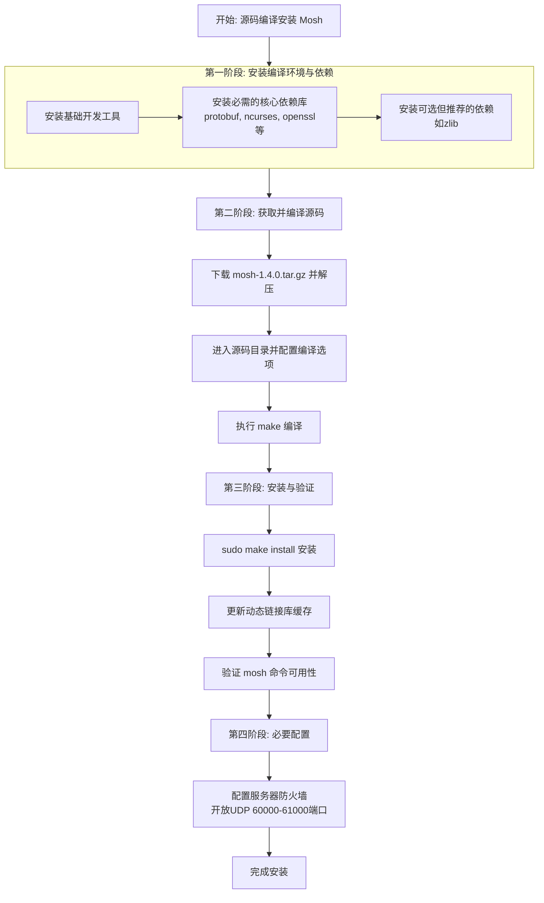

# Openeuler:mosh编译食用指南


<!--more-->

<!-- Place resource files in the current article directory and reference them using relative paths, like this: ``. -->


在 openEuler 上从源码编译安装 mosh-1.4.0，虽然步骤较多，但能让你更灵活地控制版本和编译选项。整个过程可总结为以下流程：



### 第一阶段：准备编译环境与依赖
**下载源码文件：[Release mosh-1.4.0 · mobile-shell/mosh](https://github.com/mobile-shell/mosh/releases/tag/mosh-1.4.0)**

**https://github.com/mobile-shell/mosh/archive/refs/tags/mosh-1.4.0.tar.gz**

**最好下载source code源代码，本人用其他版本代码总是莫名报错，**

**mosh-1.4.0项目中每个目录和文件的作用：**

#### **配置和构建相关文件**
1. **`configure.ac`** - **最重要的文件**
   - Autoconf的输入文件，用于生成`configure`脚本
   - 包含项目的配置需求，如检查编译器、库依赖、系统特性等
   - 定义了软件版本、安装路径、特性开关等

2. **`Makefile.am`** - **构建规则定义**
   - Automake的输入文件，用于生成`Makefile.in`
   - 定义了源代码如何编译、哪些文件需要安装、测试规则等

3. **`autogen.sh`** - **自动配置生成脚本**
   - 运行`autoreconf`等命令生成`configure`脚本
   - 用于从版本控制系统中检出的代码（您当前的情况）

4. **`build-package.sh`** / **`build-source-package.sh`** - **打包脚本**
   - 用于构建发行版软件包（如RPM、DEB）
   - `build-package.sh`：构建二进制包
   - `build-source-package.sh`：构建源码包

#### **文档和许可证文件**
5. **`README.md`** - **项目说明**
   - Markdown格式的说明文档
   - 包含项目简介、构建说明、使用方法等

6. **`ChangeLog`** - **变更日志**
   - 记录每个版本的详细变更历史
   - 格式通常遵循GNU ChangeLog规范

7. **`NEWS`** - **新闻文件**
   - 面向用户的版本更新摘要
   - 比ChangeLog更简洁，突出重要变化

8. **`COPYING`** - **主要许可证文件**
   - 包含GNU GPL许可证文本
   - mosh使用GPLv3许可证

9. **`COPYING.iOS`** - **iOS版许可证**
   - 针对iOS版本的特殊许可证条款

10. **`ocb-license.html`** - **OCB模式许可证**
    - OCB（Offset Codebook）加密模式的许可证
    - mosh使用OCB进行加密，这是其专利许可证

11. **`AUTHORS`** / **`THANKS`** - **贡献者列表**
    - `AUTHORS`：主要作者和版权持有者
    - `THANKS`：感谢列表，包括贡献者和支持者

#### **CI/CD配置文件**
12. **`appveyor.yml`** / **`appveyor.sh`** - **Windows CI配置**
    - AppVeyor持续集成配置
    - 用于在Windows平台上自动构建和测试

#### **目录结构**

##### **`src/`** - **源代码目录（核心）**
包含所有C++源代码文件：
- **`src/crypto/`** - 加密相关代码
  - OCB模式实现、密钥交换等
- **`src/frontend/`** - 客户端代码
  - 终端界面处理、用户输入输出
- **`src/network/`** - 网络通信代码
  - UDP传输、网络协议实现
- **`src/protobufs/`** - Protocol Buffers定义
  - `.proto`文件及生成的代码
- **`src/statesync/`** - 状态同步机制
  - 终端状态同步算法
- **`src/terminal/`** - 终端模拟器
  - 终端属性、字符编码处理
- **`src/util/`** - 工具函数
  - 日志、错误处理、辅助函数

##### **`man/`** - **手册页目录**
包含Unix手册页（man pages）：
- `man/mosh.1` - mosh客户端手册
- `man/mosh-server.1` - mosh服务器手册
- 通常使用troff/groff格式编写

##### **`scripts/`** - **辅助脚本目录**
包含各种构建和维护脚本：
- **自动补全脚本**（bash、zsh等）
- **安装/卸载脚本**
- **测试辅助脚本**
- **开发工具脚本**

##### **`conf/`** - **配置文件目录**
包含配置模板和示例：
- **PAM（可插拔认证模块）配置**
- **系统服务配置文件**
- **日志配置文件**
- **其他运行时配置**

##### **`m4/`** - **Autoconf宏目录**
包含自定义Autoconf宏：
- 用于`configure.ac`中检查特定库或功能
- 例如检查C++11支持、特定库版本等
- 扩展Autoconf的功能

##### **`debian/`** - **Debian/Ubuntu打包支持**
Debian系列发行版的打包文件：
- **`debian/control`** - 包依赖和描述
- **`debian/rules`** - 构建规则
- **`debian/changelog`** - Debian包变更日志
- **`debian/copyright`** - 版权信息
- **`debian/*.install`** - 文件安装规则

##### **`fedora/`** - **Fedora/RHEL打包支持**
Red Hat系列发行版的打包文件：
- **`.spec`文件** - RPM包的构建规范
- 可能包含`mosh.spec`或类似文件
- 定义了RPM包的构建、依赖和安装规则

##### **`macosx/`** - **macOS特定支持**
macOS平台特定文件：
- **Xcode项目文件**（`.xcodeproj`）
- **macOS特定补丁**
- **启动脚本和配置**

##### **为什么没有`configure`脚本？**

您遇到`configure`脚本缺失的情况是因为：

1. **从Git仓库直接打包**：这个tarball可能是从版本控制系统直接导出的，不包含生成的构建文件

2. **Autotools工作流程**：
   
   ```
   configure.ac + Makefile.am → autogen.sh/autoreconf → configure + Makefile.in
   ```
   
3. **需要生成步骤**：
   
   ```bash
   # 您需要执行的步骤
   ./autogen.sh              # 运行生成脚本
   # 或
   autoreconf -fvi           # 手动生成
   ```

##### mosh的目录结构特点：

1. **跨平台支持**：包含macOS、Windows（AppVeyor）、Linux（debian/fedora）的支持文件
2. **现代构建系统**：使用Autotools（Autoconf+Automake）确保跨平台兼容性
3. **模块化设计**：源代码按功能分目录，便于维护
4. **完整文档**：包含手册页、多种格式的说明文档
5. **打包友好**：直接支持主流Linux发行版的打包系统

这种目录结构是典型的GNU风格开源项目，理解了各部分的作用，您就能更好地进行定制化编译和问题排查。

在开始编译前，**必须**安装所有必要的依赖包。请**逐条执行**以下命令：

#### **安装基础编译工具**

```bash
sudo dnf groupinstall "Development Tools" -y
```

##### **安装 Mosh 核心依赖库**

这是最关键的一步，请确保全部安装成功：

```bash
sudo dnf install protobuf-devel ncurses-devel openssl-devel libutempter-devel gcc8 gcc8-c++ make automake autoconf wget tar perl-IO-Tty pam-devel perl-ExtUtils-MakeMaker -y
```
*   `protobuf-devel`：Mosh 通信协议的核心，**必须安装**。
*   `ncurses-devel`：终端处理库。
*   `openssl-devel`：加密通信支持。
*   `libutempter-devel`：记录终端会话。

##### **安装可选但推荐的依赖**

```bash
sudo dnf install zlib-devel -y
```

###  第二阶段：编译与安装
假设你已将 `mosh-1.4.0.tar.gz` 下载到当前用户的 `~/` 目录下。

1.  **解压源码并进入目录**
    
    ```bash
    # 设置编译环境
    export CC=gcc-11
    export CXX=g++-11
    export CXXFLAGS="-std=c++17"
    export LDFLAGS="-L/usr/local/lib"
    
    tar -xzvf ~/mosh-1.4.0.tar.gz
    # 进入源码目录
    cd mosh-1.4.0
    
    # 运行 autogen.sh 生成 configure 脚本
    ./autogen.sh
    
    ```
    
2.  **配置编译选项**
    运行 `configure` 脚本检查环境并生成编译规则：
    
    ```bash
    # 配置编译选项
    ./configure \
      --prefix=/usr/local \
      --sysconfdir=/etc \
      --localstatedir=/var \
      --enable-completion
    
    # 如果需要安装到特定目录，使用：
    # ./configure --prefix=/opt/mosh
    ```
    **请注意**：如果希望安装到特定路径（如 `/opt/mosh`），可使用 `./configure --prefix=/opt/mosh`。
    
3.  **编译源码**
    使用 `make` 命令进行编译，`-j$(nproc)` 表示使用所有CPU核心加速：
    ```bash
    # 编译（使用多核加速）
    make -j$(nproc)
    ```
    此过程若无错误，会在当前目录生成可执行文件。
    
    ```
    configure:  === Configuration results ===
    configure: Version:             1.4.0
    configure: c++ compiler:        g++ -std=c++17 -std=gnu++11
    configure: Warning CXXFLAGS:    -Wall
    configure: Picky CXXFLAGS:
    configure: Harden CFLAGS:        -fno-strict-overflow -D_FORTIFY_SOURCE=2 -fstack-protector-all -Wstack-protector --param ssp-buffer-size=1 -fPIE
    configure: Cryptography:        internal OCB, OpenSSL AES
    configure:  =============================
    ```
    
    
    
4.  **安装到系统**
    将编译好的程序安装到系统路径（默认是 `/usr/local/`）：
    
    ```bash
    # 运行测试（可选）
    make check
    
    # 安装
    sudo make install
    ```

###  第三阶段：验证与配置

1.  **刷新动态链接库缓存**
    安装后，建议运行以下命令以确保系统能找到新安装的库：
    
    ```bash
    sudo ldconfig
    ```
    
2.  **验证安装是否成功**
    执行以下命令，若显示版本号 `1.4.0` 则说明安装成功：
    
    ```bash
    mosh --version
    
    # 检查二进制文件
    which mosh
    which mosh-server
    
    # 查看版本
    mosh-server --version
    mosh-client --version
    
    # 测试基本功能
    mosh-server new
    
    # 连接测试（在另一个终端）
    # mosh-client <IP地址> <端口> <密钥>
    ```
    
3.  **配置服务器防火墙**
    这是 Mosh 能成功连接的**关键一步**。Mosh 使用 UDP 端口 60000-61000，你必须在防火墙中放行：
    
    ```bash
    # 如果使用 firewalld（openEuler 默认）
    sudo firewall-cmd --permanent --add-port=60000-61000/udp
    sudo firewall-cmd --reload
    
    # 如果使用 iptables
    sudo iptables -I INPUT -p udp --dport 60000:61000 -j ACCEPT
    # 并记得保存iptables规则
    ```

 4.**完整的安装验证脚本**

```shell
# 完整的安装验证脚本
#!/bin/bash
echo "1. 检查二进制文件:"
which mosh && which mosh-server
echo -e "\n2. 检查版本:"
mosh-server --version
echo -e "\n3. 检查动态依赖:"
ldd $(which mosh-server)
echo -e "\n4. 测试基本功能:"
timeout 2 mosh-server new 2>&1 | head -5
echo -e "\n5. 安装完成!"
```


###  第四阶段：使用与进阶玩法

#### 使用示例

```
# 基本用法
mosh user@hostname

# 指定端口范围
mosh -p 60001:60010 user@hostname

# 通过SSH连接
mosh --ssh="ssh -p 2222" user@hostname
```

#### 卸载

```
# 进入源码目录
cd mosh-1.4.0

# 卸载
sudo make uninstall

# 清理编译中间文件（保留可执行文件）
make clean

# 完全清理，回到配置前状态
# make distclean

# 清理配置文件
sudo rm -f /etc/ld.so.conf.d/mosh.conf
sudo ldconfig
```

### 简化使用mosh连接远程主机的流程

#### **配置SSH免密登录**

##### **1. 生成SSH密钥对**

```
# 检查是否已有SSH密钥
ls -la ~/.ssh/

# 生成ED25519密钥（推荐）
ssh-keygen -t ed25519 -C "mosh@$(hostname)"

# 或生成RSA密钥
ssh-keygen -t rsa -b 4096 -C "mosh@$(hostname)"

# 生成过程中会询问：
# - 保存位置（按回车使用默认 ~/.ssh/id_ed25519）
# - 密码短语（可留空）
```

##### **2. 复制公钥到远程主机**

```
# 方法1：使用ssh-copy-id（最简单）
# 使用ssh-copy-id并指定端口
ssh-copy-id -i ~/.ssh/id_ed25519_55.pub -p 55 root@192.168.8.55

# 或者使用已有密钥
ssh-copy-id -p 55 root@192.168.8.55

# 方法2：手动复制
cat ~/.ssh/id_ed25519.pub | ssh user@remote-server "mkdir -p ~/.ssh && cat >> ~/.ssh/authorized_keys"

# 方法3：使用openEuler的ssh-copy-id
sudo dnf install -y openssh-clients
ssh-copy-id -i ~/.ssh/id_ed25519.pub user@remote-server
```

##### **3. 测试免密登录**

```
# 测试SSH连接
ssh user@remote-server

# 测试mosh连接
mosh user@remote-server

# 尝试SSH连接，看是否已经可以免密登录
ssh -o BatchMode=yes root@198.23.196.252 "echo 'SSH连接测试成功'"
```

#### 为远程主机设置别名

##### **1. 配置SSH Config文件**

```shell
# 编辑SSH配置文件
mkdir -p ~/.ssh
chmod 700 ~/.ssh

cat >> ~/.ssh/config << 'EOF'
# 通用设置
Host *
    ServerAliveInterval 60
    ServerAliveCountMax 3
    TCPKeepAlive yes
    Compression yes
    IdentitiesOnly yes
    AddKeysToAgent yes
    UseKeychain yes

# 示例服务器配置
Host server1
    HostName 192.168.1.100
    User admin
    Port 22
    IdentityFile ~/.ssh/id_ed25519

Host server2
    HostName example.com
    User root
    Port 2222
    IdentityFile ~/.ssh/id_rsa
    # 使用代理跳板
    # ProxyJump jumpserver

# 通用模板
Host dev-*
    User developer
    IdentityFile ~/.ssh/dev_key

Host prod-*
    User deploy
    IdentityFile ~/.ssh/prod_key
EOF

# 设置正确的权限
chmod 600 ~/.ssh/config
```

### **2. 配置mosh别名**

```shell
# 创建mosh专用别名文件
cat >> ~/.bashrc << 'EOF'
# Mosh别名
alias m1='mosh server1'
alias m2='mosh server2'
alias mdev='mosh dev-server'
alias mprod='mosh prod-server'

# 使用ssh config中的主机名
alias mssh='mosh --ssh="ssh -F ~/.ssh/config"'
EOF

source ~/.bashrc
```


### 故障排查

如果在 `./configure` 或 `make` 阶段失败，请检查：

*   **错误：`configure: error: Package requirements (protobuf >= 3.0.0) were not met`**
    *   **原因**：protobuf 库版本太低或未安装。
    *   **解决**：确保已执行 `sudo dnf install protobuf-devel`。openEuler 22.03+ 的仓库版本通常是够的。可通过 `pkg-config --modversion protobuf` 查看版本。

*   **错误：`fatal error: utempter.h: No such file or directory`**
    *   **原因**：缺少 `libutempter-devel`。
    *   **解决**：执行 `sudo dnf install libutempter-devel`。

*   **安装后运行 `mosh` 提示 “command not found”**
    *   **原因**：默认安装路径 `/usr/local/bin` 可能不在你的 `PATH` 中。
    *   **解决**：退出当前终端重新登录，或直接使用完整路径 `/usr/local/bin/mosh`。

###  总结与建议
*   **卸载**：如需卸载，在源码目录执行 `sudo make uninstall`（如果该目标存在），或手动删除相关文件。
*   **推荐方案**：除非有特定需求，**对于大多数用户，直接通过 `sudo dnf install mosh` 安装是更简单可靠的选择**。源码编译主要用于需要特定版本、定制功能或学习的目的。

如果在任何步骤遇到问题，请提供具体的错误信息，我可以为你提供更具体的解决方案。


```

```


---

> 作者: <no value>  
> URL: https://jiang1bo.github.io/posts/d0a3efc/  

