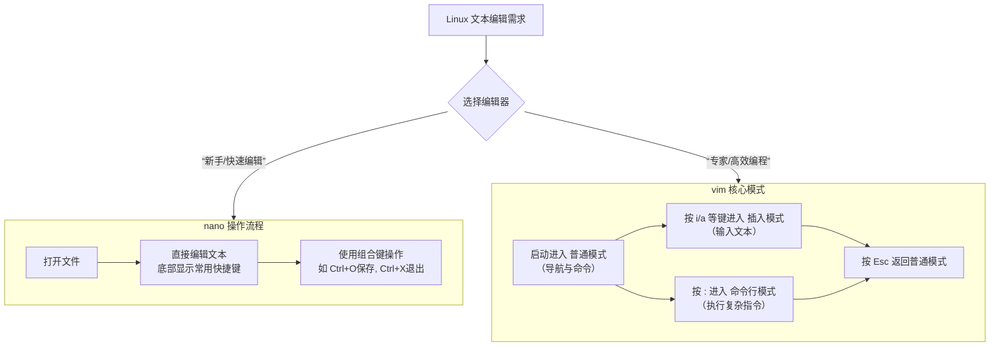

# Linux+nano+vim编辑器+git常用知识


Linux+nano+vim编辑器+git常用知识

<!--more-->

<!-- Place resource files in the current article directory and reference them using relative paths, like this: ``. -->

在 Linux 中编辑文件，`nano` 和 `vim` 是最常用的两个命令行文本编辑器。它们设计哲学不同，掌握其核心操作能让你高效工作。

下图清晰地展示了两者的核心定位与操作逻辑对比，你可以快速了解全貌：




## 一、nano：简单直观的编辑器

**特点**：界面底部有常用快捷键提示，非常适合初学者。它的所有操作都通过 **组合键**（通常是 `Ctrl` + 字母）完成。

| 操作类别       | 按键                    | 功能说明                                            |
| :------------- | :---------------------- | :-------------------------------------------------- |
| **基本操作**   | `Ctrl + O`              | 保存文件（**O**utput），然后按 `Enter` 确认文件名。 |
|                | `Ctrl + X`              | 退出（e**X**it）。如果文件未保存，会询问是否保存。  |
| **光标移动**   | `Ctrl + F` / `Ctrl + B` | 向前（**F**orward）/ 向后（**B**ackward）移动光标。 |
|                | `Ctrl + P` / `Ctrl + N` | 移动到上一行（**P**revious）/ 下一行（**N**ext）。  |
| **编辑文本**   | `Ctrl + K`              | 剪切（**K**ill）当前行。                            |
|                | `Ctrl + U`              | 粘贴（**U**ncut）被剪切的内容。                     |
|                | `Ctrl + \`              | 搜索文本，输入内容后按 `Enter`。                    |
|                | `Ctrl + W`              | 替换文本，先搜索，然后选择是否替换。                |
| **帮助与退出** | `Ctrl + G`              | 显示完整的帮助文档。                                |
|                | `Ctrl + C`              | 取消当前操作，或显示当前光标位置。                  |

**使用心法**：记住 **“O保存，X退出”** 。其他操作可以随时按 `Ctrl+G` 调出帮助菜单查看。

###  二、vim：功能强大的模态编辑器
**特点**：功能极其强大，但学习曲线陡峭。其核心在于 **模式切换**，不同模式下按键功能完全不同。这是新手最容易困惑的地方。

**1. 三种核心模式**
*   **普通模式 (Normal Mode)**：启动后默认进入。用于**移动光标、删除、复制粘贴等操作，不能直接输入文字**。按 `Esc` 键可以从其他模式返回此模式。
*   **插入模式 (Insert Mode)**：用于**输入和编辑文本**。从普通模式按 `i` (insert) 或 `a` (append) 等键进入。
*   **命令行模式 (Command-line Mode)**：用于执行**保存、退出、搜索替换等高级命令**。从普通模式按 `:` 进入。

**2. 常用操作速查表**

| 模式               | 按键/命令               | 功能说明                                        |
| :----------------- | :---------------------- | :---------------------------------------------- |
| **启动与退出**     | `vim 文件名`            | 打开文件。                                      |
|                    | `:q`                    | 退出（**q**uit）。如果文件已修改会警告。        |
|                    | `:q!`                   | **强制退出，不保存任何修改**。                  |
|                    | `:w`                    | 保存（**w**rite）文件。                         |
|                    | `:wq` 或 `:x` 或 `ZZ`   | 保存并退出。                                    |
| **模式切换**       | `i`                     | 在光标**前**进入插入模式。                      |
|                    | `a`                     | 在光标**后**进入插入模式。                      |
|                    | `o`                     | 在**当前行下方**新建一行并进入插入模式。        |
|                    | `Esc`                   | **返回普通模式**（无论当前在何种模式）。        |
| **普通模式导航**   | `h` `j` `k` `l`         | 分别代表 **左、下、上、右**。                   |
|                    | `0` / `$`               | 跳至**行首** / **行尾**。                       |
|                    | `gg` / `G`              | 跳至**文件第一行** / **最后一行**。             |
|                    | `Ctrl + f` / `Ctrl + b` | 向下 (**f**orward) / 向上 (**b**ackward) 翻页。 |
| **普通模式编辑**   | `x`                     | 删除光标所在处的字符。                          |
|                    | `dd`                    | **剪切（删除）** 当前整行。                     |
|                    | `yy`                    | **复制（yank）** 当前整行。                     |
|                    | `p`                     | 在光标下一行**粘贴**。                          |
|                    | `u` / `Ctrl + r`        | **撤销** / **重做** 上一次操作。                |
| **命令行模式操作** | `:/关键词`              | **向下搜索**关键词，按 `n` 下一个，`N` 上一个。 |
|                    | `:?关键词`              | **向上搜索**关键词。                            |
|                    | `:%s/旧/新/g`           | **全局替换**（将文件中所有“旧”替换为“新”）。    |
|                    | `:set nu` / `:set nonu` | **显示** / **隐藏** 行号。                      |

**vim 心法与学习建议**
1.  **第一要务**：时刻记住你**处于哪种模式**。**普通模式是“命令状态”，插入模式是“打字状态”**。任何不确定的时候，先按 `Esc` 回到普通模式。
2.  **生存指令**：记住 `i` (进入编辑)，`Esc` (退出编辑)，`:wq` (保存退出)，`:q!` (不保存强制退出)。这四条能让你安全地进入和离开vim。
3.  **不要死记**：初期将常用操作（如 `dd`, `yy`, `p`, `u`）写在便签上，边用边记。
4.  **游戏化学习**：强烈推荐在终端输入 `vimtutor` 命令，这是官方内置的交互式教程，花30分钟完成，效果远超死记硬背。

###  如何选择？
*   **使用 nano 如果**：你是新手，只需要快速编辑配置文件（如 `.bashrc`, `nginx.conf`），追求简单直接，不想记忆复杂命令。
*   **学习 vim 如果**：你经常在命令行下工作、编写代码或处理文本，追求极高的编辑效率和长期生产力。

**一个实用的场景**：在服务器上，你可以先用 `nano` 应急。但在日常开发中，花时间掌握 `vim` 会带来长远的效率提升。

希望这个对比能帮助你上手。如果你在使用某个具体操作时遇到了问题，或者想了解某个编辑器更高级的功能（比如vim的宏、分屏），可以随时告诉我。


## 一、Git 核心概念（新手必懂）

Git 是**分布式版本控制系统**，核心作用是追踪文件的修改历史、管理不同开发分支、支持多人协作开发。先理解 3 个核心区域，能帮你快速搞懂 Git 的工作逻辑：

- **工作区（Working Tree）**：你本地编辑代码 / 文件的目录（比如你截图里的 `d/IDM/git/github/website/privacy-fixlt`）。
- **暂存区（Index/Staging Area）**：临时存放「待提交的修改」，是工作区和版本库之间的 “中转站”。
- **版本库（Repository）**：Git 存储所有版本信息的地方（隐藏目录 `.git`），包含提交记录、分支、标签等。
- **HEAD**：一个指针，指向你当前所在分支的最新提交（比如你截图里的 `main` 分支）。

### 二、按场景拆解核心命令（对应你提供的命令清单）

下面结合日常开发最常见的场景，讲解清单里的核心命令，每个命令都给出「用法 + 场景 + 示例」，新手可直接复用。

#### 1. 初始化 / 克隆仓库（start a working area）

这是使用 Git 的第一步，对应「新建项目」或「参与已有项目」场景。

- git init

  - 作用：在当前目录创建空的 Git 仓库（生成 `.git` 隐藏目录）。

  - 场景：从零开始开发新项目，需要开启版本控制。

  - 示例：

    ```
    # 进入项目目录
    cd /d/IDM/git/my-new-project
    # 初始化仓库
    git init
    ```

- git clone

  - 作用：把远程仓库（如 GitHub/Gitee）的代码克隆到本地。

  - 场景：参与团队已有项目，先把代码拉到本地。

  - 示例：

    ```
    # 克隆远程仓库（HTTPS方式）
    git clone https://github.com/xxx/privacy-fixlt.git
    # 克隆后自动生成项目目录，进入目录
    cd privacy-fixlt
    ```

#### 2. 处理当前修改（work on the current change）

这是日常开发中最频繁的操作，对应「编辑文件后准备提交」的场景。

- git add

  - 作用：把工作区的修改（新增 / 修改 / 删除）添加到暂存区。

  - 场景：编辑完文件后，准备提交前的核心步骤。

  - 示例：

    ```
    # 添加单个文件到暂存区
    git add index.html
    # 添加当前目录所有修改的文件（推荐，避免漏加）
    git add .
    ```

- git mv

  - 作用：重命名 / 移动文件，Git 会追踪这个操作（而非 “删除 + 新增”）。

  - 场景：调整文件目录结构（比如把文件移到子目录）。

  - 示例：

    ```
    # 重命名文件：把 old.txt 改成 new.txt
    git mv old.txt new.txt
    # 移动文件：把 index.html 移到 src 目录
    git mv index.html src/
    ```

- git restore

  - 作用：恢复工作区文件（撤销未暂存的修改）。

  - 场景：改乱了文件，想恢复到 “暂存区 / 版本库” 的状态。

  - 示例：

    ```
    # 撤销工作区 index.html 的所有修改（恢复到暂存区状态）
    git restore index.html
    # 恢复到版本库最新提交的状态（忽略暂存区）
    git restore --source=HEAD index.html
    ```

- git rm

  - 作用：删除文件，同时从暂存区移除（如果只手动删文件，Git 会标记为 “未跟踪”）。

  - 场景：删除项目中无用的文件。

  - 示例：

    ```
    # 删除 test.txt 并同步到暂存区
    git rm test.txt
    # 如果文件已添加到暂存区，强制删除
    git rm -f test.txt
    ```

#### 3. 查看历史和状态（examine the history and state）

用于「检查修改、回顾历史」，是排查问题、确认修改的核心操作。

- git status

  - 作用：查看工作区 / 暂存区的状态（哪些文件被修改、未跟踪、已暂存）。

  - 场景：开发中随时确认当前修改状态，避免漏提交。

  - 示例：

    ```
    git status
    # 输出示例（你的截图里就是这个命令的环境）：
    # On branch main
    # Changes to be committed:
    #   (use "git restore --staged <file>..." to unstage)
    #         modified:   index.html
    ```

- git log

  - 作用：查看提交历史（作者、时间、提交信息、版本号）。

  - 场景：回顾项目修改记录，找某个功能的提交记录。

  - 示例：

    ```
    # 查看简洁的提交历史（一行一条）
    git log --oneline
    # 查看所有分支的提交历史
    git log --all --graph  # 带图形化分支展示，更直观
    ```

- git diff

  - 作用：查看修改的具体内容（工作区 vs 暂存区、暂存区 vs 版本库）。

  - 场景：确认自己改了哪些代码，避免误改。

  - 示例：

    ```
    # 查看工作区未暂存的修改
    git diff
    # 查看暂存区的修改（已add但未commit）
    git diff --staged
    ```

- git grep

  - 作用：在项目中搜索匹配指定内容的行（比系统自带的 grep 更快）。

  - 场景：找某个函数 / 变量 / 关键词在项目中的位置。

  - 示例：

    ```
    # 搜索所有包含 "privacy" 的行
    git grep "privacy"
    # 搜索指定文件中包含 "fix" 的行
    git grep "fix" index.html
    ```

#### 4. 分支 / 提交 / 合并（grow, mark and tweak history）

对应「功能开发、版本管理」，是多人协作的核心。

- git commit

  - 作用：把暂存区的修改提交到版本库（生成一条提交记录）。

  - 场景：完成一个小功能 / 修复一个 bug 后，保存修改到版本库。

  - 示例：

    ```
    # 提交并写提交信息（必须写，方便后续追溯）
    git commit -m "fix: 修复隐私政策页面的排版问题"
    # 如果修改已add，想补充修改并合并到上次提交（避免冗余提交）
    git commit --amend  # 会打开编辑器，修改上次的提交信息
    ```

- git branch

  - 作用：管理分支（列出、创建、删除）。

  - 场景：开发新功能时创建独立分支，避免影响主分支（main/master）。

  - 示例：

    ```
    # 列出所有本地分支（* 表示当前分支）
    git branch
    # 创建新分支（feature-privacy）
    git branch feature-privacy
    # 删除已合并的分支
    git branch -d feature-privacy
    ```

- git switch

  - 作用：切换分支（替代老的 git checkout 分支用法，更清晰）。

  - 场景：从主分支切到功能分支开发，或切回主分支合并代码。

  - 示例：

    ```
    # 切换到 feature-privacy 分支
    git switch feature-privacy
    # 创建并切换到新分支（常用）
    git switch -c feature-privacy  # 等价于 git branch + git switch
    ```

- git merge

  - 作用：把一个分支的修改合并到当前分支。

  - 场景：功能开发完成后，把功能分支合并到主分支。

  - 示例：

    ```
    # 先切到主分支
    git switch main
    # 合并 feature-privacy 分支到主分支
    git merge feature-privacy
    ```

- git tag

  - 作用：给指定提交打标签（标记版本，如 v1.0）。

  - 场景：项目发布版本时，标记稳定版本的提交。

  - 示例：

    ```
    # 打轻量标签（简单标记）
    git tag v1.0
    # 打附注标签（带版本说明，推荐）
    git tag -a v1.0 -m "发布v1.0版本，修复隐私政策问题"
    # 查看所有标签
    git tag
    ```

#### 5. 协作开发（collaborate）

对应「和团队同步代码」，是多人协作的核心操作。

- git fetch

  - 作用：拉取远程仓库的最新内容（只下载，不合并到本地分支）。

  - 场景：先查看远程有哪些更新，再决定是否合并（避免直接合并出冲突）。

  - 示例：

    ```
    # 拉取远程 main 分支的最新内容
    git fetch origin main
    ```

- git pull

  - 作用：拉取并合并远程分支的最新内容（等价于 git fetch + git merge）。

  - 场景：本地开发前，同步团队最新的代码。

  - 示例：

    ```
    # 拉取远程 main 分支并合并到本地 main 分支
    git pull origin main
    ```

- git push

  - 作用：把本地提交推送到远程仓库。

  - 场景：完成本地开发后，把代码推到远程供团队其他人使用。

  - 示例：

    ```
    # 推送本地 main 分支到远程 origin 仓库
    git push origin main
    # 推送标签到远程（发布版本时需要）
    git push origin v1.0
    ```

### 三、日常开发高频场景完整流程（直接套用）

#### 场景 1：从零开发并提交代码

```
# 1. 初始化仓库
cd /d/IDM/git/my-project
git init
# 2. 创建/编辑文件
touch index.html
# 3. 添加到暂存区
git add .
# 4. 提交到版本库
git commit -m "init: 初始化项目，添加首页"
```

#### 场景 2：克隆远程项目开发新功能

```
# 1. 克隆远程仓库
git clone https://github.com/xxx/privacy-fixlt.git
cd privacy-fixlt
# 2. 创建功能分支
git switch -c feature-privacy
# 3. 编辑文件，修改代码
# 4. 暂存+提交
git add .
git commit -m "feat: 新增隐私政策弹窗"
# 5. 推送到远程功能分支
git push origin feature-privacy
```

#### 场景 3：同步远程最新代码

```
# 切到主分支
git switch main
# 拉取远程最新代码
git pull origin main
```

### 总结

1. Git 的核心是「工作区→暂存区→版本库」的修改流转，`git add` 是暂存、`git commit` 是提交、`git push/pull` 是同步远程。
2. 分支是 Git 的核心优势：开发新功能优先创建分支，避免直接修改主分支（main/master）。
3. 高频命令优先级：`git status`（查状态）> `git add`/`git commit`（提修改）> `git switch`/`git branch`（管分支）> `git pull`/`git push`（协同步）。

记住这些核心命令和流程，就能覆盖 80% 的日常 Git 使用场景，后续遇到冲突、回滚等复杂场景，可再针对性学习。


---

> 作者: <no value>  
> URL: https://jiang1bo.github.io/posts/f6e7eb2/  

